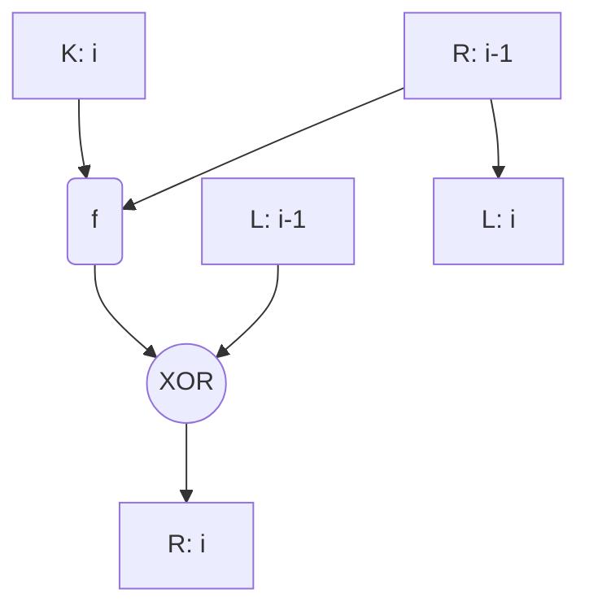

Increasing block size enhances security at the expense of speed. The same trade-off applies to key size.

### DES (Data Encryption Standard)

DES uses 64 bit blocks and 56 bit keys. AES uses 128 bit blocks and 128 or 256 bit keys.

DES and Blowfish are based on Feistel rounds.

Many cryptography algorithms are based on multiple rounds. This increases security. For instance, AES has never been broken for high round numbers. The default number of rounds for AES-256 is 14 rounds.

Even with hardware support for encryption, with the possibility of executing a whole round in a single clock cycle, there is still a need to repeat the procedure for a number of clock cycles equal to the number of rounds. This is not a problem for modern consumer devices but it may be in some other domains.

DES was requested by NBS (NIST) in 1973 and published in 1977.

The key is 64 bits long - 8 bytes of which, for each one, the 8th bit is a *parity bit* (a `xor` of the previous 7).

The cleartext is passed through:

- an IP permutation ($8 \times 8$ permutation matrix)
- 16 iterations of key scheduling on 48-bit blocks
- an exchange
- a reverse $IP^{-1}$ permutation

The following scheme represents a single iteration:

The function $f$ used in iterations works in this way:

- the 32-bit input is *expanded* to 48 bits by repeating half of them twice, following an expansion table which specifies in which position to copy each bit
- the expanded 48-bit block is `xor`-ed with a 48-bit subkey
- the result is divided in 8 6-bit block and each block is passed through an *S-Box*
- the S-boxed output is reunited and de-expanded to go back to 32 bits

S-box (NBD, 1976):

- each row is a permutation of integers 0-15
- no S-box is a linear function of its inputs
- changing one bit in the input causes at least two output bits to change
- works in 6 bit blocks
	- the first and last bit specify the row
	- the center bits specify the column
	- the output is 4 bits from the table cell
- for each S-box and each 6-bit input, the S-box output and the S-box output of the number `xor`-ed with `001100` differ for at least two bits
- for each S-box, the number of inputs for which the output bit is 0 is around the same for which it is 1

The subkeys are the output of a *key scheduling* operation:

- the 64-bit key passes through a PC-1 permutation
	- table-based like the IP
	- bits 8, 16, 24, 32, 40, 48, 56 and 64 are parity bits and do not appear
- the 56-bit output is left-shifted by a specific number of bits (1 or 2) for each iteration, with a total shift of 28 bits on 16 iterations
- the left-shifted results are passed through a PC-2 permutation to produce the 48-bit subkeys for each iteration
	- table-based
	- suppression of bits 9, 18, 22, 25, 35, 38, 43, 54

Decryption uses the same process as encryption but reverses the order of the subkeys.

A key is called *weak* if it produces the same subkey for all 16 iterations. A couple of keys is said to be *semi-weak* if the subkeys are two, each used 8 times.
There are 6 semi-weak key couples and 4 weak keys.

DES enjoys the *complement property*: the DES encryption of the complement of the input and the complement of the key is the complement of the output. This makes a bruteforce chosen plaintext attack take only $2^{55}$ attempts instead of $2^{56}$.

DES was broken in the late 90's through a series of paid challenges open to private users and companies. These were brute-force attacks with $2^{56}$ (or $2^{55}$, for the optimized version working with complements) possibilities.
More sophisticated attacks, based on linear ($2^{43}$ attempts) and differential ($2^{47}$ attempts) crypto-analysis, were made through a plaintext + ciphertext attack.

*Encryption modes* are possible answers to the question "how do I organize encryption for messages that are longer than a single block?". Possible options (all called by a three-letter acronym):

- Electronic Codebook (ECB)
- Cipher Block Chaining (CBC)
- Cipher Feedback (CFB)
- Output Feedback (OFB)
- Counter (CTR)

- Galois Counter Mode (GCM)

The last one was added later, while the first five come from the original *DES Modes of Operation* of 1977.
