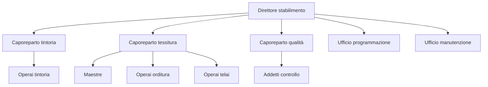

## Macrostruttura

All'interno dell'organizzazione gli individui vengono spesso raccolti in *unità organizzative*. Anch'essa viene studiata nello stesso modo, per ruolo e posizione.

Un'*unità organizzativa* è un raggruppamento di mansioni e posizioni simili o interdipendenti. Il suo istanziamento è utile ai fini della supervisione diretta, tramite un *referente*, in organizzazioni di dimensioni elevate. I membri condividono spesso gli stessi spazi ai fini di facilitare la collaborazione e il confronto.

L'*organigramma* è la rappresentazione visuale dell'articolazione degli individui in unità organizzative. È uno strumento formale. Non sempre è completo e aggiornato, o aderente al comportamento effettivo dell'impresa. Si formano spesso delle componenti di informalità, come gerarchie informali o unità organizzative formate spontaneamente. Tranne che nelle piccole organizzazioni, solitamente non contiene le singole posizioni individuali.

Scelte fondamentali per un'unità organizzativa:
- *dimensioni*: quante persone dipendono da un singolo capo
- *lunghezza della catena gerarchica*: quanti livelli verticali sono presenti nell'organizzazione

Maggiori dimensioni portano a maggiore organicità e collaborazione ma riducono le possibilità di supervisione diretta. Si distingue tra:
- *span of control*: numero di persone subordinate al capo
- *ampiezza manageriale*: numero di mansioni organizzative direttamente dipendenti dal capo
Le due metriche sono inversamente proporzionali: più persone sono subordinate a uno stesso capo, meno "dettagliata" sarà la capacità di controllo su ogni individuo, creando la necessità di standardizzazione dei ruoli dei subordinati.

L'ampiezza orizzontale dipende invece da:
- *catena gerarchica* come precedentemente definita
- *unicità del comando*: principio base dell'organizzazione gerarchica. Ogni individuo deve rispondere ad un solo responsabile gerarchico

Ampiezza verticale e ampiezza orizzontale sono inversamente proporzionali. A parità di numero di dipendenti, maggiore è l'ampiezza delle unità organizzative, meno livelli di gerarchia si formeranno.

L'estensione delle unità organizzative non deve essere troppo elevata per assicurare governabilità. L'allungamento della catena gerarchica non deve essere eccessivo per non inflazionare i costi di struttura e i tempi decisionali
Numeri comuni sono:
- 30/40 persone nelle unità organizzative a livello operativo
- 8/10 persone nelle unità organizzative a livello gestionale

Dividiamo le unità organizzative:
- per contenuto del lavoro e mansioni raggruppate:
	- *linea* vs *staff*
- per autonomia decisionale
	- *operative* vs *direttive*
- per temporaneità o stabilità
	- *team di progetto* vs *unità nell'organigramma*

Le unità organizzative di linea (organi di linea) sono disposte lungo la catena organizzativa e si occupano delle attività centrali (*core business*) dell'impresa. Esempi sono produzione, progettazione e commercializzazione. Gli organi di staff svolgono invece attività di supporto. Queste attività sono talvolta esternalizzate a consulenti. Gli organi di staff possono dipendere direttamente dalla direzione centrale, o essere subordinate ad una specifica unità di linea.

L'outsourcing aumenta i costi variabili e riduce i costi fissi. A livello organizzativo, snellisce l'organigramma.

Le unità organizzative operative sono caratterizzate da una prevalenza di mansioni operative e si trovano dunque ai livelli più bassi della gerarchia. Sono caratterizzate da standardizzazione elevata. Le unità organizzative direttive si occupano di gestione. Possono avere natura temporanea (*steering committee* = unità organizzativa direttiva di alto livello, temporanea, caratterizzata da un obiettivo temporaneo).

In generale tutti i tipi di unità organizzative possono essere definite in modo temporaneo, ai fini di raggiungere un obiettivo o completare un progetto, oppure essere una componente fissa dell'organizzazione.

I criteri per definire i raggruppamenti hanno i seguenti obiettivi:
- *minimizzare i costi di transazione*: costi legati al passaggio di risorse e informazioni tra unità:
- *minimizzare i costi di coordinamento*: come precedentemente definito

I criteri possono essere:
- *numerici*: legati alle dimensioni dell'unità. Dimensioni omogenee favoriscono sostituibilità. Un esempio sono i turni di lavoro. Utili in organizzazioni meccaniche e altamente standardizzate
- *orientati agli input*: in base alle risorse necessarie a ottenere un dato risultato. I raggruppamenti per *competenze* simili o per *funzione svolta* appartengono a questa categoria
- *orientati agli output*: in base al prodotto, al cliente o alla base geografica
La prevalenza del criterio per input permette economie di scala e di specializzazione. La prevalenza del criterio per output permette invece di aumentare l'efficacia.

Meccanismi di coordinamento:
- *ruoli di collegamento (meccanismo di distacco)*: un ruolo specifico all'interno di un'unità ha il compito di coordinarsi con il ruolo equivalente in un'altra unità. Le modalità sono spesso informali. Alto grado di mutuo adattamento
- *manager integratori*: organi di staff con l'obiettivo specifico e unico di coordinare più unità di linea. Esempi: product manager, project manager, account manager. Questa figura incarna il mutuo adattamento e la standardizzazione degli obiettivi
- *team di *
- *sistemi di pianificazione e controllo*: soluzione gestionale e non organizzativa, realizzata identificando obiettivi comuni e strategie per implementarli
- *sistemi informativi aziendali*: utilizzo di strumenti digitali per favorire indirettamente la collaborazione tra unità organizzative

Tipologie di struttura:
- *struttura semplice*: poche unità organizzative essenziali. Accentramento decisionale sull'imprenditore, bassa formalizzazione, raggruppamento funzionale delle attività, lavoro diviso per competenza, coordinamento per mutuo adattamento e standardizzazione delle competenze. Tipica di piccole imprese e gruppi di pari.
- *struttura funzionale*: attività raggruppate per funzione comune. Efficienza grazie ad economie di scala e specializzazione delle competenze. Mancanza di attenzione a prodotto e clienti, lentezza decisionale, burocratizzazione
- *struttura divisionale*: divisione in unità in base all'output. Ogni unità ha elevata autonomia decisionale. Il coordinamento è per standardizzazione dell'output e dei risultati. Permette capacità di adattamento e rapidità di risposta a scapito di economie di scala e specializzazione.
- *struttura ibrida*: mescolanza di strutture funzionali e divisionali, con il rischio di perdita di chiarezza
- *struttura a matrice*: mescolanza di strutture funzionali e divisionali, con pluralità di linee gerarchiche, facendo eccezione al principio di unicità del comando. Ogni dipendente ha due referenti, uno per divisione e uno per funzione. Il potenziale di conflittualità aumenta il rischio di esitazioni e rallentamenti. Struttura complessa e poco diffusa a causa delle difficoltà di gestione

## Esercizio: Cotonificio Bergamasco

|                            | **Specializzazione verticale** | **Specializzazione orizzontale** | **Tipologia**                                |
| -------------------------- | ------------------------------ | -------------------------------- | -------------------------------------------- |
| **Operaio tintoria**$^1$   | Alta                           | Altra                            | Operativa ristretta                          |
| **Maestra**$^2$            | Medio-alta                     | Bassa                            | Operativa allargata                          |
| **Operaio tessitura**      | Alta                           | Alta                             | Operativa ristretta                          |
| **Controllo qualità**      | Medio-bassa                    | Alta                             | Professionale (autonomia decisionale locale) |
| **Capo reparto**           | Media                          | Bassa                            | Manageriale di medio-basso livello           |
| **Direttore stabilimento** | Bassa                          | Bassa                            | Manageriale di alto livello                  |

Organigramma dello stabilimento:

L'organizzazione è prevalentemente meccanica con alcuni elementi organici ai livelli più elevati (sviluppo e standardizzazione delle competenze).

|                            | **Job Enlargment**                              | **Job Enrichment**                                  |
| -------------------------- | ----------------------------------------------- | --------------------------------------------------- |
| **Operaio tintoria**       | rotazione tra reparti manutenzione ordinaria | ø                                                   |
| **Maestra**                | ø                                               | maggiore responsabilità e autonomia decisionale  |
| **Operaio tessitura**      | rotazione tra reparti manutenzione ordinaria | ø                                                   |
| **Controllo qualità**      | ø                                               | ø                                                   |
| **Capo reparto**           | partecipazione alla programmazione           | potere decisionale in merito alla programmazione |
| **Direttore stabilimento** | ø                                               | ø                                                   |

