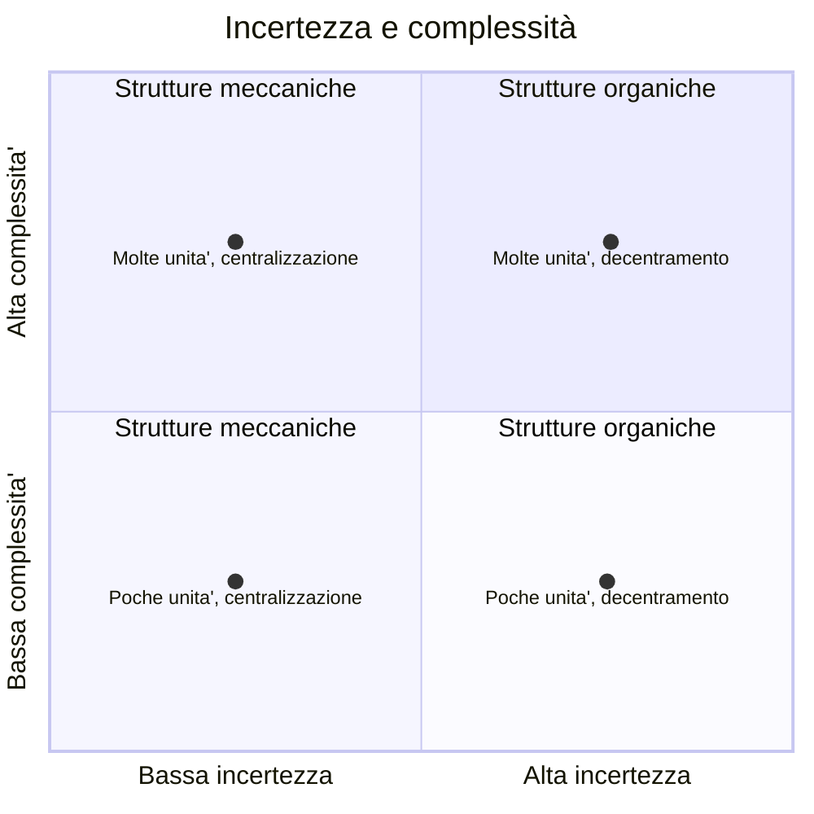
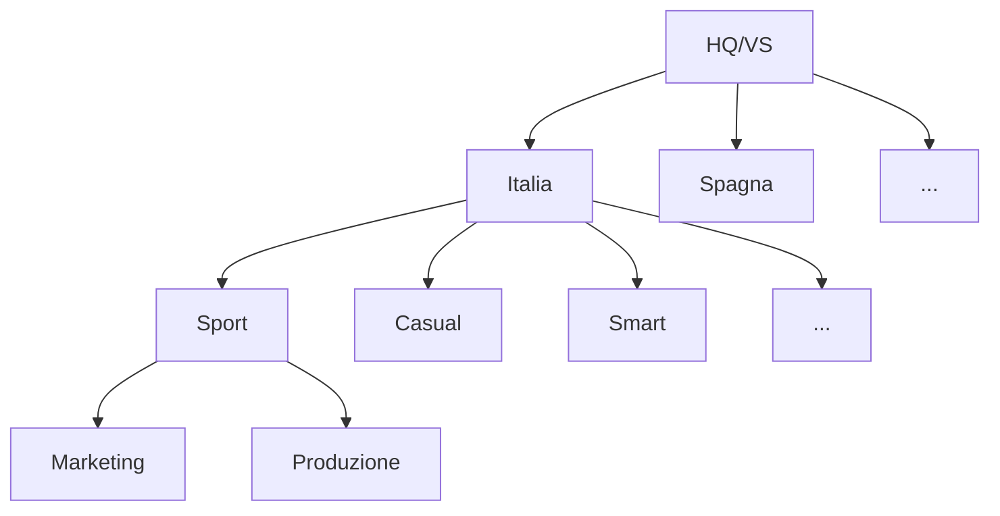

# L'organizzazione nel contesto

*Teoria delle contingenze*: studia il collegamento tra ambiente e organizzazione.

*Teoria dell'organizzazione scientifica del lavoro*.

Le contingenze si dividono in quattro categorie:

- *ambiente*: mercato di riferimento, contesto socio-economico, settore
- *tecnologie*
- *strategia*:
- *fattori anagrafici*: dimensione, età e posizione dell'impresa

Un ambiente è detto *incerto* quando è caratterizzato da un rapido tasso di cambiamento.
Esempi:

- variazioni per cause naturali dell'accesso alle materie prime
- cambiamenti dei mercati finanziari e della situazione politica
- normative ambientali

A fronte dell'incertezza la formalizzazione si riduce. A fronte della complessità la formalizzazione cresce.

Matrice prodotto-processo:

- asse y:
	- cantieri
	- reparti
	- linee non connesse
	- linee connesse
- asse x: volume di produzione
	- unitaria
	- a lotti
	- di massa
	- continua

Servizi professionali vs servizi di massa.

Le tecnologie favoriscono l'outsourcing di molti processi di coordinamento, controllo e di staff grazie alla facilità di trasferimento e tracciamento dei dati.

# Caso Coral

1. Incertezza: medio-alta ("presenta una forte variabilità da un anno all'altro in quanto...")
	- forte variabilità su base annuale
	- cambio nelle preferenze dei consumatori
	Complessità: medio-alta
	- tecnologie poco complesse
	- molto prodotti, mercati e clienti da gestire
2. Struttura divisionale
	- divisioni per area geografica
	- divisioni per prodotto
	- funzioni

Struttura meccanica:

- standardizzazione dei processi
- supervisione diretta
- molte unità organizzative

Strategia: leadership di costo

La struttura complessa con molte unità organizzative è coerente con l'ambiente complesso.

La struttura meccanica è adatta alla strategia di leadership di costo ma non è adatta all'ambiente complesso.

Standardizzazione dei processi: supervisione diretta

c) Meccanismi sono tipici di strutture meccaniche, quindi in linea con una strategia di riduzione dei costi, ma poco adatti ad un ambiente incerto.

d) aumentata la complessità. Consumatori esigenti:

- competenze tecniche
- linee nello stesso paese

e) struttura a matrice 3D

- aree geografiche
- prodotti
- funzioni

Adattamento tra struttura, ambiente e strategia.

# Processi

Un processo aziendale è un insieme organizzato di attività e decisioni finalizzato alla creazione di un output effettivamente richiesto da un cliente e al quale si attribuisce un valore ben definito.

Il cliente può essere anche interno, per i processi intermedi.

*Efficienza*: minimizzazione dei costi.
*Efficacia*: massimizzazione della soddisfazione del cliente.

Prestazioni del processo:

- costo
	- di output
	- per il cliente
	- total cost of ownership
- qualità
	- teorica
	- conformità
	- disponibilità
	- qualità percettiva
- tempo
	- di risposta
	- puntualità
	- lead time
	- time to market
- flessibilità
	- in piccolo
	- in grande
	- range di variazione
- sostenibilità
	- impatto sociale
	- impatto ambientale
