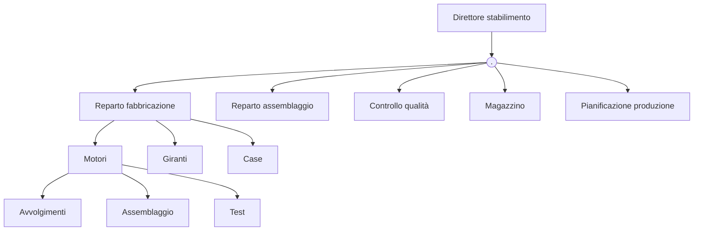
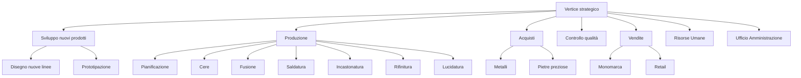

# Caso Pumps

Sottoreparti:

- motori
- giranti
- case

Altre fasi:

- assemblaggio
- controllo qualità
- stoccaggio

Operai:

- 100 in Svezia
- 125 in Ungheria

con lo stesso livello di output.

Stipendi:

- 30k/anno Svezia
- 10k/anno Ungheria

## 1. Organigramma

## 2. Ampiezza del controllo

<u>Stabilimento svedese</u>

| **Ruolo**              | **Numero di persone** |
| ---------------------- | --------------------- |
| Direttore stabilimento | 1                     |
| Capi reparto           | ?                     |
| Operai                 | 100                   |

*Ampiezza di controllo $A$?*

$$
\begin{cases}
x = \frac{100} A \quad \text{per definizione ampiezza di controllo} \\
1 = \frac x A \quad \text{per l'ampiezza di controllo (nota) del direttore}
\end{cases}
$$

$$
\begin{cases}
A^2 = 100 \to A = 10 \\
x = A
\end{cases}
$$

<u>Stabilimento ungherese</u>

| **Ruolo**              | **Numero di persone** |
| ---------------------- | --------------------- |
| Direttore stabilimento | 1                     |
| Capi area              | $x$                   |
| Capi reparto           | $y$                   |
| Operai                 | 125                   |
$$A = cost.$$
$$
\begin{cases}
y = \frac{125} A \\
x = \frac y A \\
1 = \frac x A \to x = A
\end{cases}
$$

$$
\begin{cases}
A^3 = 125 \to A = 25 \\
A^2 = y\\
x = A
\end{cases}
~\Rightarrow~
\begin{cases}
A = 5 \\
y = 25 \\
x = 5
\end{cases}
$$

Quindi:

|                            | **Stabilimento svedese** | **Stabilimento ungherese** |
| -------------------------- | ------------------------ | -------------------------- |
| **Ampiezza del controllo** | $A = 10$                 | $A = 5$                    |
| **Livelli gerarchici**     | 2 livelli gerarchici     | 3 livelli gerarchici       |
| **Struttura**              | Più orizzontale          | Più verticale              |

## 3. Costi

|                            | **Stabilimento svedese** | **Stabilimento ungherese** |
| -------------------------- | ------------------------ | -------------------------- |
| **Direttore stabilimento** | $1 \times 100k$ €        | $1 \times 50k$ €           |
| **Capi area**              | $0 \times 50k$ €         | $5 \times 35k$ €           |
| **Capi reparto**           | $10 \times 50k$ €        | $25 \times 20k$ €          |
| **Operai**                 | $100 \times 30k$ €       | $125 \times 10k$ €         |
| **Totale**                 | $3.6M$ €                 | $1.975 M$ €                |

## 4. Tipo di microstruttura

|                            | **Stabilimento svedese**                                                                                                                                                 | **Stabilimento ungherese**                                                                                                                          |
| -------------------------- | ------------------------------------------------------------------------------------------------------------------------------------------------------------------------ | --------------------------------------------------------------------------------------------------------------------------------------------------- |
| **Ampiezza del controllo** | $\uparrow A$                                                                                                                                                             | $\downarrow A$                                                                                                                                      |
| **Tipo di struttura**      | Struttura orizzontale                                                                                                                                                    | Struttura verticale                                                                                                                                 |
| **Conclusioni**            | Struttura piuttosto piatta (organica) con ricorso a mutuo adattamento e specializzazione delle mansioni più bassa. Standardizzazione degli obiettivi e delle competenze. | Struttura più meccanica con meccanismi di supervisione diretta e specializzazione delle mansioni più alta. Standardizzazione orientata ai processi. |

## 5. Intervento di ampiamento del controllo in Ungheria

Investimento di 500000 € con tempo di ritorno di un anno. In pratica, la riduzione di costo deve essere maggiore o uguale all'investimento, immediatamente.

Nuovi numeri:
- capi reparto = $\frac{125} 8 = 15.6 \approx 16$
- capi area = $\frac{16} 8 = 2$

| **Direttore stabilimento** | $1 \times 50k$ €   |
| -------------------------- | ------------------ |
| **Capi area**              | $2 \times 35k$ €   |
| **Capi reparto**           | $16 \times 20k$ €  |
| **Operai**                 | $125 \times 10k$ € |
| **Totale**                 | $1.690M$ €         |

Risparmio = $1.975M - 1.690M$ € = $285k$ €

L'intervento rientrerebbe in due anni e non in uno, come invece ci era richiesto.

# Caso Iris

Fasi:

- sviluppo
	- nuove linee
	- prototipi
- produzione
	- realizzazione cere
	- fusione e stampaggio
	- assemblaggio
	- saldatura e incastonatura
	- rifinitura
	- lucidatura

Altre informazioni:

- pianificazione mediante unità apposita
- acquisto tramite ufficio acquisti
	- responsabile metalli
	- responsabile pietre preziose
- vendite
	- responsabile monomarca (2 negozi di proprietà)
	- responsabile retail
- uffici centrali
	- amministrazione
	- risorse umane

## 1. Organizzazione della produzione

La produzione è organizzata per input in base alla tecnica e al processo di lavoro utilizzato e per le lavorazioni svolte.

- *vantaggi*:
	- efficienza e riduzione costi
	- economia di scala e di specializzazione
- *svantaggi*:
	- problemi di efficacia (persa a scapito dell'efficienza)
	- perdita efficienze legate alle interdipendenze nei processi e nei flussi di lavoro
	- coordinamento sul prodotto e vantaggi da integrazione di attività svolte in sequenza o interazione reciproca per lo specifico prodotto

## 2. Vendite

Orientate all'output perché la divisione in monomarca e retail corrisponde esattamente ai tipi di clienti.

- *vantaggi*: maggiore efficacia grazie alla focalizzazione sul prodotto
- *svantaggi*: minore efficienza per potenziale duplicazione delle risorse e delle attività tra i due tipi di vendita

## 3. Macrostruttura e organigramma

## 4. Specializzazione

|                                | **Specializzazione orizzontale**                                                          | **Specializzazione verticale**                                                                       | **Tipologia di mansione**                                      | **Meccanismi di coordinamento**                                                        |
| ------------------------------ | ----------------------------------------------------------------------------------------- | ---------------------------------------------------------------------------------------------------- | -------------------------------------------------------------- | -------------------------------------------------------------------------------------- |
| **Operaio**                    | Alta per concentrazione su una singola fase                                               | Media (medio-alta) per subordinazione a capo reparto unita ad alta autonomia per attività lavorative | Operativa - professionale                                      | Supervisione diretta                                                                   |
| **Capo reparto **              | Media: conoscenza delle fasi ed esperienza ma comunque con alto grado di specializzazione | Media: ruolo non troppo diverso dagli operai ma con più compiti gestionali                           | Manageriale di bassa entità con componenti operative allargate | Supervisione diretta con componenti di mutuo adattamento con gli operai                |
| **Direttore della produzione** | Bassa                                                                                     | Bassa                                                                                                | Manageriale di alta entità                                     | Standardizzazione degli obiettivi                                                      |
| **Designer**                   | Alta per elevato grado di formazione e conoscenze                                         | Bassa                                                                                                | Manageriale di media entità                                    | Standardizzazione delle competenze, possibile mutuo adattamento o supervisione diretta |
