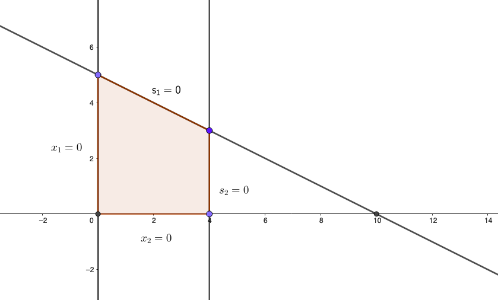

## Teorema fondamentale della Programmazione Lineare

Il teorema fondamentale della Programmazione Lineare si divide in due sottoteoremi, che chiamiamo FTLP-1 e FTLP-2.
 
 > **FTLP-1**: se la regione ammissibile del problema di PL non è vuota, almeno una delle soluzioni ammissibili è una soluzione di base.

In altre parole:
- se esiste una soluzione ammissibile, allora esiste una soluzione ammissibile di base: $$\exists~f.s. \Rightarrow \exists~b.f.s.$$
- se non esiste nessuna soluzione ammissibile di base, allora non esiste nessuna soluzione ammissibile: $$\nexists~b.f.s. \Rightarrow \nexists~f.s.$$

Questo teorema si dimostra per costruzione. Per ipotesi la regione non è vuota, quindi esiste una soluzione ammissibile. Partendo da essa, è possibile generare una sequenza di altre soluzioni ammissibili per ottenere, in un numero finito di passaggi, una soluzione di base. Basandosi su FLTP-1  è possibile sviluppare un algoritmo per studiare l'ammissibilità dei problemi di programmazione lineare. Questo algoritmo esamina solo le soluzioni di base ammissibili di un problema ausiliario opportunamente definito. L'algoritmo trova, alternativamente, una soluzione ammissibile di base per il problema originale, oppure determina che la regione di ammissibilità sia vuota.

> FLTP-2: se la funzione obiettivo è limitata sulla regione ammissibile (inferiormente per problemi di minimo, superiormente per i problemi di massimo) allora almeno una delle soluzioni ammissibili ottime è una soluzione ammissibile di base.

Anche questo sottoteorema si dimostra per costruzione. Esiste una soluzione ammissibile ottima perché la funzione obiettivo è limitata per ipotesi. Partendo da questa soluzione ammissibile, possiamo generare una sequenza di altre soluzioni ammissibili ottime per ottenere, in un numero finito di passaggi, una soluzione di base ottima. 

### Ripasso

Siano dati una matrice $F=[AI]$ di dimensioni $m \times (n+m)$ e rango $\mathrm{rk}(F)=m$, e un vettore $w = \begin{pmatrix} w \\s \end{pmatrix}$ tali che $Fw = b$,  $\exists~B~n\times m$ non singolari estratte da $F$. Scelta $B$ in $F$, riordino le colonne di $F$ e le componenti di $w$ in modo che le colonne di $B$ e le componenti di $w$ associate a $B$ siano le prime $m$.

$$F = [BN] \quad w = \begin{pmatrix} w_B \\ w_n \end{pmatrix} $$

$$ B^{-1} [B N] \begin{pmatrix} w_B \\ w_N \end{pmatrix} = B^{-1} b $$
$$w_B + B^{-1} N w_N = B^{-1} b $$

Quest'ultimo risultato è una rappresentazione di tutte e sole le soluzioni di $Fw = b$ (insieme soluzione). Esso è detto *forma canonica del sistema rispetto alla base $B$*. Il metodo del simplesso è basato su questa forma. Per ottenere l'intero insieme si sceglie arbitrariamente $w_N \in \mathbb R^n$. Esprimendo in un modo alternativo l'equazione notiamo che ciascuna variabile di base viene espressa in termini delle variabili non di base:

$$w_B = B^{-1} (b - N w_N) $$
Per ottenere la soluzione associata a $B$ si impone $w_N = 0$ (origine di $\mathbb R^n$). La soluzione di base è dunque, di fatto,
$$\begin{cases} w_B = B^{-1}B \\ w_N = 0 \end{cases}$$
Annullare le $w_N$ significa, geometricamente, porsi su $n$ frontiere di vincoli.

## L'algoritmo del simplesso

L'algoritmo procede iterativamente ripetendo questi quattro passi:
1. test di ottimalità
2. determinazione della direzione di ricerca
3. determinazione della lunghezza del passo
4. determinazione della forma canonica rispetto alla nuova base adiacente alla precedente

Il nome del primo passaggio è autoesplicativo: si verifica se la soluzione a disposizione, ovvero la prima soluzione di base da cui l'algoritmo inizia, oppure una soluzione base trovata iterativamente, è ottimale. Si procede al secondo passo soltanto se la soluzione attuale non è ottimale. Nel secondo passo si cerca la direzione lungo la quale il valore della variabile obiettivo tende a diminuire (o aumentare, nel caso di un problema di massimizzazione). Il terzo passo consiste nel determinare di quanto sia necessario muoversi in tale direzione per raggiungere la successiva soluzione di base. Si trova infine la nuova forma canonica legata al punto base trovato. Le basi canoniche trovate sono sempre adiacenti, perché da un passo all'altro si cambia un solo vincolo tra quelli considerati. L'algoritmo si muove lungo la frontiera. Ogni qual volta si determina un nuovo punto base, si ripete il test di ottimalità. Se viene passato, tale punto è la soluzione ottima. Nei problemi privi di soluzione ottimale, in un numero finito di iterazioni si arriva a una lunghezza di passo infinita durante il terzo passaggio. Esistono metodi alternativi al simplesso chiamati metodi a punti interni. Per definizione, la soluzione ottima si trova sulla frontiera. Questi metodi, muovendosi all'interno della regione ammissibile, possono avvicinarsi più rapidamente all'ottimo prendendo scorciatoie. Quando però il punto di ottimo è ritenuto abbastanza vicino, la regola di movimento deve cambiare per potersi avvicinare alla frontiera, e la determinazione del momento di cambio strategia è non banale. Il simplesso risulta tutt'oggi l'algoritmo più efficiente nella maggioranza dei casi.

---

**Esercizio:**

$$
\begin{aligned}
\max \omega & = 2x_1 + 3x_2 \\
\text{s.t.} \quad x_1 + 2x_2 & \leq 10 \\
x_1 & \leq 4 \\
x_1 \geq 0, & \quad x_2 \geq 0
\end{aligned}
\quad
\left|
\quad
\begin{aligned}
\min \varphi & = -2x_1 - 3x_2 \\
x_1 + 2x_2 + s_1 & = 10 \\
x_1 + s_2 & = 4 \\
x_1 \geq 0, & \quad x_2 \geq 0, \quad s_1 \geq 0, \quad s_2 \geq 0
\end{aligned}
\right.
$$

{ width=50% }

Il sistema è sottodeterminato. Poniamo l'obiettivo in forma di minimo. La scelta è a discrezione di chi scrive l'algoritmo. È infatti possibile trasformare un problema di massimo in minimo rendendo negativi entrambi i membri dell'equazione. In questo caso applichiamo il cambio di variabile $\varphi = -\omega$. Notiamo che il sistema è già in forma canonica rispetto alla base $B = [e_1 ~ e_2] = I$, perché $s_1$, $s_2$ e $\varphi$ sono già espresse solo in funzione di variabili $x_i$. Possiamo dunque determinare immediatamente $B$, $N$,  e le variabili di base e non di base $w_B$ e $w_N$.

In questo problema la base è formata dalle colonne di $s_1$ e $s_2$ (ovvero è una matrice identità):

$$ B = \begin{bmatrix} 1 & 0 \\ 0 & 1 \end{bmatrix} = I \quad  w_B = \begin{pmatrix} s_1 \\ s_2 \end{pmatrix}$$

$$N = \begin{bmatrix} 1 & 2 \\ 1 & 0 \end{bmatrix} \quad w_N = \begin{pmatrix} x_1 \\ x_2 \end{pmatrix}$$

Ciascuna delle variabili ($s_1$, $s_2$, $\varphi$) è espressa in funzione delle sole variabili $x_1$ e $x_2$. 

Ecco il tableau iniziale:

$$
\begin{matrix}
\small
\begin{matrix} x_1 & x_2 & s_1 & s_2 & \varphi & ~~~~~~~~ & \end{matrix} \\
\begin{bmatrix}
1 & 2 & 1 & 0 & 0 & | & 10 \\
1 & 0 & 0 & 1 & 0 & | & 4 \\
\hline
2 & 3 & 0 & 0 & 1 & | & 0
\end{bmatrix}
\end{matrix}
$$

Per ottenere il secondo punto, ovvero il punto A, annulliamo $x_2$ e $s_2$ lasciando $x_1$ e $s_1$ come variabili di base. Ricordiamo che l'algoritmo cambia una sola variabile di base per volta per passare da un punto all'altro.

$$w_B = \begin{pmatrix} x_1 \\ s_1 \end{pmatrix} \qquad w_N = \begin{pmatrix} x_2 \\ s_2 \end{pmatrix}$$

Proviamo ora a muoverci dall'origine verso l'alto.
$$
\begin{matrix}
\small
\begin{matrix} x_1 & x_2 & s_1 & s_2 & \varphi & ~~~~~~~~ & \end{matrix} \\
\begin{bmatrix}
1 & 2 & 1 & 0 & 0 & | & 10 \\
1 & 0 & 0 & 1 & 0 & | & 4 \\
\hline
2 & 3 & 0 & 0 & 1 & | & 0
\end{bmatrix}
\end{matrix}
$$

Test di ottimalità: $2x_1 + 3x_2 + \varphi = 0$: è possibile?
- $x_1 \geq 0$
- $x_2 \geq 0$

Di principio sì. Dato che le due variabili possono assumere valori positivi allora phi può diventare negativo.

- $x_1 > 0$, $x_2 = 0$ : $\varphi = -2x_1$
- $x_2 > 0$, $x_1 = 0$:  $\varphi = -3x_2$

Estraiamo $s_i$ dal tableau:

$$s_1 = 10 - 2x_2 \geq 0, \quad 0 \leq x_2 \leq 5$$
$$ s_2 = 4 \geq 0$$
Scegliamo di attribuire a $x_2$ il massimo valore possibile, ovvero 5. Questo valore corrisponde alla lunghezza del passo. Muovendoci di 5 verso l'alto dall'origine possiamo trovare il punto base situato sopra di essa nel disegno. Le nostre variabili di base per questo step sono $x_2$ e $s_2$.

Volendo procedere in modo più rigoroso, l'algoritmo calcola il passo così:
- dato che abbiamo stabilito di voler portare in base $x_2$, si divide il termine noto della riga (10) per il valore del coefficiente di $x_2$ (2): $10/2 = 5$. È necessario calcolare questo rapporto per tutte le righe, e scegliere il minimo tra quelli ottenuti. Questo calcolo è effettuato solo sui coefficienti strettamente positivi
- dobbiamo arrivare ad una nuova forma canonica per il nuovo punto in cui ci spostiamo. Ogni variabile di base deve continuare ad essere espressa in funzione delle variabili non di base.

La nuova $B$ deve essere formata dalle colonne di $x_2$ e $s_2$, quindi:
$$ B_2 = \begin{bmatrix} 2 & 0 \\ 0 & 1 \end{bmatrix} \qquad w_B \begin{pmatrix} x_2 \\ s_2  \end{pmatrix}$$
per arrivare a 
$$
\begin{matrix}
\begin{bmatrix} 2 & 0 \\ 0 & 1 \end{bmatrix} & \begin{pmatrix} x_2 \\ s_2  \end{pmatrix} & + & \begin{bmatrix} 1 & 1 \\ 1 & 0 \end{bmatrix} \begin{pmatrix} x_1 \\ s_1 \end{pmatrix} & = & \begin{pmatrix} 10 \\ 4 \end{pmatrix} \\ ~ \\
B &  w_B & + & N w_N & = & b
\end{matrix}
$$

La forma canonica con le colonne riordinate prende la seguente forma.

$$ w_B + \begin{bmatrix} \frac 1 2 & \frac 1 2 \\ 1 & 0 \end{bmatrix} w_N = \begin{pmatrix} 5 \\ 4 \end{pmatrix} $$

Non volendo modificare l'allineamento delle variabili, per procedere in maniera puramente algoritmica, il tableau assume questa disposizione:

$$
\begin{matrix}
\small
\begin{matrix} x_1 & x_2 & s_1 & s_2 & \varphi & ~~~~~ & \end{matrix} \\
\begin{bmatrix}
\frac 1 2 & 1 & \frac 1 2 & 0 & 0 & | & 5 \\
1 & 0 & 0 & 1 & 0 & | & 4 \\
\hline
\square & 0 & \square & 0 & 1 & | & \square
\end{bmatrix}
\end{matrix}
$$

L'1 del versore da costruire si trova all'intersezione tra la riga e la colonna dai quali coefficienti è stato generato il rapporto per determinare la lunghezza del passo.

Per determinare i nuovi valori delle righe, procediamo per riduzione gaussiana, in modo da ottenere i valori adeguati alla formazione di una matrice di base che sia identità:
$$ \bar R_1 = \frac 1 2 R_1 = \frac 1 2 ~ 1 ~ \frac 1 2 ~ 0 ~ 0 ~ 5 $$
$$ \bar R_2 = R_2 $$
$$
\bar R_0 = R_0 - 3 \bar R_1 =
\begin{matrix}
2 & 5 & 0 & 0 & 1 & 0 & - \\
\frac 3 2 & 3 & \frac 3 2 & 0 & 0 & 15 & = \\
\hline
\frac 1 2 & 0 & -\frac 3 2 & 0 & 1 & -15
\end{matrix}
$$
La nuova struttura è:

$$
\begin{matrix}
\begin{matrix} x_1 & x_2 & s_1 & s_2 & \varphi & ~~~~~~~~ & \end{matrix} \\
\begin{bmatrix}
\frac 1 2 & 1 & \frac 1 2 & 0 & 0 & | & 5 \\
1 & 0 & 0 & 1 & 0 & | & 4 \\
\hline
\frac 1 2 & 0 & -\frac 3 2 & 0 & 1 & | & -15
\end{bmatrix}
\end{matrix}
$$

Ripartiamo dal primo passo: determinazione dell'ottimalità.
$$ \varphi = -15 - \frac 1 2 x_2 + \cancel{\frac 3 2 s_1} $$
Non si deve attribuire a $s_1$ un valore positivo. Non si può infatti ottimizzare scegliendo variabili il cui coefficiente in ultima riga sia negativo. Da tale considerazione è escluso l'1, che è coefficiente della variabile obiettivo. In questo caso la scelta obbligata è $x_1$. A questo punto $x_1$ sostituirà la $s_2$. 

$$
\begin{matrix}
x_2 = 5 - \frac 1 2 x_1 \geq 0 & x_1 \leq 10 \\
s_2 = 4 - x_1 \geq 0 & x_1 \leq 4 \\ ~ \\
\Rightarrow x_1 = 4
\end{matrix}
$$

Dobbiamo ora trasformare le righe per ottenere che la colonna nuova di $x_1$ diventi come la vecchia $s_2$ (0 1 0):

$$
\begin{matrix}
\bar R_2 = R_2 \\ ~ \\
\bar R_1 = R_1 - \frac 1 2 R_2 =
\begin{matrix}
\frac 1 2 & 1 & \frac 1 2 & 0 & 0 & 5 & + \\
-\frac 1 2 & 0 & 0 & -\frac 1 2 & 0 & -2 \\
\hline
0 & 1 & \frac 1 2 & -\frac 1 2 & 0 & 3
\end{matrix} \\ ~ \\
\bar R_0 = R_0 - \frac 1 2 R_2 =
\begin{matrix}
\frac 1 2 & 0 & -\frac 3 2 & 0 & 1 & -15 \\
-\frac 1 2 & 0 & 0 & -\frac 1 2 & 0 & -2 \\
\hline
0 & 0 & -\frac 2 3 & -\frac 1 2 & 1 & -17 
\end{matrix}
\end{matrix}
$$

La riga finale è chiamata dei coefficienti di costo relativo. Qualora essi siano tutti negativi o nulli, allora la soluzione associata è ottima. Se tutti gli elementi sono negativi, l'ottimo è unico; se sono mescolati termini nulli e negativi, esistono soluzioni ottimali alternative. Sono deducibili altre informazioni dalle righe rimanenti del tableau. In corrispondenza della soluzione ottima, dalla loro analisi è possibile determinare in che modo essa possa modificarsi al variare dei dati in ingresso
