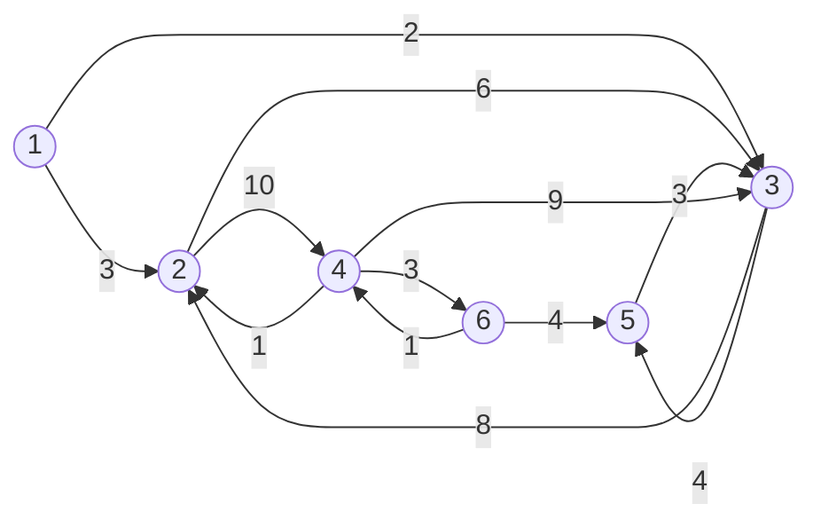
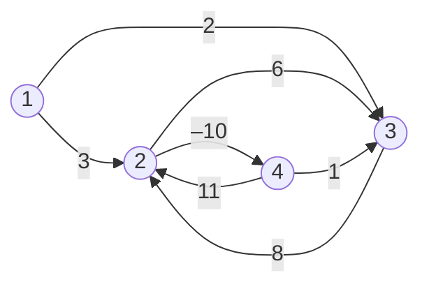
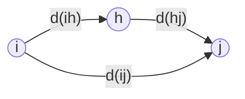
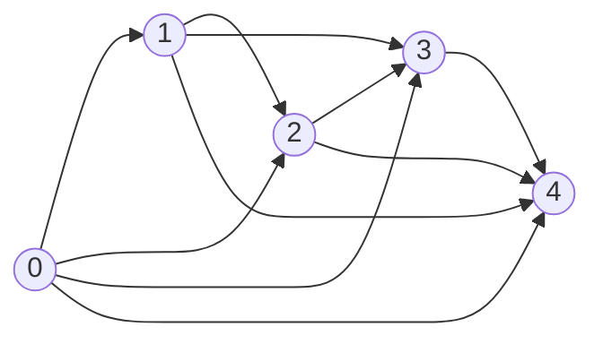

Per la risoluzione del problema dei cammini a costo minimo esistono tre algoritmi, in base alla struttura del grafo. Il primo, detto *algoritmo di Dijkstra*, si applica a grafi con presenza di cicli e $c_{i,j} \geq 0$, $\forall (i,j) \in A$. Il secondo, basato sull'*ordinamento topologico* dei nodi, è per soli grafi aciclici. Il terzo, più generico ma più pesante, è l'agoritmo di *Floyd-Warshall* per grafi con presenza di cicli e con $c_{i,j} <0$ per qualche $(i,j) \in A$

Analizziamo ora il primo algoritmo.

### Caso 1 (grafi a costo non nullo): algoritmo di Dijkstra

Una componente fondamentale di tutte le soluzioni è l'insieme $S$, che contiene i nodi per i quali è già stato determinato il costo minimo a partire dal nodo radice $s$. Il nodo $i$-esimo viene messo in $S$ quando viene trovato il costo minimo da $s$ a $i$. Durante l'inserimento, ad ogni nodo $i \in S$ viene data un'etichetta che contiene due informazioni: il suo predecessore $\mathrm{pred}[i]$ nel cammino a costo minimo e il costo $L[i]$ del cammino.

All'inizio dell'esecuzione dell'algoritmo viene messo in $S$ il nodo radice $s$, lasciando nullo il campo del predecessore nell'etichetta e segnando come zero il costo del cammino. All'inizio di ogni interazione successiva si effettua un *taglio*, per selezionare gli archi che si trovano sulla partizione $(S, N \setminus S)$. Si individuano i nodi raggiungibili tramite gli archi tagliati. Nel caso dell'esempio in figura, già alla prima iterazione si individua il cammino minimo tra i nodi 1 e 3. Se tutti i costi sono non-negativi, sarà impossibile trovare un cammino più breve passando dal nodo 2, perché già soltanto arrivare a 2 richiede un costo maggiore rispetto al raggiungimento diretto di 3. Lo stesso non si può dire del nodo 2.


```mermaid
graph LR
	1((1))
	2((2))
	3((3))
	4((4))
	5((5))
	6((6))

	1 -- 3 --> 2
	1 -- 2 --> 3
	2 -- 10 --> 4
	4 -- 1 --> 2
	2 -- 6 --> 3
	3 -- 8 --> 2
	3 -- 4 --> 5
	5 -- 3 --> 3
	4 -- 3 --> 6
	6 -- 4 --> 5
	4 -- 9 --> 3
	6 -- 1 --> 4
```

```pascal
Algoritmo Dijkstra(N,A,c,s,Pred,L)
begin
	porre S={s}, Pred[s] = nil, L[s] = 0;
	while |s| < n do
		begin
			forall(i,j) in deltaplus(s) = {(i,j):(i,j) in A, i in S, j not in S} 
				calcolare L[i] + c[i][j];
			determinare (v,h) in deltaplus(s): L[v]+c[v][h] =
				min{L[i]+c[v][h] : (i,j) in deltaplus(S)}; 
			porre Pred[h] = v; L[h] = L[v] + c[v][h]; S = S U {h};
		end
end
```

### Caso 2 (grafi aciclici): ordinamento topologico dei nodi

L'*ordinamento topologico* dei nodi è un'operazione che sostituisce la denominazione dei nodi con una denominazione numerica con la proprietà di dare una corrispondenza d'ordine ai nodi in base agli archi. Il nodo da cui un arco esce deve sempre avere un numero inferiore rispetto al nodo in cui l'arco entra:
$$ \forall (i,j) \in A: \quad i < j.$$

Riuscire a completare la procedura è la prova che il grafo non contiene cicli. In presenza di cicli, infatti, si giunge ad un'iterazione non completabile nella quale nessun nodo ha archi entranti. Riuscendo a dare una numerazione topologica ai nodi, e poi considerando i nodi in ordine numerico, si riesce ad avere una piena informazione sui cammini che arrivano fino al punto considerato. Il cammino di costo minimo dal nodo iniziale ad un nodo qualsiasi si ricostruisce percorrendo a ritroso la lista dei predecessori. 

### Caso 3 (grafi qualsiasi): algoritmo di Floyd-Warshall

In presenza di cicli e cammini a costi negativi, diventano possibili anche *cicli a costo negativo*. Questo causa problemi perché, nella determinazione del cammino a costo minimo, la scelta *greedy* porta a girare all'infinito nel ciclo a costo negativo invece che uscirne per muoversi verso il nodo destinazione. L'algoritmo di Floyd-Warshall è in grado di individuare i cicli a costo negativo e fermarsi anticipatamente in tal caso.

L'algoritmo utilizza una matrice $D$ $n \times n$ i cui elementi $d_{i,j}$ contengono il costo del cammino più breve finora trovato tra i nodi $i$ e $j$, e una matrice $P$ $n \times n$ i cui elementi $p_{i,j}$ contengono i predecessore del nodo $j$ nel cammino più breve finora trovato tra $i$ e $j$. 


```mermaid
graph LR
1((1)) -- 3 --> 2((2))
1 -- 2 --> 3((3))
2 -- 6 --> 3
3 -- 8 --> 2
2 -- –10 --> 4((4))
4 -- 11 --> 2
4 -- 1 --> 3
```

I costi associati agli archi formano la matrice

$$
C =
\begin{bmatrix}
0 & 3 & 2 & \infty \\
\infty & 0 & 6 & -10 \\
\infty & 8 & 0 & \infty \\
\infty & 11 & 1 & 0
\end{bmatrix}
$$

dove si è posto $c_{i,j} = 0$ per ogni $i \in N$ e $c_{i,j} = \infty$ per ogni $(i,j) \notin A$.

Il cammino più breve tra i nodi $i$ e $j$ è inizialmente posto uguale all'arco che li collega, quindi il predecessore del nodo $j$ nel cammino più brvee tra $i$ e $j$ è il nodo $i$: $p_{i,j} = i$

$$
P =
\begin{bmatrix}
1 & 1 & 1 & 1 \\
2 & 2 & 2 & 2 \\
3 & 3 & 3 & 3 \\
4 & 4 & 4 & 4
\end{bmatrix}
$$
mentre il costo del cammino più breve tra $i$ e $k$ è il costo dell'arco $(i,j)$:


$$
C = D = 
\begin{bmatrix}
0 & 3 & 2 & \infty \\
\infty & 0 & 6 & -10 \\
\infty & 8 & 0 & \infty \\
\infty & 11 & 1 & 0
\end{bmatrix}
$$
All'iterazione $h$ viene eseguita la seguente operazione triangolare relativa al nodo $h$; per ogni coppia di nodi $i,j$ viene considerato il nuovo cammino ottenuto passando per $h$, ovvero l'unione dei cammini da $i$ a $h$ e da $h$ a $j$:


```mermaid
graph LR
i((i)) -- d(ih) --> h((h))
h -- d(hj) --> j((j))
i -- d(ij) --> j
```

Se il costo del nuovo cammino (passante per $h$) da $i$ a $j$ è minore del costo del cammino più breve finora trovato, ossia $d_{i,h} + d_{h,j} < d_{i,j}$, si aggiornano sia il predecessore sia il costo di $j$
per identificare il nuovo cammino più breve trovato. Il predecessore di $j$ nel cammino da $i$ viene aggiornato assegnando ad esso il predecessore di $j$ nel cammino da $h$: $p_{i,j} \leftarrow p_{h,j}$. Il costo del cammino più breve finora trovato da $i$ a $j$ viene sostituito dalla somma dei costi dei
cammini più brevi finora trovati da $i$ ad $h$ e da $h$ a $j$: $d_{i,h} + d_{h,j} < d_{i,j}$.
La presenza di elementi negativi sulla diagonale della matrice $D$ indica la presenza di cicli a costo negativo. Il problema è dunque inferiormente limitato e l'algoritmo si interrompe.

Segue lo pseudocodice dell'algoritmo:
```pascal
Algoritmo Floyd-Warshall (N, A, c)
	begin
		for i = 1 to 𝑛 do
			for j = 1 to 𝑛 do
				begin
					porre 𝑑𝑖,𝑗 = 𝑐𝑖,𝑗, 𝑝𝑖,𝑗 = 𝑖 ;
				end
			for ℎ = 1 to 𝑛 do \\operazione triangolare su h
				begin
					for 𝑖 = 1 to 𝑛 do
						for 𝑗 = 1 to 𝑛 do
						if 𝑑𝑖,ℎ + 𝑑ℎ,𝑗 < 𝑑𝑖,𝑗 then
							begin
								porre 𝑑𝑖,𝑗 = 𝑑𝑖,ℎ + 𝑑ℎ,𝑗, 𝑝𝑖,𝑗 = 𝑝ℎ,𝑗 ;
							end
					for 𝑖 = 1 to 𝑛 do
			if 𝑑𝑖,𝑖 < 0 then STOP; \\ciclo negativo
				end
	end
```

## Esempio: scheduling delle ispezioni su una linea di produzione

Una linea di produzione è costituita da $n$ celle di lavorazione. La produzione è attualmente organizzata nel seguente modo:

- nella linea di produzione viene immesso un lotto costituito da $B$ pezzi da lavorare:
	- i pezzi del lotto sono tutti "senza difetti", essendo stato effettuato un controllo preventivo nel quale gli eventuali pezzi difettosi sono stati scartati
- in ognuna delle $n$ celle il lotto subisce una lavorazione:
	- costo di lavorazione nella cella $j$: $p_j$ per pezzo lavorato
	- costo della lavorazione del lotto nella cella $j$ è $B \cdot p_j$

Al termine della lavorazione $n$ viene effettuata un’ispezione per scartare i pezzi divenuti difettosi nel corso della lavorazione e non consegnarli ai clienti.

Costo totale di produzione di un lotto (lavorazione nelle $n$ celle):
$$ B \cdot \sum_{j=1}^n p_j $$

Attualmente la lavorazione dei pezzi divenuti difettosi continua nelle celle successive anche se saranno scartati nel corso dell’ispezione al termine della lavorazione $n$:

> Un pezzo divenuto difettoso nel corso della lavorazione $j < n$ viene sottoposto alle lavorazioni da $j+1$ a $n$, anche se dovrà essere scartato alla fine della lavorazione $n$.

In alternativa, si possono ispezionare i pezzi lavorati nella cella $j$, $1 \le j \le n$, scartando quelli divenuti difettosi e continuando la lavorazione solo sui pezzi non difettosi, il cui numero è denotato con $B_j$.

Per l’ispezione alla fine della lavorazione $j$ si devono sostenere un costo fisso, indipendente dal numero egli elementi selezionati, e un costo variabile, proporzionale al numero di elementi selezionati. In generale, entrambi i costi dell’ispezione alla fine della lavorazione $j$ dipendono da quando è stata effettuata l’ispezione $i$ immediatamente precedente:

- $i=0$: ispezione eseguita al momento della formazione del lotto
- $1 \le i \le j-1$: ispezione eseguita al termine della lavorazione $i$ (che precede $j$)

Definiamo anche

- $f_{i,j} , 0 \le i \le j-1$: costo fisso
- $h_{i,j} , 0 \le i \le j-1$: costo per ispezione

Il numero delle alternative tra cui scegliere aumenta esponenzialmente con il numero delle lavorazioni intermedie. Le ispezioni prima dell’inserimento del lotto e alla fine della lavorazione $n$ sono sempre effettuate:

- il costo dell’ispezione prima dell’inserimento del lotto dipende solo da $B$, quindi, fissato $B$, è una costante nella funzione dei costi complessivi
- il costo dell’ispezione alla fine della lavorazione $n$ dipende da quando è stata effettuata la precedente ispezione



```mermaid
graph LR
0((0)) --> 1((1))
1 --> 2((2))
2 --> 3((3))
3 --> 4((4))

0 --> 2
0 --> 3
0 --> 4
1 --> 3
1 --> 4
2 --> 4
```

Il grafo è aciclico e ha già i nodi ordinati. Possiamo procedere con l'algoritmo topologico.


## Problema del flusso massimo

Dato un grafo orientato $G=(N,A)$, ogni arco $(i,j) \in A$ ha capacità $u_{i,j}$, un nodo $s \in N$ è detto *nodo sorgente* o di *origine*, e un nodo $t \in N$ è detto *pozzo* o *destinazione*. È detta *problema di massimo flusso* la determinazione della massima quantità di flusso che può essere inviata da $s$ a $t$ in modo che in ogni arco il flusso non superi la capacità dell'arco e che in ogni nodo il flusso entrante sia uguale a quello uscente.

Il problema può essere strutturato come un modello di programmazione lineare, scegliendo come prima variabile decisionale la quantità immessa nella sorgente e prelevata al pozzo, e come altre variabili decisionali i flussi sui singoli archi. La conservazione del flusso al nodo sorgente richiede che il flusso immesso (da massimizzare) sia uguale al flusso uscente tramite gli archi. Nei nodi di trasferimento il flusso proveniente dagli archi entranti deve essere uguale al flusso per gli archi uscenti. Nel nodo pozzo il flusso entrante per gli archi entranti deve essere uguale al flusso prelevato (da massimizzare). Le variabili decisionali relative al flusso sugli archi sono limitate inferiormente a zero e superiormente alla capacità dell'arco considerato. Vogliamo massimizzare il flusso entrante / uscente agli estremi, affinché raggiunga il valore massimo compatibile con i vincoli interni al grafo. Per convenienza, si collegano direttamente il pozzo e la sorgente per trattare il grafo come un sistema isolato.

