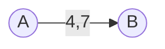
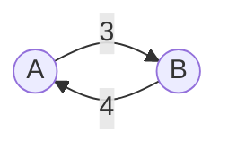
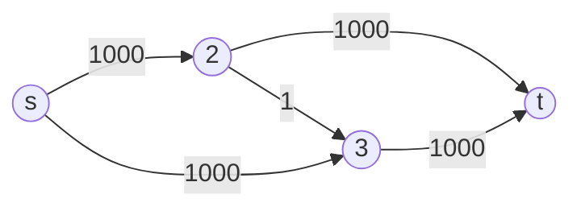
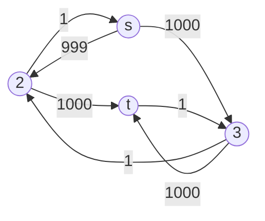

### Massimo flusso, minimo taglio

I flussi sugli archi devono rispettare sia i vincoli di nonnegatività che i vincoli di bilancio dei nodi.

Si consideri un generico taglio $(S, N \setminus S)$, definito come una partizione dei nodi in due insiemi disgiunti $S$ e $N \setminus S$. Per questo taglio, possiamo identificare due insiemi di archi:

- gli archi diretti del taglio, $A^+(S, N \setminus S)$, sono gli archi che partono da un nodo in $S$ e arrivano a un nodo in $N \setminus S$. Questi archi sono definiti come:
$$A^+(S, N \setminus S) = \{(i,j) \in A: i \in S, j \in N \setminus S\}$$

- gli archi diretti inversi del taglio, $A^-(S, N \setminus S)$, sono gli archi che partono da un nodo in $N \setminus S$ e arrivano a un nodo in $S$. Questi archi sono definiti come:
$$A^-(S, N \setminus S) = \{(i,j) \in A: i \in N \setminus S, j \in S\}$$

Il flusso sul taglio è la somma algebrica del flusso sugli archi di taglio. È importante notare che il flusso sul taglio è sempre uguale al valore di $v$ (flusso esterno) per qualsiasi taglio, e quindi è sempre positivo. Sommando le equazioni di bilancio sia su $S$ che su $N \setminus S$, otteniamo il flusso sul taglio $v$. Questo risultato è fondamentale per comprendere il flusso totale attraverso il taglio. La capacità di taglio è la somma delle capacità degli archi diretti nel taglio.

Il *teorema del flusso massimo e del taglio minimo* (*max flow, min cut*) afferma che il massimo flusso attraverso la rete coincide con la minima capacità di taglio. Questo significa che per qualsiasi taglio, il valore del flusso è minore o uguale alla capacità di taglio. Utilizzando l'elencazione combinatoria, è possibile creare tutti i possibili tagli e determinare i limiti superiori per il flusso. La soluzione del problema coincide con il minimo di questi limiti superiori. Il teorema si dimostra considerando il modello duale rispetto a quello costruito. L'obiettivo del problema duale è determinare quali sono gli archi di taglio.

Il metodo risolutivo, noto come *algoritmo di Ford-Fulkerson*, è un procedimento iterativo. All'inizio di ogni iterazione, viene fornito un flusso ammissibile. A partire da questo flusso, si costruisce la *rete incrementale*, che rappresenta tutte le modifiche applicabili ai flussi correnti della rete originaria senza violare i vincoli di capacità e di nonnegatività. Queste modifiche sono quindi ammissibili e, applicandole, si ottiene un'altra soluzione alternativa ammissibile. Sulla rete incrementale si determina l'esistenza di un cammino dalla sorgente al pozzo lungo il quale inviare ulteriore flusso, noto come cammino aumentante. Se tale cammino non esiste, il flusso ammissibile corrente è ottimo. Se invece il cammino esiste, si determina l'incremento di flusso nel rispetto dei vincoli e lo si somma al flusso iniziale per generare il flusso ammissibile iniziale per l'iterazione successiva. L'algoritmo di Ford-Fulkerson non richiede inizializzazioni particolari e può partire da un flusso iniziale nullo.

La rete incrementale è una rappresentazione che consente di identificare le modifiche ammissibili ai flussi correnti della rete originaria senza violare i vincoli di capacità e di nonnegatività. Data una rete di flusso e il suo flusso ammissibile, la rete incrementale aggiunge un arco diretto di capacità residua tra due nodi se l'arco presente non è saturo, ovvero ha un peso inferiore al proprio vincolo di flusso. Inoltre, aggiunge un arco inverso di capacità residua pari al flusso corrente se l'arco non è scarico, ovvero se il flusso non è nullo. Se l'arco non è né saturo né scarico, la rete incrementale includerà entrambi gli archi. È importante notare che gli archi residui rappresentano soltanto i massimi e i minimi per la possibile variazione, e non i valori della variazione stessa.

Ad esempio, si consideri un arco con flusso corrente di 4 unità e flusso massimo di 7 unità.

In questo caso è possibile aumentare il flusso di al massimo 3 unità per raggiungere il massimo, o rimuoverne al massimo 4 per azzerare il flusso. La rete incrementale rappresenterà questa situazione con due archi: uno diretto con capacità residua di 3 unità, e uno inverso con capacità residua di 4 unità. La rete incrementale può essere visualizzata visualizzata con il seguente grafo residuale:

In sintesi, la rete incrementale fornisce una struttura chiara per identificare le possibili modifiche ammissibili ai flussi correnti, facilitando la ricerca di cammini aumentanti e l'ottimizzazione del flusso nella rete.

Una volta costruita la rete incrementale, è possibile cercare un cammino composto esclusivamente da archi diretti che collega la sorgente al pozzo, noto come *cammino aumentante*. Il minimo tra gli incrementi presenti lungo questo cammino determinerà l'incremento complessivo rispetto al flusso ammissibile precedente. Successivamente, si aggiorna la rete originaria applicando le variazioni lungo il cammino aumentante. La ricerca del cammino aumentante nella rete incrementale rappresenta un test di ottimalità. Se viene trovato un cammino aumentante, ciò indica che la soluzione corrente non è ottima, poiché è possibile aumentare il flusso.

Un corollario del teorema di *max flow, min cut* permette di identificare il collo di bottiglia della rete. In assenza di un cammino aumentante, è possibile partizionare la rete incrementale in due insiemi: l'insieme dei nodi direttamente raggiungibili dall'origine e l'insieme dei nodi non raggiungibili. Tutti gli archi entranti nel taglio generato da questa partizione sono saturi, mentre tutti quelli uscenti sono scarichi. Questo partizionamento rivela il collo di bottiglia della rete, ovvero il punto in cui il flusso è limitato dalla capacità degli archi.

Si osservi un caso limite che evidenzia l'effetto della scelta del cammino aumentante sul numero di iterazioni dell'algoritmo. Il problema di flusso massimo rappresentato dal seguente grafo

si risolve in due iterazioni scegliendo di inviare:

- 1000 unità di flusso lungo il cammino $s,2,t$
- 1000 unità di flusso lungo il cammino $s,3,t$

Se invece si scegliesse come cammino aumentante $s,2,3,t$, che permette di inviare una sola unità di flusso, alla seconda iterazione il grafo residuale sarebbe

e anche all'iterazione successiva si potrebbe scegliere un cammino aumentante che aumenti solo di un'unità il flusso. Procedendo in questo modo, l'algoritmo richiederebbe 2000 iterazioni. Il problema può essere risolto decidendo di scegliere il cammino con il minor numero di archi (aggiunta di Edmonds e Karp all'algoritmo di Ford-Fulkerson). Questo dipende dalla differenza tra le strategie di visita in ampiezza e in profondità spiegata in precedenza: la scelta è possibile solo se l'algoritmo di visita gestisce l'insieme dei nodi raggiunti come una coda.

Tra i problemi riconducibili al flusso massimo vi è il trasferimento di merce o di valore dall'offerta alla domanda. In situazioni in cui l'offerta supera la domanda, è possibile introdurre un *nodo fittizio di domanda* che bilancia l'offerta in eccesso. Questo nodo fittizio assorbe la quantità di merce o valore che non trova corrispondenza nella domanda reale, garantendo così l'equilibrio del sistema. Viceversa, in caso di domanda superiore all'offerta, è possibile introdurre un nodo fittizio di offerta che compensi il deficit, assicurando nuovamente l'equilibrio tra offerta e domanda.

