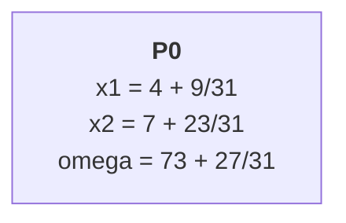
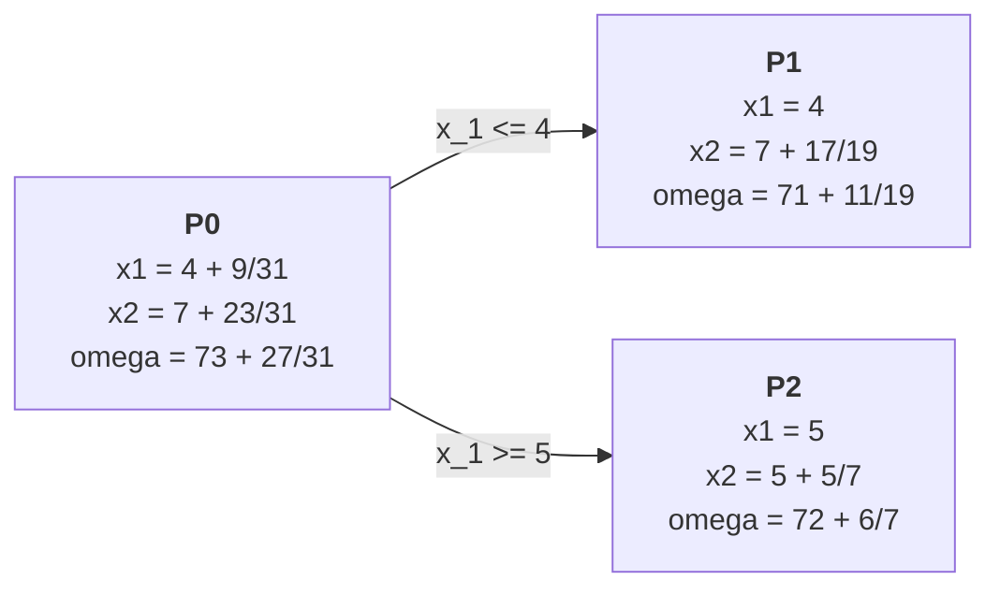
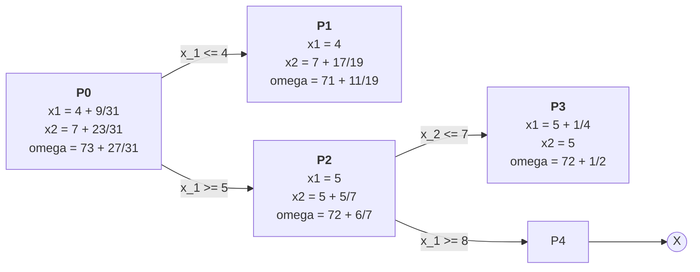
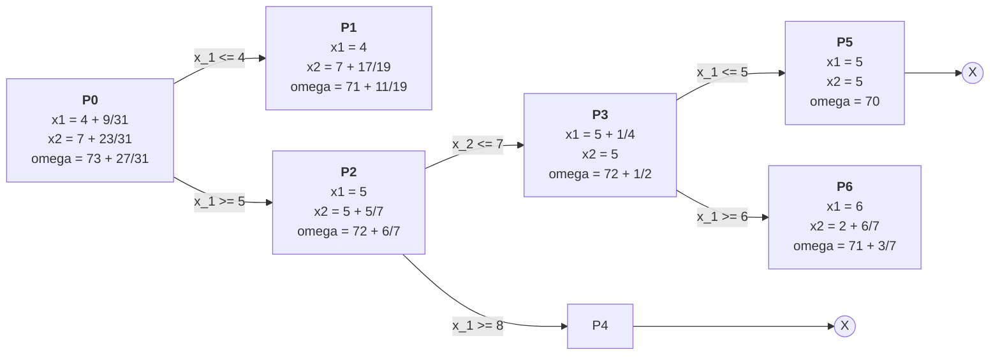
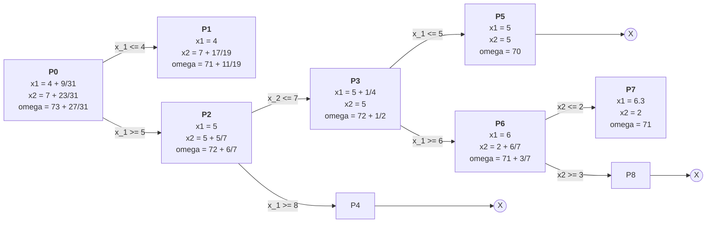
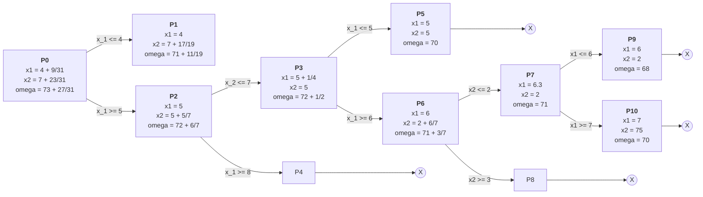
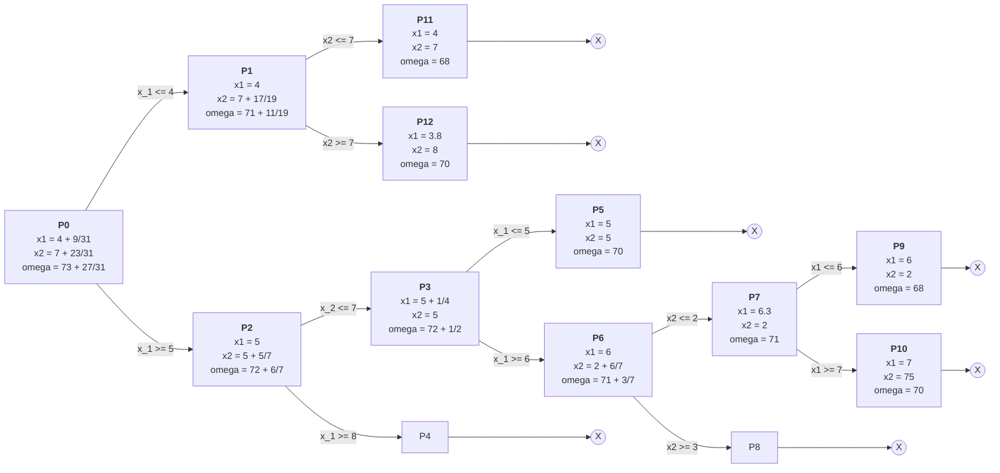

Si definisce *mixed-integer linear programming* (MILP) o semplicemente *mixed-integer programming* (MIP) la categoria di problemi di programmazione lineare in cui si osserva una mescolanza tra variabili decisionali intere e variabili decisionali continue. Nel caso in cui tutte le variabili decisionali siano soggette a vincolo di integralità, si parla invece di *programmazione lineare intera* (PLI) o *integer linear programming* (ILP). Il caso MIP può essere facilmente ricavato dopo aver definito un metodo risolutivo per la PLI.

Si inizi da una considerazione sulla regione ammissibile. Per un problema PL a $n$ vincoli, lo spazio delle soluzioni è $\mathbb R^n_+$. Per un problema PLI lo spazio perde cardinalità riducendosi a $\mathbb N^n$. Volendone dare una rappresentazione cartesiana, la regione ammissibile smette di essere una regione continua di (iper)piano. Essa si riduce infatti a un insieme finito di punti, gli incroci delle linee della porzione di griglia intera racchiusa tra i vincoli del problema. La soluzione ottima si determina graficamente costruendo innanzitutto una retta che abbia come equazione la funzione obiettivo. Dopodiché si costruiscono parallele alla retta della funzione obiettivo passanti per i punti della regione ammissibile. Si cerca infine la parallela con l'intercetta maggiore. Il punto (o i punti) attraverso cui passa tale parallela rappresenta(no) la soluzione ottima al problema.

\begin{tikzpicture}
    \draw[->] (-0.2,0) -- (5.2,0) node[right] {$x$};
    \draw[->] (0,-1.2) -- (0,3.2) node[above] {$y$};
	
	\draw[green, thick] (2.28,2.81) -- (3.64,-0.61) node[left] {$x_2 = -\frac 5 2 x_1 + \frac \omega 2$};

	\foreach \x in {0,...,3}
	\foreach \y in {0,...,1}
		\filldraw[color=red] (\x,\y) circle (2pt);

	\foreach \x in {0,...,2}
		\filldraw[color=red] (\x,2) circle (2pt);
	
	\foreach \x in {0,...,1}
		\filldraw[color=red] (\x,3) circle (2pt);

	\draw[help lines] (0,-1) grid (5,3);
	
	\draw[black, thick] (1,3.5) -- (5,-0.5) node[right] {$s_1 = 0$};
	\draw[black, thick] (3.7,-0.9) -- (2.9,3.2) node[right] {$s_2 = 0$};
	
\end{tikzpicture}

## Metodo a piani di taglio

È facile notare che il punto di ottimo si trovi all'interno della regione ammissibile, e non sul suo contorno. Questa significativa differenza impedisce di utilizzare direttamente il metodo del simplesso come precedentemente definito per i problemi PL a variabili continue. Possiamo riadattare il problema, aggiungendo vincoli aggiuntivi che si intersechino presso il punto di ottimo. Per evitare che alterino la soluzione del problema, i nuovi vincoli devono essere ridondanti. Ogni nuovo vincolo deve essere dunque soddisfatto a priori da tutti i punti appartenenti alla regione ammissibile originale. Nello specifico, li ricaviamo dalla forma canonica della soluzione ottima. Questa è l'intuizione di base su cui si fonda il *metodo a piani di taglio*. 

Lo si analizzi partendo da un esempio di riferimento:

$$
\begin{matrix*}[l]
\max \omega = & 5 x_1 + 2 x_2 \\
& 2x_1 + 2 x_2 \leq 9 \\
& 3x_1 + x_2 \leq 11 \\
& x_1, x_2 \geq 0 \text{ e intere}
\end{matrix*}
$$

\begin{tikzpicture}
    \draw[->] (-0.2,0) -- (5.2,0) node[right] {$x$};
    \draw[->] (0,-1.2) -- (0,3.2) node[above] {$y$};

	\foreach \x in {0,...,3}
	\foreach \y in {0,...,1}
		\filldraw[color=red] (\x,\y) circle (2pt);

	\foreach \x in {0,...,2}
		\filldraw[color=red] (\x,2) circle (2pt);
	
	\foreach \x in {0,...,1}
		\filldraw[color=red] (\x,3) circle (2pt);

	\draw[help lines] (0,-1) grid (5,3);
	
	\draw[black, thick] (1,3.5) -- (5,-0.5) node[right] {$s_1 = 0$};
	\draw[black, thick] (3.7,-0.9) -- (2.9,3.2) node[right] {$s_2 = 0$};
\end{tikzpicture}

È necessario innanzitutto rilassare i vincoli di integralità e trovare la soluzione ottima continua con il metodo del simplesso. Ci si aspetta che quest'ultima sia vicina alla soluzione integrale che è ancora ignota.

$$
\begin{matrix}
\begin{array}{ccccccc}
x_1 & x_2 & s_1 ~& s_2~ & \varphi & ~~~~~~~
\end{array} \\
\left [
\begin{array}{ccccc|c}
0 & 1 & \frac 3 4 & -\frac 1 2 & 0 & \frac 5 4 \\
1 & 0 & -\frac 1 4 & \frac 1 2 & 0 & \frac{13} 4 \\
\hline
0 & 0 & -\frac 1 4 & -\frac 3 2 & 1 & -\frac {75} 4
\end{array}
\right ]
\end{matrix}
$$
Ogni coefficiente deve essere diviso in una parte intera e una parte frazionaria, entrambe positive:
$$
\begin{matrix}
x_1 + \frac 3 4 s_1 - \frac 1 2 s_2 = \frac 5 4 &\quad
x_2 + (0 + \frac 3 4) s_1 + (-1 + \frac 1 2) s_2 = 1 + \frac 1 4 \\
x_1 - \frac 1 4 s_1 + \frac 1 2 s_2 = \frac{13} 4 &\quad x_1 + (-1+\frac 3 4) s_1 + (0 + \frac 1 2) s_2 = 3 + \frac 1 4 \\
\omega + \frac 1 4 s_1 + \frac 3 2 s_2 = \frac{75} 4 & \quad \omega + (0 + \frac 1 4) s_1 + (1 + \frac 1 2) s_2 = 18 + \frac 3 4
\end{matrix}
$$
La parte intera coincide con il massimo intero che precede il numero, mentre la parte frazionaria è l'avanzo rimanente.

Successivamente, si sceglie arbitrariamente una delle righe del *tableau* finale. In questo caso scegliamo di ottenere il taglio di Gomory dalla riga 0, relativa alla variabile obiettivo.

$$
\begin{matrix}
\omega + (0 + \frac 1 4) s_1 + (1 + \frac 1 2) s_2 = 18 + \frac 3 4 \\
\omega + \frac 1 4 s_1 + s_2 + \\
terza ~ equazione
\end{matrix}
$$

Il termine $\frac 1 4 s_1 + \frac 1 2 s_2$ è sempre positivo o nullo perché combinazione lineare di variabili scarto (sempre positive o nulle per definizione) con coefficienti positivi.

Sostituiamo $s_2$ e $\omega$ che ricaviamo dalle combinazioni lineari. Otteniamo il nuovo vincolo
$$x_2 \leq -2x_1 + 7 + \frac 3 4$$
che è una retta passante per il punto di ottimo $(\frac{13}{4}, \frac 5 4)$, e che è ridondante sia per il problema intero che per quello continuo.

Utilizzando invece
$$\omega + s_2 \leq 18,$$
ovvero considerando solo la parte intera del termine noto ed escludendo la parte frazionaria, otteniamo una restrizione del problema a rilassamento continuo. Stiamo infatti escludendo, tra l'altro, l'ottimo continuo. Non stiamo invece eliminando nessuna delle soluzioni ammissibili intere. Nella prima iterazione, corrispondente al puro rilassamento continuo, avevamo la massima regione ammissibile ausiliaria possibile. Ora ne viene esclusa una porzione che non porta alcuna soluzione ammissibile intera. L'idea è arrivare iterativamente al contenitore minimale, noto come *guscio convesso*, il più stretto possibile che continui a contenere tutti i punti interi ammissibili.

\begin{tikzpicture}
    \draw[->] (-0.2,0) -- (5.2,0) node[right] {$x$};
    \draw[->] (0,-1.2) -- (0,3.2) node[above] {$y$};

	\foreach \x in {0,...,3}
	\foreach \y in {0,...,1}
		\filldraw[color=red] (\x,\y) circle (2pt);

	\foreach \x in {0,...,2}
		\filldraw[color=red] (\x,2) circle (2pt);
	
	\foreach \x in {0,...,1}
		\filldraw[color=red] (\x,3) circle (2pt);

	\draw[help lines] (0,-1) grid (5,3);
	
	\draw[black, thick] (1,3.5) -- (5,-0.5) node[right] {$s_1 = 0$};
	\draw[black, thick] (3.7,-0.9) -- (2.9,3.2) node[right] {$s_2 = 0$};
	\draw[blue, thick] (1.72,3.55) -- (3.79,-0.57);
\end{tikzpicture}

Notiamo nella figura che il nuovo vincolo passa per il punto di ottimo, ma questi non è ancora raggiungibile con il metodo del simplesso perché è su un lato ma non su di un vertice. Servirà un nuovo vincolo integrale che passi per il punto.

$$
\underbrace{\omega + s_2}_A + \underbrace{\frac 1 4 s_1 + \frac 1 2 s_2}_B = \underbrace{18}_C +\underbrace{\frac 3 4}_C
$$

che diventa
$$
\begin{matrix}
A + B = C + D \\
A \leq C
\end{matrix}
\Rightarrow
B \geq D:
\frac 1 4 s_2 
$$

$$
\begin{matrix}
\left [
\begin{array}{cccccc|c}
x_1 & x_2 & s_1 & s_2 & s_3 & \varphi & \\
\hline
0 & 1 & \frac 3 4 & -\frac 1 2 & 0 & 0 & \frac 5 4 \\
1 & 0 & -\frac 1 4 & \frac 1 2 & 0 & 0 & \frac{13} 4 \\
0 & 0 & -\frac 1 4 & -\frac 1 2 & 1 & 0 & -\frac 3 4 \\
\hline
0 & 0 & -\frac 1 4 & -\frac 3 2 & 0 & 1 & -\frac {75} 4
\end{array}
\right ]
\end{matrix}
$$

Abbiamo aggiunto una nuova riga, e questo ci richiede di aggiungere una nuova variabile di base (relativa al vincolo nuovo): $s_3$. Possiamo procedere per simplesso duale. Abbiamo una riga il cui coefficiente della variabile di base assume coefficiente negativo ($s_3$). La facciamo dunque uscire di base, capendo invece che debba entrare in base una tra $s_1$ e $s_2$, che hanno coefficienti negativi nella riga dell'1 di $s_3$. Calcoliamo i rapporti con la regola dei rapporti trasposta (tra i coefficienti delle colonne nella riga 0 e i coefficienti delle colonne nella riga relativa a $s_3$):

$$
\begin{matrix}
-\frac 1 4 / -\frac 1 4 = 1 \\
-\frac 3 2 / -\frac 1 2 = 3
\end{matrix}
$$

Scelgo il più piccolo (1) che corrisponde a $s_1$: $s_1$ entra in base al posto di $s_3$. In pratica, per annullare $s_3$ portando in base $s_1$, scorro verso il basso lungo la retta di $s_1$ fino al punto in cui si incrocia con $s_3$. Notiamo sul grafico che questo punto è fuori dalla regione ammissibile, quindi dobbiamo applicare di nuovo il simplesso duale.

$$
\begin{matrix}
\left [
\begin{array}{cccccc|c}
x_1 & x_2 & s_1 & s_2 & s_3 & \varphi & \\
\hline
0 & 1 & 0 & -2 & 3 & 0 & -1 \\
1 & 0 & 0 & 1 & -1 & 0 & 4 \\
0 & 0 & 1 & 2 & 4 & 0 & 3 \\
\hline
0 & 0 & 0 & -1 & -1 & 1 & -18
\end{array}
\right ]
\end{matrix}
$$

Procediamo nuovamente. Il *pivot* è sulla prima riga e quarta colonna.

$$
\begin{matrix}
\left [
\begin{array}{cccccc|c}
x_1 & x_2 & s_1 & s_2 & s_3 & \varphi & \\
\hline
0 & -\frac 1 2 & 0 & 1 & -\frac 3 2 & 0 & \frac 1 2 \\
1 & \frac 1 2 & 0 & 0 & \frac 1 2 & 0 & \frac 7 2 \\
0 & 1 & 1 & 0 & -1 & 0 & 2 \\
\hline
0 & -\frac 1 2 & 0 & 0 & -\frac 5 2 & 1 & -\frac {35}2
\end{array}
\right ]
\end{matrix}
$$

Procediamo di nuovo rilassando l'integralità. La soluzione è ancora frazionaria, quindi serve un altro passo di taglio:

$$ \omega + \frac 1 2 x_2 + 2s_3 + \frac 1 2 s_3 = 17 + \frac 1 2 $$
Il taglio in forma intera è $\omega + 2 s_3 \leq 17$, mentre la forma frazionaria è $\frac 1 2 x_2 + \frac 1 2 s_3 \geq \frac 1 2$.
Il nuovo vincolo è verticale e si incrocia con il precedente proprio nel punto di ottimo. Il prossimo passo di simplesso conduce proprio a tale punto.

\begin{tikzpicture}
    \draw[->] (-0.2,0) -- (5.2,0) node[right] {$x$};
    \draw[->] (0,-1.2) -- (0,3.2) node[above] {$y$};
    
	\draw[blue, thick] (1.72,3.55) -- (3.79,-0.57);
	\draw[yellow, thick] (3,-0.7) -- (3,3.5);

	\foreach \x in {0,...,3}
	\foreach \y in {0,...,1}
		\filldraw[color=red] (\x,\y) circle (2pt);

	\foreach \x in {0,...,2}
		\filldraw[color=red] (\x,2) circle (2pt);
	
	\foreach \x in {0,...,1}
		\filldraw[color=red] (\x,3) circle (2pt);

	\draw[help lines] (0,-1) grid (5,3);
	
	\draw[black, thick] (1,3.5) -- (5,-0.5) node[right] {$s_1 = 0$};
	\draw[black, thick] (3.7,-0.9) -- (2.9,3.2) node[right] {$s_2 = 0$};
\end{tikzpicture}

Notiamo che ad ogni passo l'algoritmo aumenta le dimensioni del problema di uno, per aggiungere il nuovo vincolo, e nessuno dei vincoli dei passaggi precedenti può essere scartato nei passaggi nuovi.

## Metodi branch-and-bound

Il metodo di soluzione alternativo ai piani di taglio è detto *branch-and-bound*. L'algoritmo procede ricorsivamente, eliminando ad ogni passo una striscia della regione ammissibile che non contenga soluzioni intere. Dopodiché, si riapplica alle due porzioni rimanenti, situate ai lati della striscia eliminata.

Si analizzi ora l'algoritmo in maggiore dettaglio. Per rilassamento continuo si trova la prima soluzione non intera. Nell'esempio si risolveranno graficamente i sottoproblemi, ignorando deliberatamente i tableau, anche se solitamente utilizzati nella risoluzione vera e propria.

> [!Problema d'esempio]
> Un rivenditore al dettaglio acquista all’ingrosso ogni giorno 2 prodotti che rivende nell’arco della giornata:
> 
> - 1 cassa del prodotto 1 costa 10 euro e la vendita al dettaglio genera un profitto di 10 euro
> - 1 cassa del prodotto 2 costa 19 euro e la vendita al dettaglio genera un profitto di 4 euro.
> Il rivenditore ha un budget giornaliero di 190 euro.
> 
> Il rivenditore trasferisce le casse acquistate al negozio mediante il proprio furgone che può trasportare:
> 
> - fino a 7 casse, se viene trasportato solo il prodotto 1 (l’ingombro di una cassa di prodotto 1 è 1/7
> della capacità del furgone)
> - fino a 20 casse, se trasporta solo il prodotto 2 (l’ingombro di una cassa di prodotto 2 è 1/20 della
> capacità del furgone)
> - qualsiasi combinazione di casse dei 2 prodotti che non eccede la capacità del furgone.
> Determinare quante casse di ciascun prodotto il rivenditore deve acquistare per massimizzare il profitto.

La struttura dati utilizzata per immagazzinare i risultati intermedi è nota come *albero di branch-and-bound*. Nella sua iterazione iniziale contiene soltanto un nodo, relativo al problema completo:

Scegliamo ad esempio di lavorare su $x_1$. Dato che il valore di $x_1$ è intero e compreso tra 4 e 5, tripartiamo il vincolo:
- $x_1 \leq 4$
- $4 \leq x_1 \leq 5$
- $x_1 \geq 5$
Possiamo escludere la fascia centrale dalla ricerca, perché non può contenere soluzioni intere se non agli estremi che sono già compresi nelle altre due fasce. Bipartiamo il problema rispetto a $x_1$:
- $P_1 : P_0 \wedge x_1 \leq 4$
- $P_2 : P_0 \wedge x_1 \geq 5$

Costruiamo altri due problemi a partire da $P_2$, sul vincolo $x_2$:

Notiamo che $P_4$ è inammissibile, e dunque terminiamo il suo ramo. Continuiamo dividendo $P_3$ in base a $x_1$:

Terminiamo il ramo di $P_5$ perché abbiamo trovato una soluzione intera ammissibile. Continuiamo da $P_6$:

Chiudiamo $P_8$ perché è inammissibile. Procediamo di nuovo da $P_7$:

Chiudiamo i rami di $P_9$ e $P_{10}$ perché abbiamo soluzioni ammissibili. Terminiamo ora considerando le ramificazioni di $P_1$:

Chiudiamo $P_{11}$ per ammissibilità e $P_{12}$ per subottimalità (abbiamo già 2 soluzioni ammissibili con valore obiettivo minore). Possiamo ora scegliere, tra le soluzioni ammissibili foglia, quella con il valore dell'obiettivo più basso come soluzione ottimale vera.

È possibile stimare un *gap di ottimalità* a partire dalle soluzioni trovate fino a una data iterazione, e terminare anticipatamente prima quando il *gap* scende sotto ad un valore desiderato.

Si può evitare il *branch-and-bound* arrotondando direttamente la soluzione del rilassamento continuo, ma in questo modo non si garantiscono né l'ottimalità né l'ammissibilità della soluzione. Si può reintegrare l'ammissibilità ma questo potrebbe aumentare ulteriormente la distanza dalla vera soluzione intera. Si ricordi comunque che l'errore di arrotondamento è tanto più piccolo quanto più sono grandi i numeri considerati.
