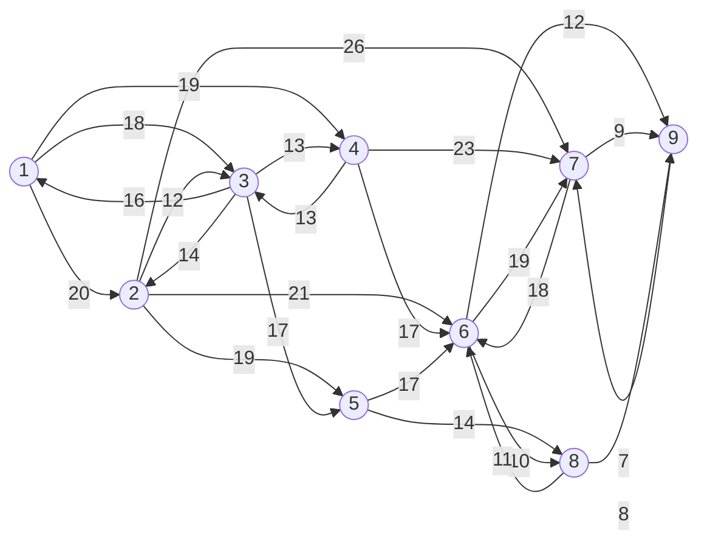

\newpage

# Ottimizzazione su grafi

I problemi di ottimizzazione sui grafi sono a soluzione integrale. Un esempio di problema appartenente a tale categoria è la selezione (binaria) degli archi da inserire in un cammino a costo minimo. L'integralità della soluzione non è da raggiungere algoritmicamente, ma è una proprietà insita nella struttura del problema. Questo deriva da una proprietà della regola di Cramer, enunciata di seguito:

> *data $A: m \times m$ matrice dei coefficienti di un sistema di equazioni $A\underline x = \underline b$, le soluzioni sono del tipo
$$ x_j = \frac{\det(A_j)}{\det(A)}$$
> dove $A_j$ è ottenuta sostituendo la $j$-esima colonna di $A$ con il vettore colonna $\underline b$ dei termini noti.*

Una proprietà significativa è che l'integralità del determinante di $A_j$ dipende dall'integralità delle componenti di $\underline b$. Dato che la matrice delle variabili di base nel tableau del simplesso ha sempre determinante $\pm 1$, essendo composta da versori, allora se $\underline b$ è integrale, le soluzioni $x_j$ saranno a loro volta integrali.

## Ripasso grafi

Un grafo $G=(V,E)$ è una coppia di insiemi di *vertici* (*nodi*) e *lati* (*archi*). I collegamenti sono coppie non ordinate nel caso di grafi non orientati e coppie ordinate nel caso di grafi orientati. Si dice *stella* l'insieme dei lati incidenti. Nel caso di grafi orientati si distingue tra *stella entrante* (*backward star*), definita come insieme degli archi entranti, e *stella uscente* (*forward star*) composta di archi uscenti.

In un grafo non orientato chiamiamo ??? (finire, slide 4)

## Problema della raggiungibilità

Dato un nodo $s \in N$ del grafo $G=(N,A)$ determinare i nodi raggiungibili da $s$, ossia il sottoinsieme $m \subseteq N$ 

## Algoritmi di visita


Dato un grafo orientato e un nodo origine $r$, determinare i nodi raggiungibili da $r$

Ordinamento degli archi: considerare l'ordine in cui sono in $N$ e poi, per ogni nodo, ordinare gli archi in modo crescente in base al nodo di testa.

$Q$ è la lista dei nodi di testa degli archi che appartengono alle stelle uscenti dei nodi già raggiunti. È una lista dalla quale estrarre ad ogni iterazione il primo elemento. Abbiamo anche un vettore $\underline p$ di cui l'elemento $i$-esimo indica il nodo che precede immediatamente $i$ nel cammino da $r$ a $i$ determinato nelle iterazioni precedenti alla corrente.

Possiamo lavorare con una pila o con una coda.

```pascal
Procedure Cammini orientati(G,r,p):
	begin
		for i := 1 to n do p[i] := 0,
		Q := {r}; p[r] := nul;

		repeat
			i := Select(Q);    Q := Q\{i};
			for each (i,j) in FS(i) do
				if p[j] := 0 then begin p[j] := i; Q := Q U {j} end
		until Q = [];
	end
```

All'inizio della procedura il nodo radice $r$ è l'unico elemento raggiungibile (unico elemento di $Q$) e non ha predecessori. Nel loop principale si cancella da $Q$ il nodo i selezionato. Nel `for-each` annidato, per ogni arco della stella uscente si controlla il valore del predecessore. Se è nullo, significa che il nodo raggiunto dall'arco non è mai stato raggiunto prima e va messo nella lista dei predecessori. In caso contrario, significa che il nodo è già stato raggiunto e non va considerato. Il loop continua finché ci sono elementi in $Q$.

I cammini orientati possono essere ricostruiti utilizzando i predecessori dei nodi. Di fatto, utilizzando solo i cammini trovati, costruiamo l'albero dei cammini, che è una versione aciclica del grafo di partenza. L'albero dei cammini è diverso a seconda che si utilizzi la versione dell'algoritmo implementata con la pila o con la coda. In particolare, l'approccio basato sulla pila tende a produrre cammini di lunghezza maggiore o uguale di quelli determinati con la pila.

Il costo della visita è $O(m)$ dove $m$ è il numero di archi del grafo. Questo perché ogni arco è considerato al massimo una volta.

Determinare l'insieme dei nodi raggiungibili con cammini orientati a partire da uno qualunque dei nodi di un dato insieme $R \subset N$ ...

Possiamo trovare la soluzione modificando l'insieme dei nodi definendo un nodo fittizio $s$ chiamato *superradice*, e creando nuovi archi che colleghino tutti i nodi alla superradice.

Determinare l'insieme die nodi dai quali è possibile raggiungere, mediante cammini orientati, un nodo destinazione $d$. Dobbiamo definire un grafo modificato in cui gli archi siano ottenuti invertendo il verso degli archi del grafo originale.

## Alberi

Un grafo $G=(N,A)$ con $n$ nodi è detto *albero* se è connesso (ovvero esiste un cammino tra ogni coppia di nodi) ed è aciclico. Alternativamente, si possono utilizzare le seguenti definizioni:
- $G$ è connesso e ha $n-1$ archi
- $G$ è aciclico e ha $n-1$ archi
- esiste un unico cammino che congiunge ogni coppia di nodi

Un *albero di supporto* (o *di copertura*) è un albero definito come sottografo di un grafo non orientato $G=(V,E)$ contenente tutti gli elementi di $V$.

Un albero con $n$ nodi ha $n-1$ collegamenti, esiste un unico cammino tra qualunque coppia di nodi, aggiungendo un collegamento qualsiasi si ottiene un unico ciclo. Proprietà di scambio: sia dato un albero di supporto. Gli si aggiunga un lato a caso tra due elementi. Rimuovendo un lato qualsiasi dal ciclo che si forma, la nuova struttura è a sua volta un albero di supporto.


### Determinazione dell'MST

Un problema importante è la determinazione dell'albero di supporto a costo minimo (MST), contenente gli archi che minimizzano la sommatoria di tutti i costi.

Una prima tecnica è il metodo di Kruskal. Si inizializza ordinando collegamenti in ordine di costo non decrescente. Si itera tra i collegamenti non ancora considerati per scegliere quello a costo minimo. Se il suo inserimento non genera cicli, lo si inserisce nell'albero di supporto, altrimenti lo si elimina dalla lista dei candidati. L'approccio è *greedy*, ma per questo tipo di problemi produce una soluzione ottima.

```pascal
Algoritmo Kruskal(V,E,T*)
begin
	ordinare i collegamenti di E secondo valori non crescenti
	porre T* = []
	while |T*| < n-1 do
	begin
		scegliere un collegamento e in E di costo minimo
		porre E = E\{e}
			if T* U {e} non ha cicli then T* = T* U {e}
		end
	end
	return T*
end
```

Un'alternativa al metodo di Kruskal è l'algoritmo di Prim. Esso garantisce, al contrario di Kruskal, che l'albero sia sempre connesso anche durante le iterazioni della costruzione. Si sceglie una radice. Si effettua un *taglio*, ovvero una partizione tra i nodi appartenenti all'albero e quelli non ancora appartenenti. Si definiscono *archi di taglio* gli archi attraversati dalla linea di partizione. Essi saranno i candidati tra cui scegliere. Tramite una scelta *greedy*, si seleziona quello di costo minore e lo si inserisce nell'albero ottimale insieme al nodo a cui porta. Si procede iterativamente fino a completare l'albero. In caso di parità di costo sugli archi candidati, la scelta è arbitraria.

```pascal
Algoritmo Prim (V, E, T*)
begin
	porre T = [] 
	porre S = 1
	while |T*| < n-1 do
	begin
		scegliere un collegamento {v, h} in delta(S) di costo minimo
		porre T* = T* U v, h
		porre S = S U h
	end
	return T*
end
```

Si definisce *lato di diminuzione* un lato che, se aggiunto ad un albero secondo le modalità della proprietà di scambio, genera un ciclo contenente lati di costo maggiore ad esso. Un albero di supporto è detto ottimale se e solo se non ammette collegamenti di diminuzione. La ricerca richiede al peggio $m-(n-1)$ iterazioni con $n$ nodi e $m$ collegamenti. Come regola empirica, conviene esaminare i collegamenti in ordine crescente di costo.

### Problema del messaggio segreto

Vogliamo minimizzare la possibilità che un messaggio segreto venga intercettato, facendo comunque in modo che raggiunga tutti i destinatari. Si tratta di trovare un albero di supporto che minimizzi il prodotto delle probabilità di intercettazione. Possiamo trasformare il prodotto in una sommatoria applicandone il logaritmo (che essendo monotono crescente non sposta l'ottimo), in modo da trasformare il problema in una determinazione di MST (Maximum in questo caso).

```pascal
Algoritmo Kruskal_max (V, E, T*)
begin
	ordinare i collegamenti di E secondo valori non crescenti
	porre T* = []
	while |T*| < n-l do
	begin
		scegliere un collegamento e in E di valore massimo
		porre E = E\{e}
		if T* U {e} non ha cicli then
			T* = T* U {e}
		end
	end
	return T*
end
```


## Problema dei cammini a costo minimo

La società Endpower gestisce una rete di distrubuzione del carburante. Il deposito centrale è rappresentato dal nodo 1. Si vuole determinare il percorso migliore per consegnare il carburante fino alla stazione rappresentata dal nodo 8. Determinare il cammino di costo minimo da sorgente a destinazione.



Per ogni nodo, dobbiamo imporre il bilancio tra gli archi entranti e gli archi uscenti. Questa proprietà vale anche sui singoli percorsi. Alcuni nodi avranno anche ingressi e uscite esterne al grafo. Il deposito rappresentato dal nodo 1 riceve carburante dall'esterno. Gli altri nodi vendono carburante. Anche questo bilancio deve essere mantenuto. Si portano le sommatorie a sinistra dell'uguale e i termini noti a destra:
$$ \sum \text{entranti} - \sum \text{uscenti} = \text{termine noto}. $$
I nodi intermedi hanno termine noto nullo, i nodi origine hanno -1 e i nodi destinazione hanno +1. Tale costante è detta *peso del nodo*. Si parla, in questo caso di *vincoli di conservazione del flusso*. Possiamo costruire una matrice di incidenza con i nomi dei nodi sulle righe e i nomi degli archi sulle colonne. La colonna associata ad un arco ha 1 sul nodo in cui entra, -1 su quello da cui esce, 0 sugli altri. Per righe riconosciamo le stelle entranti e uscenti di ogni nodo. Detta $E$ la matrice di incidenza e $x$ il vettore dei flussi sugli archi, i vincoli saranno $Ex = b$ dove $b$ sono i pesi dei nodi. L'obiettivo è ottimizzare $\min c^T x$.

