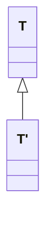

## Covarianza, invarianza e controvarianza

Sia enunciato il *principio di sostituzione di Liskov* (*LSP*), sviluppato da Barbara Liskov 1987:

> Requisito di sottotipazione: sia $\phi$ una proprietà dimostrabile di oggetti $x$ di tipo $T$. Allora $\phi(y)$ deve essere vero per oggetti $y$ di tipo $S$ dove $S$ è sottotipo di $T$.

Simbolicamente:
	$$ S \leq T \to \left(\forall x:~T.\phi(x) \to \forall y:~S.\phi(y)\right)$$



Il seguente diagramma rappresenta il concetto di *invarianza dei parametri*:
```merm
classDiagram
	class ClassA {
		method(t: T&)
	}
	class ClassB {
		method(t: T&)
	}

	ClassA <|-- ClassB
```

Il seguente, invece, rappresenta la *covarianza del tipo di ritorno*:
```merm
classDiagram
	class ClassA {
		method(t: T)
	}
	class ClassB {
		method(t': T')
	}

	ClassA <|-- ClassB
```


Ecco invece un esempio di *controvarianza* del parametro:
```merm
classDiagram
	class ClassA {
		method(t: T)
	}
	class ClassB {
		method(t': T')
	}

	ClassA <|-- ClassB
```

Il seguente diagramma rappresenta infine la *covarianza nel tipo del parametro* (non supportata da Java, perché contraria al principio di Liskov):
```merm
classDiagram
	class ClassA {
		method(t: T)
	}
	class ClassB {
		method(t': T')
	}

	ClassA <|-- ClassB
```

Un di linguaggio con parametri covarianti è il linguaggio Eiffel inventato da Bertrand Meyer.

## Array in Java

Gli *array* sono automaticamente definiti per ogni classe o interfaccia. Non sono estendibili (`final`). Possono essere multidimensionali, come array di array. Sono tipi reference e quindi possono essere nulli. Possiamo definirli esplicitamente per dimensione:
```java
Circle[] x = new Circle[array_size]
```
O anonimamente:
```java
new Circle[] = {c1, c2, c3}
```

Dalla classe base `Object` derivano:
- le classi definite dall'utente
- gli *array* di tipo `Object[]` e i loro derivati (generati automaticamente)
- le eccezioni
Non derivano da `Object` i tipi primitivi.

Gli array sono covarianti. Se $S$ è un sottotipo di $T$, allora l'array di tipo $S$ è sottotipo dell'array di tipo $T$.

Sia definito un esempio per gli errori:
```java
class A {...}

class B extends A {...}

B[] bArray = new B[10];
A[] aArray = bArray;
aArray[0] = new A();
```
Questa porzione di codice compila correttamente: possiamo assegnare `bArray` ad `aArray` perché rispettiamo la covarianza. Dà però errore in esecuzione quando assegniamo un $A$ alla prima cella di `aArray`, che nel frattempo è stato promosso ad array di $B$.

## Generici in Java

I generici in Java sono stati introdotti dalla versione 1.5. Prima si utilizzava la derivazione di tutti i tipi da `Object` come modo improprio per ottenere generici. Non sono stati inseriti da subito in Java perché non era chiara la via per implementarli (estensione alla macchina virtuale? Casting automatici? Duplicazione del codice?).

Segue un esempio di codice da risolvere necessariamente con i generici generici. Volendo definire un metodo per calcolare il massimo tra due numeri, sarebbe necessario reimplementarlo per ogni tipo numerico:
```java
int max(int a, int b) {

}

float max(float a, float b) {

}
```
Non è infatti consentito scrivere
```java
Object max(Object a, Object b) {

}
```
perché non è possibile verificare che `a` e `b` siano dello stesso tipo, per garantirne la confrontabilità. Il problema è aggirabile localmente con i `Comparable` ma anche questa soluzione richiede indirettamente i generici.

Per esempio, uno *stack* senza generici è implementabile nel seguente modo:
```java
class Stack {
	void push(Object o) { ... }
	Object pop() { ... }
	...
}
```
Dietro le quinte i generici vengono trasformati in codice con `Object` e i cast. La specializzazione senza i *generics* si può ottenere con la covarianza, ma richiede comunque java > 1.5, perché il concetto è stato inserito nello stesso aggiornamento del linguaggio che ha introdotto i generici.

```java
class className <T1, T2, ..., Tn> {
	...
}
```

```java
class Stack<A> {
	void push(A a) { ... }
	A pop() { ... }
	...
}

String s = "Hello";
Stack<A> stack = new Stack<A>();    // new Stack() dalla 1.7/1.8
stack.push(s);
```

Metodi generici:
```java
public class Util {
	public static <K,V> boolean compare(Pair<K,V> p1, Pair<K,V> p2) {
		return p1.getKey().equals(p2.getJey) &&
			   p1.getValue().equals(p2.getValue());
	}
}
```

I parametri dei generici non rispettano la covarianza. Ad esempio, nonostante `Cane` e `Gatto` siano sottotipo di `Animale`, non è possibile fare
```java
List <Animale> a = ...;
List <Cane> c = ...;
a = c;    // no
a[0] = new Gatto();
```

Non è nemmeno possibile questo:
```java
faiVerso(List<Animale> a) {...}
faiVerso(c);
```

È necessario scrivere
```java
<A extends Animale> faiVerso(List<A> a) {...}
```
e questo risolve parzialmente la mancata covarianza dei generici. Esiste anche la sintassi inversa `<E super T>` per richiedere la necessità di supertipi. Ad esempio, per chiedere l'interfaccia comparable, usiamo `<T extends Comparable<T>>`.

### Interfaccia Comparable
```java
public interface Comparable<T> {
	int compareTo(T o) {...}
}
```

Il metodo`compareTo` restituisce valori negativi se $A <B$, zero se $A=B$, positivi se $A>B$. Possiamo sfruttarlo per ordinare liste con i metodi statici `Collections.sort` o `Arrays.sort`. L'ordinamento si dice consistente se `a.compareTo(b) == 0` quando vale anche `b.compareTo(a) == 0`, per qualsiasi $a,b$ appartenenti alla classe.

```java
List<String> ls = new ArrayList<String>();    // corretto
List<Object> lo = ls;    // sbagliato
```

Volendo scrivere un metodo che stampa gli elementi di una collezione:
```java
void printCollection(Collection<Object> s) {
	for (Object e : s) {
		System.out.println(e)
	}
}
```

Come si potrebbe implementare il metodo in modo che funzioni per tutte le collezioni?
```java
void printCollection(Collection<?> c) {
	for (Object e : c) {
		System.out.println(e)
	}
}
```

Il simbolo `?` è detto *wildcard* e rappresenta il supertipo dei generici. Possiamo limitarlo superiormente e inferiormente:
```java
List <? extends Persona>    // accetto tutti i sottotipi di persona: upper bound

```

```java
<T extends Comparable<? super T>>
```
significa che $T$ debba essere confrontabile con oggetti della sua stessa classe o della sua superclasse. Rappresenta una estensione rispetto a`<T extends Comparable<T>>` che invece permette di confrontare solo con oggetti della classe specifica di T.

Il *wildcard* permette di reintrodurre l'ereditarietà, ma deliberatamente, e soprattutto permette di mantenere il controllo dei tipi. 

### Visibilità

È possibile aumentare la visibilità (a patto che quella iniziale non sia `private`)  mantenendoci nel caso dell'*overriding*. Non possiamo restringerla. Non è consentito lanciare più eccezioni, solo meno o nessuna, rispetto al metodo di cui si effettua l'*override*.

