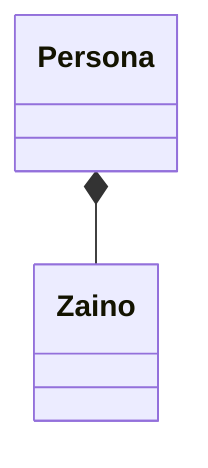

\newpage

# C++

Il linguaggio C++ nasce nel 1985 e lo sviluppo della sua prima versione si estende fino al 1997.  È stato sviluppato da Bjarne Stroustrup ai Bell Labs. C++ nasce come linguaggio per la creazione di simulazioni ed estende C aggiungendo un sistema di classi ispirato al linguaggio Simula. L'idea base è creare un linguaggio a oggetti che non comprometta la flessibilità e l'efficienza di C. È garantita la retrocompatibilità con C (C++ può essere visto come un suo *superset*), con l'aggiunta di un migliore *type checking* statico, l'astrazione dei dati, la possibilità di definire oggetti e un *focus* sull'efficienza. Quest'ultima si fonda sul seguente principio: il codice scritto senza sfruttare una certa *feature* deve essere efficiente come se il linguaggio non avesse quella feature in assoluto. Non deve esserci, insomma, *overhead* per le funzionalità non utilizzate in un dato momento.

In C++ i tipi di dati astratti corrispondono ai tipi. Rispetto al C, essi diventano centrali a scapito delle procedure. Infatti la cosa più simile ai tipi astratti in C sono i tipi opachi, che però non sono una *feature* definita appositamente. 

C++ diventa in poco tempo ampiamente usato, con grande successo. Come il suo predecessore C, alcune aziende e organizzazioni impongono vincoli aggiuntivi, restringendo l'espressività del linguaggio per aumentarne la sicurezza. Alcune di queste modifiche includono non utilizzare l'ereditarietà, le funzioni virtuali (presso SGI) e altre caratteristiche critiche.

Il linguaggio C++ eredita il modello di macchina del C (*heap*, *stack*, indirizzi), e non ha *garbage collection* per ragioni di efficienza. Al contrario di Java, è possibile decidere manualmente se allocare gli oggetti su *heap* o su *stack*. Rispetto al C aggiunge la possibilità di passaggio di parametri per *reference*, un sistema di eccezioni e il costrutto del *copy constructor* per il clonaggio degli oggetti. Un'altra aggiunta è il concetto di *namespace*. Si definisce *namespace* una regione dichiarativa per generare uno scope con un nome definito (una sorta di package). Fully qualified: `nome_namespace::nome_classe` oppure con direttiva `using namespace nome_namespace;`.  All'interno del namespace si possono dichiarare delle classi e/o dei metodi.

### Esempio: visibilità e classi in C++

Si consideri il seguente esempio di definizione di una struttura dati per rappresentare il tempo in C:
```c
// crea una struttura, imposta i suoi membri e stampalo

// definizione della struttura
struct Time {
	int hour;  // 0-23
	int minute;   // 0-59
	int second;   // 0-59
}

void printMilitary(const Time &);   // prototipo
void printStandard(const Time &);   // prototipo
```

L'esempio presenta alcune problematiche. Non abbiamo vincoli per impedire l'impostazione degli attributi a valori insensati. Non abbiamo la possibilità di inizializzare correttamente la struttura. Non c'è un'interfaccia da mantenere stabile in caso di modifiche: tutto da rifare in caso di modifiche.

L'approccio C++ consiste nel risolvere il problema mediante l'utilizzo delle classi:

```cpp
#include <iostream.h>

class Time {
public:
	Time();    // costruttore di default
	// prototipi delle funzioni
	void setTime(int h, int m, int s);
	void printMilitary(const Time &);
	void printStandard(const Time &);
private:
	int hour;    // 0-23
	int minute;  // 0-59
	int second;  // 0-59
	...
};   // notare il punto e virgola

/*
Il costruttore Time inizializza tutti i membri a zero.
Nessun valore di ritorno.
Si assicura che la classe sia inizializzata con uno stato consistente.
*/
Time::Time()
{
	hour = minute = second = 0;
}

/*
Metodo setTime.
Nessun valore di ritorno.
Permette di impostare l'orario (che è stoccato in variabili private) controllando
la correttezza dei valori inseriti.
*/
void Time::setTime(int h, int m, int s)
{
	hour = (h >= 0 && h < 24) ? h = 0;
	minute = (m >= 0 && m < 60) ? m : 0;
	second = (s >= 0 && s < 60) ? s : 0;
}

// ... metodi di stampa ...
```

Possiamo allocare la classe direttamente sullo *stack*:
```cpp
Time sunset;    // oggetto di tipo Time
Time arrayofTimes[5];   // array di Time allocato sullo stack
Time *pointerToTime;    // puntatore a Time sullo stack
```

Possiamo fare *overloading* dei metodi e degli operatori:

```cpp
Time();   // costruttore di default
Time(int hr);
Time(int hr, int min, int sec);

// Implementazioni
Time::Time() { hour = minute = second = 0; }
Time::Time(int hr) { setTime(hr, 0, 0); }
Time::Time(int hr, int min, int sec) { setTime(hr, min, sec) }
```

Notiamo che gli *overload* del costruttore chiamano implicitamente il costruttore di *default*.

C++, al contrario di C, permette l'*overloading*. In C non è possibile perché non c'è *runtime* per il *binding* dinamico.

Il costruttore di *default* è chiamato automaticamente (sia implicitamente che esplicitamente) anche all'allocazione su *stack*:
```cpp
Time t1; // Time() chiamato automaticamente
Time t1(); // errore

Time t2(08);   // chiamata implicita per i costruttori alternativi
Time t2 = Time(08);  // chiamata esplicita
```


Per allocare su *heap* si utilizza la *keyword* `new`:
```cpp
Type_name * pointer_name;
pointer_name = new Type_name;
```

Ad esempio, per allocare dinamicamente la classe `Time` definita nell'esempio:
```cpp
int* ptr;
ptr = new Time;
```

La dichiarazione degli array può avvenire sia indirettamente, sia con l'uso di un letterale:

```cpp
Time arrayOfTimes[5];  // chiama implicitamente Time()

// oppure: inizializzazione esplicita
Time secondArray[8] = {3, Time(8), Time(), Time(1,2,11)};
```

### *Constructor Initializer List*

Un altro concetto importante è quello di *constructor initializer list*. Essa rappresenta un elenco di chiamate a costruttori per elementi della classe, da eseguire prima di chiamare il costruttore della classe stessa.
```cpp
class Info {
private:
	const int i;
	double m;
	Time t;
public;
	Info();
	Info(int j, double n);
};

Info::Info(int j; double n): i(j), m(n), t(i) { ... }
```

Come mai la si impiega? Nell'esempio, `i` è un `const int`: all'interno del corpo del costruttore non è possibile variarne il valore. Va quindi assegnata nella *initializer list*. Allo stesso modo, possiamo avere come campi delle reference (ad esempio `Time &t`) che non possono essere nulle. Devono essere dunque inizializzate prima dell'avvio del costruttore. Lo stesso principio si applica ai campi contenenti oggetti, per lasciare spazio di allocazione.

La necessità per le costanti potrebbe derivare dal fatto che C++ sia costruito sul C.

### *Copy constructor* e distruttori

Sia mostrato un esempio di uso del *copy constructor*:
```cpp
S u(s);   // chiama il copy costructor della classe S
S v = s;
```
Viene utilizzato il copy constructor per clonare l'oggetto `s` di tipo `S` all'interno della variabile `u`.

Il *copy constructor* si definisce con la seguente sintassi:
```cpp
class S {
public:
	S(const S&);
};
```
In caso non lo si definisca esplicitamente, viene creata di *default* dal compilatore una versione che copia tutti i campi (compresi i puntatori a sotto-oggetti). Si parla di *shallow copy*, in contrasto alla *deep copy* che consiste in una copiatura ricorsiva che clona anche i sotto-oggetti e i sotto-oggetti dei sotto-oggetti.

È utile anche il concetto di *distruttore*. Per introdurlo, si pensi al seguente esempio: un oggetto `Persona` possiede uno `Zaino`, e tale zaino non può continuare ad esistere da solo, senza il proprietario. Vogliamo che alla deallocazione di `Persona` sia deallocato anche `Zaino`.

```java
Persona {
	Zaino z;
}
```

Distruttore: prende il nome `~class_name` senza parametri e senza ritorni.
```cpp
Class_name::~class_name() {
	// operazioni di delete
}
```
È eseguito automaticamente all'uscita di scope (dallo stack) o alla chiamata di `delete` (per gli oggetti allocati dinamicamente. È solitamente impiegato per deallocare i sotto-oggetti (o per chiamarne i rispettivi distruttori).

Sintassi del `delete`:
```cpp
delete a;

```

Ci dovrebbe essere un `delete` per ogni `new.` La chiamata ripetuta di `delete` sullo stesso puntatore può causare problemi. La chiamata a `delete` non ha alcun effetto quando eseguita su un `nullptr`. Per questo, è bene azzerare a `nullptr` i puntatori appena dopo la deallocazione.

### Dichiarazione di funzioni

```cpp
tipo Nome_classe::nome_metodo(tipo1 parametro1, ...);
```

Possiamo definire metodi `const` incapaci di modificare i propri parametri:

```cpp
tipo Nome_classe::nome_metodo(const tipo1 parametro1, ...);
```
 o incapaci di modificare lo stato della propria classe:
 
```cpp
tipo Nome_classe::nome_metodo(tipo1 parametro1, ...) const;
```

È anche possibile passare per reference (puntatore non nullo) i parametri:
```cpp
void doSomething(SomeBigObject& bo);
```

Di default il passaggio è per copia: i parametri sono mantenuti come copia locale, modificabile, che sarà deallocata all'uscita dalla funzione. Inefficiente per oggetti grossi.

### Variabili statiche, globali, funzioni inline e binding dinamico

Possiamo usare la keyword `exetern` per importare variabili globali da altri file. Variabili globali statiche con keyword `static` non utilizzabili da altri file. Le statiche dentro una classe sono condivise tra tutte le istanze della classe, come in Java. Le funzioni statiche possono accedere solo a variabili statiche, non possono chiamare funzioni non statiche, usare la reference `this` all'oggetto o essere virtuali. Costruttori e distruttori non possono essere statici.

Funzioni `inline`: sono espanse come una *macro* nel codice compilato per eseguire sul posto invece di effettuare una chiamata di funzione. Le funzioni membri di classi sono automaticamente `inline`. Nell'*inlining* di funzioni ricorsive la funzione viene espansa un numero fissato di volte (tramite parametro da passare al compilatore) sperando che basti a coprire il numero effettivo di chiamate, e rischiando altrimenti ridondanza nel compilato. Analizziamo i costi e benefici. Benefici: non creare record di attivazione. Costi: allungamento della compilazione (relativamente poco grave), allungamento significativo del codice (se la funzione è chiamata molte volte) al punto di non starci tutto in *cache* e rallentare l'esecuzione per *cache miss*. Le funzioni importate dagli *header* sono solitamente *inline*.

Possiamo specificare argomenti di default per le funzioni:
```cpp
void f(int size, int initQuantity = 0);
```

I parametri *inline* vanno messi tutti alla fine della lista dei parametri, compattati.

L'*overloading* delle funzioni è risolto per numero e tipo dei parametri. Non è possibile fare overloading del tipo di ritorno.
