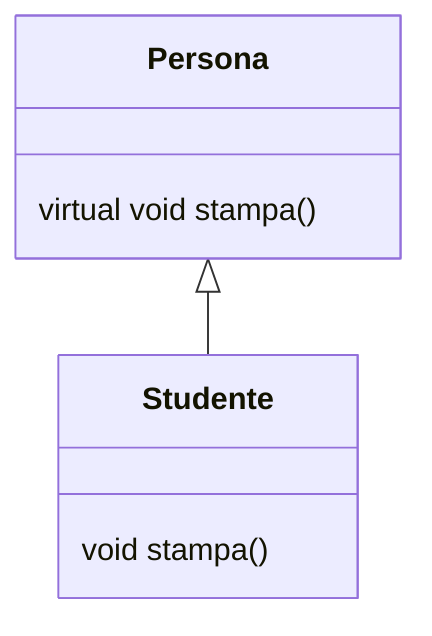
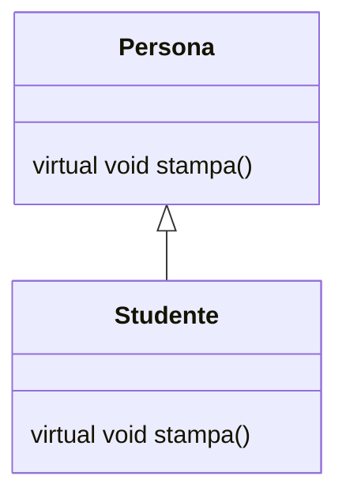

In C++, per effettuare l'override di un metodo, è necessario dichiararlo come virtuale. Il polimorfismo in esecuzione viene implementato attraverso il lookup delle funzioni virtuali. Quando ciò non è possibile, il lookup è statico. Le ridefinizioni di funzioni non virtuali portano a un overriding per semplice sostituzione, senza possibilità di accesso al metodo della classe padre. Questo approccio permette di pagare il costo del lookup dinamico solo se ritenuto necessario dal programmatore.

L'ereditarietà può essere pubblica o privata.

Le funzioni virtuali devono essere dichiarate esplicitamente come tali. Esse possono ricevere override e attivano il binding dinamico. L'accesso a queste funzioni avviene indirettamente attraverso puntatori nell'oggetto.


```cpp
class A { public: virtual void vi(){...} };
class B : public A{ public: virtual void vi(){...} };
int main() {
	A* pa = new A; a -> vi(); // chiamata virtuale
	A& ra = b; ra.vi(); // chiamata virtuale
	A a = b; a.vi();    // chiamata non virtuale
}
```

Volendo fare un esempio:

```cpp
class Pt {
public:
	Pt(int xv);
	Pt(Pt* pv);  // overload del costruttore
	int getX:    // funzione non virtuale
	virtual void move(int dx);  // funzione virtuale
	virtual void darken(int tint);  // funzione virtuale 
protected:
	void setColor(int cv);
private:
	int color;
};
```

```cpp
void colorPt::darken(int tint) {color += tint}
```


## Ereditarietà e polimorfismo

In C++, un puntatore della classe base può puntare a un oggetto di classi derivate. Poiché è possibile ridurre la visibilità dei metodi in una classe figlia, viene effettuato il *dynamic binding* per determinare quale versione visibile del metodo utilizzare. Questo meccanismo si applica solo agli oggetti mantenuti tramite puntatori o riferimenti, e non agli oggetti allocati sullo stack.

Il puntatore `this` è il primo argomento implicito di ogni funzione membro. Ad esempio, il codice

```cpp
int A::f(int x) { ...g(i)... }
```

viene trasformato internamente in

```cpp
int A::f(A *this, int x) { ...this->g(i)... }
```

È buona pratica dichiarare i distruttori come virtuali per permettere una migliore estensione delle classi derivate. Un esempio di dichiarazione di un distruttore virtuale è il seguente:

```cpp
class A {
    public:
        virtual ~A();
};
```

Le funzioni sono compilate, allocate a un indirizzo di memoria e poi l'indirizzo è salvato nella *tabella dei simboli*. In caso di ridefinizione, viene semplicemente aggiornato l'indirizzo nella tabella statica dei metodi. A differenza di Java, in C++ è possibile effettuare l'*overriding* anche dei metodi privati. L'*overriding* non funziona però per gli oggetti allocati sullo *stack*. La differenza è mostrata nel seguente esempio:

```cpp
class parent {
public:
	void printclass() {printf("p ");};
	virtual void printvirtual() {printf("p ");};
};

class child : public parent {
public:
	void printclass() {printf("c ");};
	virtual void printvirtual() {printf("c ");};
};
main () {
	parent p; child c; parent* q;
	p.printclass(); p.printvirtual(); c.printclass(); c.printvirtual();
	// ...
}
```


### Binding delle chiamate alle funzioni

La gestione delle chiamate alle funzioni in C++ è ibrida. Per i metodi non virtuali, viene utilizzato l'*early binding*, simile a quello del linguaggio C. Per le funzioni virtuali, invece, viene impiegato il *late binding* con *lookup* dinamico. Questo meccanismo genera una linea di *assembly* in più e richiede più memoria per i puntatori, ma la criticità si nota solo in ambito *embedded*.

### Sottotipazione

La sostituzione delle classi è possibile solo in un caso specifico. Una classe `A` è riconosciuta come sottotipo di `B` solo se `B` è una classe base pubblica di `A`. Questa regola viene meno se viene effettuata una ridefinizione che riduce la visibilità di metodi ereditati.

Consideriamo il seguente diagramma di classe:



In questo caso, se creiamo un oggetto di tipo `Studente` e lo assegniamo a un puntatore di tipo `Persona`, accederemo al metodo `stampa` della classe `Persona` perché il metodo `stampa` nella classe `Studente` non è virtuale:

```cpp
Persona* p = new Studente();
p->stampa();
```

Se invece utilizziamo un'assegnazione diretta tra oggetti, accederemo ancora al metodo `stampa` della classe `Persona` a causa del binding statico:

```cpp
Persona p;
Studente s;
p = s;
p.stampa();
```

Infine, se entrambi i metodi `stampa` sono dichiarati come virtuali, otteniamo il binding dinamico al metodo `stampa` della classe `Studente`:



```cpp
Persona* p = new Studente();
p->stampa();
```

In questo caso, il *binding* dinamico garantisce che venga chiamato il metodo `stampa` della classe `Studente`.

### Principio di sostituibilità per la sottotipazione

In C++, il principio di sostituibilità per la sottotipazione permette di assegnare un oggetto di una classe derivata a un puntatore o a un riferimento di una classe base, similmente a quanto accade in Java. Questo meccanismo funziona solo per puntatori o riferimenti e non per oggetti allocati sullo *stack*. Una funzione è considerata sottotipo di un'altra se può essere sostituita al suo posto. In C++ (da C++98 in avanti) vale la covarianza del tipo restituito, ma solo per puntatori a oggetti e solo per funzioni virtuali. I parametri delle funzioni sono invece invarianti, e non è possibile la controvarianza.

Tentare di applicare il polimorfismo su oggetti allocati sullo stack provoca lo slicing. Questo fenomeno si verifica quando viene chiamato il copy constructor, che "taglia" gli attributi in eccesso della classe derivata, lasciando solo quelli della classe base. Ad esempio:

```cpp
class A {
    int foo;
};

class B: public A {
    int bar;
};

B b;
A a = b;  // copy constructor: abbiamo ottenuto un oggetto A con solo l'attributo foo
```

In questo caso, l'oggetto `a` di tipo `A` conterrà solo l'attributo `foo`, mentre l'attributo `bar` della classe `B` verrà perso.

È importante notare che non è possibile restituire un tipo `A` quando il metodo da sovrascrivere era di tipo `*A`.

Le classi astratte sono definite come classi che contengono almeno un membro completamente astratto. Un membro astratto è dichiarato con la sintassi:

```cpp
virtual function_decl = 0;
```

Questo indica che la classe non può essere istanziata direttamente: deve essere ereditata da una classe derivata che fornisce implementazioni concrete per tutti i membri astratti.

### Template

I *template* in C++ rappresentano una forma di programmazione generica, permettendo di scrivere codice che può operare con tipi di dati diversi senza dover duplicare le funzioni per ciascun tipo. Consideriamo, ad esempio, una funzione di scambio per interi:

```cpp
void swap(int& x, int& y) {
    int tmp = x;
    x = y;
    y = tmp;
}
```

Per rendere questa funzione generica, possiamo utilizzare un *template*:

```cpp
template<class T>
void swap(T& x, T& y) {
    T tmp = x;
    x = y;
    y = tmp;
}
```

In questo caso, il tipo `T` deve essere lo stesso per entrambi i parametri, poiché la funzione non può operare correttamente con tipi diversi. I *template* in C++ permettono anche di parametrizzare i tipi di ritorno delle funzioni. A differenza dei generici in Java, ogni parametro del *template* deve essere anche un parametro della funzione. I *template* possono essere utilizzati anche con le classi. Ad esempio, possiamo definire una classe `Complex` che rappresenta un numero complesso con parti reali e immaginarie di tipo generico:

```cpp
template <class T>
class Complex {
private:
    T re, im;
public:
    Complex(const T& r, const T& i) : re(r), im(i) {}
    T getRe() { return re; }
    T getIm() { return im; }
};
```

In questo modo, la classe `Complex` può essere utilizzata con qualsiasi tipo di dato, purché supporti le operazioni necessarie.

