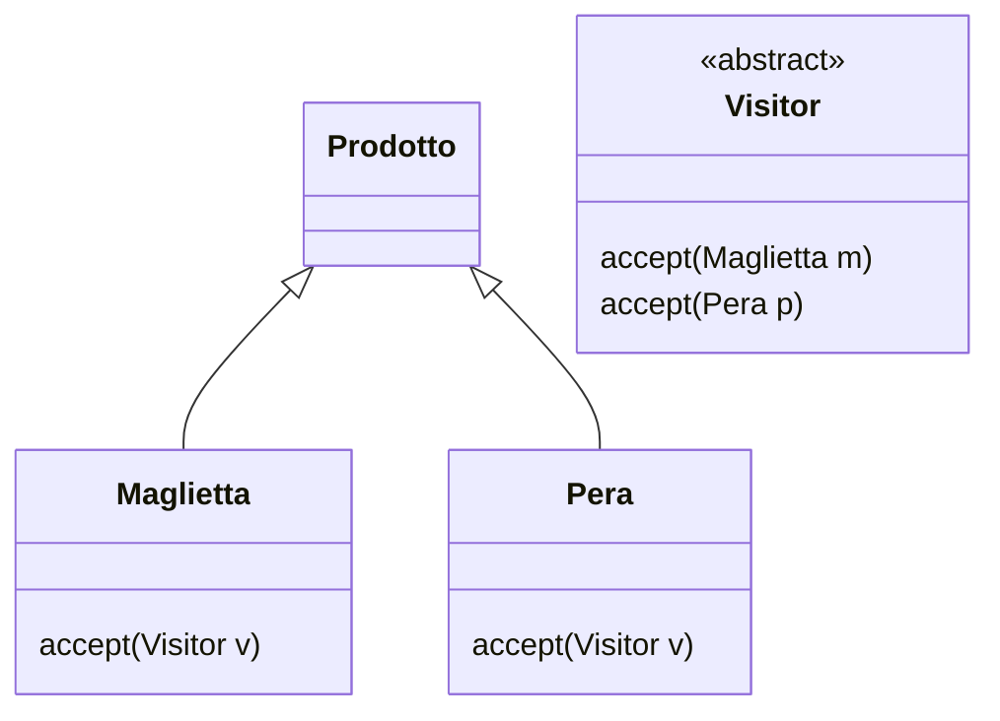
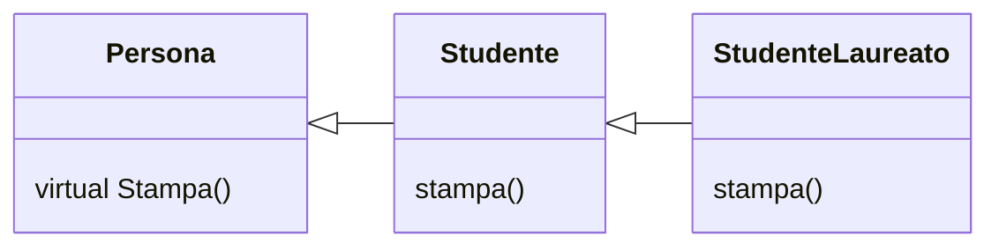

## Implementazione del *visitor pattern* in C++

Questa sezione rappresenta un esempio di implementazione del *visitor pattern* in C++, seguendo lo stesso schema dell'esempio usato in precedenza per Java.



Sono riportati di seguito i contenuti di alcuni file:

- `Product.h` : classe astratta (interfaccia) `Product` del prodotto, in grado di accettare il *visitor*
- `Pera.cpp` e `Maglietta.cpp`: due classi concrete, `Pera` e `Maglietta`, che estendono la classe `Product` contenuta in `Product.h`
- `Visitor.h`: interfaccia `Visitor` per i *visitor*
- `EnglishVisitor.h` e `EnglishVisitor.cpp`: dichiarazione e implementazione di `EnglishVisitor`, un *visitor* concreto
- `ItalianVisitor.h` e `ItalianVisitor.cpp`: dichiarazione e implementazione di `ItalianVisitor`, un *visitor* concreto

```cpp
/*
 * Product.h
 *
 */

#infdef PRODUCT_H_
#define PRODUCT_H_

class Visitor;   // forward declaration

class Product {
public:
	Product();
	virtual ~Product();
	virtual void accept(Visitor& visitor) = 0;
};

#endif /* PRODUCT_H_ */
```

```cpp
/*
 * Visitor.h
 */

#infdef VISITOR_H_
#define VISITOR_H_

class Pera;
class Maglietta;

class Visitor {
public:
	Visitor();
	virtual ~Visitor();
	
	virtual void visit(Pera& pera) = 0;
	virtual void visit(Maglietta& maglietta) = 0;
};

#endif /* VISITOR_H_ */
```


```cpp
/*
 * Pera.h
 */

#infdef PERA
#define PERA_H_

#include "Product.h"

class Pera : public Product {
public:
	Pera();
	virtual ~Pera();
	virtual void accept(Visitor& visitor) override;
};

#endif /* PERA_H_ */
```


```cpp
/*
 * Pera.cpp
 */

#include "Pera.h"
#include "Visitor.h"

Pera::Pera() {
	// TODO Auto-generated constructor stub
}

Pera::~Pera() {
	// TODO Auto-generated destructor stub
}

void Pera::accept(Visitor& visitor) {
	visitor.visit(&this);
}
```


```cpp
/*
 * ItalianVisitor.h
 */

#infdef ITALIAN_H_
#define ITALIAN_H_

#include "Product.h"

class ItalianVisitor : public Visitor {
public:
	ItalianVisitor();
	virtual ~ItalianVisitor();
	
	virtual void visit(Pera& pera) override;
	virtual void visit(Maglietta& maglietta) override;
};

#endif /* ITALIAN_H_ */
```

```cpp
/*
 * ItalianVisitor.cpp
 */

#include "ItalianVisitor.h"

ItalianVisitor::ItalianVisitor() {
	// TODO Auto-generated constructor stub
}

ItalianVisitor::~ItalianVisitor() {
	// TODO Auto-generated destructor stub
}

void ItalianVisitor::visit(Pera& pera) {
	std::cout << "Questa è una pera" << std::endl;
}

void ItalianVisitor::visit(Maglietta& maglietta) {
	std::cout << "Questa è una maglietta" << std::endl;
}
```


```cpp
/*
 * EnglishVisitor.h
 */

#infdef ENGLISH_H_
#define ENGLISH_H_

#include "Product.h"

class EnglishVisitor : public Visitor {
public:
	EnglishVisitor();
	virtual ~EnglishVisitor();
	
	virtual void visit(Pera& pera) override;
	virtual void visit(Maglietta& maglietta) override;
};

#endif /* ENGLISH_H_ */
```

```cpp
/*
 * EnglishVisitor.cpp
 */

#include "EnglishVisitor.h"

EnglishVisitor::EnglishVisitor() {
	// TODO Auto-generated constructor stub
}

EnglishVisitor::~EnglishVisitor() {
	// TODO Auto-generated destructor stub
}

void EnglishVisitor::visit(Pera& pera) {
	std::cout << "This is a pear" << std::endl;
}

void EnglishVisitor::visit(Maglietta& maglietta) {
	std::cout << "This is a t-shirt" << std::endl;
}
```

Di seguito è riportato il `main` per completare l'esempio:

```cpp


int main() {
	// Creazione di alcuni oggetti Product
	Product* pera = new Pera;
	Product* maglietta = new Maglietta;
	Visitor* italianVisitor = new ItalianVisitor;
	Visitor* englishVisitor = new EnglishVisitor;

	// Utiizzo dei Visitors
	std::cout << "Usando l'ItalianVisitor" << std::endl;
	pera->accept(*italianVisitor);
	maglietta->accept(*italianVisitor);

	std::cout << "Usando l'EnglishVisitor" << std::endl;
	pera->accept(*englishVisitor);
	maglietta->accept(*englishVisitor);

}
```


Il *visitor pattern* è conveniente da usare quando l'operazione più frequente è l'aggiunta di nuovi *visitor*. È invece sconveniente quando si tratta di aggiungere nuovi visitabili. È bene utilizzarlo partendo da una collezione di visitabili già esistente e completa.

### Altro esempio



```cpp
Persona* p = new Studente;
p->stampa();
```

Il metodo segnato come *virtual* viene automaticamente esteso a tutte le classi figlie. In una qualunque gerarchia di classi si risale per cercare un metodo virtuale. L'unico modo per fermare la catena dell'*override* di un metodo iniziato come virtuale è inserire la keyword `final` in una delle implementazioni derivate. Se una superclasse chiama un proprio metodo nel costruttore, e tale costruttore viene chiamato nel costruttore di una sottoclasse, viene chiamato il metodo della superclasse anche se esso subisce l'override nella sottoclasse. La keyword `override`, per quanto opzionale, dà errore se utilizzata su metodi che non sono virtuali nella classe padre.

## STL in C++

Le classi *template* con parametri sono un potente strumento di programmazione che permette di scrivere codice generico e riutilizzabile. La *Standard Template Library* (STL) del C++ è un esempio emblematico di come le classi template possano essere utilizzate efficacemente. Senza l'uso di *template*, per $N$ tipi di dati, $M$ *container* e K$ $algoritmi, sarebbero necessarie $N \times M \times K$ implementazioni nel caso peggiore. Grazie all'uso di template, il numero di implementazioni necessarie si riduce a $N + M + K$.

I *container* nella STL includono *liste*, *adattatori* e *container associativi*. Un esempio di *container* è il `vector<T>`, che rappresenta un array *dinamico* con la sintassi di accesso solita tramite parentesi quadre. Questo *container* permette l'accesso diretto e la modifica degli elementi. I vettori sono confrontabili utilizzando gli operatori `==` e `!=`. C++ permette l'*overloading* degli operatori, rendendo possibile l'uso di questi operatori di confronto in modo naturale. L'uso di container astratti nella STL può portare a problemi di *slicing*, ovvero alla perdita di informazioni specifiche dei tipi derivati quando si lavora con oggetti polimorfici. Questo avviene perché i *container* astratti possono memorizzare solo la parte comune degli oggetti, perdendo le informazioni specifiche dei tipi derivati.

Un altro concetto fondamentale nella STL è l'*iteratore*, un *design pattern* che risolve molti problemi legati alla gestione delle sequenze di dati. Gli iteratori permettono di accedere e manipolare gli elementi dei container in modo uniforme e astratto, indipendentemente dal tipo di container utilizzato.

## Smart pointer

Gli *smart pointer* permettono di evitare la necessità di chiamare esplicitamente `delete` sulle variabili puntate, gestendo automaticamente la memoria. Esistono tre tipi principali di *smart pointer*:

- `unique_ptr<T>`: utilizzato per oggetti non condivisi. Questo tipo di *smart pointer* garantisce che ci sia una sola istanza che possiede l'oggetto puntato, assicurando che la memoria venga deallocata automaticamente quando il `unique_ptr` viene distrutto
- `shared_ptr<T>`: utilizzato per oggetti condivisi. Questo tipo di *smart pointer* permette a più `shared_ptr` di condividere la proprietà dello stesso oggetto. La memoria viene deallocata solo dopo che l'ultimo `shared_ptr` che punta all'oggetto viene distrutto
- `weak_ptr<T>`: utilizzato per oggetti condivisi in sola lettura. Questo tipo di *smart pointer* non incrementa il conteggio dei riferimenti dell'oggetto puntato, evitando così cicli di riferimento che potrebbero impedire la deallocazione della memoria.

Segue un esempio di utilizzo di `unique_ptr`:

```cpp
unique_ptr<Song> song2(new Song("Nothing on You"));
```

In questo esempio, `song2` è un `unique_ptr` che possiede un oggetto di tipo `Song` creato dinamicamente. Quando `song2` viene distrutto, la memoria allocata per l'oggetto `Song` viene automaticamente deallocata.

