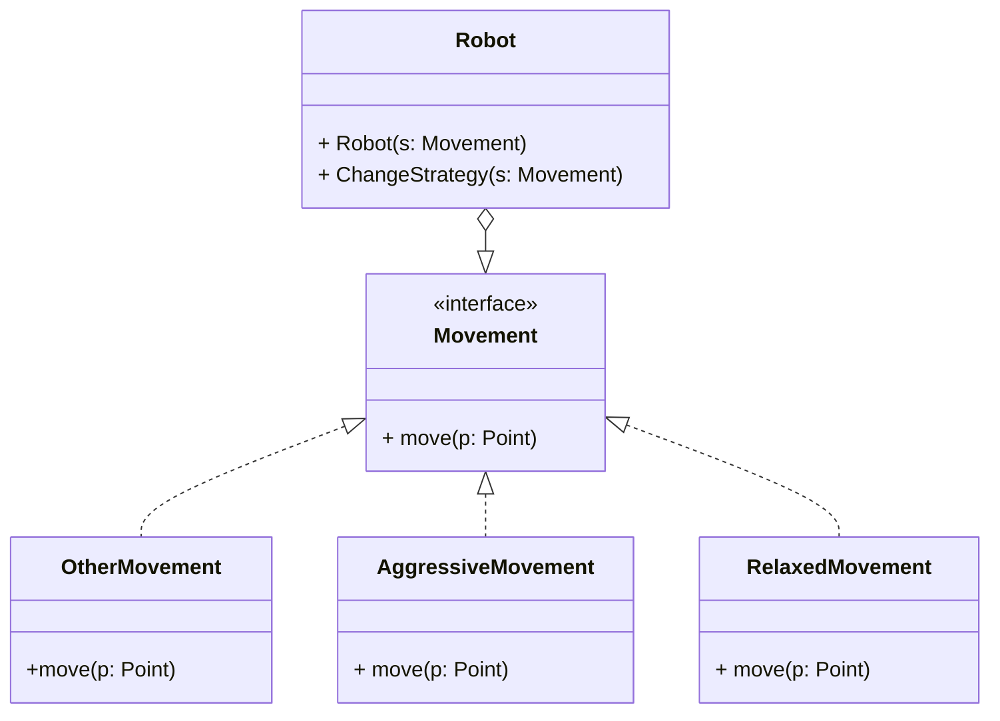
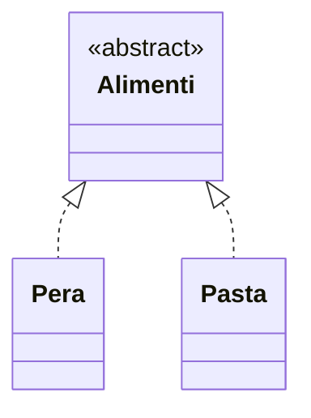
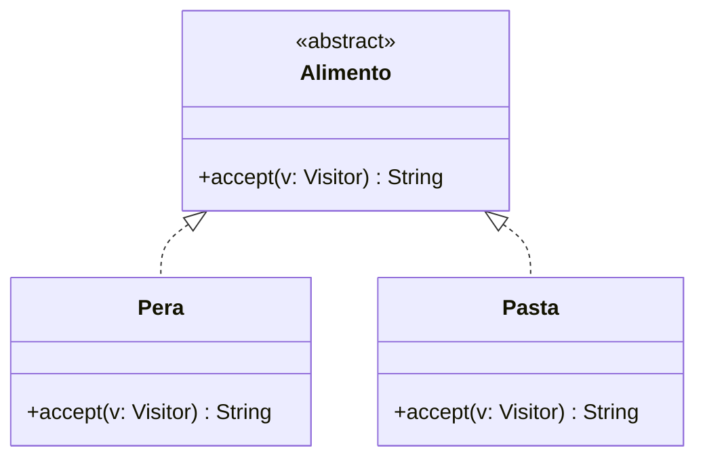
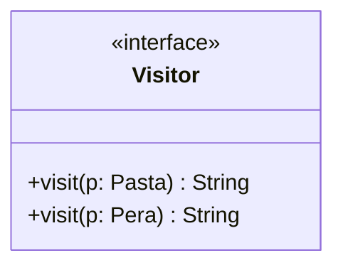
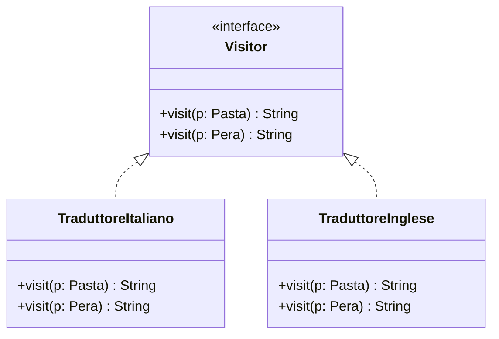
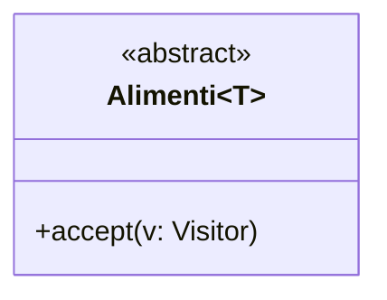
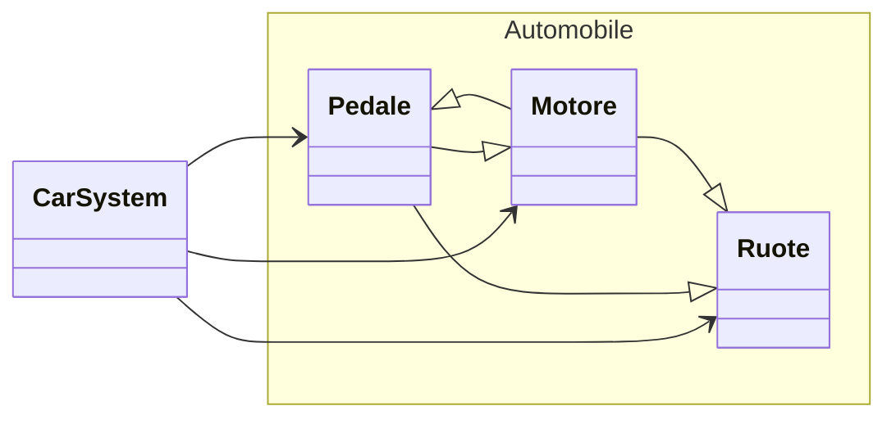

# Design pattern
Un *design pattern* è una soluzione generale e riutilizzabile a un problema ricorrente nel contesto del design del *software*. I design pattern non sono algoritmi né codice, ma piuttosto schemi che descrivono come risolvere un problema specifico in modo efficace e flessibile. Essi forniscono una struttura e una guida per risolvere problemi comuni, migliorando la qualità del codice e facilitando la comunicazione tra sviluppatori. Secondo alcune interpretazioni, tuttavia, il bisogno di *pattern* indica mancanza di funzionalità e inadeguatezza da parte dei linguaggi di programmazione.
I *design pattern* sono stati introdotti in informatica per la prima volta nel libro *"Design Patterns: Elements of Reusable Object-Oriented Software"* di Erich Gamma, Richard Helm, Ralph Johnson, and John Vlissides, noti come *Gang of Four*. L'idea di strutture fondamentali riutilizzabili è però ben più vecchia, ed è presente in molti altri settori.

Elenchiamo alcuni tipi di *design pattern*, dividendoli in categorie (quelli segnati in grassetto sono spiegati in dettaglio di seguito):
1. *creazionali*: istanziano oggetti
	1. **singleton**
	2. *prototype*: istanza (prototipo) clonabile
	3. *builder*: separa la costruzione dalla rappresentazione (produce oggetti di un'altra classe, es. `StringBuilder` di Java che concatena stringhe in modo efficiente)
	4. *factory method*: costruisce oggetti di varie classi (correlate)
	5. *abstract factory*: costruisce varie famiglie di classi
2. *strutturali*:  compongono classi e oggetti in strutture più grandi
	1. *adapter*: permette di collegare le interfacce di diverse classi
	2. *bridge*: separa interfaccia da implementazione
	3. *composite*: compone oggetti
	4. *decorator*: aggiunge dinamicamente responsabilità agli oggetti (decora i risultati di un metodo)
	5. *facade*: singola classe che rappresenta un intero sottosistema
	6. *proxy*: un oggetto rappresenta un altro oggetto
3. *comportamentali*: regolano la comunicazione tra oggetti e definiscono algoritmi e responsabilità
	1. *observer*: l'osservato invia notifiche agli osservatori sui propri cambi di stato
	2. **visitor**
	3. **strategy**
	4. *iterator*: visita di collezioni


## Strategy
Diverse strategie che sono realizzazioni di una stessa interfaccia, tra loro intercambiabili all'interno dell'utilizzatore. Nel seguente esempio, un robot può utilizzare diverse strategie di movimento, rappresentate dall'interfaccia `Movement`.




### Singleton
Vogliamo che esista una sola istanza di una data classe. Nel seguente esempio, vogliamo che esista un solo dado all'interno del gioco. Nascondiamo innanzitutto il costruttore agli utilizzatori. Ora esso può essere chiamato solo all'interno della classe `Dado`:
```java
class Dado {
	private Dado() {
		...
	}
}
```

Creiamo ora un metodo statico per ottenere la classe:
```java
class Dado {
	private Dado() {
		...
	}
	
	public static Dado getDado() {
		...
	}
```
Il metodo deve essere statico perché altrimenti non potrebbe essere chiamato prima di istanziare la classe. È necessario anche definire una variabile statica per sapere se esiste già un dado istanziato e, nel caso, restituirlo. La classe prende questa forma:
```java
class Dado {
	private static Dado d = null;
	...
	private Dado() {
		...
	}
	public static Dado getDado() {
		if (d == null)
			d = new Dado();
		return d;
	}
}
```
Una possibile riscrittura è:
```java
class Dado {
	private static Dado d = new Dado();
	...
	private Dado() {
		...
	}
	public static Dado getDado() {
		return d;
	}
}
```
ma in questo caso il dado viene creato indipendentemente dal suo effettivo uso. La prima versione viene detta *lazy singleton*, mentre la seconda è un'implementazione più classica.

La versione non *lazy* del pattern smette di funzionare correttamente se utilizzata in un programma multithread. Se un thread si interrompe durante l'esecuzione dell'if all'interno di `getDado` e l'altro thread crea un dado da zero, al ritorno del primo thread ne verrà creato un altro. Questo si risolve utilizzando la versione *lazy* oppure aggiungendo la keyword `synchronized` al metodo `getDado`.


### Visitor
Supponiamo di avere un menu che elenchi degli alimenti. Vogliamo che sia multiingua.


Possibili soluzioni non eleganti:
- diversi metodi per reperire lingue diverse: `getItaliano`, `getInglese`, ...
- `getNome(Lingua l)`

Soluzione *visitor*:


Com'è fatto un *visitor*?

Deve saper visitare ogni singola classe di nostro interesse. Nel nostro caso ne abbiamo due tipi:


```java
class TraduttoreItaliano implements Visitor {
	visit (p: Pasta) {
		return "Pasta";
	}
	
	visit (p: Pera) {
		return "Pera";
	}
}

class TraduttoreInglese implements Visitor {
	visit (p: Pasta) {
		return "Pasta";
	}
	
	visit (p: Pera) {
		return "Pear";
	}
}
```

In `Pasta` e `Pera`:

```java
class Pera extends Alimento {
	accept(v: Visitor) {
		v.visit(this)
	}
}

class Pasta extends Alimento {
	accept(v: Visitor) {
		v.visit(this)
	}
}
```

Come mai non possiamo spostare il metodo nella classe astratta, se è uguale in tutti i casi? Perché in compilazione il riferimento a `this` sarebbe a `Alimento` e non alle singole realizzazioni; nei visitor non ci sarebbe un metodo per visitare un generico alimento.
Come utilizzare il *visitor*?
```java
Alimento a = new Pasta();
Visitor v = new TraduttoreItaliano();

a.accept(v);
```

Possiamo rendere il *pattern* ancora più generico, decidendo di poter ritornare generici dal metodo `accept`. A questo fine possiamo rendere generica la classe astratta:

oppure tornare un generico dal metodo:
```java
<T> accept(v: Visitor) : T
```

Vale la pena di utilizzare questo *design pattern*? Il codice è più lungo e ha più classi, ma è più flessibile e più ordinato.

### Façade
Utilizziamo una classe che permetta di accedere in modo semplice ad un sistema complesso:



