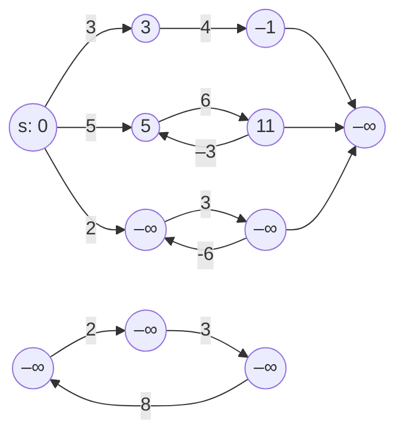

La programmazione *greedy* non sempre conduce ad una soluzione ottima ma, se lo fa, è da preferire alla programmazione dinamica perché più efficiente. Quest'ultima è onerosa per definizione, dovendo costruire le soluzioni a tutti i sottoproblemi, anche quelli non necessari alla costruzione della soluzione.

<u>Esercizio del palinsesto</u>

Un'emittente televisiva deve organizzare il palinsesto di una giornata di 24 ore (1440 minuti). L'emittente dispone di una lista non vuota di durate in minuti degli $n$ programmi disponibili.

1. scrivere un algoritmo di programmazione dinamica che restituisce `true` se e solo se esiste un sottoinsieme degli $n$ programmi disponibili la cui durata complessiva sia esattamente di 1440 minuti
2. determinare il costo computazionale di tale algoritmo
3. raffinare l'algoritmo per individuare anche i programmi che fanno parte della soluzione


Definiamo una matrice $B[1..n,0,..,1440]$ tale che $B[i,j] = true$ se e solo se esiste un sottoinsieme dei primi $i$ programmi ${1,...,i}$ la cui durata complessiva sia esattamente $j$. Controlleremo insomma di poter coprire tutti i possibili intervalli di tempo interi da 0 minuti a 24 ore. Se $i=1$ abbiamo che $B[i,j] = true$  se e solo se $j=d[1]$ oppure $j=0$. Per ogni $i=2,...,n, j=0, ... 1440$, gli altri elementi della matrice sono definiti in questo modo:
$$
B[i,j] =
\left \{
\begin{matrix*}[l]
B[i-1,j] \lor B[i-1,j-d[i]] & \text{ se } j \geq d[i] \\
B[i-1,j] & \text{ altimenti}
\end{matrix*}
\right .
$$
$B[i-1,j]$ significa coprire $j$ minuti con $i-1$ sottoprogrammi (il programma $i$-esimo non viene usato) mentre $B[i-1,j-d[i]]$ significa sottrarre a $j$ la durata del programma $i$-esimo, che viene considerato. Rappresentiamo lo pseudocodice dell'algoritmo soluzione al punto 1:

```c
Algoritmo PALINSESTO(array d[1..n] di int) -> bool
    array B[1..n, 0..1440] di bool;

// Inizializzazione di B[1, j]
for j := 0 to 1440 do
    if ( j == 0 || j == d[1] ) then
        B[1, j] := true;
    else
        B[1, j] := false;
    endif
endfor

// Riempimento della matrice B
for i := 2 to n do
    for j := 0 to 1440 do
        if ( j >= d[i] ) then
            B[i, j] := B[i-1, j] || B[i-1, j-d[i]];
        else
            B[i, j] := B[i-1, j];
        endif
    endfor
endfor

return B[n, 1440];
```

L'algoritmo calcola tutti i valori $B[i,j]$ e restituisce $B[n,1440]$. Le operazioni nei cicli sono lineari e sono ripetute 1440 volte che è una costante. L'algoritmo è dunque $\Theta(n)$.

Ecco una possibile soluzione del terzo punto. Dobbiamo tenere traccia dei programmi che vengono selezionati per ottenere la durata complessiva di 1440 minuti. Per fare questo, possiamo utilizzare una matrice ausiliaria `S[1..n, 0..1440]` che indica se il programma `i` è stato incluso per ottenere la durata `j`. In particolare, `S[i, j]` sarà `true` se il programma `i` è incluso nella soluzione per ottenere la durata `j`, altrimenti sarà `false`.
```java
Algoritmo PALINSESTO(array d[1..n] di int) -> (bool, array di int)
    array B[1..n, 0..1440] di bool;
	array S[1..n, 0..1440] di bool
    array soluzione[1..n] di int;
    int count = 0;

// Inizializzazione di B[1, j]
for j := 0 to 1440 do
    if ( j == 0 || j == d[1] ) then
        B[1, j] := true;
        S[1, j] := (j == d[1]); // Se j == d[1], allora il programma 1 è incluso
    else
        B[1, j] := false;
        S[1, j] := false;
    endif
endfor

// Riempimento delle matrici B e S
for i := 2 to n do
    for j := 0 to 1440 do
        if ( j >= d[i] ) then
            if ( B[i-1, j] ) then
                B[i, j] := true;
                S[i, j] := false; // Il programma i non è incluso
            else if ( B[i-1, j-d[i]] ) then
                B[i, j] := true;
                S[i, j] := true; // Il programma i è incluso
            else
                B[i, j] := false;
                S[i, j] := false;
            endif
        else
            B[i, j] := B[i-1, j];
            S[i, j] := false;
        endif
    endfor
endfor

// Se esiste una soluzione, ricostruisci i programmi inclusi
if ( B[n, 1440] ) then
    int j = 1440;
    for i := n to 1 do
        if ( S[i, j] ) then
            count += 1;
            soluzione[count] := i;
            j -= d[i];
        endif
    endfor
    return (true, soluzione[1..count]);
else
    return (false, []);
endif
```
Il costo computazionale dell'algoritmo rimane $\Theta(n \cdot 1440)$, poiché dobbiamo riempire le matrici `B` e `S` per ogni combinazione di `i` e `j`. La ricostruzione della soluzione ha un costo lineare rispetto al numero di programmi, quindi non influisce significativamente sul costo complessivo.

<u>Esercizio dell'ascensore</u>

Un gruppo di $n>0$ persone deve salire su un ascensore che può sostenere un peso massimo di $C$ kg. Indichiamo con $p[1]$, ..., $p[n]$ i pesi in kg delle $n$ persone. Il vettore non è ordinato e i pesi sono numeri interi.

1. scrivere un algoritmo di programmazione dinamica che restituisca il numero massimo di persone che possono salire contemporaneamente senza superare la capacità $C$ dell'ascensore
2. determinare il costo computazionale di tale algoritmo
3. raffinare l'algoritmo per individuare anche le persone che faranno parte del sottogruppo che sale

Costruiamo una matrice $N[i,c]$ i cui elementi indicano il massimo numero di persone scelte tra le prime $i$ che è possibile caricare in un ascensore avente portata massima di $c$ kg per $i=1,...,n$ $c=0,...,C$. Per una sola persona si ha che $N[1,c]$ è uguale a $1$ se e solo se $c \geq p[1]$, quindi
$$
N[1,c] = 
\begin{cases}
1 se c \geq p[1]
0 altrimenti
\end{cases}
$$

Nel caso generico:
$$
N[i,c]=
\left \{
\begin{matrix*}[l]
\max\{N[i-1,c],~N[i-1,c-P[i]]+1\} & \text{se } c \geq p[i] \\
N[i-1,c] & \text{altrimenti}
\end{matrix*}
\right .
$$

$N[i-1,c]$ significa scartare la persona $i$-esima, $N[i-1,c-P[i]]+1$ significa accettarla sull'ascensore.

La tabella si compila in tempo $\Theta(nC)$ e il risultato finale è scritto nella cella $N[n,C]$.

## Strategia *greedy*

Si tratta di una strategia euristica *top-down* per risolvere problemi di ottimizzazione. L'idea è scegliere soluzioni ottime ai sottoproblemi sperando di arrivare a una soluzione globalmente ottima. Per dimostrare l'ottimalità della soluzione greedy bisogna dimostrare che:

- la soluzione ottima è composta di soluzioni ottime in tutti i suoi sottoproblemi (sottostruttura ottima)
- la scelta ottima localmente non pregiudica il raggiungimento dell'ottimo globale (proprietà della scelta golosa)

Costruiamo la strategia a partire da un esempio. Immaginiamo di voler trovare il cammino più corto per andare da Napoli a Torino. Gli ingredienti sono:

- l'insieme dei candidati (le città da cui passare)
- l'insieme dei candidati già esaminati
- una funzione obiettivo da minimizzare o massimizzare (la lunghezza del cammino Napoli-Torino
e tre funzioni:
- `ammissibile`: verifica se un insieme di candidati rappresenta una soluzione (ovvero se un insieme di città è un cammino da Napoli a Torino)
- `ottimo`: verifica se un insieme di candidati è soluzione ottima (se è il cammino Napoli-Torino più breve)
- `seleziona`: indica quale dei candidati non ancora esaminati è al momento il più promettente

```c
algoritmo paradigmaGreedy(insieme di candidati C) -> soluzione
	S <- Ø
	while ((not ottimo(S))) and (C != Ø)) do
		x <- seleziona(C)
		C <- C - {x}
		if (ammissibile(S U {x})) then S <- S U {x}
	if (ottimo(S)) then return S
	else errore("non ho trovato soluzioni")
```

L'algoritmo viene detto *greedy* perché sceglie sempre il candidato più promettente.

<u>Problema di sequenziamento</u>

Un *server* (CPU, *web server* o anche un operatore umano) deve servire $n=cost.$ clienti. Il servizio richiesto dal cliente $i$-esimo ha tempo di erogazione $t_i$ e tempo d'attesa $T(i)$. Vogliamo minimizzare il tempo di attesa medio:
$$ T_{avg} = \frac T n = \frac 1 n \sum_{i=1}^n T(i) $$
e quindi
$$ T = \sum_{i=1}^n T(i) $$
Supponiamo di avere 3 clienti:
- $t_1 = 50~msec$
- $t_2 = 100~msec$
- $t_3 = 3~msec$

Osserviamo i 6 possibili ordinamenti:

| Ordine | T                                                 |
| ------ | ------------------------------------------------- |
| 1 2 3  | 50 + (50+100) + (50 + 100 +3) msec = 353 msec     |
| 1 3 2  | 50 + (50+3) è (50 + 3 + 100) msec = 265 msec      |
| 2 1 3  | 100 + (100 + 50) + (100 + 50 + 3) msec = 403 msec |
| 2 3 1  | 100 + (100 + 3) + (100 + 3 + 50) msec = 356 msec  |
| 3 1 2  | 3 + (3 + 50) + (3 + 50 + 100) msec = 209 msec     |
| 3 2 1  | 3 + (3 + 100) + (3 + 100 + 50) msec = 259 msec    |

Il seguente algoritmo genera l'ordine di servizio in maniera incrementale secondo una strategia *greedy*. Supponiamo di aver deciso di sequenziare i clienti: $i_1$, $i_2$, ..., $i_m$.  Se adesso decidiamo di servire il cliente $j$, il tempo totale di servizio diventa
$$t_{i1} + t_{i2} + ... + t_{im} + t_j.$$
La scelta *greedy* consiste, ad ogni passo $j$, nel servire la richiesta più breve tra quelle rimanenti. Lo pseudocodice della soluzione assume dunque la forma seguente:
```
algoritmo sequenziamento(array C) -> soluzione
	S = {}
	C = tempi (durata) t_j per j=1..n dei servizi richiesti
	Ordina C in modo non decrescente
	for j=1 to n do
		S = S U {j}
	return S
```

Il ciclo `for`contiene un inserimento a tempo costante quindi complessivamente è a costo lineare nel numero di clienti. L'ordinamento di *preprocessing* ha costo $n \log n$. Complessivamente è quest'ultimo il costo a prevalere nell'algoritmo, quindi complessivamente `sequenziamento` ha costo $O(n \log n)$.

<u>Esempio: problema del resto con algoritmo greedy</u>

Una strategia *greedy* non garantisce sempre l'ottimalità della soluzione prodotta. Prendiamo, ad esempio, il problema di un distributore automatico che deve restituire un certo resto $R$ utilizzando il minor numero di monete possibile. Supponiamo di avere a disposizione monete da 1, 5, 10, 20 e 50 centesimi di euro.

Il problema con una strategia greedy può essere descritto come segue: l'insieme $C$ dei candidati è costituito da un insieme finito di monete da 1, 5, 10, 20 e 50 centesimi di euro, non ordinati. La funzione $val(S)$ rappresenta il numero di monete nella soluzione $S$. La funzione $cost(x)$ indica il numero di monete nella soluzione $S$ necessarie per restituire il resto $R$. La funzione $scelte(x)$ rappresenta la scelta di monete che minimizza il valore di $x$. La funzione ottima è quella che minimizza il valore delle monete scelte in modo da ottenere esattamente il resto $R$.

È riportato di seguito lo pseudocodice della soluzione:

```java
algoritmo distributoreResto(C(resto,R) : soluzione/soluzione
C -> monete contenute nel vettore di distribuzione
R -> resto da restituire
while ((valore(S) != R) and (C != 0)) do
x = moneta di valore più elevato in C
C = C - x;
if (valore(S + {x}) <= R) then S = S U {x}
if (valore(S) = R) then return S come resto esatto
else return S come resto parziale
endwhile
```

Non sempre l'algoritmo distributoreResto è in grado di restituire il resto esatto. Osserviamo un esempio di funzionamento corretto:
  - $C=(50,50,20)$ ed $R=70: S=(50,20)$, $valore(S)=70=R$
Si riporti invece un esempio di funzionamento subottimale:
  - $C=(50,20,20,20,5)$ ed $R=65: S=(50,5)$, $valore(S)=55$
L'errore sta al primo passo: viene fatta la scelta sbagliata $x=50$ che non può mai essere disfatta; non utilizzando la moneta da 50, potremmo restituire il resto esatto

<u>Problema dell'ascensore con strategia greedy</u>

Un gruppo di $n > 0$ persone deve salire su un ascensore che può sostenere un peso massimo di $C$ kg. Indichiamo con $p[i] \ldots p[n]$ i pesi (in kg) delle $n$ persone. I vettori non sono ordinati e i pesi sono numeri interi. È necessario sviluppare un algoritmo greedy che restituisca il numero massimo di persone che possono salire contemporaneamente senza superare la capacità $C$ dell'ascensore. Successivamente, è importante determinare il costo computazionale dell'algoritmo descritto al punto 1. Infine, è utile raffinare l'algoritmo del punto 1 per individuare anche le persone che fanno parte del sottogruppo che sale.

Per la selezione globale, si deve considerare che le persone che possono entrare non devono superare la portata $C$ dell'ascensore. È riportato di seguito lo pseudocodice per la soluzione:

```java
Algoritmo AscensoreGlobale(int C, array p[1..n] di int ) : int
OrdinaPresenti(p);
while (n && p[1] <= C) do
C = C - p[1];
n = n - 1;
endwhile
return C;
```

Il costo dell'algoritmo è dominato dal costo dell'operazione di ordinamento, che è $O(n \log n)$ utilizzando un algoritmo ottimale che impiega un ordinamento per confronto. Se si considera un algoritmo che sfrutta il fatto che i pesi siano interi, il costo diventa lineare, ovvero $O(n)$.

\newpage

## Problema dei cammini minimi


Il *costo di cammino minimo* da un vertice $u$ ad un vertice $v$ è definito nel seguente modo:
$$
\delta(u,v) =
\left \{
\begin{matrix*}[l]
\min\{W(p)\} & \text{se esistono cammini } p \text{ da } u \text{ a } v \\
\infty &\text{altrimenti}
\end{matrix*}
\right.
$$
Un *cammino minimo* da $u$ a $v$ è un cammino $p$ da $u$ a $v$ di costo
$$ W(p) = \delta (u,v).$$

Si definisce *problema dei cammini minimi* il calcolo dei cammini minimi. Esistono quattro versioni del problema:

1. determinare i cammini minimi da un'unica sorgente a tutti gli altri vertici
2. determinare i cammini minimi da ogni vertice ad un'unica destinazione
3. determinare i cammini minimi da un'unica sorgente ad un'unica destinazione
4. determinare i cammini minimi tra tutte le coppie di vertici

Si determinerà soltanto la soluzione della prima formulazione del problema. La seconda si ricava dal primo calcolandone il *grafo specchio*. La terza si può risolvere usando la soluzione della prima, perché non si conosce alcun algoritmo asintoticamente migliore. Anche la quarta quarta si può risolvere usando la soluzione
della prima per ogni vertice del grafo, ma in genere è risolvibile più efficientemente in altri modi.

In alcuni casi il costo degli archi può essere negativo. Questo diventa un problema per l'algoritmo dei cammini minimi quando nel grafo si formano cicli il cui costo complessivo sia negativo. Se $u$ è un vertice raggiungibile da $s$ con un cammino $p$ passante per un vertice $v$ di un ciclo negativo allora esistono cammini da $s$ a $u$ di costi sempre minori e il costo di cammino minimo $\delta(s,u)$ non è definito. In questo caso poniamo $\delta (s,u) = - \infty$.

<u>Esempio</u>

Vogliamo calcolare i costi per muoversi da $s$ agli altri nodi.

Il grafo superiore presenta un ciclo negativo di costo -3. Anche quello inferiore ha costo negativo ma non è raggiungibile da $s$.

In genere ci interessa calcolare non solo i costi dei cammini minimi dalla sorgente $s$ ad ogni
vertice del grafo ma anche i cammini minimi stessi. Siccome i cammini minimi hanno sottostruttura ottima possiamo rappresentarli aumentando ogni vertice con un puntatore `p[v]` che punta al vertice precedente in un cammino minimo da $s$ a $v$.
