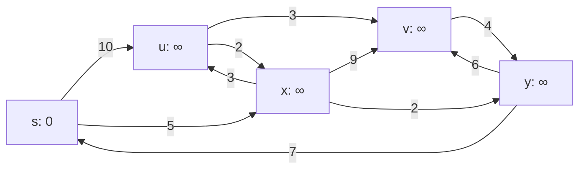
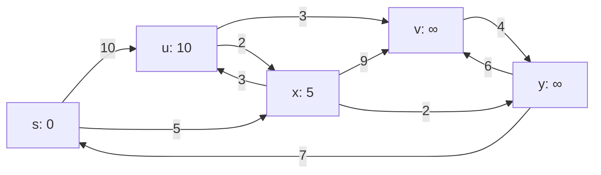
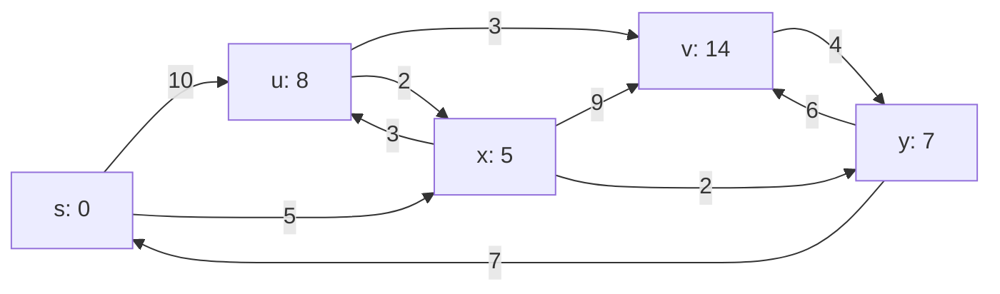
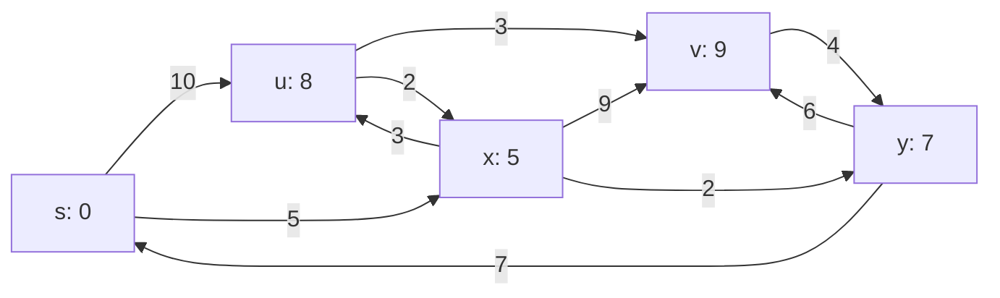

<u>Lemma: Limite superiore per i costi di cammino minimo</u>

Per ogni arco $(u,v$) vale la diseguaglianza:

$$\delta(s,v) \leq \delta(s,u) + W(u,v).$$

Dimostrazione:

- se $u$ non è raggiungibile da $s$ allora: $\delta(s,u) = \infty e \delta(s,v) \leq \infty + W(u,v)$ banalmente
- se $u$ è raggiungibile da $s$ allora $\delta(s,u) + W(u,v)$ è il costo di un cammino da $s$ a $v$ ed è quindi maggiore o uguale di $\delta(s,v).$

<u>Corollario: scomposizione dei costi di cammino minimo</u>

 Se $p$ è un cammino minimo da $s$ ad un vertice $v$ diverso da $s$ ed $u$ è il vertice che precede $v$ nel cammino allora
$$\delta(s,v) = \delta(s,u) + W(u,v).$$

La dimostrazione è conseguenza della sottostruttura ottima: $\delta(s,v) = W(p) = \delta(s,u) + W(u,v)$.

### Tecnica del rilassamento

Gli algoritmi che studieremo per il problema dei cammini minimi usano la tecnica del rilassamento. Aggiungiamo ad ogni vertice $v$ del grafo un campo `d[v]` che rappresenta una stima di cammino minimo: durante tutta l’esecuzione dell’algoritmo un limite superiore per $\delta(s,v)$ mentre alla fine è proprio uguale a $\delta(s,v)$.

L’inizializzazione dei campi `p[v]` e `d[v]` è la stessa per tutti gli algoritmi:

```
Inizializza(G, s, d, p)    // G grafo pesato sugli archi
	for ogni v in V[G] do
		p[v] <- nil
		d[v] <- infty
	d[s] <- 0
```

Il *rilassamento di un arco* $(u,v)$ consiste nel controllare se è possibile migliorare il cammino
finora trovato per $v$ (e quindi la stima `d[v]`) allungando il cammino trovato per u con l’arco
$(u,v)$.

```
Rilassa(G, u, v, d, p, W)
	if d[v] > d[u] + W(u,v) then
		d[v] <- d[u] + W(u,v)
		p[v] <- u
```

<u>Lemma 1: effetto del rilassamento</u>

Dopo aver eseguito `Rilassa(G,u,v)` vale la diseguaglianza
$$d[v] \leq d[u] + W(u,v),$$
ovvero le stime `d[v]` sono monotone non crescenti.

<u>Dimostrazione</u>

Se $d[v] > d[u] + W(u,v)$ prima del rilassamento, viene posto $d[v] = d[u] + W(u,v)$. Se invece vale la disuguaglianza $d[v] \leq d[u] + W(u,v)$ prima del rilassamento, non viene fatto nulla e quindi tale condizione rimane verificata anche dopo il passaggio di rilassamento.

<u>Lemma 2: nivariante del rilassamento</u>

Dopo l’inizializzazione per ogni vertice $v$ vale la disuguaglianza
$$d[v] \leq \delta(s,v),$$ 
che rimane verificata anche dopo un numero qualsiasi di rilassamenti. Inoltre, se a un certo punto $d[v] = \delta(s,v)$, il suo valore non può più variare.

<u>Dimostrazione</u>

Dopo l’inizializzazione, $d[s] = 0 \leq \delta(s,s)$ (in quali casi vale il > stretto?) e per ogni altro vertice $d[v] =\infty \geq \delta(s,v)$. Se $d[v]$ non viene modificata durante l’esecuzione di `Rilassa(G,u,v)` la disuguaglianza resta ancora vera. Se $d[v]$ viene invece modificata, allora $d[v] = d[u] + W(u,v)$.
Siccome $d[u]$ non è stata modificata vale la disuguaglianza $d[u] \geq \delta(s,u)$ e quindi per il limite superiore dei costi di cammino minimo:
$$d[v] \geq \delta (s,u) + W(u,v) \geq \delta(s,v)$$
Infine, dato che il valore di $d[v]$ può soltanto diminuire e $d[v] \geq \delta(s,v)$ se $d[v] = \delta(s,v)$ allora il suo valore non può più variare.

<u>Lemma 3: correttezza di</u> $d[v]$ <u>per vertici non raggiungibili</u>

Dopo l’inizializzazione per ogni vertice $v$ non raggiungibile da $s$ vale la disuguaglianza $d[v] = \delta(s,v)$, ed essa rimane vera anche dopo un numero qualsiasi di rilassamenti.

<u>Dimostrazione</u>

Dopo l’inizializzazione $d[v] = \infty$ per ogni vertice diverso da $s$, se $v$ non è raggiungibile da $s$ allora $\delta(s,v) = \infty = d[v]$ e per l’invariante del rilassamento $d[v]$ non può più cambiare.

<u>Lemma 4: estensione della correttezza di $d[v]$ per vertici raggiungibili</u>

Se $(u,v)$ è l’ultimo arco di un cammino minimo da $s$ a $v$ e $d[u] = \delta(s,u)$
prima di eseguire il rilassamento dell’arco $(u,v)$, allora dopo il rilassamento $d[v] = \delta(s,v)$.

<u>Dimostrazione</u>

Dopo il rilassamento $d[v] \geq \delta(s,u) + w(u,v)$, siccome $(u,v)$ è l’ultimo arco di un cammino minimo:
$$\delta(s,v) = \delta(s,u) + w(u,v)$$
e quindi
$$d[v] \leq \delta(s,v)$$
Per l’invariante del rilassamento $\delta(s,v)$ è anche un limite inferiore di $d[v]$, per cui vale necessariamente l’uguaglianza:
$$d[v] = \delta(s,v).$$

Possiamo concludere che qualsiasi algoritmo che esegua l’inizializzazione ed una sequenza di
rilassamenti per cui alla fine $d[v] = \delta(s,v)$ per ogni vertice $v$ calcola correttamente i cammini minimi. Esistono due algoritmi classici di questo tipo, l'algoritmo di Dijkstra l'algoritmo di Bellman e Ford. L’algoritmo di Dijkstra richiede che i pesi degli archi non siano negativi mentre quello di Bellman-Ford funziona anche nel caso generale.


### Algoritmo di Dijkstra

L'algoritmo di Dijkstra è una procedura *greedy* che risolve il problema dei cammini minimi da una singola sorgente per pesi non negativi. Si può adattare anche a pesi negativi normalizzando la funzione di somma dei pesi. Utilizza un insieme $S$ di vertici i cui pesi dei percorsi minimi sono già stati determinati. L’algoritmo seleziona a turno il vertice $u$ in $V – S$ col minimo valore $d[u]$, inserisce $u$ in $S$, e rilassa tutti gli archi uscenti da $u$.

Segue lo pseudocodice dell'algoritmo:
```
Dijkstra(G,s,d,p,W)
	Inizializza(G,s,d,p)
	S = []
	Q = V(G)   // Coda (di priorità)
	while ( Q != [] )
		u = extract_Min(Q) //scelta greeedy
		S = S U {u}
			for each vertice v adiacente a u
				relax(u,v,d,p,W)

relax(u,v,d,p,W)
	if d[v] > d[u] + w(u,v)
	then decrease_key(d[v], d[u] + w(u,v))
		p[v] = u
```


#### Esempio di esecuzione

Primo passo: scegliamo $s$ come vertice sorgente.



Secondo passo: $s$ viene estratto da $Q$ ed i vertici adiacenti $x$ ed $u$ vengono «rilassati» (le frecce rosse indicano i predecessori nel cammino minimo).



Terzo passo: $x$ viene estratto da $Q$ e i vertici adiacenti $u,v$ e $y$ vengono «rilassati»



Quarto passo: $y$ viene estratto da $Q$ ed il vertice adiacente $v$ viene «rilassato»


Quinto passo: $u$ viene estratto da $Q$ ed il vertice adiacente $v$ viene «rilassato»



Sesto passo: $v$ viene estratto da $Q$. La lista dei predecessori ora definisce il cammino minimo da $s$ per ogni nodo


#### Tempo di esecuzione

Il tempo di esecuzione dipende dall’implementazione della coda di priorità. Differenti implementazioni danno differenti costi per le operazioni sulla coda.
Ad esempio, `extract_Min` viene eseguita $O(|V|)$ volte, mentre `relax(decrease_key)` viene eseguita $O(|E|)$ volte. Il tempo totale è dunque
$$|V| T_{extract-Min}  + |E| T_{decrease\_key}.$$
Confrontiamo l'uso di array o di heap binari:

| Coda a priorità | $T_{extract-Min}$ | $T_{decrease\_key}$ | Tempo totale                 |
| --------------- | ----------------- | ------------------- | ---------------------------- |
| Array           | $O(\|V\|)$        | $O(1)$              | $O(\|V\|^2)$                 |
| Heap binario    | $O (\log \|V\|)$  | $O(\log \|V\|)$     | $O((\|V\|+\|E\|)\log \|V\|)$ |

Se $G$ è denso, è preferibile l'*array*.
