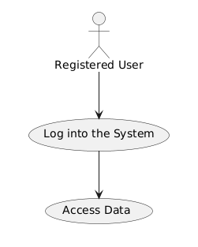
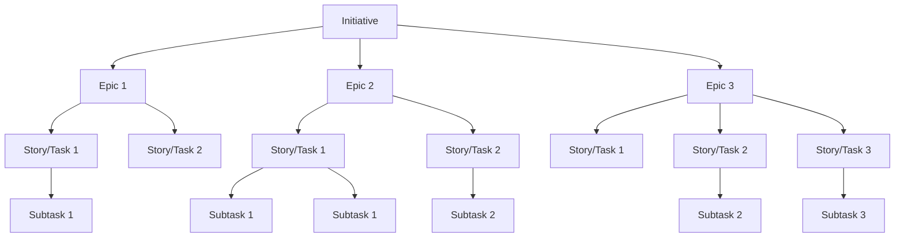

\newpage

# Sviluppo agile e API-lead

I quattro fattori essenziali studiati dall'ingegneria del software sono:

1. tempo
2. qualità
3. risorse
4. ambito (il più facile da controllare)

I metodi di sviluppo possono dividersi in tre principali categorie: *waterfall* (pianificato, lineare), *spiral* (pianificato, iterativo) e *agile* (non pianificato, *test-driven*).

## Sviluppo *agile*

Nella metodologia *agile* lo sviluppo è visto come fortemente comunicativo e legato alle persone più che ai processi. La documentazione è vista come meno importante rispetto alle *release* incrementali di *software* funzionante. È forte l'impiego di *best practice* quali la programmazione in coppia, lo sviluppo basato sui test e l'integrazione continua, a scapito di processi pesanti e rigorosi.

I quattro punti principali del *Manifesto Agile* (Beck et al. 2001): sono

1. individuals and interactions over processes and tools
2. working software over comprehensive documentation
3. customer collaboration over contract negotiation
4. responding to change over following a plan

Per esteso, il manifesto si espande in dodici principi:

1. soddisfazione del cliente attraverso la consegna precoce e continua di *software* funzionante
2. adattamento a requisiti in cambiamento durante il processo di sviluppo
3. consegna frequente di *software* funzionante
4. collaborazione giornaliera tra *stakeholder* aziendali e sviluppatori durante il progetto
5. supportare, fidarsi di, e motivare le persone coinvolte
6. abilitare interazioni faccia a faccia
7. il *software* funzionante è la misura principale di progresso
8. le procedure agili promuovono lo sviluppo sostenibile
9. l'eccellenza tecnica e la buona progettazione migliorano l'agilità
10. semplicità - sviluppa solo quanto basta per portare a termine il lavoro adesso
11. le migliori architetture, i migliori requisiti e progetti emergono da squadre auto-organizzate
12. auto-miglioramento: le squadre riflettono regolarmente su come essere più efficaci

### Pianificazione (*planning game)*

La pianificazione si basa sull'utilizzo delle *user stories*, ovvero una rappresentazione dei casi d'uso che segua lo schema seguente: 

> As a `user`, I `want to`, `so that`.

Le *user stories* possono essere trasformate in casi d'uso da schematizzare regolarmente tramite un diagramma UML dei casi d'uso. Ad esempio, la storia utente: `as a registered user, I want to log into the system to access my data.` diventa:

È possibile costruire infine una struttura che divida lo sviluppo in *epic* che raccolgono *task*
 legati alle storie:
 

### Testing

Il *testing* segue la filosofia del *test-driven development*: si parte dalla costruzione dei test, con *tutte* le funzionalità da implementare. Tutti i test inizialmente falliscono per mancanza del metodo o dell'unità da testare, ma agiscono in questo modo da promemoria e guida per lo sviluppo. I test stessi possono essere interpretati come una forma di documentazione.

### System metaphor

Il concetto di *system metaphor* nello sviluppo agile è un modo per descrivere e capire l'architettura e il progetto di un sistema software utilizzando un'analogia semplice e condivisa. Questa metafora serve come linguaggio comune per la squadra di sviluppo, gli *stakeholder* e gli utenti, aiutando tutti a capire la struttura del sistema, dei componenti e delle interazioni tra parti. La metafora semplifica i concetti, guida il progetto, ne facilita l'uniformita e ne favorisce l'evoluzione. Tutti sono coinvolti e interessati nello sviluppo del sistema. È importante che l'architettura di base e l'intero sistema siano chiari a tutti, e che tutti se ne sentano responsabili. L'architettura non è una *pipeline* in *silos* come nello sviluppo tradizionale, ma una *tavola rotonda* dove i ruoli precedentemente rappresentati dai *silos* (*product owner*, *project manager*, *designer*, sviluppatore, *tester*) convivono parallelamente in un *core team*, e possono perfino scambiarsi i ruoli nel corso del tempo.

### Programmazione in coppia

Il pair programming nella metodologia agile consiste nella collaborazione di due programmatori: il _driver_, che scrive il codice, e il _navigator_, che revisiona e guida il processo. Questo approccio migliora la concentrazione, riduce gli errori e aumenta la qualità del codice grazie alla continua revisione e al confronto costante tra i due sviluppatori.

### *Timeboxing*

Il *timeboxing* nella metodologia *agile* consiste nella divisione del tempo in intervalli di durata prefissata, alla fine dei quali ci si ferma, indipendentemente dal risultato ottenuto. Questo approccio è ampiamente utilizzato in metodologie come *Scrum* ed *eXtreme Programming*, specialmente per attività come il *brainstorming*. Un esempio pratico è la *tecnica del pomodoro*, che prevede 25 minuti di lavoro seguiti da 5 minuti di pausa. Il *timeboxing* aiuta a mantenere la concentrazione, a gestire meglio il tempo e a ridurre la procrastinazione, migliorando così l'efficienza e la produttività del team.

### *Continuous integration*

La *Continuous Integration* (CI) è una pratica fondamentale nella metodologia *agile* che mira a evitare il cosiddetto "_big bang disaster_", ovvero la situazione in cui nulla compila e tutti i test falliscono durante la fase di integrazione finale. Questo approccio prevede che ogni modifica al codice venga automaticamente testata e compilata su un *server* collegato al repository remoto. In questo modo, eventuali problemi vengono identificati e risolti tempestivamente, riducendo il rischio di errori critici in fase di rilascio.

*DevOps* è una metodologia che promuove la collaborazione e l'integrazione tra il team di sviluppo, il team di garanzia qualità e il team di operazioni di deployment. Questo approccio mira a ridurre i *silos* organizzativi e a migliorare la comunicazione e la cooperazione tra i vari team, accelerando così il ciclo di vita dello sviluppo software. Automatizzando il processo di rilascio come parte della CI, si garantisce che il codice sia sempre pronto per la produzione, migliorando così l'efficienza e la qualità del software.

Un altro aspetto cruciale della CI è l'*Infrastructure-as-Code* (*IaC*), che consiste nell'utilizzo di codice per gestire e configurare gli strumenti di management della configurazione. Questo approccio permette di automatizzare ulteriormente il processo di integrazione continua, rendendo la gestione delle infrastrutture più efficiente e meno soggetta a errori umani. In sintesi, la CI non solo migliora la qualità del codice, ma anche la collaborazione tra i team e l'efficienza operativa.

### Problemi con le metodologie agili

Le metodologie agili, sebbene offrano numerosi vantaggi, presentano anche alcune sfide significative. Uno dei principali problemi è la mancanza di obiettivi chiaramente definiti, che può portare al fenomeno del _feature creep_, ovvero l'aggiunta continua di nuove funzionalità che allunga indefinitamente il progetto. Questo può rendere difficile determinare quando un progetto è effettivamente completato. Inoltre, le metodologie agili richiedono un cliente singolo e altamente coinvolto, disposto a partecipare attivamente al processo di sviluppo. Questo livello di impegno non è sempre facile da ottenere, specialmente in progetti complessi o con clienti multipli. Un altro aspetto critico è l'utilizzo di team piccoli, che possono essere più agili ma anche più vulnerabili a problemi di risorse umane, come la perdita di membri chiave del team. Un'altra problematica legata al personale è la difficile, seppure possibile, scalabilità del metodo *agile* a team di grandi dimensioni. Infine, l'integrazione delle tecniche agili spesso avviene in modo "all-or-nothing", con una forte codipendenza tra le varie pratiche. Questo significa che l'adozione parziale delle metodologie agili può non portare ai benefici attesi, rendendo necessaria una transizione completa per ottenere risultati significativi.

### Prodotti e progetti

Tradizionalmente, il lavoro nello sviluppo software si concentrava su progetti ad-hoc commissionati da singoli clienti. Questo approccio comportava la creazione di soluzioni personalizzate per soddisfare esigenze specifiche. Nel corso degli anni è emersa una tendenza verso lo sviluppo di prodotti generici, vendibili su un mercato più ampio. All'interno delle aziende spesso c'è personale dedicato che cerca opportunità per creare prodotti a valore aggiunto. Questo processo può includere il riutilizzo di componenti già sviluppate in passato, ottimizzando così le risorse e riducendo i tempi di sviluppo. L'economia delle API (Application Programming Interfaces) ha ulteriormente trasformato il mercato, permettendo l'uso di servizi in abbonamento o a consumo. Questo modello consente alle aziende di offrire funzionalità avanzate e scalabili, facilitando l'integrazione con altre piattaforme e servizi.

La *Software Product Line* (SPL) è un approccio allo sviluppo *software* che si concentra sulla creazione di una famiglia di prodotti simili, i quali condividono una base comune di componenti riutilizzabili. Questo metodo permette di ridurre i costi e i tempi di sviluppo, migliorando al contempo la qualità e la coerenza dei prodotti.

### Modello di esecuzione

In passato, i software venivano eseguiti principalmente in locale, o al massimo sul server del cliente, con aggiornamenti periodici installati manualmente. Questo approccio richiedeva un intervento diretto per mantenere il software aggiornato e funzionante. È in seguito emerso il modello di *esecuzione ibrida*, in cui alcune funzionalità aggiuntive vengono servite direttamente dal *server* del venditore. Questo approccio combina l'esecuzione locale con l'accesso a servizi remoti, offrendo maggiore flessibilità e scalabilità. Il modello *Software as a Service* (*SaaS*) rappresenta un ulteriore passo avanti. In questo caso, il software viene eseguito interamente sul server del venditore e accessibile tramite *web app*. Questo approccio elimina la necessità di installazioni locali e aggiornamenti manuali, garantendo che gli utenti abbiano sempre accesso alla versione più recente del software.

### Product software management

Le responsabilità del *product manager* includono la ricerca di nuove opportunità di mercato, la vendita ai clienti e la costruzione di un business model sostenibile. Questa figura è inoltre responsabile della gestione della customer experience, assicurandosi che i prodotti soddisfino le esigenze degli utenti e offrano un valore significativo. Questi compiti devono essere svolti tenendo conto delle limitazioni tecniche, bilanciando le aspettative dei clienti con le capacità tecnologiche dell'azienda.

## API

La definizione di *Application Programming Interface* (*API*) è stata introdotta da Cotton e Greatorex nel 1968 come *endpoint* esposti tramite i quali è possibile accedere a un servizio. Inizialmente, le API erano principalmente utilizzate per facilitare l'interazione tra diversi componenti *software* all'interno di un unico sistema. Negli ultimi anni, le API sono diventate esse stesse prodotti a tutti gli effetti, producibili, vendibili e componibili. Questo cambiamento ha portato alla nascita dell'*economia delle API*, in cui le aziende offrono accesso a funzionalità e servizi tramite API, spesso in modalità di abbonamento o a consumo. Le API sono ora considerate componenti fondamentali per l'innovazione e la scalabilità, permettendo alle aziende di integrare facilmente nuove funzionalità e di creare soluzioni composite che rispondono a esigenze specifiche del mercato.
