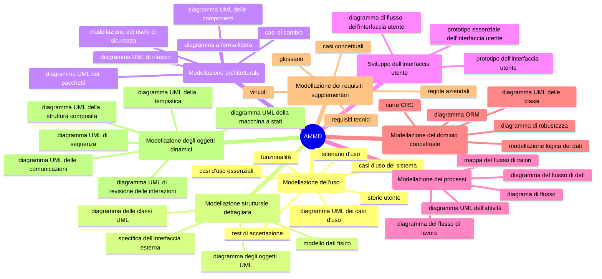
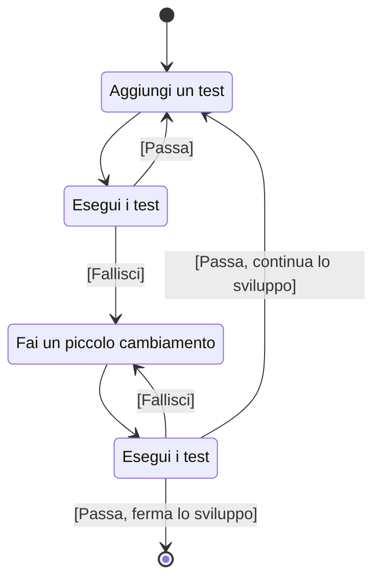

## AMMD (Agile Model Driven Development)

AMMD (*Agile Model Driven Development*) è una versione agile del *Model-Driven Development* (*MDD*), che combina i principi dell'agilità con la modellazione guidata dai modelli. Come molti altri metodi agili, AMMD è iterativo e incrementale, permettendo di adattarsi rapidamente ai cambiamenti e alle esigenze del progetto. Il principio base di AMMD è quello di affiancare una modellazione semplice e sufficiente alla scrittura del codice, garantendo che il modello venga aggiornato in tempo reale durante le iterazioni dello sviluppo.

Uno degli aspetti distintivi di AMMD rispetto ad altre tecniche simili è che non richiede l'uso di un linguaggio di modellazione particolare. Questo permette ai team di sviluppo di scegliere gli strumenti e i linguaggi di modellazione più adatti alle loro esigenze specifiche, senza essere vincolati da imposizioni rigide.

Di seguito è riportato uno schema delle principali categorie di modelli utilizzate nell'ambito AMMD, divise per categoria.

Le principali tipologie di modellazione utilizzate in AMMD includono modellazione strutturale, modellazione dell'uso e modellazione architetturale. La modellazione strutturale si concentra sulla definizione delle interfacce e delle strutture dati del sistema. Un esempio comune è il diagramma delle interfacce, che descrive come i diversi componenti del sistema interagiscono tra loro. Questo tipo di modellazione è fondamentale per garantire che il sistema sia ben strutturato e facilmente mantenibile. La modellazione dell'uso si focalizza su come gli utenti interagiranno con il sistema. Include la creazione di casi d'uso, diagrammi di sequenza e altri artefatti che descrivono i flussi di lavoro e le interazioni tra utenti e sistema. La modellazione dell'uso è cruciale per assicurare che il sistema soddisfi le esigenze degli utenti finali. La modellazione architetturale, infine, si occupa della definizione dell'architettura complessiva del sistema. Include la creazione di diagrammi di componenti, diagrammi di distribuzione e altri artefatti che descrivono come i vari componenti del sistema sono organizzati e come comunicano tra loro. La modellazione architetturale è essenziale per garantire che il sistema sia scalabile, performante e sicuro.

### Iterazioni

L'iterazione iniziale, denominata *envisioning*, si concentra sulla concettualizzazione della visione del prodotto e della struttura iniziale. Questa fase dura solitamente pochi giorni. È fondamentale scegliere fin da subito i framework, poiché da essi derivano alcune scelte architetturali essenziali. La prima iterazione successiva all'*envisioning* comprende diverse attività: la modellazione, che richiede ore di lavoro; il model storming, che si svolge in pochi minuti; e lo sviluppo guidato dai test, che occupa diverse ore. Inoltre, viene incluso il *testing* investigativo. Le iterazioni seguenti adottano lo stesso modello della prima. Al termine di ciascuna iterazione, è possibile effettuare una revisione opzionale con il cliente.

Il seguente schema rappresenta il processo di *test-driven development*:

Il *testing investigativo* si focalizza sulla ricerca di *bug* in situazioni estreme, svolgendosi in un'unica sessione intensiva. Questo tipo di *testing* è cruciale per identificare problemi che potrebbero emergere in condizioni operative inusuali.

I requisiti vengono ordinati in una *pila dei requisiti* in base all'urgenza della loro implementazione, permettendo di gestire le priorità in modo efficace. Questo approccio garantisce che i requisiti più critici vengano affrontati per primi, assicurando un progresso coerente e mirato.

La *matrice di tracciabilità* dei componenti è una tabella che registra la data e le informazioni relative all'inserimento di ciascun requisito. Questa matrice fornisce una panoramica dettagliata dello stato dei requisiti, facilitando il monitoraggio e la gestione del progetto. Si registrano il nome del requisito; un suo identificativo; il tipo (funzionale / non funzionale); i gradi di priorità, criticità e rischio; la data di inserimento e una breve descrizione. La tabella seguente rappresenta un esempio di matrice di tracciabilità dei requisiti.

| nome requisito    | id requisito | tipo       | priorità | criticità | rischio | data           | descrizione                                        | fonte                           | implementazione | requisito padre | requisiti figli |
| ----------------- | ------------ | ---------- | -------- | --------- | ------- | -------------- | -------------------------------------------------- | ------------------------------- | --------------- | --------------- | --------------- |
| acquisto prodotti | 1            | funzionale | 1        | alta      | basso   | 22/06/2005     | deve permettere ai clienti di fare acquisti online | verbale riunione 22/06/2005     |                 |                 | 2,3,4,5         |
| registrazione     | 2            | funzionale | 1        | alta      | alto    | 22/06/2005  | deve permettere al cliente nuovo di registrarsi    | verbale riunione 22/06/2005  |                 | 1               |                 |

L'utilizzo della matrice è considerato una *best practice* perché garantisce la tracciabilità sia in avanti che all'indietro. Questo consente di seguire l'evoluzione dei requisiti nel tempo, facilitando la gestione e il controllo del progetto.

Nell'ambito dell'*envisioning* architetturale, è fortemente consigliato produrre un diagramma di *deployment* UML. Questo diagramma fornisce una rappresentazione visiva della distribuzione del sistema sull'*hardware*, aiutando a comprendere meglio la struttura e le interazioni tra i vari componenti.

### Casi d'uso

I *casi d'uso* devono essere formulati nel modo più astratto possibile, evitando qualsiasi riferimento alla parte implementativa. Questo approccio permette di concentrarsi sulle interazioni e sui requisiti funzionali senza essere influenzati dalle specifiche tecniche di realizzazione. Possono essere rappresentati come *user story*, con un diagramma formale UML, con una specifica scritta o con più tecniche contemporaneamente.

### Esempio CoCoMe

L'esempio CoCoME (Common Component Modeling Example) è un caso di studio ampiamente utilizzato per illustrare la realizzazione di componenti software. È spesso utilizzato come esempio didattico. CoCoME modella un sistema di gestione per un supermercato, coprendo vari aspetti come la gestione degli inventari, le vendite e le operazioni di cassa. Questo esempio è particolarmente utile per dimostrare come i componenti software possano essere progettati e integrati in un sistema complesso. CoCoME adotta un approccio modulare. Il sistema viene suddiviso in componenti distinti che interagiscono tra loro. Ogni componente è responsabile di una specifica funzionalità. Esempi di funzionalità sono la gestione dei prodotti, il processo di vendita e l'interfaccia utente. La modularità facilita la manutenzione e l'aggiornamento del sistema. I componenti possono essere sviluppati, testati e aggiornati indipendentemente gli uni dagli altri. Un aspetto fondamentale di CoCoME è l'uso di interfacce ben definite per la comunicazione tra i componenti. Queste interfacce garantiscono che i componenti possano interagire in modo coerente e prevedibile. Ciò riduce il rischio di errori e migliora l'affidabilità del sistema. Inoltre, l'uso di interfacce standardizzate facilita l'integrazione di nuovi componenti o la sostituzione di componenti esistenti, senza dover modificare l'intero sistema.

