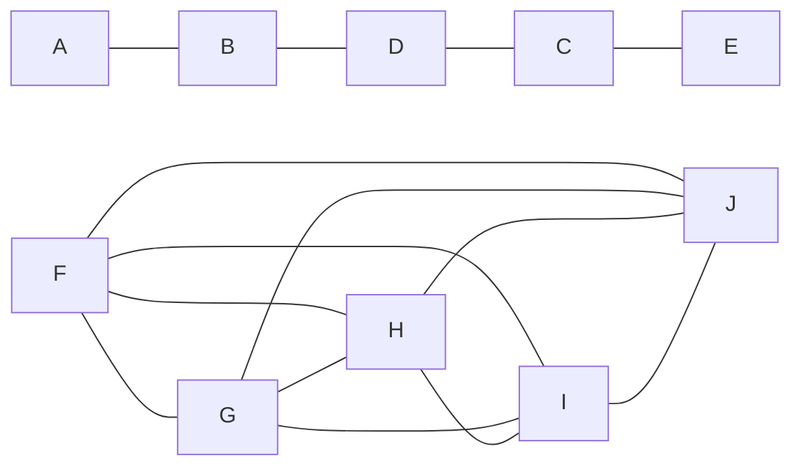

## Architettura software

L'*architettura software* è una disciplina che ha radici negli studi di Dijkstra nel 1968 e di Parnas nel 1970. Questa disciplina si concentra sulla struttura dei sistemi *software* e sulla difficoltà di determinare una struttura ottimale. A partire dagli anni '90, la ricerca in questo campo ha visto un notevole sviluppo, con particolare attenzione agli stili architetturali, ai problemi comuni (*pattern*), ai linguaggi descrittivi (ADL), alla documentazione della struttura (view) e alla valutazione della qualità del servizio (QoS).

I requisiti non funzionali, come la responsività, l'affidabilità, la disponibilità, la sicurezza, l'usabilità, la mantenibilità e la resilienza, sono aspetti fondamentali dell'architettura *software*. Questi requisiti influenzano significativamente la progettazione e l'implementazione del sistema, garantendo che il <u>software</u> soddisfi le aspettative degli utenti e risponda efficacemente alle esigenze operative. Un concetto emergente è quello dell'*antifragilità*, che si riferisce alla capacità di un sistema di resistere alle avversità, autoaggiustarsi e apprendere dalle criticità scoperte. Questo approccio mira a creare sistemi che non solo sopravvivono alle difficoltà, ma ne traggono anche vantaggio, migliorando nel tempo.

Gli standard ANSI/IEEE 1471:2000 e ISO/IEC/IEEE 42010:2011 forniscono una definizione ufficiale dell'architettura *software*, stabilendo linee guida e *best practice* per la progettazione e la documentazione dei sistemi software. Questi *standard* sono ampiamente riconosciuti e utilizzati nella pratica professionale per garantire la qualità e l'efficienza dei sistemi software.

Nell'ingegneria del *software* tradizionale, il processo di sviluppo comporta un passaggio da un singolo problema a molteplici soluzioni possibili, esplorando l'intero spazio delle soluzioni per trovare quella ottimale. Al contrario, l'approccio moderno all'ingegneria del *software* prevede, data una specifica problematica, la selezione tra un numero più ristretto di architetture di riferimento, che vengono poi adattate per creare implementazioni specifiche. Questo metodo semplifica il processo decisionale e permette di concentrarsi su soluzioni già validate e ottimizzate. Un altro principio fondamentale nell'architettura software è quello delle *few interfaces*, che mira a minimizzare il numero totale di comunicazioni tra i moduli. Ogni modulo dovrebbe comunicare con il minor numero possibile di altri moduli, idealmente avvicinandosi al minimo teorico di $n-1$ collegamenti tra $n$ moduli. Ridurre le interazioni tra i moduli non solo semplifica la struttura del sistema, ma migliora anche la manutenibilità e la gestione delle dipendenze, rendendo il sistema più robusto e meno suscettibile agli errori. Il seguente grafico rappresenta un esempio di interconnessione minimizzata ed un esempio di interconnessione eccessiva:

La *separazione delle responsabilità* consiste nel dividere un'applicazione in funzionalità distinte con la minima sovrapposizione possibile. Questo approccio mira a minimizzare i punti di interazione tra le diverse parti del sistema, ottenendo così un'alta coesione e un basso accoppiamento. Il *principio di singola responsabilità* afferma che ogni componente o modulo deve avere responsabilità solo per una specifica funzionalità o per un'aggregazione di funzionalità strettamente correlate. Questo principio promuove la modularità e la manutenibilità del sistema, rendendo più semplice l'identificazione e la risoluzione dei problemi. Il *principio di minima conoscenza* stabilisce che un componente non deve conoscere i dettagli interni di altri componenti, ma solo la loro interfaccia. Procedere in questo modo riduce la dipendenza tra i componenti e facilita la modifica e l'aggiornamento del sistema senza effetti collaterali indesiderati. Il principio *Don't repeat yourself* (*DRY*) sottolinea l'importanza di evitare la duplicazione di funzionalità tra componenti diversi. Questo approccio mira a ridurre la ridondanza e a migliorare la manutenibilità del codice, rendendo più facile apportare modifiche e aggiornamenti. Il principio *minimize upfront design* è ampiamente applicato nel *design* *agile*. Questo principio suggerisce di progettare solo ciò che è necessario in quel momento, evitando di investire tempo e risorse in dettagli che potrebbero non essere immediatamente rilevanti. Questo approccio permette di concentrarsi sulle esigenze attuali e di adattarsi rapidamente ai cambiamenti, promuovendo flessibilità e efficienza nello sviluppo del software.

Nella progettazione del *software* si distinguono tre diversi livelli di *pattern*. Gli *idiomi*, o *pattern* a livello di codice, riguardano le convenzioni utilizzate direttamente nel codice sorgente per migliorare la leggibilità e l'efficienza. I *design pattern*, a livello di componente, forniscono soluzioni per problemi comuni nella progettazione, promuovendo la riutilizzabilità e la modularità. Gli *architectural pattern*, a livello di sistema, definiscono la struttura complessiva del sistema, come la stratificazione, che suddivide il sistema in livelli con responsabilità ben definite, facilitando la gestione della complessità.

Il *modello 4+1* è un *framework* di progettazione del *software* che integra quattro diverse prospettive, unite da scenari. La *vista logica* o *funzionale* descrive i requisiti funzionali del sistema e i servizi che esso offre, utilizzando un modello statico che include componenti, classi e interazioni tra componenti. La *vista dei processi*, invece, è un modello dinamico che riguarda l'esecuzione delle componenti, includendo processi, *thread* e interazioni tra entità attive, oltre ai requisiti non funzionali sul comportamento del sistema. La *vista di sviluppo*, o di *implementazione*, utilizza diagrammi statici per guidare il *team* di sviluppo, mostrando unità compilative, *package*, componenti e la distribuzione in unità logiche. La *vista fisica* descrive come le componenti software create si distribuiscono sull'hardware. Infine, gli *scenari* modellano i casi d'uso e i requisiti funzionali, fornendo una visione integrata delle diverse prospettive. Per rappresentare la vista logica si utilizzano diagrammi dei componenti, delle classi e dell'attività. La vista dei processi è rappresentata da diagrammi della macchina a stati, oggetti, componenti, sequenza e attività. La vista di sviluppo include diagrammi delle classi, dei *package*, sequenza e macchina a stati. La vista fisica è rappresentata dal diagramma di *deployment*. Gli scenari utilizzano diagrammi dei casi d'uso, sequenza e attività per fornire una visione completa delle diverse prospettive del sistema.
