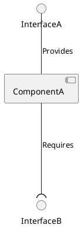
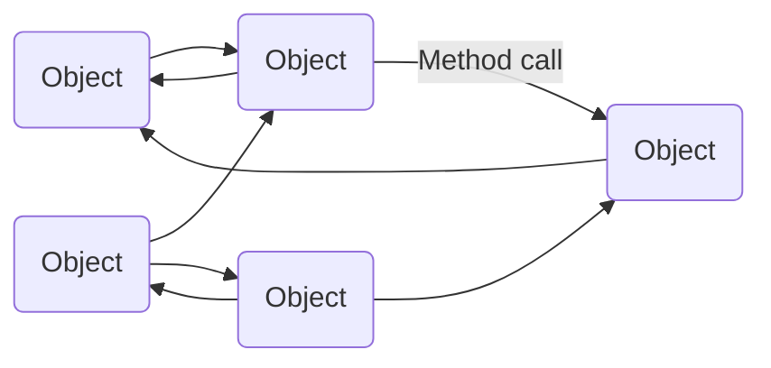

[comment]: appunti pessimi riassunta con Mistral. Da rivedere assolutamente.

Un componente software incapsula funzionalità e dati, ed è tipicamente specifico per un determinato dominio applicativo. Nella specifica dei componenti, si ragiona in termini di interfacce: interfacce fornite, interfacce richieste (dipendenze) e contratti (obblighi pubblici), che includono precondizioni, postcondizioni e invarianze. L'implementazione di un componente consiste in una struttura di oggetti realizzati (istanze di classi) e algoritmi che implementano la funzionalità dichiarata nella specifica del componente.

Un diagramma dei componenti specifica le interfacce richieste e fornite. Ad esempio, un componente chiamato `ComponentA` può richiedere un'interfaccia chiamata `InterfaceB` e fornire un'interfaccia chiamata `InterfaceA`.

Le relazioni tra componenti possono essere di diversi tipi:

- *is-part-of*: indica l'appartenenza di un componente a un altro.
- *uses*: indica l'invocazione di un componente da parte di un altro.
- *is-located-with*: indica che due componenti fanno parte dello stesso supercomponente.
- *shares-data-with*: indica che due componenti condividono la memoria.

Un connettore collega due componenti e può assumere diverse forme, come chiamate di procedura, memoria condivisa, metodi remoti, client-server, passaggio di messaggi, accesso a database e multicast asincrono. I connettori possono anche includere wrapper e adattatori. I protocolli definiscono le regole per l'ordinamento delle operazioni di un'interfaccia. Infine, è importante distinguere tra *tier* e *layer*. I *tier* rappresentano livelli fisici, mentre i *layer* rappresentano livelli logici.

## Stili architettonici

Uno stile architettonico rappresenta una raccolta denominata di decisioni di design architettonico che sono applicabili in un determinato contesto di sviluppo. Queste decisioni vincolano il design architettonico a un sistema specifico all'interno di quel contesto, promuovendo qualità benefiche in ogni sistema risultante. Gli stili architettonici si manifestano attraverso modelli organizzativi ricorrenti e idiomi, riflettendo una comprensione condivisa e consolidata delle forme di design comuni. Essi sono considerati un segno distintivo di un campo ingegneristico maturo. Secondo Shaw e Garlan, uno stile architettonico è un'astrazione delle caratteristiche ricorrenti di composizione e interazione in un insieme di architetture. Medvidovic e Taylor concordano su questa visione, sottolineando l'importanza degli stili architettonici nel fornire una struttura coerente e riconoscibile ai progetti.

Le architetture basate su oggetti e chiamate di metodi possono operare localmente o remotamente. Nel caso di interazioni remote, viene utilizzato un meccanismo di comunicazione inter-processo, come ad esempio le chiamate di procedura remota (RPC) e l'invocazione di metodi remoti (RMI). Questo stile di interazione è sincrono, il che significa che ogni chiamata di metodo attende il completamento dell'operazione prima di procedere con l'esecuzione successiva.

Un meccanismo di comunicazione inter-processo può essere descritto attraverso due dimensioni fondamentali: la dimensione spaziale e la dimensione temporale. La dimensione spaziale si occupa di due aspetti principali. Il primo è la natura dell'interazione, che può essere *uno-a-uno* o *uno-a-molti*. Il secondo aspetto riguarda il modo in cui le parti interagenti vengono a conoscenza l'una dell'altra. La dimensione temporale, invece, si concentra sul tipo di interazione, che può essere sincrona o asincrona. La combinazione di queste due dimensioni determina diversi stili di interazione e, di conseguenza, diversi stili architettonici, come mostrato in tabella.

|               | **Uno-a-uno**                | **Uno-a-molti**             |
| ------------- | ---------------------------- | --------------------------- |
| **Sincrono**  | Richiesta/risposta           | -                           |
| **Asincrono** | Notifica                     | Pubblica/iscriviti          |
| **Asincrono** | Richiesta risposta asincrona | Pubblica/risposte asincrone |

### Stili di base

Esistono diversi stili architettonici di base, tra cui il modello *Pipe-and-Filter*, l'architettura multilivello, il modello *client-server* e le sue varianti, il modello *broker*, il modello MVC, l'architettura orientata ai messaggi, l'architettura orientata ai servizi e l'architettura esagonale (nota anche come architettura porte e adattatori, spesso utilizzata per i microservizi).

### Pipe-and-filter

L'architettura *Pipe-and-Filter* prevede che un flusso di dati, in un formato relativamente semplice, venga passato attraverso una serie di processi, ciascuno dei quali lo trasforma in qualche modo. I dati vengono costantemente alimentati nella *pipeline* e i processi lavorano in modo concorrente. Questo tipo di architettura è estremamente flessibile, poiché quasi tutti i componenti possono essere rimossi o sostituiti, e nuovi componenti possono essere inseriti facilmente.

Una *pipeline* di Big Data su *cloud* segue un modello a cinque stadi. Inizia con un *data lake* che contiene tutti i dati in formati come *stream*, BLOBs (*Binary Large Objects*), CLOBs (*Character Large Objects*) o *file*, ad esempio file JSON. Un esempio di tecnologie *open source* utilizzate in questo contesto è l'ecosistema Apache Spark, che consente di passare dal *data lake* alla *data warehouse* fino all'analisi dei dati. Un esempio pratico è la piattaforma *ENEA PELL smart city* per l'illuminazione pubblica.

L'architettura *Pipe-and-Filter* e i suoi principi di *design* si basano su diversi concetti chiave. Il primo è il principio *divide et impera*, dove i processi separati possono essere progettati indipendentemente. Questo aumenta la coesione funzionale dei processi e riduce l'accoppiamento, poiché ciascun processo ha un solo input e un solo output. I componenti della *pipeline* sono spesso buone astrazioni, nascondendo i dettagli interni e aumentando la riutilizzabilità. I processi possono essere utilizzati in molteplici contesti e spesso è possibile trovare componenti riutilizzabili da inserire nel pipeline. Il sistema è progettato per essere flessibile e testabile, rendendo facile testare i singoli processi. Infine, il *design* difensivo implica un rigoroso controllo degli *input* di ciascun componente, o l'uso del *design by contract*.

### Architettura multilivello

L'*architettura multilivello* consente di costruire sistemi complessi sovrapponendo strati a livelli crescenti di astrazione. Ogni livello comunica esclusivamente con il livello immediatamente sottostante e fornisce un'interfaccia ben definita, ovvero un insieme di servizi, al livello immediatamente superiore.

I principi di *design* dell'architettura multilivello si basano su diversi concetti fondamentali. Il principio *divide et impera* permette di progettare i livelli indipendentemente. Questo aumenta la coesione all'interno di ciascun livello. I livelli inferiori, se ben progettati, non hanno conoscenza dei livelli superiori. L'unica connessione tra i livelli avviene tramite l'API, e questo riduce l'accoppiamento. Tale approccio aumenta l'astrazione, poiché non è necessario conoscere i dettagli di implementazione dei livelli inferiori. I livelli inferiori possono essere progettati in modo generico, aumentando la riutilizzabilità. Spesso è possibile riutilizzare livelli costruiti da altri che forniscono i servizi necessari.

L'architettura multilivello offre grande flessibilità. Permette di aggiungere nuove funzionalità basate su servizi di livello inferiore o di sostituire livelli di livello superiore. Isolando i componenti in livelli separati, il sistema diventa più resistente all'obsolescenza. Tutte le funzionalità dipendenti possono essere isolate in uno dei livelli inferiori, favorendo la portabilità. I livelli possono essere testati indipendentemente, facilitando la verifica del sistema. Infine, le API dei livelli sono punti naturali per implementare controlli rigorosi delle asserzioni, promuovendo un design difensivo.

### Architettura client-server

L'architettura *client-server* e le sue varianti rappresentano un modello di architettura distribuita in cui almeno un componente assume il ruolo di *server*, che attende connessioni e le gestisce una volta stabilite. Almeno un altro componente assume il ruolo di *client*, iniziando le connessioni per ottenere un servizio. I *server* non conoscono il numero né l'identità dei *client*, mentre i *client* conoscono l'identità del server. Un'ulteriore estensione di questo modello è il pattern *peer-to-peer*, dove il sistema è composto da varie componenti *software* distribuiti su diversi *host*, creando un sistema decentralizzato. Un esempio di questa architettura è un *motore di ricerca web*. I *pattern* architetturali coinvolti in questo caso includono una combinazione di livelli, *pipe* e filtri, e *client-server*.

L'architettura distribuita e i suoi principi di *design* si basano su una serie di concetti chiave. Il principio *divide et impera* implica la suddivisione del sistema in processi *client* e *server*, permettendo lo sviluppo indipendente di ciascuno. Il *server* può fornire un servizio coeso ai *client*, aumentando la coesione del sistema. Generalmente esiste un solo canale di comunicazione che scambia messaggi semplici. Questo riduce l'accoppiamento. I componenti distribuiti separati sono spesso buone astrazioni, che nascondono i dettagli interni e aumentano la riutilizzabilità. È spesso possibile trovare *framework* adatti per costruire buoni sistemi distribuiti.

I sistemi distribuiti possono essere facilmente riconfigurati aggiungendo *server* o *client* aggiuntivi, aumentando la flessibilità. La portabilità è migliorata poiché è possibile scrivere *client* per nuove piattaforme senza dover portare il *server*. La testabilità è facilitata poiché *client* e server possono essere testati indipendentemente. Infine, un *design* difensivo implica l'implementazione di controlli rigorosi nel codice di gestione dei messaggi, garantendo la robustezza del sistema.

### Architettura MVC

L'architettura *Model-View-Controller* (MVC) è un *pattern* architetturale utilizzato per separare il livello dell'interfaccia utente dagli altri componenti del sistema. Il *modello* contiene le classi sottostanti, le cui istanze sono visualizzate e manipolate. La *vista* contiene gli oggetti utilizzati per rendere l'aspetto dei dati del modello nell'interfaccia utente. Il *controllore* contiene gli oggetti che gestiscono e controllano l'interazione dell'utente con la vista e il modello. Il *pattern* di design *Observable* viene normalmente utilizzato per separare il modello dalla vista.

Un esempio dell'architettura MVC per l'interfaccia utente prevede interazioni triangolari. Nel modello passivo, la vista "tira" i risultati dal controllore. Nel modello attivo, il modello "spinge" i cambiamenti di stato alla vista attraverso un pattern *Observer*, noto anche come *Publish/Subscribe*.

I principi di design dell'architettura MVC includono il modello *divide et impera*, nel quale i tre componenti possono essere progettati in modo relativamente indipendente. Si aumenta così facendo la coesione dei componenti, che è più forte rispetto a una situazione in cui la vista e il controllore fossero combinati in un unico livello dell'interfaccia utente. La riduzione dell'accoppiamento è ottenuta minimizzando i canali di comunicazione tra i tre componenti. L'aumento del riuso è favorito dall'utilizzo estensivo di componenti riutilizzabili per vari tipi di controlli dell'interfaccia utente. La flessibilità è migliorata poiché è generalmente facile modificare l'interfaccia utente cambiando la vista, il controllore o entrambi. La testabilità è facilitata poiché è possibile testare l'applicazione separatamente dall'interfaccia utente.

Confrontando l'architettura MVC con l'architettura a tre livelli, quest'ultima è concettualmente lineare: una regola fondamentale è che il livello *client* non comunica mai direttamente con il livello dati. In un modello a tre livelli, tutte le comunicazioni devono passare attraverso il livello intermedio. Al contrario, l'architettura MVC è triangolare: la vista invia aggiornamenti al controllore, il controllore aggiorna il modello, e la vista riceve aggiornamenti direttamente dal modello (*push*) o dal controllore (*pull*).

### Architettura Broker

Il pattern architetturale *Broker* è utilizzato per strutturare sistemi distribuiti con componenti disaccoppiati. I *server* pubblicano le loro capacità, ovvero i servizi e le caratteristiche, a un *broker*. I *client* richiedono un servizio al *broker*, che poi reindirizza il *client* a un servizio appropriato dal suo registro. Questo pattern si basa su connettori di invocazione remota, permettendo a un oggetto di chiamare i metodi di un altro oggetto senza sapere che quest'ultimo è situato remotamente. Esempi di tecnologie di implementazione includono lo standard aperto OMG CORBA (*Common Object Request Broker Architecture*), RPC (*Remote Procedure Call*), Java RMI (*Remote Method Invocation*) e gRPC (*google Remote Procedure Calls*) per invocazioni di servizi remoti. Quest'ultimo si distingue per l'uso di servizi anziché oggetti, messaggi o riferimenti.

Un esempio di questo pattern è l'RMI in Java, dove la JVM lato *client* comunica con la JVM lato *server*, che svolge il ruolo di *broker*. Un altro esempio è gRPC, un'infrastruttura RPC *open source* e versatile sviluppata da Google per connettere servizi. gRPC utilizza HTTP/2 per il trasporto e *Protocol Buffers* come linguaggio di definizione delle interfacce (IDL). Offre funzionalità come autenticazione, *streaming* bidirezionale, controllo del flusso, *binding* bloccanti o non bloccanti, cancellazione e *timeout*.

I principi di *design* dell'architettura Broker includono *divide et impera*, permettendo di progettare gli oggetti remoti in modo indipendente. Questo aumenta la riusabilità, poiché è spesso possibile progettare gli oggetti remoti in modo che possano essere utilizzati anche da altri sistemi. Inoltre, è possibile riutilizzare oggetti remoti creati da altri. La flessibilità è garantita dalla possibilità di aggiornare i *broker* quando necessario, o di far comunicare il *proxy* con diversi oggetti remoti. La portabilità è migliorata poiché è possibile scrivere *client* per nuove piattaforme mantenendo l'accesso ai *broker* e agli oggetti remoti su altre piattaforme. Infine, un design difensivo implica l'implementazione di controlli rigorosi delle asserzioni negli oggetti remoti.

### Architettura ad elaborazione di transazioni

Il *pattern* architetturale di *elaborazione delle transazioni* prevede che un processo legga una serie di ingressi uno alla volta. Ogni ingresso descrive una transazione, ovvero un comando che tipicamente comporta una modifica ai dati memorizzati dal sistema. Un componente chiamato *dispatcher delle transazioni* decide come gestire ciascuna transazione. Il *dispatcher* invia una chiamata di procedura o un messaggio a uno dei componenti responsabili dell'elaborazione della transazione.

I principi di *design* dell'architettura di elaborazione delle transazioni includono *divide et impera*, dove i gestori delle transazioni rappresentano suddivisioni del sistema che possono essere assegnate a ingegneri del *software* separati. I gestori delle transazioni sono unità naturalmente coese, e separare il *dispatcher* dai gestori tende a ridurre l'accoppiamento. La flessibilità è garantita dalla possibilità di aggiungere facilmente nuovi gestori delle transazioni. Un *design* difensivo implica l'implementazione di controlli rigorosi delle asserzioni in ciascun gestore delle transazioni e/o nel *dispatcher*.

### Architettura orientata ai messaggi

Il pattern architetturale *orientato ai messaggi* prevede che diversi sottosistemi comunichino e collaborino esclusivamente scambiando messaggi, anche quando il destinatario non è disponibile. Questo modello è noto anche come *Message-Oriented Middleware* (MOM). I mittenti e i ricevitori devono conoscere solo i formati dei messaggi, e le applicazioni che comunicano non devono essere disponibili contemporaneamente, grazie al modello asincrono di pubblicazione/sottoscrizione. I messaggi possono essere resi persistenti. Esempi di tecnologie includono il *Java Message Service* (JMS) di Java EE, che permette alle applicazioni Java di scambiare messaggi, *Google Cloud Messaging* (GCM), sostituito da *Google Firebase Cloud Messaging* (FCM), *Roscore* per i sistemi basati su *Robot Operating System* (ROS) e lo standard ISO MQTT (*MQ Telemetry Transport o Message Queue Telemetry Transport*) su TCP/IP.

Nello stile di interazione *publish-subscribe*, i messaggi sono inviati da un componente (il publisher) attraverso canali virtuali (topics) a cui altri componenti software interessati possono sottoscriversi (subscribers). Un esempio di questa architettura è *Google Cloud Messaging* (GCM), ora sostituito da Google Firebase Cloud Messaging (FCM). I principi di *design* dell'architettura orientata ai messaggi includono *divide et impera*, dove l'applicazione è composta da componenti software isolati. La riduzione dell'accoppiamento è ottenuta poiché i componenti sono collegati in modo lasco, condividendo solo messaggi in formati di scambio dati. L'aumento dell'astrazione è garantito dalla semplicità di manipolazione dei formati dei messaggi prescritti, nascondendo i dettagli dell'applicazione dietro il sistema di messaggistica. La riusabilità è migliorata se i formati dei messaggi sono flessibili. I componenti possono essere riutilizzati finché il nuovo sistema aderisce ai formati dei messaggi proposti. La flessibilità è garantita dalla possibilità di aggiornare o potenziare facilmente la funzionalità di un sistema orientato ai messaggi aggiungendo o sostituendo componenti. La testabilità è migliorata poiché ogni componente può essere testato indipendentemente. Un *design* difensivo consiste semplicemente nel validare tutti i messaggi ricevuti prima di elaborarli.

### Architettura esagonale

L'*architettura esagonale*, nota anche come *architettura porte e adattatori*, rappresenta un'alternativa all'architettura a strati ed è alla base dell'*architettura a microservizi*. In questo modello, il sistema è suddiviso in diverse componenti debolmente accoppiate, rappresentate come esagoni. Queste componenti sono connesse attraverso porte, che sono API astratte, e adattatori, che fungono da collante tra le porte e il mondo esterno. Gli adattatori permettono l'interazione attraverso una porta utilizzando una specifica tecnologia di comunicazione o connettore. È possibile avere più adattatori per una singola porta. Ad esempio, i dati possono essere forniti da un utente attraverso un'interfaccia grafica (GUI), un'interfaccia a riga di comando o un *controller* API. Un esempio di questa architettura è rappresentato da due applicazioni esagonali che comunicano tramite REST.

