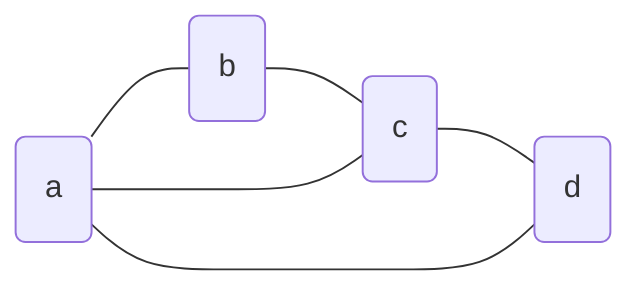
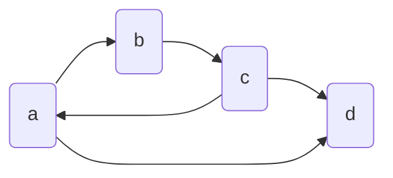

### BucketSort

*BucketSort* è un algoritmo utilizzato per ordinare *array* con chiavi intere. Funziona inserendo l'intero *record* nella posizione corrispondente alla sua chiave in un nuovo *array* ordinato. Questo metodo è particolarmente efficace quando le chiavi sono distribuite uniformemente. Per ordinare $n$ *record* con chiavi intere nell'intervallo $1, k]$, consideriamo un esempio pratico: ordinare $n$ record con campi come nome, cognome, anno di nascita, matricola, ecc. Si potrebbe desiderare di ordinare i record per matricola o per anno di nascita. L'*input* del problema è costituito da $n$ record mantenuti in un array. Ogni elemento dell'*array* è un record che include un *campo chiave* (rispetto al quale si desidera ordinare) e altri campi associati alla chiave (*informazioni satellite*). Per risolvere questo problema, è sufficiente mantenere un *array* di liste, anziché di contatori, e operare in modo simile all'algoritmo IntegerSort. La lista $Y[x]$conterrà gli elementi con chiave uguale a $x$. Infine, è necessario concatenare le liste per ottenere l'ordinamento desiderato.


**BucketSort (X, k)**
1. Sia $Y$ un array di dimensione $k$
2. for $i=1$ to $k$ `do` $Y[i]$ = lista vuota `// Inizializzazione`
3. `for` $j=1$ `to` $n$ `do`
4. `if` ($key(X[j]) \in {1,k}$) `then` errore
5. `else` appendi il record $X[j]$ alla lista $Y[key(X[j])]$
6. `for` $i=1$ to $k$ `do` `// Ordine crescente a livello di bucket`
7. copia l'ordinamento in $X$ gli elementi della lista $Y[i]$


Un algoritmo è definito stabile se preserva l'ordine iniziale tra elementi con la stessa chiave. Il BucketSort è reso stabile appendendo gli elementi di $X$in coda alla lista appropriata $Y[i]$. Una domanda pertinente è se gli altri algoritmi di ordinamento che abbiamo visto finora siano stabili. Tra questi, possiamo considerare il CountingSort, il Mergesort e il Quicksort.


Per ordinare $n$interi nell'intervallo $[1, k]$utilizzando il BucketSort, sono necessarie $O(\log_b k)$passate. Ciascuna passata richiede un tempo di $O(n + b)$. Utilizzando la relazione $\log_2 k = \log_n k \log_2 n$, il tempo complessivo dell'algoritmo è $O((n + b) \log_b k)$.

Se $b = O(n)$, il tempo di esecuzione diventa $O(n \log_b k) = O(n \log k)$. Se $b = O(1)$, il tempo di esecuzione è $O(n \log k) = O(n \log n)$. L'algoritmo raggiunge un tempo lineare se $k = O(n^c)$, dove $c$è una costante. In media, il tempo è $S$, ovvero $O(n)$ se $k = O(n)$.


### RadixSort

*RadixSort* è un algoritmo di ordinamento che opera in modo inverso rispetto ai metodi tradizionali, ordinando gli elementi numerici a partire dalla cifra meno significativa fino a quella più significativa. Questo processo viene eseguito cifra per cifra, applicando il BucketSort a ciascuna cifra. RadixSort trova applicazione in vari campi, tra cui il controllo del plagio e la biologia molecolare computazionale, dove è utilizzato per identificare la sottostringa ripetuta più lunga. Il RadixSort rappresenta i valori in una certa base $b$ed esegue una serie di BucketSort sulle cifre in modo bottom-up, partendo dalla cifra meno significativa verso quella più significativa.

L'algoritmo RadixSort può essere descritto come segue:

**RadixSort(A, 0) = for i = 0 to t-1 do**
- Esegui un algoritmo di BucketSort lineare per ordinare gli elementi di $A$ sulla cifra $i$.

La correttezza del RadixSort si basa su due principi fondamentali. Se $x$ e $y$ hanno una diversa $i$-esima cifra, la $i$-esima passata di BucketSort li ordina correttamente. Se $x$ e $y$ hanno la stessa $i$-esima cifra, la proprietà di stabilità del BucketSort li mantiene ordinati correttamente. Dopo la $t$-esima passata di BucketSort, i numeri sono correttamente ordinati rispetto alle $t$cifre meno significative.

<u>Esempio</u>

Supponiamo di voler ordinare $n = 10^6$numeri da 32 bit. Come scegliere la base $b$?
- $n = 10^6$ è compreso tra $2^{19}$ e $2^{20}$.
- Scegliendo $b = 2^{16} = 65536$, si ha:
  - $k = 2^{16}/1 = 65536$ con $c = 2$.
  - Sono sufficienti 2 passate di BucketSort.
  - Ogni passata richiede tempo lineare $O(n)$.

<u>Usi</u>

Il sorter IBM 802 è un esempio storico di applicazione del RadixSort. Questo dispositivo era utilizzato per ordinare le schede perforate da 12x80 per il linguaggio FORTRAN. Il RadixSort trova applicazione in vari altri campi, tra cui l'ordinamento delle stringhe, l'indicizzazione dei testi, il controllo di copiature e plagio, e la biologia molecolare computazionale. L'identificazione di geni, ad esempio, si può effettuare cercando la sottostringa ripetuta più lunga in una stringa di $N$caratteri rappresentanti le basi azotate. Queste applicazioni sfruttano l'efficienza e la stabilità del RadixSort per gestire grandi volumi di dati in modo efficiente.


Segue lo pseudocodice dell'algoritmo RadixSort, utilizzando come base per il bucketSort a valore $t$. La $t$-esima cifra più significativa di BucketSort considera come chiave la $t$-esima cifra meno significativa della rappresentazione decimale del numero.
```pseudocodice
procedura bucketSort(array A di n interi, interi b e t)
  sia T un array di dimensione b
  for i = 1 to n do
    c = estrai cifra t-esima di A[i] //Inizializzazione
    T[c] = T[c] + 1 // rappresentazione in base b
  for i = 1 to b do
    for j = 1 to T[i] do
      copia ordinatamente in A gli elementi della lista Y[i]
  fine procedura

algorithmo radixSort(array A di n interi)
  while (cifra t-esima di A non è 0)
    bucketSort(A, 10, t)
  t = t - 1
```

### Riepilogo e confronto

BucketSort e RadixSort sono generalizzazioni del CountingSort. Quest'ultimo, in particolare, assume che gli elementi siano compresi nell'intervallo $[1, k]$, ed è particolarmente utile quando $k$ è piccolo, ovvero dell'ordine di $O(n)$. Se ogni *bucket* ha dimensione 1, si ottiene il CountingSort. Il BucketSort, d'altra parte, presuppone la conoscenza della distribuzione dell'ingresso. Nel caso peggiore, il BucketSort ha una complessità di $\Theta(n^2)$, mentre nel caso medio la sua complessità è $\Theta(n)$. Il RadixSort, invece, assume che gli interi siano composti da $t$ cifre, con ogni cifra in base $b$. Questo algoritmo è particolarmente utile quando i numeri da ordinare sono molti, $t$ è costante e piccolo. È importante notare che nessuno di questi algoritmi esegue l'ordinamento in loco.

# Grafi

Una struttura dati non lineare e non gerarchica è rappresentata dai *grafi*. Un grafo è costituito da un insieme di *vertici*, o *nodi*, e da un insieme di *archi* o *spigoli* che collegano questi vertici. I grafi possono essere *orientati* o non *orientati*. In un grafo orientato, gli archi hanno una direzione specifica, mentre in un grafo non orientato gli archi sono bidirezionali. Nel primo caso la relazione non è simmetrica, nel secondo lo è. Un *cappio* è un arco i cui estremi coincidono. Un tipo particolare di grafo è il *multigrafo*, che ammette la presenza di più archi tra la stessa coppia di nodi. 

Un grafo orientato è definito *semplice* se non presenta due archi con gli stessi estremi. In caso contrario, si parla di multigrafo. A meno che non sia specificato diversamente, assumeremo sempre che un grafo sia semplice.
Due vertici collegati da uno spigolo sono detti *adiacenti*, e tale spigolo è detto incidente ai due vertici. Il *grado* di un vertice è il numero di archi incidenti ad esso. La somma dei gradi di tutti i vertici è pari al doppio del numero di archi nel grafo. Nei grafi orientati, la relazione di adiacenza segue l'orientamento: il vertice da cui l'arco esce è adiacente al vertice in cui l'arco entra. Di conseguenza, il grado di un vertice è dato dalla somma del numero di archi entranti e uscenti. A livello complessivo del grafo, il grado totale di archi entranti è uguale al grado totale uscente, ed entrambi sono pari al numero di archi totali. Come nel caso dei grafi non orientati, il grado complessivo è pari al doppio degli archi totali.

Un *cammino semplice* è un percorso che attraversa vertici distinti in un grafo. Il cammino più corto tra due nodi è detto distanza. Un ciclo semplice è un percorso chiuso che non si ripete. Un cappio è un ciclo semplice di lunghezza unitaria.

## Componenti connesse

Una *componente connessa* di un grafo $G$ è un insieme massimale di vertici $U \subseteq V$  tale che per ogni coppia di vertici in $U$ esiste un cammino che li collega in $G$. Un grafo non orientato $G = (V, E)$ è connesso se esiste almeno un cammino tra ogni coppia di vertici, o equivalentemente, se esiste un'unica componente connessa. È facile verificare che la relazione tra vertici "essere raggiungibile da" è una *relazione di equivalenza*, poiché gode delle proprietà riflessiva, simmetrica e transitiva. Di conseguenza, le componenti connesse di un grafo non orientato sono le classi di equivalenza dei suoi vertici rispetto alla relazione di raggiungibilità.

Una *componente fortemente connessa* di un grafo orientato $G$ è un insieme massimale di vertici $U \subseteq V$ tale che, per ogni coppia di vertici $u$ e $v$ in $U$, esiste in $G$ un cammino orientato che collega $u$ a $v$ e un cammino orientato che collega $v$ a $u$. Un grafo orientato $G = (V, E)$ è fortemente connesso se esiste almeno un cammino orientato tra ogni coppia di vertici. Le componenti fortemente connesse rappresentano le classi di equivalenza dei vertici rispetto alla relazione di equivalenza definita dalla connettività forte.

Gli *alberi* sono casi particolari di grafi. Un albero è un grafo non orientato, connesso e aciclico. Inoltre, un albero ha esattamente $|V| - 1$ archi, come dimostrabile.

Un DAG (*Directed Acyclic Graph*) è un grafo orientato ed aciclico.

## Implementazione

Una possibile interfaccia per un grafo in Java:
```java
interface Grafo {
    public int n();
    public int m();
    public int grado(Vertice v);
    public Arco[] archi(Vertice v);
    public Arco sonodi(Vertice v);
    public void aggiungiArco(Vertice x, Vertice y);
    public void aggiungiVertice(Vertice v);
    public void cancellaArco(Arco e);
    public void cancellaVertice(Vertice v);
    // fine...
}
```

Ecco alcune delle più note e utilizzate librerie per la gestione dei grafi nel linguaggio Java:

- **JGraphT** [https://jgraph.github.io/](https://jgraph.github.io/)
  - Per gli algoritmi!
  - Usa Jgraph come UI
- **JDSL** (Data Structures Library in Java) [http://128.148.32.110/cgc/jdsl/](http://128.148.32.110/cgc/jdsl/)
- **Annas** [http://code.google.com/p/annas/](http://code.google.com/p/annas/)
- **JGraphX** - Java Swing graph visualization library [https://github.com/jgraph/jgraphx](https://github.com/jgraph/jgraphx)
  - Utili come debugging dei vostri algoritmi
- Altre API alternative: Jung, yworks, prefuse.org e BFG

## Linearizzazione dei grafi

Un grafo può essere rappresentato in memoria in diversi modi. Prendiamo ad esempio il seguente grafo:



<u>Lista di archi</u>

Una lista di archi per un grafo è un elenco di tutte le coppie di vertici collegati da un arco. Nell'esempio, la lista di archi è:
$$
\begin{bmatrix}
(a,b) & (c,a) & (b,c) & (c,d) & (a,d)
\end{bmatrix}
$$

I costi associati alla rappresentazione mediante lista di archi sono rappresentati nella seguente tabella:

| Operazione                  | Tempo di esecuzione |
|----------------------------|---------------------|
| `grado(v)`                 | $O(m)$              |
| `archiIncidenti(v)`         | $O(m)$              |
| `sonoAdiacenti(r, y)`       | $O(m)$              |
| `aggiungiVertice(v)`       | $O(1)$              |
| `aggiungiArco(r, y)`       | $O(1)$              |
| `rimuoviVertice(v)`        | $O(m)$              |
| `rimuoviArco(e)`           | $O(m)$              |

<u>Liste di adiacenza e di incidenza</u>

Una lista di incidenza per un grafo è una rappresentazione che associa a ogni vertice una lista dei lati incidenti. Una lista di adiacenza è una rappresentazione che associa a ogni vertice una lista dei vertici adiacenti. Nell'esempio utilizzato, le liste di adiacenza e di incidenza assumono le seguenti forme:

$$
\begin{matrix}
\text{lista di adiacenza} \\
\begin{bmatrix}
a \\ b \\ c \\ d
\end{bmatrix}
\begin{matrix}
\to & b & \to & d & \to & c \\
\to & c & \to & a \\
\to & a & \to & d & \to & b \\
\to & c & \to & a
\end{matrix}
\end{matrix}
$$
$$
\begin{matrix}
\text{lista di incidenza} \\
\begin{bmatrix}
a \\ b \\ c \\ d
\end{bmatrix}
\begin{matrix}
\to & 0 & \to & 4 & \to & 1 \\
\to & 2 & \to & 0 \\
\to & 1 & \to & 3 & \to & 2 \\
\to & 4 & \to & 3
\end{matrix}
& ~~dove~~ &
\begin{matrix}
0 \\ 1 \\2 \\ 3 \\ 4
\end{matrix}
\begin{bmatrix}
(a,b) \\ (c,a) \\ (b,c) \\ (c,d) \\ (a,d)
\end{bmatrix}
\end{matrix}
$$


I costi associati alla rappresentazione mediante liste di adiacenza e di incidenza sono rappresentati nella seguente tabella:

| Operazione                  | Tempo di esecuzione |
|----------------------------|---------------------|
| `grado(v)`                 | $O(\delta(v))$      |
| `archiIncidenti(v)`         | $O(\delta(v))$      |
| `sonoAdiacenti(x, y)`       | $O(\min\{\delta(x), \delta(y)\})$ |
| `aggiungiVertice(v)`       | $O(1)$              |
| `aggiungiArco(x, y)`       | $O(1)$              |
| `rimuoviVertice(v)`        | $O(n)$              |
| `rimuoviArco(e = (x, y))`  | $O(\delta(x) + \delta(y))$ |

<u>Matrice di adiacenza</u>

Una matrice di adiacenza per un grafo è una matrice quadrata dove l'elemento in posizione $(i, j)$ è 1 se c'è un arco da $i$ a $j$, altrimenti è 0. La matrice di adiacenza per l'esempio corrente è riportata di seguito:

$$
\begin{array}{c|cccc}
 & a & b & c & d \\
\hline
a & 0 & 1 & 1 & 1 \\
b & 1 & 0 & 1 & 0 \\
c & 1 & 1 & 0 & 1 \\
d & 1 & 0 & 1 & 0 \\
\end{array}
$$

I costi associati alla rappresentazione mediante matrice di adiacenza sono rappresentati nella seguente tabella:

| Operazione                  | Tempo di esecuzione |
|----------------------------|---------------------|
| `grado(v)`                 | $O(n)$              |
| `archiIncidenti(v)`         | $O(n)$              |
| `sonoAdiacenti(x, y)`       | $O(1)$              |
| `aggiungiVertice(v)`       | $O(n^2)$            |
| `aggiungiArco(x, y)`       | $O(1)$              |
| `rimuoviVertice(v)`        | $O(n^2)$            |
| `rimuoviArco(e)`           | $O(1)$              |


<u>Matrice di incidenza</u>

Una matrice di incidenza per un grafo è una matrice che indica quali vertici sono connessi da ciascun arco. La matrice di incidenza per l'esempio corrente è riportata di seguito:

$$
\begin{array}{c|ccccc}
 & (a,b) & (c,a) & (b,c) & (c,d) & (a,d) \\
\hline
a & 1 & 1 & 0 & 0 & 1 \\
b & 1 & 0 & 1 & 0 & 0 \\
c & 0 & 1 & 1 & 1 & 0 \\
d & 0 & 0 & 0 & 1 & 1 \\
\end{array}
$$

I costi associati alla rappresentazione mediante matrice di incidenza sono rappresentati nella seguente tabella:

| Operazione                  | Tempo di esecuzione |
|----------------------------|---------------------|
| `grado(v)`                 | $O(m)$              |
| `archiIncidenti(v)`         | $O(m)$              |
| `sonoAdiacenti(x, y)`       | $O(m)$              |
| `aggiungiVertice(v)`       | $O(nm)$             |
| `aggiungiArco(x, y)`       | $O(nm)$             |
| `rimuoviVertice(v)`        | $O(nm)$             |
| `rimuoviArco(e)`           | $O(n)$              |

<u>Grafi orientati</u>



La lista degli archi rimane formalmente invariata nel caso di grafi orientati. È importante prestare attenzione a riportare, per ogni coppia, il nodo da cui l'arco esce come primo elemento della coppia, e il nodo in cui l'arco entra come secondo elemento:
$$
\begin{bmatrix}
(a,b) & (c,a) & (b,c) & (c,d) & (a,d)
\end{bmatrix}
$$
Nelle liste di adiacenza e di incidenza e nelle matrici di adiacenza per grafi orientati si riportano soltanto gli archi uscenti:
$$
\begin{matrix}
\text{lista di adiacenza} \\
\begin{bmatrix}
a \\ b \\ c \\ d
\end{bmatrix}
\begin{matrix}
\to & b & \to & d \\
\to & c \\
\to & a & \to & d \\
~
\end{matrix}
\end{matrix}
$$
$$
\begin{matrix}
\text{lista di incidenza} \\
\begin{bmatrix}
a \\ b \\ c \\ d
\end{bmatrix}
\begin{matrix}
\to & 0 & \to & 4 \\
\to & 2 \\
\to & 1 & \to & 3 \\
~
\end{matrix}
& ~~dove~~ &
\begin{matrix}
0 \\ 1 \\2 \\ 3 \\ 4
\end{matrix}
\begin{bmatrix}
(a,b) \\ (c,a) \\ (b,c) \\ (c,d) \\ (a,d)
\end{bmatrix}
\end{matrix}
$$
$$
\text{matrice di adiacenza} \qquad
\begin{array}{c|cccc}
 & a & b & c & d \\
\hline
a & 0 & 1 & 1 & 1 \\
b & 1 & 0 & 1 & 0 \\
c & 1 & 1 & 0 & 1 \\
d & 1 & 0 & 1 & 0 \\
\end{array}
$$
Nelle matrici di incidenza per grafi orientati si riporta con il valore 1 l'incidenza con arco uscente, -1 l'incidenza con arco entrante:
$$
\begin{array}{c|ccccc}
 & (a,b) & (c,a) & (b,c) & (c,d) & (a,d) \\
\hline
a & 1 & -1 & 0 & 0 & 1 \\
b & -1 & 0 & 1 & 0 & 0 \\
c & 0 & 1 & -1 & 1 & 0 \\
d & 0 & 0 & 0 & -1 & -1 \\
\end{array}
$$

## Operazioni di visita

Una *visita* (o *attraversamento*) di un grafo $G$ consente di esaminare i nodi e gli archi di $G$ in modo sistematico, partendo da un vertice sorgente $s$. Questo problema è fondamentale in molte applicazioni e può essere affrontato con diversi tipi di visite, ciascuna con proprietà specifiche. In particolare, le visite più comuni sono la visita in ampiezza (BFS, breath first search) e la visita in profondità (DFS, depth first search).

Un vertice viene *marcato* quando viene incontrato per la prima volta; questa marcatura può essere mantenuta tramite un vettore di bit di marcatura. La visita genera un albero di copertura $T$ del grafo, radicato in $s$. Un insieme di vertici $F \subseteq T$ mantiene la frangia di $T$. Se un vertice $v$ è in $F$, significa che è aperto e che esistono archi incidenti su $v$ non ancora esaminati. Se un vertice $v$ è in $F-F$, significa che è chiuso e che tutti gli archi incidenti su $v$ sono stati esaminati. Se la frangia $F$ è implementata come coda, si ottiene la *visita in ampiezza* (BFS). Se invece la frangia $F$ è implementata come pila, si ottiene la *visita in profondità* (DFS).


Il tempo di esecuzione della visita dipende dalla struttura dati utilizzata. Se si utilizza una lista di archi, il costo è $O(mn)$, poiché l'operazione `archiIncidenti(v)` richiede l'esame di tutti gli archi del grafo per ogni vertice $v$. Se si utilizza una lista di adiacenza o di incidenza, il costo è $O(m+n)$, dato che la somma delle lunghezze delle liste di adiacenza per tutti i vertici è $2m$. Se si utilizza una matrice di adiacenza, il costo è $O(n^2)$, poiché l'operazione `archiIncidenti(v)` richiede la scansione di una riga e quindi un tempo $O(n)$ per ogni vertice $v$. Infine, se si utilizza una matrice di incidenza, il costo è $O(mn)$, poiché l'operazione `archiIncidenti(v)` richiede $O(m)$ per ogni vertice $v$.

Analizziamo l'algoritmo per la visita in ampiezza:

1. Inizializza tutti i vertici come non marcati.
2. Scegli un vertice $s$ non marcato.
3. Marca il vertice $s$.
4. Inserisci $s$ in una coda.
5. Finché la coda non è vuota:
   1. Estrai un vertice $v$ dalla coda.
   2. Se $v$ è non marcato:
      1. Marca $v$.
      2. Inserisci tutti i vicini di $v$ nella coda.
6. Se $v$ è un nodo di radice:
   1. Aggiungi $v$ alla coda $F$.
   2. Imposta $s$ come padre di $v$ nell'albero $T$.
7. Restituisci l'albero $T$.

Gli archi incidenti in $v$ possono essere esaminati in qualsiasi ordine. Nell'albero BFS, ogni vertice si trova il più vicino possibile alla radice $s$. La visita in ampiezza gode inoltre delle seguenti proprietà:
- Per ogni nodo $v$, il livello di $v$ nell’albero BFS è pari alla distanza di $v$ dalla sorgente $s$.
- Per ogni arco $(u,v)$ di un grafo non orientato, gli estremi $u$ e $v$ appartengono allo stesso livello o a livelli consecutivi dell’albero BFS.
- Se il grafo è orientato, possono esistere archi $(u,v)$ che attraversano all’indietro più di un livello.

La visita in profondità (DFS) è un algoritmo che esplora i vertici di un grafo in modo ricorsivo, partendo da un vertice sorgente $s$. La variabile $t$ è utile per segnare i marcatempo di inizio e fine della visita. Possiamo dividere l'algoritmo in due componenti, seguendo la logica ricorsiva del *divide et impera:*

- procedura `visitaDFSRicorsiva(vertice v, albero T)`:
	1. Marca e visita il vertice $v$: `inizio[v] ← t++`.
	2. Per ogni arco $(v, w)$:
	   1. Se $w$ non è marcato:
	      1. Chiama ricorsivamente `visitaDFSRicorsiva(w, T)`.
	      2. Aggiungi l’arco $(v, w)$ all’albero $T$.
- algoritmo `visitaDFS(vertice s) → albero vuoto`:
	1. Chiama `visitaDFSRicorsiva(s, T)`.
	2. Restituisci l’albero $T$.

La complessità dell'algoritmo è $O(n+m)$, dove $n$ è il numero di vertici e $m$ è il numero di archi. La procedura `visitaDFSRicorsiva` è chiamata esattamente una volta per ogni vertice, e il ciclo interno viene eseguito $n(n+1)/2$ volte, portando a un tempo di esecuzione complessivo di $n(n+1)/2$. La visita DFS gode inoltre delle seguenti proprietà:
- Per ogni arco $(u,v)$ di un grafo non orientato:
	- $(u,v)$ è un arco dell’albero DFS, oppure
	- i nodi $u$ e $v$ sono l’uno discendente/antenato dell’altro, oppure
	- $(u,v)$ è un arco in avanti o un arco all’indietro.

- Per ogni arco $(u,v)$ di un grafo orientato:
	- $(u,v)$ è un arco dell’albero DFS, oppure
	- i nodi $u$ e $v$ sono l’uno discendente/antenato dell’altro, oppure
	- $(u,v)$ è un arco trasversale a sinistra, ovvero il vertice $v$ è in un sottoalbero visitato precedentemente rispetto a $u$.

### Riepilogo

Un grafo è una struttura composta da vertici e archi che li collegano. La terminologia include concetti come vertici, archi, grafo orientato e non orientato. Esistono diversi modi per rappresentare i grafi nella memoria di un calcolatore, come liste di adiacenza, liste di incidenza, matrici di adiacenza e matrici di incidenza. La scelta della rappresentazione può influenzare significativamente i tempi di esecuzione degli algoritmi sui grafi, come dimostrato nelle visite in ampiezza e in profondità. Gli algoritmi di visita, come la visita in ampiezza (BFS) e la visita in profondità (DFS), sono fondamentali per esplorare i grafi in modo sistematico. La visita in ampiezza esamina i vertici livello per livello, mentre la visita in profondità esplora i vertici in modo ricorsivo, seguendo i percorsi più profondi possibili.
