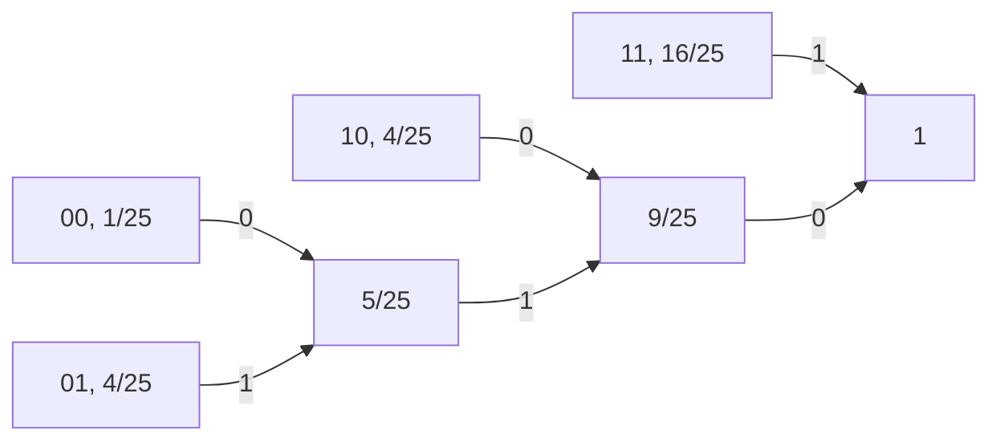

# Informazioni sul corso

Esame: scritto (1 esercizio, 30 min) + orale (1h)

3 esiti dallo scritto:

- non ammesso all'orale
- ammesso all'orale con voto limitato a 26
- ammesso all'orale senza limitazioni

Prerequisiti:

- analisi
- calcolo probabilità

Teoria dell'informazione:

- più astratta, occupa la maggior parte del corso
- testo fornito nel materiale (prof. Bellini)

Teoria della trasmissione:

- parte minore, fisica
- testo prof. Prati (molto esteso)
- slide aggiuntive

---

# Introduzione alla teoria dell'informazione

La teoria dell'informazione nasce con la pubblicazione di Mathematical Theory of Communication (Claude Shannon, 1940). L'obiettivo del testo è formalizzare le risposte alle domande fondamentali della teoria dell'informazione:

- Cos'è l'informazione? Come misurarla?
- Qual è il modo più economico per rappresentare l'informazione (da trasmettere o da memorizzare)? $\to$ *codifica di sorgente*
	- equivalenza: memorizzazione = trasmissione nel tempo
- Quanta informazione è trasmissibile in modo affidabile su un canale rumoroso? In che modo? $\to$ *codifica di canale*

## Codifica di sorgente

Per poter trattare e misurare le sorgenti di informazione è necessario astrarle ed ottenere un modello che ne rappresenti le caratteristiche essenziali.

Un esempio è il testo: sequenza di caratteri appartenenti ad un alfabeto. Un altro esempio è un segnale audio, ovvero un'onda di pressione nell'aria, variabile nel tempo. Il terzo tipo sono le immagini, luminanza osservabile in tre diverse bande (colori primari) variabile nel tempo e nello spazio. L'esempio più complesso sono i video, sequenze di immagini.

Tutte sono contraddistinte da una grandezza osservabile (carattere, livello di pressione, luminanza) che varia in funzione di una o più variabili indipendenti (tempo, spazio), non nota a priori. L'informazione è data proprio dal non essere nota a priori, altrimenti non avrebbe nessun contenuto informativo.

Volendo arrivare ad una definizione formale:

> *Sorgente di informazione* = grandezza osservabile che varia in funzione di una variabile indipendente (tempo) in modo non noto a priori.

Sono possibili classificazioni ulteriori:

- discretezza o continuità nel tempo
	- audio: continuo (secondo il tempo), testo: discreto (un carattere per volta)
- discretezza o continuità nell'ampiezza (la grandezza osservabile)
	- audio: continuo (valore reale della pressione), testo: discreto (caratteri distinti)

Nell'era digitale anche i segnali continui vengono discretizzati per campionamento, sia nel tempo (teorema del campionamento) che nelle ampiezze (ad esempio colori a 8 bit).

Possiamo di conseguenza vedere tutti i segnali come una *sequenza di messaggi*.

> Una sorgente discreta nel tempo e nelle ampiezze si può modellizzare come una sequenza di messaggi $X_1, X_2, ..., X_k, ...$ presi da un alfabeto $X = \{x_1, x_2, ..., x_M\}$  in modo casuale (non noto a priori.

I pedici dei messaggi rappresentano il campione di tempo. I pedici nei simboli dell'alfabeto rappresentano l'ordinamento all'interno dell'alfabeto. L'alfabeto ha dimensione $M$, ovvero ogni messaggio può avere $M$ possibili valori. I messaggi sono variabili casuali e l'alfabeto rappresenta l'insieme delle possibili realizzazioni.

*Osservazione*: per descrivere una sorgente dobbiamo assegnare la sua distribuzione di probabilità ($\mathrm{pmf}$, *probability mass function*):

$$P_{X_k}(x_i) = \mathrm{Prob}[X_k = x_i]$$

- $0 \le P_{X_k}(x_i) \le 1$
- $\sum_{i=1}^M P_{X_k}(x_i) = \sum_x P_{X_k}(x) = 1$

Una sorgente può essere *con memoria* o *senza memoria*.
In una sorgente con memoria il messaggio $k+1$-esimo è dipendente dal messaggio $k$-esimo.

> Una sorgente è con memoria se il valore assunto da un messaggio condiziona la $\mathrm{pmf}$ dei successivi. *(es. testo)*
>
> Una sorgente è senza memoria se i messaggi sono indipendenti tra di loro. *(es. roulette)*

Una sorgente senza memoria è univocamente caratterizzata dall'alfabeto $\mathcal X$ e dalla $\mathrm{pmf}$ $P_X(x)$.

Per descrivere una sorgente con memoria bisogna assegnare la distribuzione congiunta di probabilità o quella condizionata.

Probabilità congiunta:
$$P_{X_1 X_2}(x', x'') = \mathrm{Prob}[X_1 = x' \land X_2 = x'']$$
Probabilità condizionata:

$$ P_{X_1 | X_2} (x' | x'') = \frac{P_{X_1 X_2} (x',x'')}{P_{X_2}(x'')} $$

Osservazioni:

- da una distribuzione congiunta posso ricavare una marginale (distribuzione di probabilità di una singola variabile):
  $$ \sum_{x'} P_{X_1 X_2}(x', x'') = P_{X_1}(x') $$
- la sommatoria di tutti i possibili valori di una condizionata deve essere a 1:
  $$ \sum_{x'} P_{X_1 | X_2} (x' | x'') = 1 $$
- $X_1$ e $X_2$ sono indipendenti se e solo se la distribuzione di probabilità congiunta è il prodotto delle singole probabilità:
  $$ X_1, X_2 \text{ indipendenti} \Leftrightarrow P_{X_1, X_2}(x',x'') = P_{X_1}(x')P_{X_2}(x'')$$
- $X_1$ e $X_2$ sono indipendenti se e solo se la distribuzione di probabilità condizionata è uguale alla distribuzione della prima variabile:
  $$  X_1, X_2 \text{ indipendenti} \Leftrightarrow P_{X_1 | X_2}(x',x'') = P_{X_1}(x') $$

Si assumono sorgenti *stazionarie*: le loro statistiche non cambiano nel tempo, ovvero la distribuzione di probabilità dei valori dell'alfabeto si considera costante per ogni messaggio. Il concetto è diverso rispetto alla correlazione tra i messaggi.

$$ P_{X_k}(x) = P_{X}(x) \quad \forall k$$

## Sorgenti senza memoria

Sia $X$ una sorgente senza memoria con alfabeto $\mathcal X = \{x_1, ..., x_M\}$ e $\mathrm{pmf}$ $P_X(x)$.

L'informazione portata da un messaggio dipende dalla sua improbabilità.

Assumendo che:

1. l'informazione di un messaggio $X_i$ è tanto più grande quanto più $P_X(x_i)$ è piccola
2. l'informazione portata da due messaggi indipendenti è la somma delle informazioni che portano singolarmente

si definisce l'informazione portata da un messaggio $X_i$ come logaritmo dell'inverso della sua probabilità:

$$ \mathcal{I}(x_i) = \log \frac 1 {P_X(x_i)} $$

L'informazione media per messaggio emessa da $X$ è dunque

$$H(X) \triangleq \mathbb E[\mathcal I(x_i)] = \sum_{i=1}^M P_X(x_i) \cdot \log \frac 1 {P_X(x_i)}$$
e si definisce *entropia* della sorgente.

Osservazioni:

- Se il logaritmo è naturale, $H$ e $\mathcal I$ si misurano in $[\mathrm{nat}]$; se il logaritmo è in base 2 $H$ e $\mathcal I$ si misurano in $[\mathrm{bit}]$. Da qui in avanti per $\log$ si intende sempre $\log_2$.
- Dato che $P_X(x_i) \ge 0$, allora $\mathcal I \ge 1$ e dunque il suo logaritmo è sempre positivo.
- Se $P_X(x) = 0$, la sua informazione sarebbe teoricamente infinita, ma se la probabilità è nulla quel messaggio non esiste. In ogni caso nel calcolo dell'entropia la forma d'indecisione $\lim_{x \to 0} x \log x = 0$.

### Esempio 1: lancio di una moneta

$\mathcal X = \{T, C\}$, $P_X(x) = \{\frac 1 2, \frac 1 2 \}$

$$H(x) = \frac 1 2 \log_2 2 + \frac 1 2 \log_2 2 = \frac 1 2 + \frac 1 2 = 1 ~[\mathrm{bit}]$$
Per memorizzare il risultato di una serie di esperimenti di lancio di moneta, servirebbero $n$ bit, uno per ogni esperimento.

### Esempio 2: seme di una carta da gioco

Le carte sono estratte casualmente con reimmissione.

$\mathcal X = \{C, S, B, D\}$, $P_X(x) = \{\frac 1 4, \frac 1 4, \frac 1 4, \frac 1 4\}$

$$H(x) = \frac 1 4 \log 4 + \frac 1 4 \log 4 + \frac 1 4 \log 4 + \frac 1 4 \log 4  = \frac 1 2 + \frac 1 2 + \frac 1 2 + \frac 1 2 = 2$$

Per memorizzare la sequenza dei semi usciti servono 2 bit per ciascuna estrazione.

### Esempio 3: roulette truccata

$\mathcal X = \{R, N\}$, $P_X(x) = \{p, 1-p\}$

$$H(x) = p \log \frac 1 p + (1-p) \log \frac 1 {1-p}$$

$H(x)$ è parametrizzata in $P$. Si tratta di una forma ricorrente, entropia di una variabile binaria parametrizzata:

$$ H_2(P) \triangleq p \log \frac 1 p + (1-p) \log \frac 1 {1-p}$$

- se $p = 0$ esce sempre nero, gli esperimenti non portano alcuna informazione
- se $p = 1$ esce sempre rosso, gli esperimenti non portano alcuna informazione
- se $p = \frac 1 2$ i due eventi sono equiprobabili, $H(p) = 1$ (come nel caso della moneta)

Eseguendo uno studio di funzione:

$$
\frac {\mathrm d H_2(p)}{\mathrm d p} =
\frac {\mathrm d}{\mathrm dp}
\left(
- \frac 1 {\ln 2}
\left(p \ln p + (1-p) \ln (1-p) \right)
\right)
$$

$$
= - \frac 1 {\ln 2} (\ln p + \cancel 1 - \ln (1-p) - \cancel{(1-p)} \frac 1 {\cancel{1-p}}) = \log_2 \frac {1-p} p
$$

(inserire grafico)

> *Teorema*: sia $\mathcal X$ = $\{x_1, x_2, ..., x_M\}$ un alfabeto con $M$ possibili valori e $X$ una sorgente senza memoria con $\mathrm{pmf}$ $P_X(x)$, allora l'entropia è minore o uguale al logaritmo in base 2 di $M$:
> $$ H(x) \le \log_2 M$$
> con uguaglianza se e solo se la distribuzione è uniforme:
> $$ P_X(x) = \frac 1 M \quad \forall x $$

*Dimostrazione*:

$$
X(x) - \log_2 M
= \sum_{i=1}^M P_X(x_i) \log \frac 1 {P_X(x_i)}
- \sum_{i=1}^M P_X(x_i) \log_2 M =
$$

$$
= \sum_{i=1}^M P_X(x_i) \log_2 \frac 1 {M P_X(x_i)} =
$$

(disuguaglianza fondamentale della teoria dell'informazione: $\ln x \le x-1$ $\forall x$, $\ln x = x$ per $x=1$, quindi

$$\frac{\log_2 x}{\log_2 e} \leq (x-1) \Rightarrow \log_2(x) \le (x-1) log_2 e  $$
). Tornando alla dimostrazione:
$$
= \sum_{i=1}^M P_X(x_i) \log_2 \frac 1 {M P_X(x_i)} \le
\log_2 e \sum_{i=1}^M P_X(x_i) \left( \frac 1 {MP_X(x_i)} - 1 \right) =
$$

$$
= \log_2 e
\left[ \sum_{i=1}^M \frac 1 M - \sum_{i=1}^M P_X(x_i) \right]
= 0.
$$

L'uguaglianza vale solo con $P_X(x_i) = \frac 1 M$ perché ogni $P_X(x_i)$ diverso da $\frac 1 M$ dà una perdita nel passaggio $\log \frac 1 {P_X} \to \frac 1 {P_X} - 1$.

## Codifica di sorgenti senza memoria

Codificare consiste nell'associare ad un messaggio $x_i$ una $n$-upla di bit $c_i$ o $c(x_i)$ lunga $n_i$ bit.

Un codice $\mathcal C$ è l'elenco di tutte le sequenze $c_1, c_2, ..., c_n$ di lunghezze $n_1, ..., n_m$.

Indichiamo con $\underline x = [x_{i_2} ~ x_{i_2} ~ ... ~ x_{iL}]$  una sequenza di messaggi con codici $c(\underline x) = [c_{i_2} ~ c_{i_2} ~ ... ~ c_{iL}]$.

Un codice $\mathcal C$ è detto *univocamente decodificabile* se

$$ c(\underline x') \neq c(\underline x'') \quad \forall \underline x' \neq \underline x''.$$

e *istantaneamente decodificabile* se $c_i$ non coincide con l'inizio di nessun altro $c_j$ con $n_j > n_i$.
L'istantanea decodificabilità implica l'univoca decodificabilità, ovvero ne è sottoinsieme.

Si può osservare che il costo di $\mathcal C$ è la sua lunghezza media:

$$\bar n_e = \sum_{i=1}^M n_i P_X(x_i).$$
Un codice è dunque tanto migliore quanto riesce a minimizzare la lunghezza media.

> *Definizione*: $\mathcal C$ rispetta la disuguaglianza di Kraft se
> $$ \sum_{i=1}^M 2^{-n_i} \leq 1$$

Da questa definizione è possibile ricavare due teoremi:

- se le lunghezze del codice rispettano la disuguaglianza di Kraft, è possibile costruire un codice istantaneamente decodificabile
- se un codice è istantaneamente decodificabile, le sue lunghezze rispettano necessariamente la disuguaglianza di Kraft

> *Teorema 1*: se $n_i$, $i = 1, ..., M$ rispetta la disuguaglianza di Kraft, allora $\exists ~ \mathcal C$ istantaneamente decodificabile di lunghezze $n_i$

*Dimostrazione (per costruzione)*

- Siano $n_1 \le n_2 \le n_3 ... \le n_M$. Scegliere a caso $c_1$ lungo $n_1$.
- Scegliere $c_2$ a caso escludendo le $2^{n_2 - n_1}$ sequenze che iniziano come $c_1$.
- Scegliere $c_3$ a caso escludendo le $2^{n_3-n_2}$ che iniziano come $c_2$ e le $2^{n_3-n_1}$ che iniziano come $c_1$.
- Procedere in ugual modo fino a $c_M$.

È possibile completare la costruzione se all'ultimo passo il numero di sequenze vietate è minore o uguale del numero di sequenze possibili per $c_M$:

$$ 2^{n_M - n_1} + 2^{n_M - n_2} + ... + 2^{n_M - n_{M-1}} \leq 2^{n_M} - 1,$$
cioè se

$$2^{-n_1} + 2^{-n_2} + ... + 2^{-n_{M-1}} \le 1 - 2^{n_M} \Rightarrow \text{Kraft}.$$

> *Teorema 2*: sia $\mathcal C$ univocamente decodificabile. Allora $\mathcal C$ rispetta la disuguaglianza di Kraft.

*Dimostrazione:* considero una $n$-upla di messaggi $x_{i1}$ $x_{i2}$ ... $x_{iN}$ che si può presentare in $M^N$ valori distinti e calcolo

$$
\left( \sum_{i=1}^N 2^{-n_i} \right)^N =
\sum_{i_1 = 1}^M
\sum_{i_2 = 1}^M
...
\sum_{i_N = 1}^M
2^{\underbrace{-(n_{i1} + n_{i2} + ... + n_{iN})}_{\text{lunghezza di } c(\underline x) = n}}
= \sum_{n=1}^{M \cdot N_{\max}} A_n 2^{-n}
$$
dove $A_n$ è il numero di $\underline x$ distinte tali che $C(\underline x) = n$.

$$ = \sum_{n=1}^{M \cdot N_{\max}} A_n 2^{-n}  \le N \cdot n_{\max}$$

Estraiamo la radice $n$-esima, che essendo monotona crescente non cambia l'ordinamento:

$$
\sum_{n=1}^{M \cdot N_{\max}} A_n 2^{-n}  \le N \cdot n_{\max}
\Rightarrow
\sum_{i=1}^N 2^{-n_i} \leq (N \cdot n_{\max})^\frac 1 n
\to_{N \to \infty} 1
$$

perché riconducibile al limite noto

$$ \lim_{N \to \infty} e^{\frac 1 N \log N}. $$

> *Teorema sulla codifica di sorgente*: sia $X$ una sorgente senza memoria di entropia $H(x)$ e $\mathcal C$ un codice univocamente decodificabile per $X$. Segue che
> $$ \bar n_e \ge H(x) ~[\mathrm{bit}]. $$

*Dimostrazione:*

$$
H(x) - \bar n_e =
\sum_{i=1}^N P_X(x_i) \log \frac 1 {P_X(x_i)} - \sum_{i=1}^M P_X(x_i) n_i =
$$

$$
= \sum_{i=1}^M P_X(x_i) \log \frac {2^{-n_i}}{P_X(x_i)}
\le
\log e \sum_{i=1}^M P_X(x_i)
\left( \frac{2^{-n_i}}{P_X(x_i)} - 1 \right) =
$$

$$
= \log e
\left[
\underbrace{\sum_{i=1}^M 2^{-n_i}}_{\le 1}
-
\underbrace{\sum_{i=1}^M P_X(x_i)}_{= 1}
\right]
\le 0.
$$

*Osservazione*: se $P_X(x) = 2^{-n_i}$ $\forall i$ allora $\bar n = H(x)$.

*Osservazione*: si potrebbero codificare coppie di messaggi consecutivi come messaggi presi da un alfabeto con $M^2$ simboli e $\mathrm{pmf}$ $P_{X_1}(x_1) \cdot P_{X_2}(x_2)$. Per il teorema di Shannon la lunghezza media del codice $\mathcal C$ univocamente decodificabile sarebbe

$$\bar l \ge H(X_1) + H(X_2) = 2 H(X)$$

e la lunghezza per messaggio sarebbe

$$\bar n = \frac{\bar l} 2 \ge \frac{\cancel 2 H(X)}{\cancel 2}$$

Ma la $\mathrm{pmf}$ $P_{X_1}(x_1) \cdot P_{X_2}(x_2)$ magari può dare un vantaggio.

### Codifica di Gilbert-Moore

Assegnare ad ogni codice la lunghezza

$$
n_i = \left \lceil \log \frac 1 {P_X(x_i)} \right \rceil
$$

da cui segue la scelta delle sequenze. Vale

$$
\log \frac 1 {P_X(x_i)} \leq
n_i <
\log \frac 1 {P_X(x_i)} + 1
$$

da cui

$$
\sum_{i=1}^M P_X(x_i) \log \frac 1 {P_X(x_i)} \leq
\sum_{i=1}^M P_X(x_i) n_i <
\sum_{i=1}^M P_X(x_i) \left[ \log \frac 1 {P_X(x_i)} + 1 \right]
$$

quindi

$$
H(x) \le \bar n < H(X) + 1.
$$

Segue che la codifica di Gilbert-Moore sprechi al massimo 1 bit. Per ridurre l'effetto relativo di tale spreco, applichiamo la codifica a $L$-uple di messaggi:

$$
L H(X) \le \bar l < LH(X) + 1
$$
ovvero

$$
H(X) \le \bar n < H(X) + \frac 1 L,
$$

che significa che è possibile ridurre lo spreco aumentando la lunghezza dei raggruppamenti di messaggi.

### Esercizio

Sia $X$ una sorgente binaria $\mathcal X = \{0, 1\}$, $P_X(2) = \{ \frac 1 5, \frac 4 5\}$

1. Calcolare $H(X)$
2. Codificare con Gilbert-Moore e Huffmann dato $L=2$
3. Codificare con Gilbert-Moore e Huffmann dato $L=3$

$$
H(X) = \frac 1 5 \log 5 + \frac 4 5 \log \frac 5 4 = \log 5 - \frac 8 5 \approx 0.722 ~ \mathrm{bit}.
$$

Il numero è plausibile (compreso tra 0 e 1, a occhio sembra corrispondere alla curva a campana dell'entropia).

Codifica di Gilbert-Moore con $L=2$:

| $x_k x_{k+1}$ | $P(x_k x_{k+1})$  | $l_i$ | $c_i$ |
| ------------- | ----------------- | ----- | ----- |
| 00            | $\frac 1 {25}$    | 5     | 11111 |
| 01            | $\frac 4 {25}$    | 3     | 101   |
| 10            | $\frac 4 {25}$    | 3     | 100   |
| 11            | $\frac {16} {25}$ | 1     | 0     |
La somma delle probabilità è (correttamente) 1.

Le $l_i$ rappresentano l'intero superiore di $\log \frac 1 P$.

Il modo più immediato per ottenere i $c_i$ è scriverli come immediatamente decodificabili.

Otteniamo un $\bar l$ pari a:

$$
\bar l = \sum_{i=1}^4 l_i \cdot P_{\underline x}(\underline x_i) =
\frac{16}{25} + 2 \cdot 3 \cdot \frac{4}{25} + 5 \cdot \frac{1}{25} =
\frac{45}{25} = \frac 9 5
$$

$$ \bar n = \frac{\bar l}{L} = \frac{\bar l} 2 = 0.9 ~\mathrm{bit} $$

Consideriamo la codifica di Huffmann. Essa assegna iterativamente il bit iniziale 0 e 1 ai due messaggi meno probabili dell'iterazione.

| $x_k x_{k+1}$ | $P(x_k x_{k+1})$  | $c_i$ |
| ------------- | ----------------- | ----- |
| 00            | $\frac 1 {25}$    | 010   |
| 01            | $\frac 4 {25}$    | 011   |
| 10            | $\frac 4 {25}$    | 00    |
| 11            | $\frac {16} {25}$ | 1     |

$$
\bar l = \frac{16}{25} + 2 \cdot \frac{4}{25} + 3 \cdot \frac{5}{25} = \frac{39}{25}
\to \bar n = \frac{39}{50} = 0.78 ~\mathrm{bit} > 0.722 = H(x)
$$

### Esame 17/6/2010

Sia $X$ una sorgente discreta, che emette 5 messaggi, A, B, C, D, E con probabilità (0.1, 0.1, 0.5, 0.15, 0.15). Scegliere 5 codici da associare ai 5 messaggi tra i 10 codici binari proposti qui sotto in modo da ottenere un codice immediatamente decodificabile.

$$
\begin{matrix}
c_1 = 0110 & c_2 = 0 & c_3 = 100 & c_4 = 111 & c_5 = 110110 \\
c_6 = 1001 & c_7 = 1101 & c_8 = 1100 & c_9 = 010 & c_{10} = 00
\end{matrix}
$$

Il codice scelto rispetta la disuguaglianza di Kraft?
Confrontare la lunghezza media ottenuta con l'entropia $H(X)$.
Potendo scegliere liberamente i codici, ma sempre codificando messaggi singoli, si poteva ottenere una lunghezza media inferiore?

| $x_k$ | $P(x_k)$ | $l_i$ | $c_i$        |
| ----- | -------- | ----- | ------------ |
| A     | 0.1      | 4     | $c_8 = 1100$ |
| B     | 0.1      | 4     | $c_7 = 1101$ |
| C     | 0.5      | 1     | $c_2 = 0$    |
| D     | 0.15     | 3     | $c_3 = 100$  |
| E     | 0.15     | 3     | $c_4 = 111$  |

$$
\to \sum_{i=1}^5 2^{-n_i} =
2^{-1} + 2^{-3} + 2^{-3} + 2^{-4} + 2^{-4}
= \frac 7 8
$$

$$ \bar n = 0.5 + 0.3 \cdot 3 + 0.2 \cdot 4 = 2.2~\mathrm{bit} > H(x) = 1.93~\mathrm{bit}$$

### Tema del 18/2/2016

Due giocatori si sfidano a chi pesca la carta più bassa da un mazzo di 40 carte da gioco (con reimmissione). In caso di pareggio la prova si ripete. Si consideri come risultato $X$ il valore della carta vincente.

- Quante sono le coppie estratte possibili? Sono equiprobabili?
- Quanti valori può assumere $X$? Con che probabilità?
- Quanti bit occorrono, approssimativamente, per memorizzare i risultati di $N$ prove, con $N$ grande, senza prevedere una codifica di sorgente?
- Quanti con una codifica di sorgente ideale?
- Quanti con codifica di Shannon e quanti con codifica di Huffmann per risultati $X$ codificati singolarmente?

|        | **1**          | **2**          | **3**          | **4**          | **5**          | **6**          | **7**          | **8**          | **9**          | **10**         |
| ------ | -------------- | -------------- | -------------- | -------------- | -------------- | -------------- | -------------- | -------------- | -------------- | -------------- |
| **1**  | $\nexists$     | $\frac 1 {90}$ | $\frac 1 {90}$ | $\frac 1 {90}$ | $\frac 1 {90}$ | $\frac 1 {90}$ | $\frac 1 {90}$ | $\frac 1 {90}$ | $\frac 1 {90}$ | $\frac 1 {90}$ |
| **2**  | $\frac 1 {90}$ | $\nexists$     | $\frac 1 {90}$ | $\frac 1 {90}$ | $\frac 1 {90}$ | $\frac 1 {90}$ | $\frac 1 {90}$ | $\frac 1 {90}$ | $\frac 1 {90}$ | $\frac 1 {90}$ |
| **3**  | $\frac 1 {90}$ | $\frac 1 {90}$ | $\nexists$     | $\frac 1 {90}$ | $\frac 1 {90}$ | $\frac 1 {90}$ | $\frac 1 {90}$ | $\frac 1 {90}$ | $\frac 1 {90}$ | $\frac 1 {90}$ |
| **4**  | $\frac 1 {90}$ | $\frac 1 {90}$ | $\frac 1 {90}$ | $\nexists$     | $\frac 1 {90}$ | $\frac 1 {90}$ | $\frac 1 {90}$ | $\frac 1 {90}$ | $\frac 1 {90}$ | $\frac 1 {90}$ |
| **5**  | $\frac 1 {90}$ | $\frac 1 {90}$ | $\frac 1 {90}$ | $\frac 1 {90}$ | $\nexists$     | $\frac 1 {90}$ | $\frac 1 {90}$ | $\frac 1 {90}$ | $\frac 1 {90}$ | $\frac 1 {90}$ |
| **6**  | $\frac 1 {90}$ | $\frac 1 {90}$ | $\frac 1 {90}$ | $\frac 1 {90}$ | $\frac 1 {90}$ | $\nexists$     | $\frac 1 {90}$ | $\frac 1 {90}$ | $\frac 1 {90}$ | $\frac 1 {90}$ |
| **7**  | $\frac 1 {90}$ | $\frac 1 {90}$ | $\frac 1 {90}$ | $\frac 1 {90}$ | $\frac 1 {90}$ | $\frac 1 {90}$ | $\nexists$     | $\frac 1 {90}$ | $\frac 1 {90}$ | $\frac 1 {90}$ |
| **8**  | $\frac 1 {90}$ | $\frac 1 {90}$ | $\frac 1 {90}$ | $\frac 1 {90}$ | $\frac 1 {90}$ | $\frac 1 {90}$ | $\frac 1 {90}$ | $\nexists$     | $\frac 1 {90}$ | $\frac 1 {90}$ |
| **9**  | $\frac 1 {90}$ | $\frac 1 {90}$ | $\frac 1 {90}$ | $\frac 1 {90}$ | $\frac 1 {90}$ | $\frac 1 {90}$ | $\frac 1 {90}$ | $\frac 1 {90}$ | $\nexists$     | $\frac 1 {90}$ |
| **10** | $\frac 1 {90}$ | $\frac 1 {90}$ | $\frac 1 {90}$ | $\frac 1 {90}$ | $\frac 1 {90}$ | $\frac 1 {90}$ | $\frac 1 {90}$ | $\frac 1 {90}$ | $\frac 1 {90}$ | $\nexists$     |

- la probabilità che un asso sia la carta più bassa è $\frac{18}{90}$
- la probabilità che un 2 sia la carta più bassa è $\frac{16}{90}$
- la probabilità che un 3 sia la carta più bassa è $\frac{14}{90}$
- stesso vale per tutte le altre carte tranne il re, che non può uscire come carta più bassa

Altri temi d'esame fattibili:

- 29/10/2014
- 8/11/2018
- 4/7/2008
- 10/11/2022
