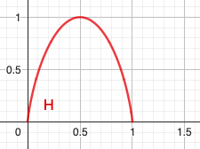
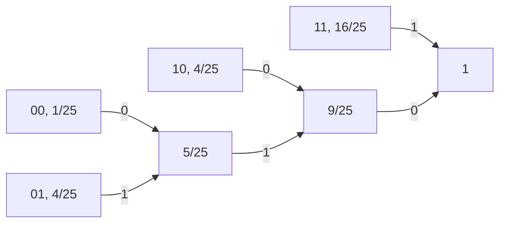

# Informazioni sul corso


Esame: scritto (1 esercizio, 30 min) + orale (1h)

3 esiti dallo scritto:

- non ammesso all'orale
- ammesso all'orale con voto limitato a 26
- ammesso all'orale senza limitazioni

Prerequisiti:

- analisi
- calcolo probabilità

Teoria dell'informazione:

- più astratta, occupa la maggior parte del corso
- testo fornito nel materiale (prof. Bellini)

Teoria della trasmissione:

- parte minore, fisica
- testo prof. Prati (molto esteso)
- slide aggiuntive

---

# Introduzione alla teoria dell'informazione

La teoria dell'informazione nasce con la pubblicazione di Mathematical Theory of Communication (Claude Shannon, 1940). L'obiettivo del testo è formalizzare le risposte alle domande fondamentali della teoria dell'informazione:

- Cos'è l'informazione? Come misurarla?
- Qual è il modo più economico per rappresentare l'informazione (da trasmettere o da memorizzare)? $\to$ *codifica di sorgente*
	- equivalenza: memorizzazione = trasmissione nel tempo
- Quanta informazione è trasmissibile in modo affidabile su un canale rumoroso? In che modo? $\to$ *codifica di canale*

## Codifica di sorgente

Per poter trattare e misurare le sorgenti di informazione è necessario astrarle ed ottenere un modello che ne rappresenti le caratteristiche essenziali.

Un esempio è il testo: sequenza di caratteri appartenenti ad un alfabeto. Un altro esempio è un segnale audio, ovvero un'onda di pressione nell'aria, variabile nel tempo. Il terzo tipo sono le immagini, luminanza osservabile in tre diverse bande (colori primari) variabile nel tempo e nello spazio. L'esempio più complesso sono i video, sequenze di immagini.

Tutte sono contraddistinte da una grandezza osservabile (carattere, livello di pressione, luminanza) che varia in funzione di una o più variabili indipendenti (tempo, spazio), non nota a priori. L'informazione è data proprio dal non essere nota a priori, altrimenti non avrebbe nessun contenuto informativo.

Volendo arrivare ad una definizione formale:

> *Sorgente di informazione* = grandezza osservabile che varia in funzione di una variabile indipendente (tempo) in modo non noto a priori.

Sono possibili classificazioni ulteriori:

- discretezza o continuità nel tempo
	- audio: continuo (secondo il tempo), testo: discreto (un carattere per volta)
- discretezza o continuità nell'ampiezza (la grandezza osservabile)
	- audio: continuo (valore reale della pressione), testo: discreto (caratteri distinti)

Nell'era digitale anche i segnali continui vengono discretizzati per campionamento, sia nel tempo (teorema del campionamento) che nelle ampiezze (ad esempio colori a 8 bit).

Possiamo di conseguenza vedere tutti i segnali come una *sequenza di messaggi*.

> Una sorgente discreta nel tempo e nelle ampiezze si può modellizzare come una sequenza di messaggi $X_1, X_2, ..., X_k, ...$ presi da un alfabeto $X = \{x_1, x_2, ..., x_M\}$  in modo casuale (non noto a priori.

I pedici dei messaggi rappresentano il campione di tempo. I pedici nei simboli dell'alfabeto rappresentano l'ordinamento all'interno dell'alfabeto. L'alfabeto ha dimensione $M$, ovvero ogni messaggio può avere $M$ possibili valori. I messaggi sono variabili casuali e l'alfabeto rappresenta l'insieme delle possibili realizzazioni.

*Osservazione*: per descrivere una sorgente dobbiamo assegnare la sua distribuzione di probabilità ($\mathrm{pmf}$, *probability mass function*):

$$P_{X_k}(x_i) = \mathrm{Prob}[X_k = x_i]$$

- $0 \le P_{X_k}(x_i) \le 1$
- $\sum_{i=1}^M P_{X_k}(x_i) = \sum_x P_{X_k}(x) = 1$

Una sorgente può essere *con memoria* o *senza memoria*.
In una sorgente con memoria il messaggio $k+1$-esimo è dipendente dal messaggio $k$-esimo.

> Una sorgente è con memoria se il valore assunto da un messaggio condiziona la $\mathrm{pmf}$ dei successivi. *(es. testo)*
>
> Una sorgente è senza memoria se i messaggi sono indipendenti tra di loro. *(es. roulette)*

Una sorgente senza memoria è univocamente caratterizzata dall'alfabeto $\mathcal X$ e dalla $\mathrm{pmf}$ $P_X(x)$.

Per descrivere una sorgente con memoria bisogna assegnare la distribuzione congiunta di probabilità o quella condizionata.

Probabilità congiunta:
$$P_{X_1 X_2}(x', x'') = \mathrm{Prob}[X_1 = x' \land X_2 = x'']$$
Probabilità condizionata:

$$ P_{X_1 | X_2} (x' | x'') = \frac{P_{X_1 X_2} (x',x'')}{P_{X_2}(x'')} $$

Osservazioni:

- da una distribuzione congiunta posso ricavare una marginale (distribuzione di probabilità di una singola variabile):
  $$ \sum_{x'} P_{X_1 X_2}(x', x'') = P_{X_1}(x') $$
- la sommatoria di tutti i possibili valori di una condizionata deve essere a 1:
  $$ \sum_{x'} P_{X_1 | X_2} (x' | x'') = 1 $$
- $X_1$ e $X_2$ sono indipendenti se e solo se la distribuzione di probabilità congiunta è il prodotto delle singole probabilità:
  $$ X_1, X_2 \text{ indipendenti} \Leftrightarrow P_{X_1, X_2}(x',x'') = P_{X_1}(x')P_{X_2}(x'')$$
- $X_1$ e $X_2$ sono indipendenti se e solo se la distribuzione di probabilità condizionata è uguale alla distribuzione della prima variabile:
  $$  X_1, X_2 \text{ indipendenti} \Leftrightarrow P_{X_1 | X_2}(x',x'') = P_{X_1}(x') $$

Si assumono sorgenti *stazionarie*: le loro statistiche non cambiano nel tempo, ovvero la distribuzione di probabilità dei valori dell'alfabeto si considera costante per ogni messaggio. Il concetto è diverso rispetto alla correlazione tra i messaggi.

$$ P_{X_k}(x) = P_{X}(x) \quad \forall k$$

## Sorgenti senza memoria

Sia $X$ una sorgente senza memoria con alfabeto $\mathcal X = \{x_1, ..., x_M\}$ e $\mathrm{pmf}$ $P_X(x)$.

L'informazione portata da un messaggio dipende dalla sua improbabilità.

Assumendo che:

1. l'informazione di un messaggio $X_i$ è tanto più grande quanto più $P_X(x_i)$ è piccola
2. l'informazione portata da due messaggi indipendenti è la somma delle informazioni che portano singolarmente

si definisce l'informazione portata da un messaggio $X_i$ come logaritmo dell'inverso della sua probabilità:

$$ \mathcal{I}(x_i) = \log \frac 1 {P_X(x_i)} $$

L'informazione media per messaggio emessa da $X$ è dunque

$$H(X) \triangleq \mathbb E[\mathcal I(x_i)] = \sum_{i=1}^M P_X(x_i) \cdot \log \frac 1 {P_X(x_i)}$$
e si definisce *entropia* della sorgente.

Osservazioni:

- Se il logaritmo è naturale, $H$ e $\mathcal I$ si misurano in $[\mathrm{nat}]$; se il logaritmo è in base 2 $H$ e $\mathcal I$ si misurano in $[\mathrm{bit}]$. Da qui in avanti per $\log$ si intende sempre $\log_2$.
- Dato che $P_X(x_i) \ge 0$, allora $\mathcal I \ge 1$ e dunque il suo logaritmo è sempre positivo.
- Se $P_X(x) = 0$, la sua informazione sarebbe teoricamente infinita, ma se la probabilità è nulla quel messaggio non esiste. In ogni caso nel calcolo dell'entropia la forma d'indecisione $\lim_{x \to 0} x \log x = 0$.

### Esempio 1: lancio di una moneta

$\mathcal X = \{T, C\}$, $P_X(x) = \{\frac 1 2, \frac 1 2 \}$

$$H(x) = \frac 1 2 \log_2 2 + \frac 1 2 \log_2 2 = \frac 1 2 + \frac 1 2 = 1 ~[\mathrm{bit}]$$
Per memorizzare il risultato di una serie di esperimenti di lancio di moneta, servirebbero $n$ bit, uno per ogni esperimento.

### Esempio 2: seme di una carta da gioco

Le carte sono estratte casualmente con reimmissione.

$\mathcal X = \{C, S, B, D\}$, $P_X(x) = \{\frac 1 4, \frac 1 4, \frac 1 4, \frac 1 4\}$

$$H(x) = \frac 1 4 \log 4 + \frac 1 4 \log 4 + \frac 1 4 \log 4 + \frac 1 4 \log 4  = \frac 1 2 + \frac 1 2 + \frac 1 2 + \frac 1 2 = 2$$

Per memorizzare la sequenza dei semi usciti servono 2 bit per ciascuna estrazione.

### Esempio 3: roulette truccata

$\mathcal X = \{R, N\}$, $P_X(x) = \{p, 1-p\}$

$$H(x) = p \log \frac 1 p + (1-p) \log \frac 1 {1-p}$$

$H(x)$ è parametrizzata in $P$. Si tratta di una forma ricorrente, entropia di una variabile binaria parametrizzata:

$$ H_2(P) \triangleq p \log \frac 1 p + (1-p) \log \frac 1 {1-p}$$


- se $p = 0$ esce sempre nero, gli esperimenti non portano alcuna informazione
- se $p = 1$ esce sempre rosso, gli esperimenti non portano alcuna informazione
- se $p = \frac 1 2$ i due eventi sono equiprobabili, $H(p) = 1$ (come nel caso della moneta)


Eseguendo uno studio di funzione:

$$
\frac {\mathrm d H_2(p)}{\mathrm d p} =
\frac {\mathrm d}{\mathrm dp}
\left(
- \frac 1 {\ln 2}
\left(p \ln p + (1-p) \ln (1-p) \right)
\right)
$$

$$
= - \frac 1 {\ln 2} (\ln p + \cancel 1 - \ln (1-p) - \cancel{(1-p)} \frac 1 {\cancel{1-p}}) = \log_2 \frac {1-p} p
$$





> *Teorema*: sia $\mathcal X$ = $\{x_1, x_2, ..., x_M\}$ un alfabeto con $M$ possibili valori e $X$ una sorgente senza memoria con $\mathrm{pmf}$ $P_X(x)$, allora l'entropia è minore o uguale al logaritmo in base 2 di $M$:
> $$ H(x) \le \log_2 M$$
> con uguaglianza se e solo se la distribuzione è uniforme:
> $$ P_X(x) = \frac 1 M \quad \forall x $$

*Dimostrazione*:

$$
X(x) - \log_2 M
= \sum_{i=1}^M P_X(x_i) \log \frac 1 {P_X(x_i)}
- \sum_{i=1}^M P_X(x_i) \log_2 M =
$$

$$
= \sum_{i=1}^M P_X(x_i) \log_2 \frac 1 {M P_X(x_i)} =
$$

(disuguaglianza fondamentale della teoria dell'informazione: $\ln x \le x-1$ $\forall x$, $\ln x = x$ per $x=1$, quindi

$$\frac{\log_2 x}{\log_2 e} \leq (x-1) \Rightarrow \log_2(x) \le (x-1) log_2 e  $$
). Tornando alla dimostrazione:
$$
= \sum_{i=1}^M P_X(x_i) \log_2 \frac 1 {M P_X(x_i)} \le
\log_2 e \sum_{i=1}^M P_X(x_i) \left( \frac 1 {MP_X(x_i)} - 1 \right) =
$$

$$
= \log_2 e
\left[ \sum_{i=1}^M \frac 1 M - \sum_{i=1}^M P_X(x_i) \right]
= 0.
$$

L'uguaglianza vale solo con $P_X(x_i) = \frac 1 M$ perché ogni $P_X(x_i)$ diverso da $\frac 1 M$ dà una perdita nel passaggio $\log \frac 1 {P_X} \to \frac 1 {P_X} - 1$.

## Codifica di sorgenti senza memoria

Codificare consiste nell'associare ad un messaggio $x_i$ una $n$-upla di bit $c_i$ o $c(x_i)$ lunga $n_i$ bit.

Un codice $\mathcal C$ è l'elenco di tutte le sequenze $c_1, c_2, ..., c_n$ di lunghezze $n_1, ..., n_m$.

Indichiamo con $\underline x = [x_{i_2} ~ x_{i_2} ~ ... ~ x_{iL}]$  una sequenza di messaggi con codici $c(\underline x) = [c_{i_2} ~ c_{i_2} ~ ... ~ c_{iL}]$.

Un codice $\mathcal C$ è detto *univocamente decodificabile* se

$$ c(\underline x') \neq c(\underline x'') \quad \forall \underline x' \neq \underline x''.$$

e *istantaneamente decodificabile* se $c_i$ non coincide con l'inizio di nessun altro $c_j$ con $n_j > n_i$.
L'istantanea decodificabilità implica l'univoca decodificabilità, ovvero ne è sottoinsieme.

Si può osservare che il costo di $\mathcal C$ è la sua lunghezza media:

$$\bar n_e = \sum_{i=1}^M n_i P_X(x_i).$$
Un codice è dunque tanto migliore quanto riesce a minimizzare la lunghezza media.

> *Definizione*: $\mathcal C$ rispetta la disuguaglianza di Kraft se
> $$ \sum_{i=1}^M 2^{-n_i} \leq 1$$

Da questa definizione è possibile ricavare due teoremi:

- se le lunghezze del codice rispettano la disuguaglianza di Kraft, è possibile costruire un codice istantaneamente decodificabile
- se un codice è istantaneamente decodificabile, le sue lunghezze rispettano necessariamente la disuguaglianza di Kraft

> *Teorema 1*: se $n_i$, $i = 1, ..., M$ rispetta la disuguaglianza di Kraft, allora $\exists ~ \mathcal C$ istantaneamente decodificabile di lunghezze $n_i$

*Dimostrazione (per costruzione)*

- Siano $n_1 \le n_2 \le n_3 ... \le n_M$. Scegliere a caso $c_1$ lungo $n_1$.
- Scegliere $c_2$ a caso escludendo le $2^{n_2 - n_1}$ sequenze che iniziano come $c_1$.
- Scegliere $c_3$ a caso escludendo le $2^{n_3-n_2}$ che iniziano come $c_2$ e le $2^{n_3-n_1}$ che iniziano come $c_1$.
- Procedere in ugual modo fino a $c_M$.

È possibile completare la costruzione se all'ultimo passo il numero di sequenze vietate è minore o uguale del numero di sequenze possibili per $c_M$:

$$ 2^{n_M - n_1} + 2^{n_M - n_2} + ... + 2^{n_M - n_{M-1}} \leq 2^{n_M} - 1,$$
cioè se

$$2^{-n_1} + 2^{-n_2} + ... + 2^{-n_{M-1}} \le 1 - 2^{n_M} \Rightarrow \text{Kraft}.$$


> *Teorema 2*: sia $\mathcal C$ univocamente decodificabile. Allora $\mathcal C$ rispetta la disuguaglianza di Kraft.

*Dimostrazione:* considero una $n$-upla di messaggi $x_{i1}$ $x_{i2}$ ... $x_{iN}$ che si può presentare in $M^N$ valori distinti e calcolo

$$
\left( \sum_{i=1}^N 2^{-n_i} \right)^N =
\sum_{i_1 = 1}^M
\sum_{i_2 = 1}^M
...
\sum_{i_N = 1}^M
2^{\underbrace{-(n_{i1} + n_{i2} + ... + n_{iN})}_{\text{lunghezza di } c(\underline x) = n}}
= \sum_{n=1}^{M \cdot N_{\max}} A_n 2^{-n}
$$
dove $A_n$ è il numero di $\underline x$ distinte tali che $C(\underline x) = n$.

$$ = \sum_{n=1}^{M \cdot N_{\max}} A_n 2^{-n}  \le N \cdot n_{\max}$$

Estraiamo la radice $n$-esima, che essendo monotona crescente non cambia l'ordinamento:

$$
\sum_{n=1}^{M \cdot N_{\max}} A_n 2^{-n}  \le N \cdot n_{\max}
\Rightarrow
\sum_{i=1}^N 2^{-n_i} \leq (N \cdot n_{\max})^\frac 1 n
\to_{N \to \infty} 1
$$

perché riconducibile al limite noto

$$ \lim_{N \to \infty} e^{\frac 1 N \log N}. $$

> *Teorema sulla codifica di sorgente*: sia $X$ una sorgente senza memoria di entropia $H(x)$ e $\mathcal C$ un codice univocamente decodificabile per $X$. Segue che
> $$ \bar n_e \ge H(x) ~[\mathrm{bit}]. $$

*Dimostrazione:*

$$
H(x) - \bar n_e =
\sum_{i=1}^N P_X(x_i) \log \frac 1 {P_X(x_i)} - \sum_{i=1}^M P_X(x_i) n_i =
$$

$$
= \sum_{i=1}^M P_X(x_i) \log \frac {2^{-n_i}}{P_X(x_i)}
\le
\log e \sum_{i=1}^M P_X(x_i)
\left( \frac{2^{-n_i}}{P_X(x_i)} - 1 \right) =
$$

$$
= \log e
\left[
\underbrace{\sum_{i=1}^M 2^{-n_i}}_{\le 1}
-
\underbrace{\sum_{i=1}^M P_X(x_i)}_{= 1}
\right]
\le 0.
$$

*Osservazione*: se $P_X(x) = 2^{-n_i}$ $\forall i$ allora $\bar n = H(x)$.

*Osservazione*: si potrebbero codificare coppie di messaggi consecutivi come messaggi presi da un alfabeto con $M^2$ simboli e $\mathrm{pmf}$ $P_{X_1}(x_1) \cdot P_{X_2}(x_2)$. Per il teorema di Shannon la lunghezza media del codice $\mathcal C$ univocamente decodificabile sarebbe

$$\bar l \ge H(X_1) + H(X_2) = 2 H(X)$$

e la lunghezza per messaggio sarebbe

$$\bar n = \frac{\bar l} 2 \ge \frac{\cancel 2 H(X)}{\cancel 2}$$

Ma la $\mathrm{pmf}$ $P_{X_1}(x_1) \cdot P_{X_2}(x_2)$ magari può dare un vantaggio.

### Codifica di Gilbert-Moore

Assegnare ad ogni codice la lunghezza

$$
n_i = \left \lceil \log \frac 1 {P_X(x_i)} \right \rceil
$$

da cui segue la scelta delle sequenze. Vale

$$
\log \frac 1 {P_X(x_i)} \leq
n_i <
\log \frac 1 {P_X(x_i)} + 1
$$

da cui

$$
\sum_{i=1}^M P_X(x_i) \log \frac 1 {P_X(x_i)} \leq
\sum_{i=1}^M P_X(x_i) n_i <
\sum_{i=1}^M P_X(x_i) \left[ \log \frac 1 {P_X(x_i)} + 1 \right]
$$

quindi

$$
H(x) \le \bar n < H(X) + 1.
$$

Segue che la codifica di Gilbert-Moore sprechi al massimo 1 bit. Per ridurre l'effetto relativo di tale spreco, applichiamo la codifica a $L$-uple di messaggi:

$$
L H(X) \le \bar l < LH(X) + 1
$$
ovvero

$$
H(X) \le \bar n < H(X) + \frac 1 L,
$$

che significa che è possibile ridurre lo spreco aumentando la lunghezza dei raggruppamenti di messaggi.

### Esercizio

Sia $X$ una sorgente binaria $\mathcal X = \{0, 1\}$, $P_X(2) = \{ \frac 1 5, \frac 4 5\}$

1. Calcolare $H(X)$
2. Codificare con Gilbert-Moore e Huffmann dato $L=2$
3. Codificare con Gilbert-Moore e Huffmann dato $L=3$

$$
H(X) = \frac 1 5 \log 5 + \frac 4 5 \log \frac 5 4 = \log 5 - \frac 8 5 \approx 0.722 ~ \mathrm{bit}.
$$

Il numero è plausibile (compreso tra 0 e 1, a occhio sembra corrispondere alla curva a campana dell'entropia).

Codifica di Gilbert-Moore con $L=2$:

| $x_k x_{k+1}$ | $P(x_k x_{k+1})$  | $l_i$ | $c_i$ |
| ------------- | ----------------- | ----- | ----- |
| 00            | $\frac 1 {25}$    | 5     | 11111 |
| 01            | $\frac 4 {25}$    | 3     | 101   |
| 10            | $\frac 4 {25}$    | 3     | 100   |
| 11            | $\frac {16} {25}$ | 1     | 0     |
La somma delle probabilità è (correttamente) 1.

Le $l_i$ rappresentano l'intero superiore di $\log \frac 1 P$.

Il modo più immediato per ottenere i $c_i$ è scriverli come immediatamente decodificabili.

Otteniamo un $\bar l$ pari a:

$$
\bar l = \sum_{i=1}^4 l_i \cdot P_{\underline x}(\underline x_i) =
\frac{16}{25} + 2 \cdot 3 \cdot \frac{4}{25} + 5 \cdot \frac{1}{25} =
\frac{45}{25} = \frac 9 5
$$

$$ \bar n = \frac{\bar l}{L} = \frac{\bar l} 2 = 0.9 ~\mathrm{bit} $$


Consideriamo la codifica di Huffmann. Essa assegna iterativamente il bit iniziale 0 e 1 ai due messaggi meno probabili dell'iterazione.


| $x_k x_{k+1}$ | $P(x_k x_{k+1})$  | $c_i$ |
| ------------- | ----------------- | ----- |
| 00            | $\frac 1 {25}$    | 010   |
| 01            | $\frac 4 {25}$    | 011   |
| 10            | $\frac 4 {25}$    | 00    |
| 11            | $\frac {16} {25}$ | 1     |

$$
\bar l = \frac{16}{25} + 2 \cdot \frac{4}{25} + 3 \cdot \frac{5}{25} = \frac{39}{25}
\to \bar n = \frac{39}{50} = 0.78 ~\mathrm{bit} > 0.722 = H(x)
$$




### Esame 17/6/2010

Sia $X$ una sorgente discreta, che emette 5 messaggi, A, B, C, D, E con probabilità (0.1, 0.1, 0.5, 0.15, 0.15). Scegliere 5 codici da associare ai 5 messaggi tra i 10 codici binari proposti qui sotto in modo da ottenere un codice immediatamente decodificabile.

$$
\begin{matrix}
c_1 = 0110 & c_2 = 0 & c_3 = 100 & c_4 = 111 & c_5 = 110110 \\
c_6 = 1001 & c_7 = 1101 & c_8 = 1100 & c_9 = 010 & c_{10} = 00
\end{matrix}
$$

Il codice scelto rispetta la disuguaglianza di Kraft?
Confrontare la lunghezza media ottenuta con l'entropia $H(X)$.
Potendo scegliere liberamente i codici, ma sempre codificando messaggi singoli, si poteva ottenere una lunghezza media inferiore?

| $x_k$ | $P(x_k)$ | $l_i$ | $c_i$        |
| ----- | -------- | ----- | ------------ |
| A     | 0.1      | 4     | $c_8 = 1100$ |
| B     | 0.1      | 4     | $c_7 = 1101$ |
| C     | 0.5      | 1     | $c_2 = 0$    |
| D     | 0.15     | 3     | $c_3 = 100$  |
| E     | 0.15     | 3     | $c_4 = 111$  |

$$
\to \sum_{i=1}^5 2^{-n_i} =
2^{-1} + 2^{-3} + 2^{-3} + 2^{-4} + 2^{-4}
= \frac 7 8
$$

$$ \bar n = 0.5 + 0.3 \cdot 3 + 0.2 \cdot 4 = 2.2~\mathrm{bit} > H(x) = 1.93~\mathrm{bit}$$

### Tema del 18/2/2016

Due giocatori si sfidano a chi pesca la carta più bassa da un mazzo di 40 carte da gioco (con reimmissione). In caso di pareggio la prova si ripete. Si consideri come risultato $X$ il valore della carta vincente.


- Quante sono le coppie estratte possibili? Sono equiprobabili?
- Quanti valori può assumere $X$? Con che probabilità?
- Quanti bit occorrono, approssimativamente, per memorizzare i risultati di $N$ prove, con $N$ grande, senza prevedere una codifica di sorgente?
- Quanti con una codifica di sorgente ideale?
- Quanti con codifica di Shannon e quanti con codifica di Huffmann per risultati $X$ codificati singolarmente?


|        | **1**          | **2**          | **3**          | **4**          | **5**          | **6**          | **7**          | **8**          | **9**          | **10**         |
| ------ | -------------- | -------------- | -------------- | -------------- | -------------- | -------------- | -------------- | -------------- | -------------- | -------------- |
| **1**  | $\nexists$     | $\frac 1 {90}$ | $\frac 1 {90}$ | $\frac 1 {90}$ | $\frac 1 {90}$ | $\frac 1 {90}$ | $\frac 1 {90}$ | $\frac 1 {90}$ | $\frac 1 {90}$ | $\frac 1 {90}$ |
| **2**  | $\frac 1 {90}$ | $\nexists$     | $\frac 1 {90}$ | $\frac 1 {90}$ | $\frac 1 {90}$ | $\frac 1 {90}$ | $\frac 1 {90}$ | $\frac 1 {90}$ | $\frac 1 {90}$ | $\frac 1 {90}$ |
| **3**  | $\frac 1 {90}$ | $\frac 1 {90}$ | $\nexists$     | $\frac 1 {90}$ | $\frac 1 {90}$ | $\frac 1 {90}$ | $\frac 1 {90}$ | $\frac 1 {90}$ | $\frac 1 {90}$ | $\frac 1 {90}$ |
| **4**  | $\frac 1 {90}$ | $\frac 1 {90}$ | $\frac 1 {90}$ | $\nexists$     | $\frac 1 {90}$ | $\frac 1 {90}$ | $\frac 1 {90}$ | $\frac 1 {90}$ | $\frac 1 {90}$ | $\frac 1 {90}$ |
| **5**  | $\frac 1 {90}$ | $\frac 1 {90}$ | $\frac 1 {90}$ | $\frac 1 {90}$ | $\nexists$     | $\frac 1 {90}$ | $\frac 1 {90}$ | $\frac 1 {90}$ | $\frac 1 {90}$ | $\frac 1 {90}$ |
| **6**  | $\frac 1 {90}$ | $\frac 1 {90}$ | $\frac 1 {90}$ | $\frac 1 {90}$ | $\frac 1 {90}$ | $\nexists$     | $\frac 1 {90}$ | $\frac 1 {90}$ | $\frac 1 {90}$ | $\frac 1 {90}$ |
| **7**  | $\frac 1 {90}$ | $\frac 1 {90}$ | $\frac 1 {90}$ | $\frac 1 {90}$ | $\frac 1 {90}$ | $\frac 1 {90}$ | $\nexists$     | $\frac 1 {90}$ | $\frac 1 {90}$ | $\frac 1 {90}$ |
| **8**  | $\frac 1 {90}$ | $\frac 1 {90}$ | $\frac 1 {90}$ | $\frac 1 {90}$ | $\frac 1 {90}$ | $\frac 1 {90}$ | $\frac 1 {90}$ | $\nexists$     | $\frac 1 {90}$ | $\frac 1 {90}$ |
| **9**  | $\frac 1 {90}$ | $\frac 1 {90}$ | $\frac 1 {90}$ | $\frac 1 {90}$ | $\frac 1 {90}$ | $\frac 1 {90}$ | $\frac 1 {90}$ | $\frac 1 {90}$ | $\nexists$     | $\frac 1 {90}$ |
| **10** | $\frac 1 {90}$ | $\frac 1 {90}$ | $\frac 1 {90}$ | $\frac 1 {90}$ | $\frac 1 {90}$ | $\frac 1 {90}$ | $\frac 1 {90}$ | $\frac 1 {90}$ | $\frac 1 {90}$ | $\nexists$     |


- la probabilità che un asso sia la carta più bassa è $\frac{18}{90}$
- la probabilità che un 2 sia la carta più bassa è $\frac{16}{90}$
- la probabilità che un 3 sia la carta più bassa è $\frac{14}{90}$
- stesso vale per tutte le altre carte tranne il re, che non può uscire come carta più bassa


Altri temi d'esame fattibili:

- 29/10/2014
- 8/11/2018
- 4/7/2008
- 10/11/2022

$\mathcal X = \{0,1\}$, $P_X(x) = \{0.2, 0.8\}$ $H(X) = 0.722$ $\mathrm{bit}$

Codifica di Huffman, caso $L=3$:

| $\underline x$ | $P_{\underline x}(\underline x)$ | $\mathcal C ~ \text{(Huffman)}$ | $n_H$ | $n_{GM}$ |
| -------------- | -------------------------------- | ------------------------------- | ----- | -------- |
| 111            | 0.512                            | 1                               | 1     | 1        |
| 110            | 0.128                            | 011                             | 3     | 3        |
| 101            | 0.128                            | 010                             | 3     | 3        |
| 011            | 0.128                            | 001<br>                         | 3     | 3        |
| 100            | 0.0032                           | 00011                           | 5     | 5        |
| 010            | 0.0032<br>                       | 00010                           | 5     | 5        |
| 001            | 0.0032<br>                       | 00001                           | 5     | 5        |
| 000            | 0.008                            | 00000                           | 5     | 7        |

Grafo di Huffman:
```merm
graph LR
A(111, 0.512)
B(110, 0.128)
C(101, 0.128)
D(011, 0.128)
E(100, 0.0032)
F(010, 0.0032)
G(001, 0.0032)
H(000, 0.008)

G --> Z(0.04)
H --> Z

E --> Y(0.064)
F --> Y

Z --> X(0.104)
Y --> X

D --> W(0.232)
X --> W

B --> V(0.256)
C --> V

V --> U(0.488)
W --> U

A --> T(1)
U --> T
```

Lunghezze medie dei messaggi:

- $\bar l_{GM} \approx 2.2$
- $\bar n_{GM} = 0.733$ $\mathrm{bit}$ $\ge$ $0.722$ $\mathrm{bit}$ $= \bar n_H$

Una codifica è tanto buona quanto sono "ben spesi" i bit: ogni bit aggiuntivo spezza la parte rimanente di spazio di probabilità in due. Analizzando la codifica di Huffman per questo esercizio:

- il primo bit separa il caso 111, con probabilità 0.512 $\approx \frac 1 2$ dal resto
- il secondo bit separa il gruppo (110, 101) dal resto (probabilità 0.256 vs 0.232, quasi dimezzamento)

e così via.

> **Esempio**: *Indovina Chi*. 32 personaggi, quindi servono 5 $\mathrm{bit}$ per arrivare alla soluzione. Questo vale se si fanno domande in grado di scartare ogni volta la metà dei personaggi rimasti. Domande che fanno scartare meno della metà dei personaggi portano un $\mathrm{bit}$ di scarsa qualità, e ne serviranno complessivamente più di 5. Al contrario, domande intelligenti che portano a scartare più della metà dei rimasti permettono di abbreviare la partita.


## Ottimalità della codifica di Huffman

*da Cover & Thomas, "Elements of Information Theory", Wiley 1989*

> **Definizione**: $\mathcal C$ è un codice ottimo per la sorgente $X$ se $\nexists$ $\mathcal C': \bar n_{\mathcal C'} < \bar n_{\mathcal C}$, con $\mathcal C$ e $\mathcal C'$ univocamente decodificabili.

> **Teorema**: data $X$ con $M$ messaggi con $\mathcal{pmf}$ $p_1 \ge p_2 \ge p_3 \ge ...\ge p_M$ $\Rightarrow \exists \mathcal C$ immediatamente decodificabile di lunghezze $n_i$, $i = 1...M$, *ottimo*, con le seguenti proprietà:

1. se $p_i \ge p_j$ $\Rightarrow$ $n_i \le n_j$
   
   Altrimenti, scambiando i codici $c(x_i)$ e $c(x_j)$, si otterrebbe $\bar n$ inferiore.
   
2. $n_M = n_{M-1}$: la lunghezza delle ultime due stringhe (messaggi meno probabili) è uguale
   
   Altrimenti, troncando $c(x_M)$ ai suoi primi $n_{M-1}$ $\mathrm{bit}$, si otterrebbe comunque un codice immediatamente decodificabile con $\bar n$ inferiore.
   
3. $c(x_M)$ e $c(x_{M-1})$ possono differire anche solo nell'ultimo $\mathrm{bit}$
   
   Infatti $c(x_M)$ così scelto non inizia come tutti i codici più corti precedentemente assegnati se già $c(x_{M-1})$ lo fa. Se questo codice fosse già assegnato potrei fare uno scambio con un'altra stringa lunga $n_{M-1}$ che deve essere disponibile ($\mathcal C$ immediatamente decodificabile).

### Codifica di Huffman

Data $X$ di messaggi $x_1, ..., x_M$ e probabilità $p_1 \ge p_2 \ge ... \ge p_M$, costruisce $\mathcal C$ ottimo con i seguenti passaggi:

1. Scegliere $c(x_M)$ e $c(x_{M-1})$ di lunghezze $n_M = n_{M-1}$ (incognite) che differiscono solo nell'ultimo bit.
2. Considerare una sorgente $X'$ di messaggi $x'_1, ..., x'_{M-1}$ e probabilità $p'_1 \ge p'_2 \ge ... \ge p'_{M-1}$, con $p'_{M-1} = p_{M-1} + p_M$. Dato un codice $\mathcal C'^{(M-1)}$ ottimo per $X'$, usando $c(x_i) = c(x'_i)$, $i=1,...,M-2$ e $[C(x'_{M-1})~0]$, $[C(x'_{M-1})~1]$ per $x_{M-1}$ e $x_M$ ottengo $\mathcal C$ ottimo per $X$. Infatti:
   $$\bar n_{\mathcal C} = n'_1 p_1 + n'_2p_2 ... (n'_{M-1}+1)(p_M + p_{M-1}) = \bar n_{\mathcal C'} + p_M + p_{M-1}$$
   e se esistesse $\tilde{\mathcal C}^{(M)}$ con $\bar n_{\tilde{\mathcal C}} < \bar n_{\mathcal C}$ con le caratteristiche del teorema, usando $\tilde c(x_1) ... \tilde c(x_{M-2})$ e $\tilde c(x_M)$ senza l'ultimo $\mathrm{bit}$ per $X$ otterrei
   $$\bar n_{\tilde{\mathcal C}^{(M-1)}} = \bar n_{\tilde{\mathcal C}^{(n)}} - p_M - p_{M-1} < \bar n_{\mathcal C'} \Rightarrow \mathcal C' \text{ non è ottimo per } X$$
3. Un codice ottimo per $X'$ lo ottengo procedendo ricorsivamente.

> **Osservazione:** un buon codice di sorgente produce sequenze di $\mathrm{bit}$ con distribuzione uniforme.


**Esempio (1):** standard CCITT4 per la codifica FAX e immagini raster in file PDF e TIFF.

- *sorgente*: immagine bitonale (bianco/nero), descritta a pixel con $P_X(x) = \{ 0.04, 0.96\}$ altamente sbilanciata
	- senza codifica di sorgente: 1 $\mathrm{bit}$ per pixel
	- con codifica di sorgente senza memoria:
	  $$H(x) = 0.247 ~ \mathrm{bit}/\mathrm{pixel}$$
- già con una codifica senza memoria è possibile risparmiare circa il 75% dello spazio; aggiungendo la memoria (i pixel neri sono quasi sempre contigui) si potrebbe risparmiare ancora più spazio

**Esempio (2):** testo italiano.

- $\mathcal X = \{25~\text{ caratteri}\}$
	- senza codifica di sorgente: 5 $\mathrm{bit}/\mathrm{carattere}$
	- con codifica di sorgente senza memoria:
	  $$H(X) = 3.956 ~ \mathrm{bit}/\mathrm{carattere}$$
- le vocali rappresentano circa la metà delle occorrenze pur essendo un quinto delle lettere totali
- altre lingue hanno altri livelli di entropia. Ad esempio l'inglese:
  $$X(x)_{eng} = 4.056 ~ \mathrm{bit}/\mathrm{carattere}$$
  per via della sua maggiore uniformità; la distribuzione dell'italiano è alterata dall'avere una struttura a sillabe che alterna quasi forzatamente vocali e consonanti
- le lingue sono strutture con memoria; si potrebbe ottenere un risparmio di caratteri ancora maggiore usando una codifica con memoria


# Sorgenti con memoria

Se la sorgente ha memoria la conoscenza del messaggio precedente modifica la $\mathrm{pmf}$ del messaggio successivo e quindi l'informazione che questo porta. La distribuzione che fotografa questo legame è la $\mathrm{pmf}$ *condizionata*:
$$P_{X|Y}(x|y) = \mathrm{Prob}[X=x|Y=y]$$
con cui calcoliamo l'*entropia condizionata*.

> **Definizione:** l'*entropia condizionata ad uno specifico evento* $Y=y$ è definita
> $$H(X|y) = \sum_{x \in \mathcal X} P_{X|Y}(x|y) \cdot \log \frac 1 {P_{X|Y}(x|y)}$$
> e misura in $[\mathrm{bit}]$ l'informazione portata da $X$ quando $Y=y$.

**Esempio:** sia $Y$ = carattere precedente = $'q'$.  Allora

$$
P_{X|Y}(x|y) =
\left \{
\begin{matrix}
1 & x = 'u' \\
0 & x \ne 'u'
\end{matrix}
\right .
~\Longrightarrow~
H(X|y) = 0
$$

> **Definizione:** si definisce *entropia condizionata* (media)
> $$H(X|Y) = \sum_{y \in \mathcal Y} P_Y(y) \cdot H(X|y)$$
> e misura l'informazione portata da $X$ quando conosco $Y$.

Per esteso:
$$H(X|Y) = \sum_{y \in \mathcal Y} P_Y(y) \cdot H(X|y) = \sum_{y \in \mathcal Y}\sum_{x \in \mathcal X} \underbrace{P_y(y) \cdot P_{X|Y}(x|y)}_{P_{xy}(x,y) \text{ congiunta}} \log \frac 1 {P_{X|Y}(x|y)} =$$
$$ = \mathbb E_{xy} \left[ \log \frac 1 {P_{X|Y}(x|y)} \right].$$

> **Proprietà:**

1. $X(X|Y) \ge 0$
2. $H(X|Y) \le H(X)$

La proprietà 2 indica che il condizionamento può solo ridurre l'entropia (in media). In particolare $H(X|Y) = H(X) \Leftrightarrow X$ e $Y$ indipendenti.

Si dimostra nel modo seguente, arrivando a stabilire che la differenza tra i due termini sia negativa o nulla:

$$H(X|Y) - H(X) = \sum_x \underbrace{\sum_y P_{xy}(x,y)}_{P_X(x)}~ \log \frac 1 {P_{X|Y}(x|y)} - \sum_x \underbrace{\sum_y P_{xy}(x,y)}_{P_X(x)} \log \frac 1 {P_X(x)} =$$

$$= \sum_y \sum_x P_{xy}(x,y) \log \frac{P_X(x)}{P_{X|Y}(x|y)} \le \log e \left[ \sum_x \sum y P_{xy}(x,y) \left(\frac{P_X(x)P_Y(y)}{P_{xy}(x,y)} - 1\right) \right] = \quad (\log x \le \log e (x-1))$$

$$=\sum_x \sum_y P_X(x)P_Y(y) - \sum_x \sum_y P_{xy}(x,y) = 0.$$


> **Osservazione:** se $X$ e $Y$ sono indipendenti, $H(X|Y) < H(X)$. Il caso estremo è che $X$ e $Y$ siano deterministicamente legate da una funzione $f(\cdot)$ biunivoca tale che $X=f(Y)$:
> $$P_{X|Y} = \left \{ \begin{matrix}1 & x=f(y) \\0 & x \ne f(y)\end{matrix} \right. ~\Rightarrow~ H(X|Y) = 0.$$
> Non è vero che $H(X|y) \le H(X)$. In particolare se $P_{X|Y}(x|y)$ è un po' "più uniforme" di $P_X(x)$ può capitare che $H(X|y) > H(x)$.

Analogamente possiamo definire:

> **Definizione:** si dice *entropia congiunta tra due variabili casuali* il valore
> $$H(X,Y) = \mathbb E_{xy} \left[ \log \frac 1 {P_{xy}(x,y)} \right] = \sum_x \sum_y P_{xy}(x,y) \cdot \log \frac 1 {P_{xy}(x,y)}$$
> che misura l'informazione in $[\mathrm{bit}]$ portata congiuntamente da $X$ e $Y$.

> **Osservazione:** poiché $P_{xy}(x,y) = P_{X|Y}(x|y) \cdot P_Y(y)$ nel logaritmo della formula dell'entropia congiunta, risulta:
> $$H(X,Y) = H(X|Y) + H(Y).$$
> Se $X$ e $Y$ sono indipendenti, $H(X|Y)$ diventa $H(X)$ e dunque la congiunta si riduce alla somma delle entropie dei singoli.
> 
> Cambiando formulazione:
> $$H(X,Y) = H(X|Y) + H(Y) = H(Y|X) + H(X).$$

Sia l'entropia congiunta che l'entropia condizionata sono applicabili a più variabili casuali, in numero maggiore di 2. È possibile condizionare una variabile a più altre variabili:

$$H(X|Y,Z) = \mathbb E_{xyz} \left[ \log \frac 1 {P_{X|YZ}(x|y,z)} \right]$$
che misura in $[\mathrm{bit}]$ l'informazione che porta $X$ quando sono noti sia $Y$ che $Z$. Si osservi che

$$H(X|Y,Z) \le H(X|Y) \le H(X),$$
$$H(X|Y,Z) \le H(X|Z) \le H(X),$$
ovvero ogni condizionamento può solo ridurre l'entropia.

Si ricordi che

$$ P_{X|YZ} (x|y,z) = \frac{P_{XYZ}(x,y,z)}{P_{YZ}(y,z)}. $$

Applicando lo stesso all'entropia congiunta:

$$H(x,y,z) = \mathbb E_{XYZ} \left[ \log \frac 1 {P_{XYZ}(x,y,z)} \right]$$
da cui

$$H(X,Y,Z) = H(Z) + H(Y|Z) + H(X|Y,Z)$$

perché $P_{XYZ}(x,y,z) = P_{X|YZ}(x|y,z) \cdot P_{YZ}(y,z)$ = $P_{X|YZ}(x|y,z) \cdot P_{Y|Z}(y|z) P_Z(z)$.


## Entropia di sorgenti con memoria

> **Definizione:** *informazione media per messaggio emessa da una sorgente con memoria* $X$:
> $$H(X) \triangleq \lim_{L \to \infty} H(X_k|X_{k-1}~...~X_{k-L})$$

Se la sorgente ha memoria finita $m$ (*sorgente di Markov*) allora:

$$P_{X_k|X_{k-1},...,X_{k-m-1}}(x_k|x_{k-1},...,x_{k-m-1}) = P_{X_k|x_{k-1},...,x_{k-m}}(x_k|x_{k-1},...,x_{k-m})$$

$$ \Rightarrow H(X) = H(X_k|X_{k-1}, ..., X_{k-m})$$

In alternativa:

$$H(X) = \lim_{L \to \infty} \frac 1 L H(X_k, x_{k-1}, ..., X_{k-L+1}).$$

Le due definizioni coincidono senza altre ipotesi con memoria finita $m$.


> **Estensione del teorema** *sulla codifica di sorgente*: sia $X$ con memoria e $\mathcal C$ un codice univocamente decodificabile per $\underline X = (x_k, ..., x_{k-L+1})$. Allora
> $$ \Rightarrow \quad \bar n_{\mathcal C} \ge \frac 1 L H(\underline X) $$

**Dimostrazione:** se $\mathcal C$ è univocamente decodificabile allora le sue lunghezze $l(\underline x)$ soddisfano la disuguaglianza di Kraft: $\sum_{\underline x} 2^{-l(\underline x)} \le 1$. Allora

$$ \frac 1 L H(\underline X) - \bar n = \frac 1 L \left( H(\underline X) - \bar l \right) ... \underset{\underset{\text{ Kraft}}{\uparrow}}{\le} 0. $$


---

### Esercizi


**Esercizio:** sia data una sorgente binaria $\mathcal X = \{0, 1 \}$, con $P_X(x) = \{\frac 1 2, \frac 1 2\}$ con $\mathrm{pmf}$ condizionata data da:

1. $P_{X_k | X_{k-1}, X_{k-2}} (x_k| 0~1) = P_{X_k | X_{k-1}, X_{k-2}} (x_k| 1~0)  = \frac 1 2$, $x_k = 0,1$.
   
   A parole: se gli ultimi due bit sono diversi tra loro, il bit corrente ha distribuzione uniforme
   
2. $P_{X_k | X_{k-1}, X_{k-2}} (1| 1~1)$ = $P_{X_k | X_{k-1}, X_{k-2}} (0| 0~0)  = p$, da cui $P_{X_k | X_{k-1}, X_{k-2}} (0| 1~1)$ = $P_{X_k | X_{k-1}, X_{k-2}} (1| 0~0) = 1-p$

Calcolare $H(X)$ e discutere in particolare i casi $p=0$, $p=\frac 1 2$, $p=1$ (caso limite).


 > **Osservazione:** la sorgente ha memoria $m=2$ (sorgente di Markov).

$$H(X) = X(X_k | X_{k-1}, X_{k-2}) = \mathbb E_{X_k X_{k-1} X_{k-2}} \left[ \log \frac 1 {P_{X_k | X_{k-1}, X_{k-2}}(x_k|x_{k-1}, x_{k-2})} \right]$$

$$ = \sum_{x_k=0}^1 ~ \sum_{x_{k-1}=0}^1 ~ \sum_{x_{k-2}=0}^1 P_{X_k|X_{k-1}X_{k-2}}(x_k|x_{k-1},x_{k-1}) \cdot P_{X_{k-1}X_{k-2}}(x_{k-1}, x_{k-2}) \log \frac 1 {P_{X_k|X_{k-1}X_{k-2}}(x_k|x_{k-1},x_{k-2})}. $$

Sono note le $P_{X_k|X_{k-1}X_{k-2}}(x_k|x_{k-1},x_{k-1})$. Non sono invece note le *probabilità di stato* $P_{X_{k-1}X_{k-2}}(x_{k-1}, x_{k-2})$.

Esse si ricavano tramite una *catena di Markov*:

```merm
graph LR

S((stato x_k-1, x_k-2)) --> A((00))

A -- p --> A
A -- 1-p --> B((10))
B -- 1/2 --> C((01))
C -- 1/2 --> B
C -- 1/2 --> A
B -- 1/2 --> D((11))
D -- 1-p --> C
D -- p --> D


```


$$
\begin{cases}
P_{\underline X} (00) = p P_{\underline X}(00) + \frac 1 2 P_{\underline X}(01) \\
P_{\underline X} (10) = \frac 1 2 P_{\underline X}(01) + (1-p) P_{\underline X}(00) \\
P_{\underline X} (01) = (1-p) P_{\underline X}(11) + \frac 1 2 P_{\underline X}(10) \\
P_{\underline X} (00) + P_{\underline X}(11) + P_{\underline X}(01) + P_{\underline X}(10) = 1
\end{cases}
$$


Sappiamo che: 

- $P_u = P_{\underline X} (0,0) = P_{\underline X}(1,1)$
- $P_d = P_{\underline X}(0,1) = P_{\underline X}(1,0)

quindi possiamo ridurre il sistema a due incognite e dunque a due equazioni:

$$
\begin{cases}
P_u = p P_u + \frac 1 2 P_d \\
2 P_u + 2 P_d = 1
\end{cases}
~
\begin{cases}
P_u - p P_u - \frac 1 4 + \frac 1 2 P_u = 0 \\
P_d = \frac 1 2 - P_u
\end{cases}
~
\begin{cases}
P_u = \frac{\frac 1 2}{3-2p}= P_{\underline X}(00) = P_{\underline X}(11) \\
P_d = \frac{1-p}{3-2p}= P_{\underline X}(01) = P_{\underline X}(10)
\end{cases}
$$


Ora:

$$H(X) = 2 P_u \cdot \underbrace{\left( p \log \frac 1 p + (1-p) \log \frac 1 {1-p} \right)}_{H_2(p)} + 2 P_d = $$

$$ = \frac{H_2(p)}{3-2p} + \frac{2(1-p)}{3-2p} = \frac{H_2(p) + 2 - 2p}{3-2p} $$

Analisi caso per caso:

- $p=0$ $\to$ $H(X) = \frac 2 3$
	- 1 $\mathrm{bit}$ con probabilità $\frac 2 3$
	- 0 $\mathrm{bit}$ con probabilità $\frac 1 3$

```merm
graph LR
A((00, p = 1/6))

A -- 1 --> B((10, p = 1/3))
B -- 1/2 --> C((01, p = 1/3))
C -- 1/2 --> B
B -- 1/2 --> D((11, p = 1/6))
C -- 1/2 --> A
D -- 1 --> D
D -- 1 --> C
```

- $p = \frac 1 2$ $\to$ $H(X) =1$

```merm
graph LR
A((00))

A -- 1/2 --> B((10))
B -- 1/2 --> C((01))
C -- 1/2 --> B
B -- 1/2 --> D((11))
C -- 1/2 --> A
D -- 1/2 --> D
D -- 1/2 --> C
```

- $p=1$ $\to$ $H(x) = 0$

```merm
graph LR
A((00)) -- 1 --> A
B((10)) -- 1/2 --> C((01))
C -- 1/2 --> B
B -- 1/2 --> D((11))
C -- 1/2 --> A
D -- 1 --> D
```


con $H_2(p)$ = ![[hx.png]]

---

**Tema d'esame 16/7/2009**

Un anemometro rileva l'assenza di vento (0) o la sua direzione (+1,-1) campionando la situazione a intervalli di tempo regolari. L'analisi statistica dei dati misurati rivela che se in un dato istante non c'è vento, nel successivo rimane calmo con probabilità 1/2, o si alza vento con probabilità 1/4 per ciascuna delle due direzioni. Se invece si è già in presenza di vento in. una qualsiasi direzione, all'istante successivo questo si calma oppure si mantiene uguale con probabilità 1/4 o 3/4, rispettivamente.

Sia $X$ la sorgente ternaria di alfabeto (-1,0,+1) che modellizza nel modo descritto i messaggi rilevati dall'anemometro. Si tratta di una sorgente con memoria?

...

```merm
graph LR
A((0)) -- 1/2 --> A
A -- 1/4 --> B((+1))
A -- 1/4 --> C((`-1))

B -- 3/4 --> B
C -- 3/4 --> C
B -- 1/4 --> A
C -- 1/4 --> A
```

**Altri temi d'esame:**

- 16/7/2009
- 24/10/2013
- 26/6/2014
- 17/1/2019

**Riassunto sorgenti con memoria:**

$$H(X_k|X_{k-1}) \le H(X_k)$$

Non importa come siano legati i messaggi: se non sono indipendenti, l'entropia condizionata è minore di quella non condizionata.

Se invece è condizionata ad un messaggio specifico:

$$H(X_k|x_{k-1}) \lesseqgtr H(X_k)$$

Inoltre:

$$H(\mathcal X) = \lim_{L \to \infty} H(X_k|X_{k-1}...X_{k-L})$$

Se la sorgente ha memoria finita (memoria di $m$ messaggi):

$$H(\mathcal X) = H(X_k|X_{k-1}...X_{k-m})$$
ovvero la conoscenza di messaggi ad un orizzonte di più di $M$ indici indietro non ha alcun effetto sulla distribuzione del messaggio successivo.

Definizione alternativa:

$$H(\mathcal X) = \lim_{l \to \infty} \frac 1 L H(X_k|X_{k-1}...X_{k-L + 1})$$
> *Osservazione:* le due definizioni coincidono per ogni sorgente a memoria finita.

Entropia condizionata:
$$\frac 1 L H(\underline X) = \frac 1 L \left( H(x_{k-L+1}) + H(X_{k-L+2}|X_{k-L+1}) + H(X_{k-L+3}|X_{k-L+2}~X_{k-L+3}) + ... + H(X_k|X_{k-1}~X_{k-2}~X_{k-L+1}) \right)$$

L'ultimo termine è pari a

$$H(X_k|X_{k-1} ... X_{k-m})$$

Il condizionamento può solo ridurre l'entropia. Il contributo di ogni termine, andando indietro, è decrescente. I primi $m$ termini sono diversi tra loro, quelli da $m+1$ a $L$ sono uguali tra loro (e uguali all'$m$-esimo termine), quindi:

$$\frac 1 L (L-m) \cdot H(X_k | X_{k-1} ... X_{k-m}) + \frac 1 L \mathrm{cost(L)} \underset{L \to \infty}{\longrightarrow} H(X_k | X_{k-1} ... X_{k-m})$$
dove il termine costante è la somma di $m$ entropie con condizionamento a meno di $m$ messaggi precedenti, descritta sopra.

## Codifica Lempel-Ziv (LZ)

La codifica di Lempel-Ziv è una codifica universale per sorgenti binarie con memoria. Ne esistono diverse varianti; quella presentata di seguito è presa da *Information Theory, Inference and Learning Algorithms* di David McKay, docente di Cambridge.

**Esempio:** codificare LZ la sequenza $1011010100010$.

La distribuzione di probabilità stimata è circa $\frac 1 2$, $\frac 1 2$ ma è presente una memoria.

Passaggi:

-  *parsing*: suddividere la sequenza binaria in sottosequenze inedite:
   $$|1|0|11|01|010|00|10|$$
   in caso di sequenze già viste, le si codifica comunque in modo separato.
   Chiamiamo:
   - $s_1$: $1$
   - $s_2$: $0$
   - $s_3$: $11$ e così via.

- *codifica*: codificare $s_n$ come $(p_n, b_n)$ ovvero una coppia formata da un puntatore $p_n$ ad una sequenza già vista $s_i$ con $i < n$ e un bit inedito $b_n$.

| $n$         | $0$     | $1$              | $2$     | $3$      | $4$      | $5$       | $6$       | $7$       |
| ----------- | ------- | ---------------- | ------- | -------- | -------- | --------- | --------- | --------- |
| $s_n$       | $\cdot$ | $1$              | $0$     | $11$     | $01$     | $010$     | $00$      | $10$      |
| $(p_n,b_n)$ |         | $(\cancel 0, 1)$ | $(0,0)$ | $(01,1)$ | $(10,1)$ | $(100,0)$ | $(010,0)$ | $(001,0)$ |

*Osservazione:* Per codificare la sequenza $n$, serve un puntatore (binario) $p_n$ da $\lceil \log_2 n \rceil$ $\mathrm{bit}$.

Il primo $0$ si salta perché è ovvio.

La sequenza codificata è:
$$100011101100001000010$$

In questo caso la stringa codificata è più lunga dell'originale ma l'algoritmo, pur semplice, è asintoticamente ottimo.

La decodifica si ottiene separando la stringa in sottosequenze di lunghezza crescente in base alla dimensione dei puntatori ($\lceil \log_2 n \rceil$ $\mathrm{bit}$ + il bit inedito):

$$|1|00|011|101|1000|0100|0010|$$

da cui:

| $1$ | $00$ | $011$ | $101$ | $1000$ | $0100$ | $0010$ |
| --- | ---- | ----- | ----- | ------ | ------ | ------ |
| $1$ | $0$  | $11$  | $01$  | $010$  | $00$   | $10$   |

Una  buona codifica per sorgenti $\mathcal X$ con memoria deve generare una sequenza di bit con $\mathrm{pmf}$ uniforme (avere una pari probabilità per $0$ e $1$) ed essere senza memoria. Se così non fosse, sarebbe ulteriormente comprimibile per LZ.

**Esempio 1:** $\mathrm{CCITG4}$, sorgente binaria con memoria, con $P_X(x) = \{0.96, 0.04\}$. Senza codifica di sorgente, sarebbe necessario un bit per pixel. Usando invece una codifica per sorgente senza memoria, si può scendere a $0.25 ~ \mathrm{bit}/\mathrm{pixel}$, producendo un'entropia $H(X) = 0.247$.
Sfruttando una codifica con memoria monodimensionale (solo sulle righe), si ottiene $0.1 ~ \mathrm{bit}/\mathrm{pixel}$ mentre nel caso bidimensionale si arriva addirittura a $0.05 ~ \mathrm{bit}/\mathrm{pixel}$.

**Esempio 2:** testo italiano. Senza codifica di sorgente, servono $5 ~ \mathrm{bit}/\mathrm{carattere}$. Con codifica di sorgente senza memoria, la codifica ottiene $\ge 3.956 ~ \mathrm{bit}/\mathrm{carattere} = H(X)$. Usando la memoria, si ottiene $< 1 ~ \mathrm{bit}/\mathrm{carattere} = H(X)$. La ridondanza del linguaggio naturale è forte e la memoria è di circa 10 caratteri.
Per eliminare completamente la memoria del linguaggio si dovrebbe costruire un vocabolario in cui ogni sequenza di caratteri sia una parola sensata ed ogni sequenza di parole sia una frase valida. Un linguaggio del genere, però, sarebbe incredibilmente soggetto ad errori di totale incomprensione, in caso di anche un minimo errore o perdita. Insomma, la ridondanza del linguaggio naturale protegge il significato dai disturbi sul canale.

La teoria dell'informazione si occupa di massimizzare l'efficienza della trasmissione su canali disturbati.

# Codifica di canale

> *Definizione:* un canale è un oggetto che racchiude tutti i fenomeni aleatori che fanno sì che il messaggio ricevuto $Y$ a fronte di un trasmesso $X$ sia non perfettamente predicibile per trasmettitore e ricevitore.

```merm
graph LR
X((X)) --> C[Canale] --> Y((Y))
```


I canali possono essere continui o discreti nel tempo. In questo corso sono affrontati solamente canali discreti nel tempo, da cui segue il concetto di *uso di canale* (invio di un singolo simbolo). I canali possono essere anche continui o discreti nelle ampiezze. Dato che spesso i disturbi sono continui, è necessario considerare continui anche i canali che portano segnali ad ampiezza discreta. Infine, anche ai canali si applica la distinzione memoria / non memoria.

Nella pratica si hanno spesso canali con memoria (a causa dei *burst* di disturbi), ma il modello per rappresentarli è complesso. Esistono tecniche di mescolamento dei messaggi per fare in modo che ad ogni uso il canale si comporti in modo indipendente.

Un canale discreto, stazionario senza memoria, con ingresso $X$ e uscita $Y$ è univocamente caratterizzato da:

1. alfabeto $\mathcal X = \{ x_1 ~ x_2 ~ ...~ x_{M_X}\}$ (ingresso discreto) o $\mathcal X = [x_\min, x_\max]$ (ingresso continuo)
2. alfabeto $\mathcal Y = \{y_1 ~ y_2 ~ ... ~ y_{M_Y} \}$ (uscita discreta) o $\mathcal Y = [y_\min, y_max]$ (uscita continua)
3. $P_{Y|X} (y_j|x_i)$ (per ingresso e uscita discreti) o $\mathcal p_{Y|X} (y|x_i)$ (ingresso discreto e uscita continua) o $\mathcal p_{Y|X}$ (ingresso e uscita continui)

Si noti che non è necessario che ingresso e uscita abbiano la stessa cardinalità: può corrispondere un'uscita continua ad un ingresso discreto.


## Distribuzione e densità di probabilità

> $\mathrm{pmf}$: $X$ discreta $\in \mathcal X = \{x_1~...~x_M\}$

$$ P_X(x_i) = \mathrm{Prob}[X = x_i]: \quad 0 \le P_X(x_i) \le 1 ~ \text{ perché } ~ \sum_{i=1}^M P_X(x_i) = 1, ~ \mathbb E[f(x)] = \sum_{i=1}^M P_X(x_i) \cdot P_X(x_i) \cdot f(x_i)$$

> $X$ continua $\in [x_\min, x_\max]$ descritta da una densità di probabilità $p_X(x)$

$$p_X(x_i) \cdot \mathrm d x = \mathrm{Prob}[x \le X \le x + \mathrm d x]$$
$$\mathrm{Prob}[a \le X \le b] = \int_a^b p_X(x) \mathrm d x$$
per cui valgono le proprietà $\int_{-\infty}^\infty p_X(x) = 1$ e $p_X(x) \ge 0$. La funzione $p$ non è limitata a 1, e localmente può assumere valori maggiori di uno a patto che l'integrale complessivamente sia limitato a 1.

Il valore atteso è
$$\mathbb E[p(X)] = \int_{-\infty}^\infty p_X(x) f(x) \mathrm d x.$$


## Tipi di canali

**Canale binario simmetrico BSC($\varepsilon$)**

Canale discreto/discreto, binario/binario.

$$\mathcal X = \{0,1\}, \quad \mathcal Y = \{0, 1\}$$

Il *diagramma di transizione del canale* rappresenta tramite frecce le possibili combinazioni di ingressi e uscite.

```merm
graph LR
Xz(X, 0) -- 1-e --> Yz(Y, 0)
Xu(X, 1) -- 1-e --> Yu(Y, 1)
Xz(X, 0) -- e --> Yu(Y, 1)
Xu(X, 1) -- e --> Yz(Y, 0)
```


**Canale binario con cancellazioni BEC($\varepsilon$)**

```merm
graph LR
X0(X,0) -- 1-e --> Y0(Y, 0)
X0 -- e --> E
X1(X, 1) -- e --> E
X1(X, 1) -- 1-e --> Y1(Y, 1)
```

Le frecce in uscita da un singolo valore sommano a 1, dove $1-\varepsilon = P_{Y|X}(y_j|x_i)$.

**Canale con rumore additivo gaussiano**

Si assume che il rumore $N$ sia indipendente dall'ingresso $X$ e $\sim \mathcal N(0, \sigma^2)$ ($\mathrm{ddp}$ gaussiana di $\mathbb E[\mathcal N] = 0$ e $\mathbb E[\mathcal N^2] = \sigma^2$).

$$p_N(n) = \frac 1 {\sqrt{2 \pi \sigma^2}} e ^{-\frac{n^2}{2 \sigma^2}}$$
I rumori si modellizzano sempre a valor medio nullo, perché la media è la parte predicibile e può essere compensata.

La probabilità che il valore osservato cada tra $-\sigma$ e $\sigma$ è di circa il 65%. L'intervallo $-3\sigma$, $3\sigma$ copre circa il 99.7% dell'area della distribuzione.

GRAFICO:
```
                N
                |
                v
X --> ( canale (+) ) --> Y = X+N
```

$X$ discreto / continuo

$Y$ continua (perché $N$ è continua).

Caso BSC($\epsilon$):

Informazione all'uscita del canale:
$$H(Y) = \sum_{i=1}^{M_y} P_Y(y_i) \log \frac 1 {P_Y(y_i)}$$

Informazione all'ingresso:
$$ H(X) = \sum_{i=1}^{M_X} P_X(x_i) \log \frac 1 {P_X(x_i)}$$

$$\mathrm{Hp}: ~ P_X(x) = \left\{ \frac 1 2, \frac 1 2 \right\} \Rightarrow P_Y(y) = \left\{ \frac{1-\varepsilon} 2 + \frac \varepsilon 2 = \frac 1 2, \frac 1 2 \right\}$$

$$ P_Y(0) = P_X(0) \cdot P_{Y|X} (0|0) + P_X(1) \cdot P_{Y|X}(0|1)$$
(teorema delle probabilità totali)

$$ \Rightarrow H(X) = 1~\mathrm{bit}, \quad H(Y) = 1~\mathrm{bit} $$
se le due variabili sono incorrelate, altrimenti

$$H(X|Y) \le H(X)$$
> *Definizione*: definiamo *informazione mutua* tra $X$ e $Y$
> $$I(x;y) = H(X) - H(X|Y) \quad [\mathrm{bit}/\text{uso di canale}]$$
> e misura l'informazione che $Y$ porta su $X$, cioè l'informazione che attraversa il canale.

*Osservazione 1:* dato che $H(X)$ è sempre maggiore di $H(X|Y)$, allora $I(x;y) \ge 0$, con uguaglianza se e solo se $X$ e $Y$ sono indipendenti. Ovviamente un canale per i quali ingresso e uscita sono completamente incorrelati non porta nessuna informazione.

*Osservazione 2:* $I(x;y) \le H(X)$ perché $H(X|Y) \ge 0$ e $I=H(X)$ se e solo se $X$ e $Y$ sono deterministicamente legati.

> *Definizione*: si definisce *capacità del canale*
> $$ C = \max_{P_X(x)} I(x;y) \quad [\mathrm{bit}/\text{uso di canale}] $$

La capacità è una caratteristica propria del canale.

*Osservazione 3:* $H(X,Y) = H(X) + X(Y|X) = H(Y) + H(X|Y)$ quindi sostituendo
$$ I(x;y) = H(X) - H(X|Y) = \cancel{H(X)} - \cancel{H(X)} + H(Y) - H(Y|X)$$
$$ \Rightarrow I(x;y) = H(Y) - H(Y|X) = I(y;x) $$
e le due formulazioni sono esattamente identiche. Per questo si parla di informazione mutua: è una caratteristica simmetrica.

> *Definizione:* si chiama *equivocazione* $H(X|Y)$ la misura dell'informazione persa nel canale.


Si calcoli ora la mutua informazione per il BSC.

$$I(X;Y) = H(X) - H(X|Y) = H(Y) - H(Y|X)$$
e la seconda formulazione è generalmente più semplice da calcolare.

$$P_X(x) = \{\frac 1 2, \frac 1 2\} \to H(X) = 1 ~\mathrm{bit}$$
$$P_Y(y) = \{\frac 1 2, \frac 1 2\} \to H(Y) = 1 ~\mathrm{bit}$$

ora:

$$ H(Y|X) = \sum_{i=1}^{M_X} P_X(x_i) \cdot H(Y|x_i)$$
$$ H(Y|x_i) = H(Y|0) = \sum_{j=1}^{M_Y} P_{Y|X}(y_j|0) \cdot \log \frac 1 {P_{Y|X}(y_j|0)} =$$
$$ = (1-\varepsilon) \log \frac 1 {1-\varepsilon} + \varepsilon \log \frac 1 \varepsilon  H_2(\varepsilon) = H(Y|1) $$
quindi
$$ H(Y|X) = \sum_{i=1}^{M_X} P_X(x_i) \cdot H(Y|x_i) = \frac 1 2 H_2(\varepsilon) + \frac 1 2 H_2(\varepsilon) = H_2(\varepsilon) $$

$$ \Rightarrow I(x;y) = 1 - H_2(\varepsilon) $$

![[immagini/Pasted image 20250320164133.png]]
Questo ci dice che un canale che sbaglia sempre ha la stessa utilità di un canale che non sbaglia mai. Un canale che sbaglia sempre sta semplicemente invertendo il segnale - basta saperlo per risolvere il problema. Il canale peggiore è quello che sbaglia nella metà dei casi. In tale scenario, il canale è completamente inservibile.

La generica $P_X(x) ) \{p, 1-p\}$ $\to$ $P_Y(y) = \{ p(1-\varepsilon) + (1-p) \varepsilon, ~ 1 - (p(1-\varepsilon) + (1-p) \varepsilon) \}$.

$$H(Y) = H_2 \left( p(1-\varepsilon)+(1-p)\varepsilon \right)$$
	$$H(Y|X) = pH_2(\varepsilon) + (1-p)H_2(\varepsilon) = H_2(\varepsilon)$$
$$
\begin{cases}
H(Y) = H_2 \left( p(1-\varepsilon)+(1-p)\varepsilon \right) \\
H(Y|X) = pH_2(\varepsilon) + (1-p)H_2(\varepsilon) = H_2(\varepsilon)
\end{cases}
\Rightarrow
I(x;y) = H_2(p(1-\varepsilon) + (1-p) \varepsilon) - H_2(\varepsilon)
$$

$$
C = \left [ \underset{p}{\max} H_2(p(1-\varepsilon) + (1-p)\varepsilon) \right] - H_2(\varepsilon) = 1 - H_2(\varepsilon)
~\Leftrightarrow~
\begin{matrix*}[l]
(1-p) \varepsilon + (1-\varepsilon)p = \frac 1 2 \\
p = \frac{\frac 1 2 - \varepsilon}{1-2\varepsilon} = \frac 1 2
\end{matrix*}
$$

### Tema d'esame 23/4/2009

Canale BEC($\varepsilon$)

```merm
graph LR
X0(X,0) -- 1-e --> Y0(Y, 0)
X0 -- e --> E
X1(X, 1) -- e --> E
X1(X, 1) -- 1-e --> Y1(Y, 1)
```


| $0$ | $\frac{1-\varepsilon} 2$ |     |
| --- | ------------------------ | --- |
| $E$ | $\varepsilon$            |     |
| $1$ | $\frac{1-\varepsilon} 2$ |     |


1. Determinare $I(x;y)$ con $P_X$ uniforme.
2. Con $P_X$ generica calcolare l'equivocazione, quindi $I$ e $C$.


**Punto 1**

$P_X(x) = \{\frac 1 2, \frac 1 2\} \to H(X) = 1$. Si calcola $I(x;y) = H(X)-H(X|Y)$.

$$H(X|Y) = \sum_{i=1}^{M_Y} P_Y(y_i) \cdot H(X|Y_i)$$
- $H(X|Y_j) = \sum_{i=1}^{M_X} P_X(x_i|y_j) \log \frac 1 {P_{X|Y}(x_i|y_j)}$

Il calcolo è breve perché ha solo due termini, ma mancano le $P_X$ condizionate, da ricavare tramite Bayes:

- $P_{X|Y}(x_i|y_j) = P_{Y|X} (y_j|x_i) - \frac{P_X (x_i)}{P_y(y_i)}$

Bisogna calcolarne 6:


|       | $y=0$                                                         | $y=E$                                                   | $y=1$ |
| ----- | ------------------------------------------------------------- | ------------------------------------------------------- | ----- |
| $x=0$ | $(1-\varepsilon)\frac{\frac 1 2}{\frac{1-\varepsilon} 2} = 1$ | $\varepsilon \frac{\frac 1 2}{\varepsilon} = \frac 1 2$ | $0$   |
| $x=1$ | $0$                                                           | $\frac 1 2$                                             | $1$   |
Le sommatorie lungo delle colonne sono a 1.

$$H(X|0) = 1 \log 1 + 0 \log \frac 1 0 = 0 = H(X|1)$$
$$H(X|E) = H_2\left(\frac 1 2\right) = 1$$
$$ \Rightarrow H(X|Y) = \varepsilon \cdot 1 = \varepsilon \quad \text{equivocazione } (P_X \text{ uniforme}) $$
$$ \Rightarrow I(x;y) = 1 - \varepsilon $$

**Punto 2**

$P_X(x) = \{ p, 1-p \}$ generica. $H(X)$ non è più 1 ma $H_2(p)$. $I(x;y)$ resta sempre $1-\varepsilon$.


### Tema 3/11/2006

Un canale con ingresso $X$ ternario ($a,b,c$) e uscita $Y$ quaternaria ($r,s,t,u$) ha il diagramma di transizione riportato in figura (tutte le probabilità di transizione presenti valgono $\frac 1 2$):

```merm
graph LR
a --> r
a --> s
b --> s
b --> t
c --> t
c --> u
```

Calcolare $I(x;y)$ con ingressi equiprobabili.

Ipotizzare una forma di distribuzione ottima di $P_X$ che dipenda da un solo parametro (sfruttando le simmetrie) e calcolare la capacità $C$ del canale. Qual è il codice che raggiunge la capacità? (è sufficiente calcolare la distribuzione $P_X$ ottima...)


**Ingressi equiprobabili**

$P_X = \{\frac 1 3, \frac 1 3, \frac 1 3\}$. $I(x;y) = H(Y)-H(Y|X)$.

| $r$ | $\frac 1 6$ |
| --- | ----------- |
| $s$ | $\frac 1 3$ |
| $t$ | $\frac 1 3$ |
| $u$ | $\frac 1 6$ |

$H(Y) = 2 \frac 1 3 \log 3 + 2 \frac 1 6 \log 6$ $=$ $\frac 1 3 + \log 3 \approx 1.91\bar 3$ bit.

$$H(Y|X) = \sum_{i=1}^3 P_X(x_i) \cdot H(Y|x_i) = H_2\left(\frac 1 2\right) = 1 ~\mathrm{bit} \quad \text{indipendentemente da } P_X$$

$$H(Y|a) = 1$$

$$ \Rightarrow I(x;y) = 0.913 $$


**Distribuzione ottima**

La distribuzione ottima assegna probabilità ai messaggi in base alle probabilità del canale.

| $a$ | $\frac{1-p} 2$ |
| --- | -------------- |
| $b$ | $p$            |
| $c$ | $\frac{1-p} 2$ |
$P_X(x) = \{p, 1-p, p\}$ $\to$ $P_Y(y) = \{\frac p 2, \frac 1 2 - \frac p 2, \frac 1 2 -\frac p 2, \frac p 2\}$.

$$C = \left[\underset p \max H(Y) \right] -H(Y|X) = 2 - 1 = 1 ~ \mathrm{bit}/\text{uso di canale}$$
Questo si ottiene quando tutte le probabilità sono $\frac 1 4$, ovvero per $p = \frac 1 2$.


**Recap**

$$0 \le I(x;y)=H(X)-H(X|Y) \le H(X) \quad [\mathrm{bit}/\text{uso di canale}]$$

$$C = \underset{P_X(x)}{\max} ~ I(x;y)$$
$$\mathrm{BSC}(\varepsilon): \quad C=1-H_2(\varepsilon)$$
$$\mathrm{BEC}(\varepsilon): \quad C= 1 - \varepsilon$$

Il canale BEC, per un buon tratto del livello d'errore, è più affidabile del BSC. Questo perché è possibile riconoscere i bit mancanti, mentre nel caso BSC i bit sono semplicemente errati.

# Entropia di variabili casuali continue

$X$ si distribuisce con una certa densità di probabilità

$$X \sim p_X(x) \quad \to \quad H(X) = \int_{-\infty}^\infty p_X(x) \log \frac 1 {p_X(x)} \mathrm d x = \mathbb E_X \left[ \log \frac 1 {p_X(x)} \right]$$

funzione continua, positiva, che sottende un'area unitaria.

> *Osservazione 1*: non vale il vincolo $H(X) \ge 0$, quindi $H(X)$ da sola perde di significato.

> *Osservazione 2*: vale ancora che $H(X|Y) \le H(X)$, quindi è ancora possibile definire $I(x;y)=H(X)-H(X|Y) \ge 0$.

**Dimostrazione**

$$H(X|Y)-H(X) = \int p_Y(y) \int p_{X|Y}(x|y) \log \frac 1 {p_{x|y}(x|y)} \mathrm dx \mathrm dy ~ - $$
$$- \int p_Y(y) \int p_{X|Y}(x|y) \log \frac 1 {p_X(x)} \mathrm dx \mathrm dy \le \log e \iint p_Y(y) p_{X|Y}(x|y) \left[ \frac{p_X(x)}{p_{X|Y}(x|y)} -1 \right] =$$
$$ = (1 - 1) = 0 \quad \text{(integrale della congiunta)}.$$

Nel caso $X$ discreta, $Y$ continua:

$$H(Y|X) = \mathbb E_{XY} \left[ \log \frac 1 {p_{Y|X}(y|x_i)} \right] = \sum_{i=1}^{M_X} P_X(x_i) \int p_{Y|X}(y|x_i) \log \frac 1 {p_{Y|X}(y|x_i)} \mathrm dy.$$

$$C = \underset{P_X ~ \circ ~ p_X(x)} \max I(x;y)$$

Per $X$ continua si ricade nel caso precedente.

## Canale con rumore additivo indipendente da $X$

$$Y = X + N, \quad \text{con } N \sim P_N(n) \quad \text{indipendente da } X.$$

$$P_{Y|X}(y|x) = P_{N|X}(y-x|x) = P_N(y-x)$$

La prima formulazione è una conseguenza dell'additività del rumore, la seconda è conseguenza della sua indipendenza.

$$ \Rightarrow H(Y|x) = \sum_{i=1}^{M_Y} P_{Y|X}(y_i|x) \cdot \log \frac 1 {P_{Y|X}(y_i|x)} = \sum_{i=1}^{M_Y} P_N(y_i-x) \log \frac 1 {P_N(y_i-x)} = H(N).$$

$$C = \underset{P_X}{\max} H(Y) - H(Y|X) = \left[\underset{P_X}{\max} H(Y) \right] - H(N). $$


Sia $Y$ Gaussiana con media $\mu$ e varianza $\sigma^2$: $N(\mu, \sigma^2)$. Segue che la sua densità di probabilità sia

$$\frac 1 {\sqrt{2 \pi \sigma^2}} e^{-\frac{(y-\mu)^2}{2 \sigma^2}} \triangleq \mathbb Z(y)$$

$$H(Y) = \sum_{-\infty}^{\infty} \mathbb Z(y) \cdot \log \frac 1 {\mathbb Z(y)}  \mathrm dy = \int \mathbb Z(y) \cdot \log \sqrt{2 \pi \sigma^2} \mathrm dy + \int \mathbb Z(y) \cdot \log e^{\frac{(y-\mu)^2}{2 \sigma^2}} \mathrm dy =$$
$$= \frac 1 2 \log (2 \pi \sigma^2) + \frac{\log e}{2 \cancel{\sigma^2}} \int \cancel{\mathbb Z(y) (y-\mu)^2 \mathrm dy} =$$
$$\frac 1 2 \log (2 \pi e \sigma^2), $$
perché $\int \mathbb Z(y) (y-\mu)^2 \mathrm dy$ è la definizione di varianza $\sigma^2$.

> *Osservazione 1*: $H(Y)$ aumenta con $\sigma^2$ e non dipende da $\mu$.

> *Osservazione 2:* $\int \mathbb Z \log \frac 1 {\mathbb Z} \mathrm dy$ = $\int p_Y(y) \log \frac 1 {\mathbb Z(y)} \mathrm dy$ a patto che $p_y$ sia una densità di probabilità con $\mathbb E(Y) =y$, $\mathrm{Var}[Y] = \sigma^2$.


> *Teorema*: sia $Y \sim p_Y(y)$ con $\mathbb E[Y] = \mu$, $\mathrm{Var}[Y] = \sigma^2$. Allora
> $$ H(Y) \quad \text{è massima se } ~ p_Y(y) = \mathbb Z(y)$$
> cioè se $Y$ è Gaussiana.

**Dimostrazione**

$$H(Y) - \frac 1 2 \log(2 \pi e \sigma^2) = $$
$$ = \int p_Y(y) \log \frac 1 {p_Y(y)} \mathrm dy - \int p_Y(y) \log \frac 1 {\mathbb Z(y)} \mathrm dy =$$
$$ = \int p_Y(y) \cdot \log \frac{\mathbb Z(Y)}{p_Y(y)} \mathrm dy \le \log e \int p_Y(y) \left( \frac{\mathbb Z(y)}{p_Y(y)}-1 \right) \mathrm dy = 0.$$

## Canale AGN

Sia $X$ continua, $Y = X+N$, $N \sim \mathcal N(0, \sigma^2_N)$ indipendente da $X$.

L'informazione mutua è
$$I(x;y) = H(Y)-H(N) = H(Y)-\frac 1 2 \log (2 \pi e \sigma_N^2).$$

> *Osservazione 1:* se $X$ e $N$ sono indipendenti, allora la varianza della loro somma è
> $$\sigma_Y^2 = \mathrm{Var}[X+N] = \mathrm{Var}{X} + \mathrm{Var}[N] = \sigma_X^2 + \sigma_N^2$$
> Fissata $\sigma^2_X$, è fissata anche $\sigma^2_Y$.

> *Osservazione 2*:
> $$ C = \left[\underset{p_X}{\max} H(Y) \right] - H(N)$$
> che si ottiene per $p_Y(y)$ Gaussiana.

La somma e la differenza di variabili casuali gaussiane produce una nuova gaussiana, dunque:

> *Osservazione 3*: essendo $X=Y-N$, basta che $X$ sia Gaussiana.
> $$\Rightarrow C = \underset{\underset{p_X}{\max} H(Y)}{\frac 1 2 \log (2 \pi e \sigma^2_Y)} - \underset{H(N)}{\frac 1 2 \log (2 \pi e \sigma^2_N)} =$$
> che si ottiene per $P_X(x) \sim \mathcal N(0, \sigma_X^2)$. Allora
> $$= \frac 1 2 \log \left( \frac{2 \pi e (\sigma_X^2 + \sigma_N^2)}{2 \pi e \sigma^2_N} \right).$$
> $$ \Rightarrow C = \frac 1 2 \log \left( 1 + \frac {\sigma^2_X}{\sigma^2_N} \right)$$

$\frac {\sigma^2_X}{\sigma^2_N}$ si misura in $[\mathrm{dB}]$ e rappresenta ???


![[immagini/Pasted image 20250327153154.png]]

**Tema d'esame 15/2/2007**

$$ X \in \{+1,~-1\}, \quad P_X(x) = \left\{ \frac 1 2, ~ \frac 1 2 \right\}$$
$N$ additivo indipendente da $X$ con $\mathrm{ddp}$ uniforme in $[-4,~+4]$.

1. $Y=X+N$
2. $N$ continuo $\Rightarrow$ $Y$ continua

$$p_Y(y) = \sum_{i=1}^{M_X} P_X(x_i) \cdot p_{Y|X}(y|x_i) =$$
$$=\frac 1 2 \cdot p_N (y-1) + \frac 1 2 p_N(y+1)$$

Si tratta della somma di due distribuzioni uniformi, di cui la prima è compresa tra -3 e +5, e la seconda tra -5 e +3. Si noti che complessivamente l'area sottesa è 1.

L'entropia di $X$ è
$$H(X) = 1 ~ \mathrm{bit}$$
mentre
$$H(Y) = \int_{-\infty}^\infty p_Y(y) \log \frac 1 {p_Y(y)} \mathrm dy = \int_{-5}^{-3} \frac 1 {16} \log 16 \mathrm dy + \int_{-3}^3 \frac 1 8 \log 8 \mathrm dy + \int_3^5 \frac 1 {16} 4 \mathrm dy =$$
$$ = 2 \cdot \frac 1 {16} \cdot 4 + 6 \cdot \frac 1 8 \cdot 3 + 2 \cdot \frac 1 {16} \cdot 4 = \frac {13}4.$$

Invece
$$H(N) = \int_{-4}^4 \frac 1 8 \cdot \log 8 ~ \mathrm dn = 8 \cdot \frac 1 8 \cdot 3 = 3 = H(Y|X). $$

Infine
$$ I(X;Y) = H(Y)- H(N) = \frac 1 4 [\mathrm{bit}/\text{uso di canale})].$$

La capacità è
$$ C = \underset{P_X}{\max} ~ I(X;Y).$$

Per una distribuzione generica $P_X(x) = \{p, ~ 1-p\}$ :

- $H(X) = H_2(p)$
- $H(Y)$ cambia perché cambia $p_Y$
- $H(N) = 3 = H(X|Y)$ non cambia

$$H(Y) = 2 \cdot \frac{1-p} 8 \log \frac 8 {1-p} + \frac 9 4 + 2 \cdot \frac p 8 \log \frac 8 p =$$
$$= \frac{1-p}4 \cdot 3 + \frac{1-p}{3} \log \frac 1 {1-p} + \frac 9 3 + \frac 6 8 p + \frac p 4 \log \frac 1 p =$$ $$= \frac{12} 4 + \frac 1 4 H_2(p). $$

$$I(X;Y) = \frac{12} 4 + \frac 1 4 H_2(p) - 3 = \frac 1 4 H_2(p)$$
$$ \Rightarrow C = \frac 1 4 \quad \text{per } ~ p = \frac 1 2.$$
Non è dunque conveniente sbilanciare gli ingressi.

**Tema d'esame 22/7/2019**

Si consideri un canale con ingresso binario $X$, disturbo moltiplicativo $A$ e disturbo additivo $N$ (tutti indipendenti tra loro) e quindi con uscita $Y=AX+N$, dove $A \in \{0,~1\}$, con distribuzione $P(A) = \{a, ~ 1-a\}$ mentre $X$, $N \in \{+1,-1\}$ con distribuzioni $P(X)$ e $P(N)$ uniformi.

- Determinare l'alfabeto dell'uscita $Y$ e disegnare il diagramma di transizione del canale.
- Determinare la distribuzione $P_Y(y)$ e l'entropia $H(Y)$.
- Determinare l'entropia condizionata $H(Y|x)$ e quella media $H(Y|X)$.
- Determinare $I(X;Y)$ e discutere in particolare i casi $a=0$, $a=1$.
- Si consideri ora una generica distribuzione $P(X) = \{1-p, ~, p\}$. $H(Y)$ e $H(Y|X)$ dipendono da $P(X)$? Dimostrare che quella ottenuta al punto precedente è la capacità del canale.
- Il canale in esame si può vedere come la cascata di due canali($Z=AX$, $Y=Z+N$). Osservando che quando l'uscita intermedia è nulla non passa alcuna informazione su $X$, si può trascurare l'ingresso $Z=0$ al secondo canale, e interpretarli entrambi come canali noti a ingresso binario. Alla luce di quest'osservazione, fornire un'interpretazione più intuitiva dell'espressione ottenuta per la capacità del canale.


Alfabeto di $Y$:

```merm
graph LR
A[+1] -- 1-a / 2 --> 2[+2]
A --> 1[+1]
A --> 0[0]
A --> M1[-1]

B[-1] -- a/2 --> 1
B -- 1-a / 2 --> 0
B -- a/2 --> M1
B -- 1-a / 2 --> M2[-2]
```

$P_Y(y) = \{ \frac {1-a} 4, ~ \frac a 2, ~ \}$

```merm
graph LR
X1[+1] -- 1-a --> AX1[+1]
X1 -- a --> AX0[0]
MX1[-1] -- a --> AX0
MX1 -- 1-a --> MAX1[-1]

AX1 --> Y2[+2]
AX1 --> Y0[0]
AX0 --> Y1[+1]
AX0 --> MY1[-1]
MAX1 --> Y0
MAX1 --> MY2[-2]
```

$$H(Y) = \cancel 2 \cdot \frac a {\cancel 2} \log \frac 2 a + \frac{1-a} {\cancel 4 2} \cdot \cancel 2 \log \frac 4 {1-a} + \frac{1-a} 2 \log \frac 2 {1-a} = $$
$$ = a \log \frac 1 a + a + \frac {1-a} 2 \log \frac 1 {1-a} + (1-a) + \frac{1-a} 2 \log \frac 1 {1-a} + \frac{1-a} 2 = $$
$$ = H_2(a) + 1 + \frac{1-a} 2. $$


$$H(Y|x) = 2 \cdot \frac {1-a} 2  \log \frac 2 {1-a} + 2 \frac a 2 \log \frac 2 a = (1-a) + a + H_2(a)$$

$$ \Rightarrow H(Y|X) = \sum P_X(x) \cdot H(Y|x) = (1-a) + a + H_2(a). $$

$$I(X;Y) = H(Y) - H(Y|X) = \frac{1-a} 2$$

Per $a=0$ si ottiene $I= \frac 1 2$, per $a=1$ si ha $I= 0$.

```merm
graph LR
A1[+1] --> B2[+2]
A1 --> B0[0]
M1[-1] --> B0
M1 --> BM2[-2]
```

Canale BEC$(\frac 1 2)$, $C = \frac 1 2$.

```merm
graph LR
A1[+1] --> B1[+1]
A1 --> B0[-1]
M1[-1] --> B0
M1 --> B1
```
Canale BSC$(\frac 1 2)$, $C = 0$.

Penultimo punto:

$$H(Y) = 1 + H_2(a) + \frac{1-a} 2 H_2(a)$$

Ultimo punto:

```merm
graph LR

X((X)) --> Z[Z=AX] -- Z --> Y[Y=Z+N] --> YY((Y))
```
È una serie di canali BEC, il primo di parametro $a$ e il secondo di parametro $\frac 1 2$, producendo dunque $\frac {1-a} 2$.

---

## Teorema sulla codifica di canale

Valido per qualunque canale.

> *Teorema*: dato un canale con un ingresso $X \in \mathcal X$, $|\mathcal X| = M_X$, e uscita $Y \in \mathcal Y$, $|\mathcal Y| = M_Y$, senza memoria con $P_{Y|X}(y_i|x_j)$, si trasmette una sequenza di $N$ simboli $\underline x = (x_1, ..., x_N)$, scelta da un codice $\mathcal C = \{\underline x_1, \underline x_2, ..., \underline x_M\}$: sono trasmessi $\frac {\log_2 M} N = R$ $[\mathrm{bit}/\text{uso di canale}]$ .
> Le sequenze $\underline x$ sono scelte a caso, simbolo per simbolo, con probabilità $P_X(x_i)$ $\forall i$.
> Il ricevitore ottimo MAP (Massima probabilità A Posteriori) è
> $$\hat{\underline x}_{MAP} = \underset{m=1...M}{\arg\max} ~ \mathrm{Prob}[\underline x_{TX} = \underline x_m | \underline y] =$$
> $$ = \underset{m=1...M}{\arg\max} ~ P_{\underline Y| \underline X}(\underline y |\underline x_m) \cdot \frac{\mathrm{Prob}[\underline x_{TX} = \underline x_M]}{P_{\underline Y}(\underline y)} = $$
> (il denominatore è indipendente da $m$, il numeratore è pari a $\frac 1 M$ per ipotesi se i bit di informazione sono equiprobabili)
> $$ = \underset{m=1...M}{\arg\max} ~P_{\underline Y | \underline X}(\underline y | \underline x_m) = \underline{\hat x}_{ML}.$$
> Assumiamo ricevitore ML e calcoliamo la probabilità d'errore media al variare della scelta di $\mathcal C$.
> $$\mathbb E[P_{\mathcal C}] = \sum_{\underline x} P_{\underline x}(\underline x) \cdot \left[\sum_{\underline y} P_{\underline Y | \underline X}(\underline y | \underline x)\cdot \mathrm{Prob}[\text{errore ML}|\underline x, \underline y] \right]$$
> dove
> $$ \mathrm{Prob}[\text{errore ML}|\underline x, \underline y] = \mathrm{Prob}[\exists \underline x' \in \mathcal C: ~ P_{\underline Y | \underline X}(\underline y|\underline x') \ge P_{\underline Y | \underline X}(\underline y |\underline x)] =$$
> $$ = \sum_{\underline x'} P_{\underline x}(\underline x') \cdot \mathbb I \left[ P_{\underline Y | \underline X}(\underline y | \underline x') \ge P_{\underline Y | \underline X}(\underline y | \underline x) \right]$$
> dove $\mathbb I$ è la *funzione indicatrice* che vale 1 se vero e 0 se falso.
> $$ \le \left[ \left( \sum_{\underline x'} P_{\underline x}(\underline x') \cdot \mathbb I \left[ P_{\underline Y | \underline X}(\underline y | \underline x') \ge P_{\underline Y | \underline X}(\underline y | \underline x) \right] \right) (M-1)\right]^\rho, \quad 0 \le \rho \le 1. $$
> Dato che
> $$ \left( \frac{P_{\underline Y | \underline X}(\underline y | \underline x')}{P_{\underline Y | \underline X}(\underline y | \underline x)} \right)^{\frac 1 {1+\rho}} \ge \mathbb I \left [ P_{\underline Y | \underline X}(\underline y | \underline x') \ge P_{\underline Y | \underline X}(\underline y | \underline x) \right]$$
> $$ \mathrm{Prob}[\text{errore ML}| \underline x \underline y] \ge \left[ M \cdot \sum_{\underline x} P_{\underline X}(\underline x') \cdot \left( \frac{P_{\underline Y | \underline X}(\underline y | \underline x')}{P_{\underline Y | \underline X}(\underline y | \underline x)} \right)^{\frac 1 {1+\rho}} \right]^\rho, \quad 0 \le \rho \le 1$$
> $$ \Rightarrow \mathbb E[P_e] \ge M^\rho \sum_{\underline x}P_{\underline x}(\underline x) \cdot \sum_{\underline y} P_{\underline Y | \underline X}(\underline y | \underline x) \cdot \left[ \sum_{\underline x'} P_{\underline x}(\underline x') \cdot \left( \frac{P_{\underline Y|\underline X}(\underline y | \underline x')}{P_{\underline Y | \underline X}(\underline y | \underline x)} \right)^{\frac 1 {1+\rho}} \right]^\rho =$$> $$= M^\rho \sum_x P_{\underline X}(\underline x) \cdot \sum_{\underline y} P_{\underline Y |\underline X}(\underline y |\underline x)^{\frac 1 {1+\rho}} \cdot \left[ \sum_{\underline x'} P_{\underline X}(\underline x') P_{\underline Y | \underline X}(\underline y | \underline x')^{\frac 1 {1+\rho}}\right]^\rho$$
> $$= M^\rho \sum_{\underline y} \left( \sum_{\underline x} P_{\underline x}(\underline x) \cdot P_{\underline Y | \underline X}(\underline y |\underline x)\right )^{\frac 1 {1+\rho}} \left[ \sum_{\underline x'} P_{\underline x}(\underline x') P_{\underline Y |\underline X}(\underline y | \underline x')^{\frac 1 {1+\rho}} \right]^\rho =$$
> $$=M^\rho \sum_{\underline y} \left( \sum_{\underline x} P_{\underline x}(\underline x) \cdot P_{\underline Y | \underline X}(\underline y | \underline x)^{\frac 1 {1+\rho}} \right)^{1+\rho} =$$
> $$= M^\rho  \sum_{\underline y} \left( \sum_{x_1} \sum_{x_2} ... \sum_{x_n} \prod_{n=1}^N P_X(x_n) \cdot P_{Y|X} (y_n|x_n)^{\frac 1 {1+\rho}} \right)^{1+\rho} =$$
> $$= M^\rho \sum_{\underline y}\left( \prod_{n=1}^N \sum_{x_n} P_X(x_n) \cdot P_{Y|X}(y_n|x_n)^{\frac 1 {1+\rho}} \right)^{1+\rho}=$$
> $$=M^\rho \cdot \sum_{y_1}\sum_{y_2}...\sum_{y_N} \prod_{n=1}^N \left( \sum_{x_n} P_X(x_n) \cdot P_{Y|X}(y_n|x_n)^{\frac 1 {1+\rho}} \right)^{1+\rho} =$$
> $$= M^\rho \cdot \cancel{\prod_{n=1}^N} \left[ \sum_{y_n} \left( \sum_{x_n} P_X(x_n)\cdot P_{Y|X}(y_n|x_n)^{\frac 1 {1+\rho}} \right)^{1+\rho} \right]^N =$$
> $$=2^{NR\rho} \left[ \sum_y \left( \sum_x P_X(x) \cdot P_{Y|X}(y|x)^{\frac 1 {1+\rho}} \right)^{1+\rho} \right]^N =$$
> $$= 2^{NR\rho} \cdot 2^{-NEo(\rho)} = 2^{N(R\rho - Eo(\rho))}$$
> $$E_O(\rho) \triangleq -\log_2 \sum_y (\sum_x P_X(x) P_{Y|X}(y|x)^{\frac 1 {1+\rho}})^{1+\rho}.$$


Ipotesi:

- canale senza memoria $\mathcal X, \mathcal Y, P_{Y|X}(y|x)$
- $\mathcal C = \{\underline x_1, ..., \underline x_M\}$, $\frac{\log_2 M} N = R$ bit/uso di canale
- ricevitore ML
- $\underline x \in \mathcal C$ scelte a caso con $P_{\underline X}(\underline x) = \prod_{n=1}^N P_X(x_n)$

$$\mathbb E[P_{\mathcal C}] \le 2^{NR \rho} \cdot 2^{-NE_0(\rho)} = 2^{-N(E_0(\rho)-\rho R)} \le 2^{-R \cdot E(R)} \qquad 0 \le \rho \le 1$$
$$E_0(\rho) = -\log_2 \sum_{y \in \mathcal Y} \left( \sum_{x \in \mathcal X} P_X(x) P_{Y|X}(y|x)^{\frac 1 {1+\rho}} \right)^{1+\rho}$$

dove $E(R)$, chiamato *esponente d'errore*, è definito come
$$E(R) \triangleq \underset{0 \le \rho \le 1}{\max} E_0(\rho) - \rho R.$$
dove $E_0(\rho)$ è tale che:

1. $E_0(0) = -\log_2 \sum_{y \in \mathcal Y} P_Y(y) = 0$
2. $\sum_x P_X(x) P_{Y|X}(y|x)^{\frac 1 {1+\rho}}  = \mathbb E_X \left[ P_{Y|X}^{\frac 1 {1+\rho}} \right]$ $\le$ $\left( \mathbb E_X[P_{Y|X}(y|x)] \right)^{\frac 1 {1+\rho}}$  (per la disuguaglianza di Jensen, valida per funzioni convesse) quindi
   $$E_0(\rho) \ge -\log \sum_y \left[ \left( \sum_{x \in \mathcal X} P_X(x) P_{Y|X}(y|x) \right)^{\frac 1 {1+\rho}} \right]^{1+\rho} = -\log \sum_y P_Y(y) = 0$$
   e dunque $E_0(\rho) \ge 0$ $\forall \rho$ e $E_0(\rho) \underset{\rho \to 0}{\longrightarrow} 0$ 

Dunque
$$\mathbb E[P_{\mathcal C}] \le 2^{NR \rho} \cdot 2^{-NE_0(\rho)} = 2^{-N(E_0(\rho)-\rho R)} \le 2^{-R \cdot E(R)} \to 0$$

Notiamo che $E_0(\rho) - \rho R$ è un fascio di rette, con intercetta $E_0(\rho)$. Sia l'intercetta che il coefficiente angolare sono proporzionali a $\rho$. Per $\rho$ decrescente le rette tendono ad abbassarsi e "sdraiarsi". $E(R)$, essendo il massimo di questo fascio, va a creare una curva (decrescente) d'inviluppo sulle rette. Il punto di radice sull'asse $x$ è in $\lim_{\rho \to 0} \frac{E_0(\rho)}\rho$.

$$E_0(\rho) = -\log_2 \sum_y \left( \underbrace{\sum_x P_X(x) P_{Y|X}(y|x)^{\frac 1 {1+\rho}}}_{g_y} \right)^{1+\rho} =$$
$$=-\log_2 \underbrace{\sum_y g_y(\rho)^{1+\rho}}_{f(\rho)} =$$

$$\left. \lim_{\rho \to 0} \frac{E_0(\rho)} \rho = \frac{\mathrm d}{\mathrm dp} E_0(\rho) \right|_{\rho = 0} = \left. -\frac 1 {\ln 2} \frac 1 {f(\rho)} \cdot f'(\rho) \right|_{\rho = 0} =$$
$$= \left. -\frac 1 {\ln 2} \cdot \sum_y \frac{\mathrm d}{\mathrm dp} \lfloor g_y(\rho)^{1+\rho} \rfloor \right|_{\rho = 0}$$

(sapendo che:)

$$ \frac{\mathrm d}{\mathrm dp} g_y(\rho)^{1+\rho} = \frac{\mathrm d}{\mathrm d\rho} e^{(1+\rho)\ln g_y(\rho)} = $$
$$ = g_y(\rho)^{1+\rho} \left[ \ln g_y(\rho)+(1+\rho) \frac{g'_y(\rho)}{g_y(\rho)} \right] $$

quindi
$$\lim_{\rho \to 0} \frac{E_0(\rho)}{\rho} = -\frac 1 {\ln 2} \cdot \sum_y g_y(0) \left[ \ln g_y(0) + \frac{g'_y(\rho) |_{\rho=0}}{g_y(9)} \right] =$$
$$ \left. = -\sum_y g_y(0) \log_2 g_y(0)- \frac 1 {\ln 2} \sum_y \sum_x P_X(x) P_{Y|X}(y|x)^{\frac 1 {1+\rho}} \cdot \left( -\frac{1}{(1+\rho)^2} \right) \ln P_{Y|X}(y|x) \right|_{\rho = 0} =$$

(ricordando che $g_y(\rho) = \sum_x P_X(x) P_{Y|X}(y|x)^{\frac 1 {1+\rho}}$)

$$ = \underbrace{\sum_y P_Y(y) \cdot \log_2 \frac 1 {P_Y(y)}}_{H(y)} - \underbrace{\sum_y \sum_x P_X(x) P_{Y|X}(y|x) \cdot \log_2 \frac 1 {P_{Y|X}(y|x)}}_{H(Y|X)} = I(X;Y) $$

e scegliendo $P_X(x) = \arg \max I(X;Y)$ si ottiene che
$$\mathbb E[P_e] \le 2^{-N \cdot E(R)} \underset{N \to \infty} \longrightarrow 0 \qquad \forall R \le C ~~ (\text{ perché } E(R) > 0)$$

Questo teorema:

- indica che aumentando la lunghezza dei codici (quindi accrescendo la ridondanza) si riduce la probabilità di errori
- fornisce un limite teorico per questo fenomeno

Gli "ingredienti" del teorema sono:

1. trasmettere $R < C$
2. ricevitore $ML$
3. $N$ grande (sequenze lunghe)
4. $\mathcal C$ scelto a caso

Volendo portare il tasso d'errore a $10^{-6}$:
$$ \mathbb E[P_e] \le 2^{-N \cdot E(R)} = 10^6 \Leftrightarrow N = 200$$
con $R =0.5$ $\Rightarrow$ $M = 2^{100}$.

Devo memorizzare $2^{100}$ sequenze da 200 bit cioè
$$ 200 \cdot 2^{100} ~ \mathrm{bit} = 2.5 \cdot 10 \cdot 10^{30} ~ \mathrm{byte} = 2.5 \cdot 10^{19} ~ \mathrm{TB}.$$

La ricerca si è focalizzata sul cercare sequenze (non casuali, vista la quantità irragionevole di memoria richiesta) che si avvicinassero ai risultati teorici. Tali progressi non si sono concretizzati fino agli anni '90.

# Introduzione ai codici binari (codifica per canale BSC)

```merm
graph LR
L0[0] -- 1-e --> R0[0]
L0 -- e --> R1[1]
L1[1] -- e --> R0
L1 -- 1-e --> R1
```

Su canale $BSC(\epsilon)$:

$$P_{\underline Y| \underline X}(\underline y |\underline x) = \prod_{n=1}^N P_{Y|X}(y_|x_n) = \varepsilon^d (1-\varepsilon)^{N-d} $$
dove $d$ = distanza di Hamming, $d_H (\underline x , \underline y)$ è il numero di simboli in cui $\underline x$ e $\underline y$ differiscono.

Quindi $\hat {\underline x}_{ML}$ è la sequenza a minima $d_H$ dalla sequenza ricevuta $\underline y$.

1. Come scegliere $\mathcal C$ in modo da garantire grande $d_H(\underline x_1, \underline x_2)$ tra due sequenze $\underline x_1, \underline x_2 ~ \in \mathcal C$?
2. Come individuare $\hat x_{ML} = \underset{\underline x \in \mathcal C}{\arg \min} d_H(\underline x, \underline y)$ ?

## Codici lineari

Sia $\mathcal C = \{ \underline c_1, \underline c_2, ... \underline c_M\}$ dove $\underline c = [c_0 ~ c_1 ~ ... c_{N-1}]$ è una sequenza di bit $c_i \in \{0, 1\}$. $\mathcal C$ è *lineare* se i bit $c_i$ sono combinazioni lineari (in algebra XOR, $1+1=0$) dei bit d'informazione $\underline u = [u_0 ~ ... u_{K-1}]$ dove $M=2^K$ e $\frac K N = R$ è il *rate* del codice.

$\mathcal C$ è univocamente definito dalla *matrice generatrice* ${\underline{\underline G}}^{[K \times N]}$:

$$ \underline u^{[1,K]} \cdot {\underline{\underline G}}^{[K, N]} = \underline c^{[1,N]}, \quad {\underline{\underline G}}^{[i,j]} \in \{0,1\}$$

Proprietà:

1. la sequenza tutta nulla $\underline 0$ $\in \mathcal C$, $\forall \mathcal C$ lineare
2. $\forall \underline c_1, \underline c_2 \in \mathcal C$, $\underline c_1 + \underline c_2 \in \mathcal C$. Questo perché $\underline u_1 {\underline{\underline G}} + \underline u_2 {\underline{\underline G}} = (\underline u_1 + \underline u_2) {\underline{\underline G}} \in \mathcal C$.

> *Definizione:* si chiama *peso di Hamming* il numero $W_H(\underline c)$ di simboli non nulli in $\mathcal C$.

3. se $\mathcal C$ è lineare, la sua distanza minima di Hamming $d$, cioè
   $$ d \triangleq \underset{\underline c_1, \underline c_2 \in \mathcal C}{\min} d_H(\underline c_1, \underline c_2) = \underset{\underline c \in \mathcal C \setminus \{ \underline 0 \} }{\min} W_H(\underline c).$$

> *Definizione:* si chiama *potere correttore* di $\mathcal C$ il massimo numero di errori che si può essere sicuri di riuscire a correggere.
> $$ t = \left \lfloor \frac{d-1}2 \right \rfloor$$

Ad esempio, scegliendo una distanza di Hamming minima pari a 5, tra i seguenti codici sono validi (e appartenenti al codice) solo il primo e l'ultimo:

```
00000...
10000...
110...
111000...
1111000...
1111100...
```

Il secondo e il terzo, se ricevuti, vengono ricondotti al primo. Il quarto e il quinto sono ricondotti al sesto. Il potere correttore è dunque pari a 2.

> *Definizione:* si chiama *potere rivelatore* di $\mathcal C$ il massimo numero di errori che si possono rivelare con certezza.
> $$r = d-1$$

In *modalità mista* correggo fino a $t'$ errori e ne rivelo fino a $r'$, a patto che $r'+d' < d$.

Per le sequenze rivelate ma non corrette si richiede la ritrasmissione.

> *Definizione:* si chiama *matrice di parità* di $\mathcal C$
> $$\underline{\underline H}^{[N, N-K]}, \quad \{\underline{\underline H}_{i,j} \} \in \{0,1\}:$$
> $$  \underline c^{[1,N]} \cdot \underline{\underline H}^{[N, N-K]} = \underline 0^{[1,N-K] } \quad \forall \underline c \in \mathcal C. $$
> Poiché
> $$(\underline u  ~ \underline{\underline G}) \cdot \underline{\underline H} = \underline u (\underline{\underline G} \cdot \underline{\underline H}) = \underline 0 \quad \forall \underline u \Leftrightarrow \underline{\underline G} \cdot \underline{\underline H} = \underline{\underline 0}.$$

> *Definizione:* $\mathcal C$ è sistematico se $\underline u$ è una sottosequenza della sequenza $\underline c$ associata, per esempio:
> $$\underline c^{[1,N]} = \left[ \underline p^{[1,N-K]} ~ \underline u^{[1,K]} \right] \Rightarrow \underline{\underline G}^{[K,N]} = \left[ \underline{\underline P}^{[K,N-K]} ~ \underline{\underline I}^{[K,K]} \right]$$
> $$\Rightarrow \underline{\underline H}^{[N,N-K]} = \begin{bmatrix} \underline{\underline I}^{[N-K, N-K]} \\ \underline{\underline P}^{[K, N-K]}\end{bmatrix} \Rightarrow \underline{\underline G} \cdot \underline{\underline H} = \underline{\underline P} + \underline{\underline P} = \underline{\underline 0}.$$


**Esempio 1: codice SPC** (Simple Parity Check): $SPC(k+1, k)$ (ed eventualmente $d$): aggiunge un bit di parità complessiva. È un codice sistematico.

Per $k=3$ si ha che
$$
\underline{\underline G}^{[3,4]} =
\left[
\begin{matrix}
1 \\ 1 \\ 1
\end{matrix}
\left |
\begin{matrix}
1 & 0 & 0 \\
0 & 1 & 0 \\
0 & 0 & 1
\end{matrix}
\right .
\right]
$$

dove il blocco sinistro è $\underline{\underline P}$, il blocco destro è $\underline{\underline I}$ e invece

$$
\underline{\underline H} = 
\begin{bmatrix}
1 = \underline{\underline I}^{N-K} \\ – – – – – – – \\
1 \\ 1 \\ 1
\end{bmatrix}
$$
 
 *Osservazione 1:* essendo $\underline c = \underline{\underline G} \cdot \underline u = [p ~ \underline u]$ allora
- se $W_H(\underline u)$ è pari, $p = 0$
- se $W_H(\underline u)$ è dispari, $p = 1$
quindi $W_H(\underline c)$ è pari $\forall \underline c \in \mathcal C$.

*Osservazione 2:* $\underline c ~ \underline{\underline H}$  (la somma di tutti i bit di $\underline c$ che sono uguali a 0) è nulla $\Leftrightarrow$ $W_H(\underline c)$ è pari.

*Osservazione 3:* poiché $\underset{\underline c \in \mathcal C}{\min} W_H(\underline c) = 2$ $\Rightarrow$ $d=2$, $r=1$, $t=0$.

**Esempio 2: codice di Hamming.** Codici lineari, sistematici, di parametri $(N, k, d) = (2^{N-K}-1, k, 3)$.

| $N-K$ | $N$ | $K$ |
| ----- | --- | --- |
| 3     | 7   | 4   |
| 4     | 15  | 11  |
| 5     | 31  | 26  |
Per esempio $H(7,4,3)$ è generato da
$$
\underline{\underline G}^{[4,7]} = 
\left[
\begin{matrix}
1 & 1 & 0 \\
0 & 1 & 1 \\
1 & 1 & 1 \\
1 & 0 & 1
\end{matrix}
\left |
\begin{matrix}
1 & 0 & 0 & 0 \\
0 & 1 & 0 & 0 \\
0 & 0 & 1 & 0 \\
0 & 0 & 0 & 1 \\
\end{matrix}
\right .
\right]
$$
mentre
$$
\underline{\underline H} =
\begin{bmatrix}
1 & 0 & 0 \\
0 & 1 & 0 \\
0 & 1 & 0 \\
–  & – & – \\
1 & 1 & 0 \\
0 & 0 & 1 \\
1 & 1 & 1 \\
1 & 0 & 1
\end{bmatrix}
$$

Si ottiene $d=3$, $t = 1$, $r=2$.

Inviato $\underline c$, il messaggio ricevuto è $\underline y = \underline c + \underline e$, dove $\underline e = [0010000]$ $\Rightarrow$ $\underline c \cdot \underline{\underline H} = \underline c ~ \underline{\underline H}  + \underline e ~ \underline{\underline H} = \underline{\underline H}^{(3, :)} \ne \underline 0$.
È possibile determinare che l'errore è in posizione 3 perché le righe sono distinte.

1. $W_H(G(1,:)) = 3 \Rightarrow d \le 3$
2. se $W_H(\underline u) = 2$ essendo righe in $\underline{\underline P}$ distinte $\Rightarrow W_H(\underline c) \ge 3$
3. se $W_H(\underline u) \ge 3$ $\Rightarrow$ $W_H(\underline c) \ge 3$

## Rappresentazione polinomiale dei codici

$$
\begin{matrix}
\underline c = (c_0 ~ c_1 ~ ... ~ c_{N-1})
& \to &
c(x) = c_0 + c_1 x + c_2 x^2 + ... + c_{N-1}x^{N-1}
& \text{grado } \le N-1
\\
\underline u = (u_0 ~ u_1 ~ ... ~ u_{K-1})
& \to &
u(x) = u_0 + u_1 x + u_2 x^2 + ... + u_{K-1}x^{N-1}
& \text{grado } \le K-1
\end{matrix}
$$

Un codice è univocamente definito dal polinomio generatore del codice $g(x)$ di grado $N-K$ come insieme dei polinomi $c(x)$ divisibili per $g(x)$.

Tutti e soli i $c(x) \in \mathcal C$ sono ottenuti facendo
$$u(x)g(x)=c(x) \quad \forall u(x) ~ \text{ di grado } \le K-1$$


>*Osservazione 1:* gli $u(x)$ distinti sono $2^K$.

>*Osservazione 2:* $\mathcal C$ è lineare perché $c_i = \sum_{j=0}^{\min(i, N-K)} g_j \cdot u_{i-j}$. Da $g(x)$ si può sempre ricavare $\underline{\underline G}$ ma non viceversa.

>*Osservazione 3:* l'operazione $c(x) = u(x)g(x)$ realizza una codifica non sistematica.

Per ottenere una codifica sistematica bisogna fare
$$u(x) \cdot x^{N_K} - \mathrm{Resto} \left[ \frac{u(x)\cdot x^{N-K}}{g(x)} \right].$$

**Esempio: codice di Hamming** $H(7,4)$.

$$g(x) = 1 + x + x^3$$
Si prenda $\underline u = [1~0~1~0]$. Si genera $u(x) = 1 + 0x +  1x^2 + 0x^3 = 1 + x^2.$ Dunque
$$ \Rightarrow c(x) = (1+x^2)x^3 - \mathrm{Resto} \left[ \frac{x^5+x^3}{1+x+x^3} \right] $$
Effettuando la divisione:

| $x^5+x^3$<br>$x^5+x^3+x^2$ | $x^3+x+1$         |
| -------------------------- | ----------------- |
| $-x^2$ (resto)             | $x^2$ (quoziente) |

$$c(x) = x^5 + x^3 + x^2 \Rightarrow \underline c = [0~0~1~\underbrace{1~0~1~0}_{\underline u}]$$
La divisione viene effettuata in hardware con $N-K$ flip-flop, un registro a scorrimento retroazionato.

```
           u0u1u2u3-----------|
                              v
|---> [ ] -+-> [ ] --> [ ] ---+
|          |        |         |
|-----------------------------|
g0         g1       g2       g3
```

---

**Tema d'esame 27/8/2008**

$\mathcal C$ binario non sistematico con $N=7$, $g(x) = x^4 + x^3 + x^2 +1$.

Dall'espressione di $g$ si deduce che $N-K = 4$, e da questo che $K=3$, che implica che $u(x)$ abbia grado $\le 2$; $c(x)$ deve dunque avere grado $\le 6$.

1. Quante e quali sono le parole di codice $c(x) \in \mathcal C$?

Si hanno 8 polinomi ($2^k$, $2^3 = 8$) e possono essere calcolati direttamente tramite codifica non sistematica:


| $u(x)$    | $c(x) = g(x)u(x)$     |
| --------- | --------------------- |
| $0$       | $0$                   |
| $1$       | $x^4+x^3+x^2+1$       |
| $x$       | $x^5+x^4+x^3+x$       |
| $x^2$     | $x^6+x^5+x^4+x^2$     |
| $1+x$     | $x^5 + x^2 + x + 1$   |
| $1+x^2$   | $x^6+x^5+x^3+1$       |
| $x+x^2$   | $x^6 + x^3 + x^2 + x$ |
| $1+x+x^2$ | $x^6 + x^4 + x + 1$   |

I $c(x)$ relativi a $u(x)$ "complessi" si possono trovare per combinazione lineare dei valori più semplici. Si noti che termini dello stesso grado si cancellano (algebra XOR).

$$
\Rightarrow ~
\left\{
\begin{matrix*}[l]
\min W_H = 4 = d \\
t = 1 \\
r = 3
\end{matrix*}
\right.
$$

**Tema d'esame del 19 gennaio 2012**

Un codice binario sistematico, rivelatore d'errori, a blocco di lunghezza $N=4$ ha polinomio generatore $g(x)=x+1$.

- Quante e quali sono le parole di codice?

$N-K = 1$ $\to$ $K = 3$.

Quindi abbiamo $2^k = 8$ parole di codice. Gli $u(x)$ devono avere grado $\le K-1 = 2$.

Codice non sistematico (inutile):

| $u(x)$    | $c(x) = g(x)u(x)$ |
| --------- | ----------------- |
| $0$       | $0$               |
| $1$       | $x+1$             |
| $x$       | $x^2+x$           |
| $x^2$     | $x^3+x^2$         |
| $1+x$     | $x^2+1$           |
| $1+x^2$   | $x^3+x^2+x+1$     |
| $x+x^2$   | $x^3+x$           |
| $1+x+x^2$ | $x^3+1$           |

Codice sistematico:

$$c(x) = u(x) x - \mathrm{Resto} \left[ \frac{u(x) \cdot x}{g(x)} \right]$$
Divisioni:

| $x$<br>$x+1$ | $x+1$ |
| ------------ | ----- |
| 1            | 1     |

| $x^2$<br>$x^2+x$ | $x+1$ |
| ---------------- | ----- |
| $x$<br>$x+1$     | $x+1$ |
| 1                | 1     |

| $x^3$<br>$x^3+x^2$ | $x+1$     |
| ------------------ | --------- |
| $x^2$<br>$x^2+x$   | $x^2+x+1$ |
| $x$                |           |
| 1                  |           |

Parole di codice:

| $u(x)$    | $c(x) = g(x)u(x)$ |
| --------- | ----------------- |
| $0$       | $0$               |
| $1$       | $x+1$             |
| $x$       | $x^2+1$           |
| $x^2$     | $x^3+1$           |
| $1+x$     | $x^2+x$           |
| $1+x^2$   | $x^3+x$           |
| $x+x^2$   | $x^3+x^2$         |
| $1+x+x^2$ | $x^3+x^2+x+1$     |

Distanza minima di Hamming: $d=2$. Quindi $t=0$, $r=1$.

Si tratta di un codice a parità semplice: il bit di parità ha valore 1 per le sequenze di lunghezza dispari ed è nullo per le sequenze di lunghezza pari.

Altro tema: 19 febbraio 2009.


Codici lineari

$$
d = \underset{\underline c_1, \underline c_2 \in \mathcal C}{\min} d_H(\underline c_1, \underline c_2) =
\underset{\underline c \in \mathcal C \setminus \{\underline 0\}}{\min} W_H(\underline c)
$$
$$ t = \lfloor \frac{d-1} 2 \rfloor \quad r = d-1 $$

- $\underline{\underline G}, \underline{\underline H}$

FINIRE??

> *Definizione:* un codice polinomiale $\mathcal C$ è *ciclico* se $g(x)$ è un divisore di $x^N+1$.

$\Rightarrow$ qualunque rotazione ciclica di $c(x) \in \mathcal C$ appartiene a $\mathcal C$.
Infatti se $c(x)$ è divisibile per $g(x)$ la sua rotazione ciclica $c'(x)$
$$x'(x) = c(x) \cdot x + c_{N-1}x^N + c_{N-1} =$$
$$ = xc(x) + c_{N-1}(x^N+1)$$
$\Rightarrow$ $c'x(n)$ è divisibile per $g(x)$ se anche $(x^N+1)$ lo è.

Da un codice $\mathcal C(N,k,d)$ posso ottenere:

1. per *accorciamento*: $\mathcal C_a(N-a, k-a, d)$ un codice (con la stessa distanza minima di Hamming) fissando a $0$ $a$ $\mathrm{bit}$ di informazione e non trasmettendoli.
   
   *Esempio*: da un Hamming $(31,26,3)$ $\to$ $H_a(21,16,3)$ azzerando $a=10~\mathrm{bit}$;

2. per *estensione*: $\mathcal C_e(N+1,k,d_e)$ dove $d_e=d+1$ se $d$ è dispari, $d$ altrimenti, e il bit aggiuntivo è un bit di parità complessivo. Infatti tutte le sequenze appartenenti a $\mathcal C$ di peso dispari (compreso $d$) prendono peso $d+1$ in $\mathcal C_e$.
   
   *Esempio*: Hamming$(63,57,3)$ $\to$ $H_e(64,57,4)$. Otteniamo lo stesso potere correttore $t_e = t'_e =1$ e $r_e =3$ ma $r_e' = 2$.
   
> *Osservazione:* entrambe le operazioni producono un codice non ciclico anche se $\mathcal C$ lo è.


## Prestazioni di codici binari

Sia $\mathcal C(N,k,d)$, $t = \lfloor \frac{d-1}2 \rfloor$, $r=d-1$, su canale $\mathrm{BSC}(\varepsilon)$:

1. $P_e$ probabilità di mancata correzione
2. $P_b$ probabilità d'errore sul bit all'uscita del decodificatore
3. $P_r$ probabilità di mancata rivelazione degli errori.

$$
P_e = \sum_{e=t+1}^B
\underbrace{
\begin{pmatrix}
N \\ e
\end{pmatrix}
\varepsilon^e (1-\varepsilon)^{N-e}
}_{N(e,N) ~ \text{ binomiale}}
$$

$B(e,N)$ parte al valore $(1-\varepsilon)^N$ in 0, ha un picco e poi decresce rapidamente al crescere di $e$. Il suo valore atteso $\mathbb E[e]$ è $N \cdot \varepsilon$. $P_e$ è la sommatoria di tutti i contributi da $t+1$ in poi. La massa di probabilità prima di tale valore è la probabilità di trasmettere correttamente.
Dato che la distribuzione è decrescente, il termine di contributo massimo è quello in $t+1$. Possiamo dunque approssimare il calcolo:

$$
P_e = \sum_{e=t+1}^B
\underbrace{
\begin{pmatrix}
N \\ e
\end{pmatrix}
\varepsilon^e (1-\varepsilon)^{N-e}
}_{N(e,N) ~ \text{ binomiale}}
\approx
\begin{pmatrix}
N \\ t+1
\end{pmatrix}
\varepsilon^{t+1} (1-\varepsilon)^{N-t-1}
$$
Si può ulteriormente approssimare, nell'ipotesi $\varepsilon \ll 1$:
$$
P_e \approx
\begin{pmatrix}
N \\ t+1
\end{pmatrix}
e^{t+1}
$$

La binomiale è scomoda da calcolare; con un'ulteriore approssimazione, ricordando che in
$$
\frac{N(N-1)(N-2)...(N-t)}{(t+1)t(t-1)...1}
$$
il numero di fattori a denominatore e numeratore è uguale, allora
$$
\begin{pmatrix}
N \\ t+1
\end{pmatrix}
\approx \frac{N^{t+1}}{(t+1)!}
$$

e quindi
$$
P_e \approx \frac{N^{t+1}}{(t+1)!} \varepsilon^{t+1}
\quad \text{per }~ N \gg t.
$$

Invece
$$
\sum_{e=t+1}^N
\begin{pmatrix}
N \\ e
\end{pmatrix}
\varepsilon^e (1-\varepsilon)^{N-e}
\le P_b \le
\sum_{e=t+1}^N \frac{e+t}N
\begin{pmatrix}
N \\ e
\end{pmatrix}
\varepsilon^e (1-\varepsilon)^{N-e}
$$
(compresa tra il caso più sfavorevole e quello più favorevole, a seconda che il decodificatore noti o meno l'errore, e in caso di non notarlo lo aumenti)

che si approssima in

$$
\frac{N^t}{t!} e^{t+1} \le P_b \le
\frac{2t+1}{N} \cdot \frac{N^{t+1}}{(t+1)!} e^{t+1} \lessapprox 2 \cdot \frac{N^t}{t!} \varepsilon^{t+1}
$$

Il caso peggiore corrisponde alla trasformazione della sequenza errata in una nuova sequenza valida diversa da quella desiderata.

$$
P_r = \sum_{e=d}^N = \underbrace{A_e}_\text{spettro di Hamming del codice}
\varepsilon^e{1-\varepsilon}^{N-e} \approx A_d \varepsilon^d
$$

Essendo il codice lineare, questo tipo di errore avviene quando il pattern d'errore è di per sé una sequenza valida, che si somma alla sequenza valida originale ottenendo una nuova sequenza valida (ma errata nel senso che non è quella originale).

L'approssimazione è valida per $d \gg N\varepsilon$, $\varepsilon \ll 1$.

Lo spettro di Hamming di $\mathcal C$ è il numero di sequenze appartenenti a $\mathcal C$ di peso $W_H = e$.


*Esempio:* tema d'esame del 28/8/2008.

$$g(x) = x^4 + x^3 + x^2 + 1 ... $$

| $u(x)$ | $c(x)$          | $W_H$ |
| ------ | --------------- | ----- |
| 0      | 0               | 0     |
| 1      | $x^4+x^3+x^2+1$ | 4     |
| ...    |                 | 4     |
| ...    |                 | 4     |
| ...    |                 | ...   |
| ...    |                 | 4     |

$A_0 = 1$, poi seguono 7 sequenze di peso 4. $A_e = 0$ per ogni altro $e$.

$$ P_e \simeq \frac{N^{t+1}}{(t+1)!} \varepsilon^{t+1} =
\frac{49}2 \varepsilon^2 $$
$$ 7\varepsilon^2 \le P_b \le 14 \varepsilon^2 $$
$$ P_r = A_4 \varepsilon^4 = 7 \varepsilon^4 $$

## Codici convoluzionali

Basati sull'algebra dei campi di Galois.

Un *campo di Galois* $GF(q)$ è un insieme di $q$ elementi su cui sono definite le operazioni binarie (a due ingressi) *somma* e *prodotto* con le seguenti proprietà:

1. *chiusura*: $\forall ~ \alpha, \beta \in GF(q)$
	- $\alpha + \beta \in GF(q)$
	- $\alpha \cdot \beta \in GF(q)$
2. *esistenza di elementi neutri*: $0,1 \in GF(q)$
	- $\forall \alpha \in GF(q)$, $\alpha + 0 = \alpha$
	- $\forall \alpha \in GF(q)$, $\alpha \cdot 1 = \alpha$
3. *esistenza dell'opposto*: $\forall \alpha \in GF(q)$, $\exists \beta \in GF(q):$ $\alpha + \beta = 0$ ($\beta = -\alpha)$
4. *esistenza dell'inverso*: $\forall \alpha \ne 0 \in GF(q)$: $\alpha \cdot \beta = 1$ ($\beta = \alpha^{-1}$)
5. *proprietà*:
	- *commutativa*: $\alpha + \beta = \beta + \alpha$, $\alpha \cdot \beta = \beta \cdot \alpha$
	- *associativa*:
		- $\alpha + \beta + \gamma = (\alpha + \beta) + \gamma = \alpha + (\beta + \gamma)$
		- $\alpha(\beta + \gamma) = \alpha + \beta + \alpha + \gamma$

Da cui si deduce che:

6. se $\alpha \cdot \beta = 0$ allora $\alpha = 0$ o $\beta = 0$ o entrambi
   
   infatti, supponendo $\alpha \ne 0$, $\alpha + \alpha \cdot \beta = \alpha (1+\beta)$ e $\alpha (1+\beta) = \alpha$ $\to$ $(1+\beta) = 1$ $\to$ $\beta = 0$.
   
   Inoltre $\nexists ~ 0^{-1}$

7. se $\alpha \cdot \beta = \alpha \cdot \gamma$, $\alpha \ne 0$, allora $\beta = \gamma$
   
   infatti $\alpha(\beta-\gamma) = 0$ $\to$ $\beta-\gamma = 0$, $\beta = \gamma$
   
8. $\alpha \cdot x = \beta$ $\to$ $x = \alpha^{-1} \beta$  (soluzione di equazioni lineari)
9. si possono risolvere sistemi di equazioni lineari, ad esempio per calcolo di determinanti
10. si possono risolvere equazioni di ordine superiore al secondo:
    $\alpha x^2 + \beta x + \gamma = 0$ $\leftrightarrow$ $x^2 + \alpha^{-1} \beta x + \alpha^{-1} \gamma = 0$
    $(x-\delta)(x-\varepsilon) = 0$
    $$
    \begin{cases}
    \delta + \varepsilon = -\alpha^{-1} \beta \\
    \delta \varepsilon = \alpha^{-1} \gamma
    \end{cases}
    $$

11.  Anche in $GF(q)$ un'equazione di grado $N$ non può avere più di $N$ soluzioni distinte.
    Di contro, un polinomio con $N$ radici distinte ha grado $\ge N$.
    (teorema fondamentale dell'algebra).

Esempio: $GF(2) = \{0,1\}$. 

| $+$ | $0$ | $1$ |
| --- | --- | --- |
| 0   | 0   | 1   |
| 1   | 1   | 0   |

| $\cdot$ | $0$ | $1$ |
| ------- | --- | --- |
| $0$     | 0   | 0   |
| $1$     | 0   | 1   |
Questo campo coincide con l'algebra XOR.

$GF(3) = \{ 0,1,2 \}$

Per rispettare la chiusura, usiamo il risultato della somma algebrica modulo $q$:

| $+$ | $0$ | $1$ | $2$ |
| --- | --- | --- | --- |
| $0$ | $0$ | $1$ | $2$ |
| $1$ | $1$ | $2$ | $0$ |
| $2$ | $2$ | $0$ | $1$ |
Per rispettare la chiusura, usiamo il risultato del prodotto algebrico modulo $q$:

| $\cdot$ | $0$ | $1$ | $2$ |
| ------- | --- | --- | --- |
| $0$     | $0$ | $0$ | $0$ |
| $1$     | $0$ | $1$ | $2$ |
| $2$     | $0$ | $2$ | $1$ |

Proviamo a definire $GF(4)=\{0,1,2,3\}$ nello stesso modo.

La somma si riesce a ottenere regolarmente:

| $+$ | $0$ | $1$ | $2$ | $3$ |
| --- | --- | --- | --- | --- |
| $0$ | $0$ | $1$ | $2$ | $3$ |
| $1$ | $1$ | $2$ | $0$ | $0$ |
| $2$ | $2$ | $0$ | $1$ | $1$ |
| $3$ | $3$ | $0$ | $1$ | $2$ |
Per il prodotto, invece:

| $\cdot$ | $0$ | $1$ | $2?$ | $3$ |
| ------- | --- | --- | ---- | --- |
| $0$     | $0$ | $0$ | $0$  | $0$ |
| $1$     | $0$ | $1$ | $2$  | $3$ |
| $2?$    | $0$ | $2$ | $0?$ | $2$ |
| $3$     | $0$ | $3$ | $2$  | $1$ |
Notiamo che il 2 non ha un inverso, e che il prodotto di due elementi non nulli dà $0$.

Non è dunque possibile definire $GF(4)$.

### Campi di Galois primi (del primo ordine)

È possibile costruire $GF(p)$, $p$ primo, nel modo seguente:

- $GF(p) = \{0,1,2,3 ... p-1\}$
- somme e prodotti ridotti modulo $p$
- esistenza dell'opposto come *complemento a $p$*
- esistenza dell'inverso:
	1. $\alpha \cdot \beta = \alpha \cdot \gamma$, $\alpha \ne 0$ $\Rightarrow$ $\beta = \gamma$
	   $\alpha(\beta-\gamma) = 0 ~ \mathrm{mod}~p$ $\Rightarrow$ $\beta = \gamma$ se $p$ è primo
	2. $\alpha$ moltiplicato per i $p-1$ elementi non nulli dà $p-1$ risultati distinti non nulli
	   $\Rightarrow$ uno dei risultati deve dare 1

*Esempio:* $GF(5) = \{0,1,2,3,4\}$

| $\cdot$ | $0$ | $1$ | $2$ | $3$ | $4$ |
| ------- | --- | --- | --- | --- | --- |
| $0$     | $0$ | $0$ | $0$ | $0$ | $0$ |
| $1$     | $0$ | $1$ | $2$ | $3$ | $4$ |
| $2$     | $0$ | $2$ | $4$ | $1$ | $3$ |
| $3$     | $0$ | $3$ | $1$ | $4$ | $2$ |
| $4$     | $0$ | $4$ | $3$ | $2$ | $1$ |

Esistono campi $GF(q)$ solo per $q=p$ ($q$ primo, campi primi) oppure $q=p^m$ (campi estesi).

### Campi di Galois estesi

Gli elementi di $GF(p^m)$, $m \ge 1$, sono rappresentabili tramite $p^m$ $m$-uple distinte $a_0~a_1 ... a_{m-1}$ con $a_i \in GF(p)$ oppure come polinomi con coefficienti $a_i$ in una variabile $\alpha$: $a_0 + a_1 \alpha + a_2 \alpha^2 + ... + a_{m-1} \alpha^{m-1}$.

- *somma*: somma di polinomi, con chiusura garantita dalla chiusura di $GF(p)$. L'elemento nullo è il polinomio nullo. L'elemento opposto è ottenuto invertendo i segni di tutti i coefficienti
- *prodotto*: per garantire la chiusura si riduce il prodotto tra polinomi dividendo $\mathrm{mod}~p$ dove $p(\alpha)$ è il *polinomio generatore del campo*, che deve:
	1. avere coefficienti $GF(p)$
	2. avere grado $m$
	3. deve essere irriducibile in $GF(p)$ ovvero non fattorizzabile in polinomi con coefficienti in $GF(p)$
	   Esistenza dell'inverso:
		1. $r(\alpha) \cdot s(\alpha)$ $\mathrm{mod}~p(\alpha)$ = $r(\alpha) \cdot q(\alpha)$ $\mathrm{mod}~p(\alpha)$, $r(\alpha) \ne 0$
		   $\Rightarrow$ $r(\alpha) (s(\alpha)-q(\alpha))$ $\mathrm{mod}~p(\alpha) = 0$ $\Rightarrow$ $s(\alpha)$
		FINIRE??

*Esempio:* $GF(4) = \{ 0, 1, \alpha, 1+\alpha \}$, $p=2$, $m=2$.

Alternativamente, $GF(4) = \{00, 01, 10, 11\}$.


| $+$        | $0$        | $1$        | $\alpha$   | $\alpha+1$ |
| ---------- | ---------- | ---------- | ---------- | ---------- |
| $0$        | $0$        | $1$        | $\alpha$   | $\alpha+1$ |
| $1$        | $1$        | $0$        | $\alpha+1$ | $\alpha$   |
| $\alpha$   | $\alpha$   | $\alpha+1$ | $0$        | $1$        |
| $\alpha+1$ | $\alpha+1$ | $\alpha$   | $1$        | $0$        |

| $\cdot$    | $0$ | $1$        | $\alpha$ | $\alpha+1$ |
| ---------- | --- | ---------- | -------- | ---------- |
| $0$        | $0$ | $0$        | $0$      | $0$        |
| $1$        | $0$ | $1$        | $\alpha$ | $\alpha+1$ |
| $\alpha$   | $0$ | $\alpha$   |          |            |
| $\alpha+1$ | $0$ | $\alpha+1$ |          |            |

$p(\alpha) = p_2 \alpha^2 + p_1 \alpha + p_0$, $p_i \in GF(2)$

I polinomi $\alpha$, $\alpha+1$ moltiplicati tra loro danno $\alpha^2$, $\alpha^2 + \alpha$, $\alpha^2 + 1$.

$p_2$ deve essere per forza uguale a 1 per mantenere a 2 il grado.

Risulta che $p(\alpha) = \alpha^2 + \alpha + 1$ sia l'unico irriducibile in questo caso.

$$
\frac{\alpha^2}{\alpha^2+\alpha+1} =
1+ \frac{\alpha+1}{\alpha^2 + \alpha +1}
$$
dove $\alpha+1$ è il resto.

$$
\frac{\alpha^2+\alpha}{\alpha^2+\alpha+1} =
1 + \frac{1}{\alpha^2+\alpha+1}
$$

$$
\frac{\alpha^2+1}{\alpha^2+\alpha+1} = 1 + \frac \alpha {\alpha^2+\alpha+1}
$$

Gli elementi del campo
$$
\beta, \quad
\beta^2 = \beta \cdot \beta,
\beta^3,
\beta^4 ... \beta^n
$$
si ripetono periodicamente: quando un elemento fa 1, la sequenza riparte. Tutti gli elementi prima dell'1, però, sono tutti distinti e mai ripetuti.

### Notazione esponenziale

Dato $GF(q)$ qualsiasi, la sequenza delle potenze $\beta^n$, con $\beta \in GF(q)$, è periodica con periodo pari al minimo $n > 0$: $\beta^n = 1$, e questo si chiama ordine di $\beta$.

*Esempio*: $GF(5) = \{0,1,2,3,4\}$.

| $n=1$ | $2$   | $3$ | $4$   |     |     |     |     |
| ----- | ----- | --- | ----- | --- | --- | --- | --- |
| 2     | 4     | 3   | **1** | 2   | 4   | 3   | ... |
| 3     | 4     | 2   | **1** | ... |     |     |     |
| 4     | **1** | 4   |       |     |     |     |     |

> *Osservazione*: l'ordine massimo di un elemento è $q-1$.

> *Definizione*: gli elementi di ordine $q-1$ si dicono *primitivi*.
> Si possono rappresentare gli elementi di $GF(q)$ come potenze di $\alpha$ se $\alpha$ è un elemento primitivo.
> $$ GF(q) = \{0,1,\alpha, \alpha^2, ..., \alpha^{q-2}\} $$

> *Teorema*: in qualsiasi $GF(q)$ esiste almeno un elemento primitivo.

*Dimostrazione*: cerchiamo $k$, ordine dell'elemento di ordine massimo del campo, $k \le q-1$.

Sia $\beta$ di ordine $b$ e $\gamma$ di ordine $c$, $\gamma \ne \beta^{-1}$, $b$ e $c$ relativamente primi.
Allora prendiamo $(\beta \cdot \gamma)$ tale che
$$\delta = (\beta \cdot \gamma)^d = 1 = \beta^d \gamma^d$$
e dovendo essere $\beta^d = \gamma^d = 1$ occorre che $d = \mathrm{mcm}(b,c)$.

Sia $\eta$ un elemento del campo, di ordine $e = l \cdot m$ dove $l$ è fattore di $d$ e $m$ non lo è ($m$ relativamente primo con $d$). Dunque
$$ \eta^{l \cdot m} = (\eta^l)^m = \lambda^m \Rightarrow \lambda \cdot \delta ~ \text{ ha ordine } ~ n = \mathrm{mcm}(m,d).$$
Si può procedere alzando l'ordine fino a ottenere $\mu$ di ordine $k$, divisibile per tutti gli ordini del campo.

Segue che
$$\nu^k = 1 \quad \forall \nu \in GF(q) \Rightarrow x^k -1 = 0 \quad\text{ammette } q-1 \text{ soluzioni distinte}.$$
$$\Rightarrow k \ge q-1 ~\land~ k \le q-1 \Rightarrow k = q-1. $$

> *Osservazione 1*: in notazione esponenziale $\{ 0,1, \alpha, ..., \alpha^{q-2} \}$
> $$ \mathrm{ordine}(\alpha^k) = \frac{q-1}{\mathrm{MCD}(k,q-1)} $$

> *Osservazione 2*: gli elementi di $GF(q)$ possono avere come ordine solo un fattore di $q-1$.

> *Osservazione 3*: $\beta^{q-1} = 1$ $\forall \beta \in GF(q)$.

> *Definizione*: se $p(\alpha)$ polinomio generatore del campo ammette $\alpha$ primitivo come radice, si chiama *polinomio primitivo*, e la relazione tra notazione esponenziale e polinomiale si può ottenere dividendo $\alpha^k$ per $p(\alpha)$.


**Tema d'esame del 12/9/2008**

Dato $GF(17)$:

 > è un campo primo? Quanti e quali sono gli elementi? Quali sono primitivi?

Sì, perché 17 è primo, quindi $GF(17) = \{0,1,2,3, ..., 16\}$.

In notazione esponenziale, $\alpha^k$ ha ordine $\frac{q-1 = 16}{\mathrm{MCD}(16,k)}$, ovvero:
- $16$ se $\mathrm{MCD} = 1$,  per $k=1,3,5,7,9,11,13,15$ (sappiamo a priori che ci sono 8 elementi primitivi)
- 8 se $\mathrm{MCD} = 2$, ovvero per $k=2,6,10,14$
- 4 se $\mathrm{MCD} = 4$, ovvero per $k=4,12$
- 2 per $k=8$
- 0 per $k=0$

$\{0,1,\alpha,\alpha^2, ... ,\alpha^{15} \}$

$$
\begin{matrix}
k=0 & 1 & 2 & 3 & 4 & 5 & 6 & 7 & 8 & 9 & 10 & 11 & 12 & 13 & 14 & 15 & 16 \\
2^k = 1 & 2 & 4 & 8 & 16 & 15 & 13 & 9 & 1 \\
3^k = 1 & 3 & 9 & 10 & 13 & 5 & 15 & 11 & 16 & 14 & 8 & 7 & 4 & 12 & 2 & 6 & 1
\end{matrix}
$$

In 3:
- gli elementi di ordine 16 sono 3, 10, 5, 11, 14, 7, 12 e 6
- gli elementi 8 sono 9, 15, 8 e 2

> Opposto di 9, 1, 5, 0 $\to$ 8, 16, 12, 0

> Inverso di 9, 1, 5, 0 $\to$ $\alpha^{-2} = \alpha^{14} = 2$, $5^{-1} = \alpha^{-5} = \alpha^{11} = 7$. Non esiste l'inverso di 0

> Calcolo di $2^{148}$: $2^{148} = 2^{16 \cdot 9 / 4}$ (perché 148 equivale a 9 nel campo) $= (2^{16})^9 \cdot 2^4 = 16$.

> Calcolare $\beta = \sqrt{15}$: $\beta = \sqrt{15} \leftrightarrow \beta^2 = 15$. $\beta = \alpha^k$ $\to$ $(\alpha^k)^2 = \alpha^6$, vero al massimo per 2 possibili $k$: $\alpha^6 \leftrightarrow 2k ~\mathrm{mod}~16 = 6$ $\leftrightarrow$ $k=3$ o $2k=22 \to k = 11$. Quindi $\beta = 10$ o $\beta = 7$.


**Tema d'esame del 7/2/2013**

In $GF(8)$ generato da $\alpha^3+\alpha+1$ determinare:

- quanti e quali sono gli elementi primitivi
- l'opposto di $\alpha^2+1$ (in forma polinomiale)
- l'opposto di $\alpha^2+\alpha$ (in forma polinomiale)
- tutte le radici di $x^2=0$, $x^2=1$, $x^2+x=0$, $x^3+x+1=0$ (in forma polinomiale)
- la radice $\sqrt{\alpha^2+\alpha}$ (in forma polinomiale)

$GF(8) = GF(2^3) = \{0,1,\alpha, \alpha+1,\alpha^2, \alpha^2+1, \alpha^2+\alpha, \alpha^2+\alpha+1\}$, $p(\alpha) = \alpha^3+\alpha+1$ primitivo.

> Quanti e quali sono gli elementi primitivi?

Corrisponde a determinare in quali casi
$$\mathrm{ord}(\alpha^k) = \frac{7}{\mathrm{MCD}(7,k)} = 7, \quad k \le 6$$
Essendo $q-1$ primo, tutti gli elementi tranne 0 e 1 sono primitivi.

Conviene comunque costruire la mappa tra la notazione polinomiale e quella esponenziale, perché è utile per risolvere i punti successivi:

$$
\frac{\alpha^3}{\alpha^3+\alpha+1} =
1 + \frac{\alpha+1}{\alpha^3+\alpha+1}
$$
Calcoliamo la divisione per completamento.

$\alpha^4 = \alpha \cdot \alpha^3 = \alpha(\alpha+1)$
$\alpha^5 = \alpha \cdot \alpha^4 = \alpha^3 + \alpha^2 = \alpha^2 + \alpha + 1$

$$
\begin{matrix}
0 & 1 & \alpha & \alpha + 1 & \alpha^2 & \alpha^2+1 & \alpha^2+\alpha & \alpha^2+\alpha+1 \\
0 & 1 & \alpha & \alpha^3 & \alpha^2 & \alpha^6 & \alpha^4 & \alpha^5
\end{matrix}
$$

> Opposto di $\alpha^2+1$ e inverso di $\alpha^2+\alpha$

Opposto di $a^2+1$: $\alpha^2+1$

Inverso di $\alpha^2 + \alpha$: $(\alpha^4)^{-1} = \alpha^{-4} = \alpha^{-4+7} = \alpha^3 = \alpha+1$.

> Radici di $x^2=0$, $x^2=1$, $x^2+x=0$, $x^3+x+1=0$

$x^3+x+1$ ammette radice di $\alpha$ perché è radice di $p(\alpha)$. È possibile procedere anche per lunga divisione.

> Radice $\sqrt{\alpha^2+\alpha}$ 

$\beta = \sqrt{\alpha^2+\alpha} \Rightarrow \beta^2 = \alpha^2+\alpha = \alpha^4$ $\Leftrightarrow$ $\alpha^{2k} = \alpha^4$ $\Leftrightarrow$ $2k ~\mathrm{mod}~7 = 4$, quindi $k=2$ (unica soluzione).

**Recap**

$GF(q)$ definiti:
- per $q$ numero primo:
	- elementi $\{0,1,...,q-1\}$
	- algebra modulo $q$
- per $q$ potenza di numero primo $p$, $p^m$:
	- elementi $\{0,1,...,p-1,\alpha,2\alpha, (p-1)\alpha, ..., (p-1)+(p-1)\alpha + ...(p-1) \alpha^m \}$
	- somma in $GF(p)$
	- prodotto ridotto modulo $p(\alpha)$

Qualunque campo $GF(q)$ rappresentabile come $GF(q) = \{0,1,\alpha,\alpha^2,...\alpha^{q-2}\}$.

Ad esempio, $GF(5) = \{0,1,2,3,4\}$. Potenze:

$$
\begin{matrix}
n=1 & 2 & 3 & \underline 4 & 5 & ... \\
2^n = 2 & 4 & 3 & \underline 1 & 2 \\
3^n = 3 & 4 & 2 & \underline 1 \\
4^n =4 & \underline 1 & 4 & 1
\end{matrix}
$$

**Tema d'esame del 15/4/2015**

Si consideri il campo $GF(9)$.

1. È esteso? Quanti e quali elementi contiene?

Il campo è esteso. È basato sulla terza potenza del numero primo $3$, quindi $p=3$ e $m=3$. Gli elementi sono $\{0,1,\alpha,\alpha^2,\alpha^3,\alpha^4,\alpha^5,\alpha^6\,\alpha^7\}$ per un totale di 9 elementi.

Alternativamente
$$GF(9) = GF(3^2) = \{0,1,2,\alpha,\alpha+1,\alpha+2,2\alpha,2\alpha+1,2\alpha+2\}.$$

2. Calcolare l'opposto di $\alpha+2$ e l'inverso di $2$.

Opposto di $\alpha+2$:
$$ \alpha + 2 + (p_1 \alpha + p_0) = 0$$
$$
\begin{matrix}
p_1 = 2 \\ p_0 = 1
\end{matrix}
\Rightarrow
-(\alpha+2) = 2\alpha + 1
$$

Inverso di $2$:
- moltiplicando 2 per un polinomio di grado 1, troviamo un polinomio di grado 2 appartenente al campo
- dobbiamo invece avere 1 come risultato
- l'elemento deve essere dunque di grado 0
- l'unico elemento che moltiplicato per 2, modulo 3, dia 2 è il 2 stesso
$\Rightarrow$ 2 è inverso di sé stesso

3. Scegliere $p(\alpha)$ opportuno e primitivo

Per "opportuno" si intende che debba avere tre caratteristiche indispensabili:
1. coefficienti in $GF(3)$
2. grado 2
3. irriducibile in $GF(p)$
Per i punti 1 e 2 si ottiene dunque la struttura
 $$\alpha^2 + p_1 \alpha + p_0, \quad p_i \in \{0,1,2\},$$
che deve essere, per il punto 3, scomponibile in
$$(\alpha-\beta)(\alpha-\gamma).$$

Osservazioni:
- $p_0=0$
- $p(\alpha) |_{\alpha=1} \ne 0 = 1 + p_1 + p_0$
- $p(\alpha)|_{\alpha=2} \ne 0 = 1 + 2p_1 + p_0$
Da questo ricaviamo:
$$
p_0 = 1 \Rightarrow
\begin{cases}
p_1 \ne 1 \\
p_2 \ne 2
\end{cases}
\to p(\alpha) = \alpha^2 + 1
$$
$$
p_0 = 2
\Rightarrow
\begin{cases}
p_1 \ne 0 \\
p_1 \ne 0
\end{cases}
\to
\begin{cases}
p(\alpha) = \alpha^2 + \alpha + 2 \\
p(\alpha) = \alpha^2 + 2\alpha + 2
\end{cases}
$$

Dati i tre polinomi disponibili, si sceglie quello corretto in base alla primitività.

Un polinomio è primitivo se $\alpha^k ~\mathrm{mod}~ p(\alpha)$, $k=0,1,...,7$ produce tutti i polinomi di $GF(9)$. Bisogna procedere per tentativi.

$$\alpha^2 ~\mathrm{mod}~ \alpha^2 + 1 = ??$$
$$
\frac{\alpha^2}{\alpha^2+1} = ??
$$
Si procede per completamento:
$$
\frac{\alpha^2 + 1 + 2}{\alpha^2+1} = 1 + \frac 2 {\alpha^2 + 1}
$$

Quindi
- $\alpha^2 ~\mathrm{mod}~ \alpha^2 + 1 = 2$.
- $\alpha^3 ~\mathrm{mod}~ \alpha^2 + 1 = 2 \alpha$ (non primitivo)
dunque questo non è il polinomio corretto.

Si proceda con il secondo:
- $\alpha^2 ~\mathrm{mod}~ \alpha^2 + \alpha + 1 = 2\alpha+1$
- $\alpha^3 ~\mathrm{mod}~ \alpha^2 + \alpha + 1 = 2\alpha+2$
  $$\frac{2\alpha^2+\alpha}{\alpha^2+\alpha+2} = -2 + \frac{}{\alpha^2+\alpha+2}$$
  $$\frac{2\alpha^2+\alpha + \alpha + 1 - (\alpha + 1)}{\alpha^2+\alpha+2} = -2 + \frac{2\alpha+2}{\alpha^2+\alpha+2}$$
- $\alpha^4 ~\mathrm{mod}~ \alpha^2 + \alpha + 1 = 2$
- $\alpha^5 ~\mathrm{mod}~ \alpha^2 + \alpha + 1 = 2\alpha$
- $\alpha^6 ~\mathrm{mod}~ \alpha^2 + \alpha + 1 = \alpha + 2$
- $\alpha^7 ~\mathrm{mod}~ \alpha^2 + \alpha + 1 = 1$

Il polinomio è dunque primitivo e irriducibile.

4. Trovare le soluzioni delle equazioni:
	1. $x^2=0$
	2. $x^2 = 1$
	3. $x^2+x=0$
	4. $x^3+x+1=0$

- $x^2 = 0 \leftrightarrow x = 0$

- $x^2 = 1$ significa che l'elemento è di ordine 0 o 1.

*Nota*: ordini
$$
\begin{matrix}
\text{ordine} & - & 1 & 8 & 4 & 8 & 2 & 8 & 4 & 8 \\
~ & 0 & 1 & \alpha & \alpha^2 & \alpha^3 & \alpha^4 & \alpha^5 & \alpha^6 & \alpha^7
\end{matrix}
$$
$x^2=1$ $\to$ $(x-1)(x+1) = 0$ quindi $x_1 = 1$, $x_2=2$

- $x^2 + x = 0$ $\to$ $x(x+1) = 0$ quindi $x_1 = 0$, $x_2 = 2$

- $x^3+x+1=0$ quindi $x_1 = 1$. L'altro risultato si trova per divisione:
  

| $x^3+x+1$<br>$x^3+2x^2$ | $x+2$     |
| ----------------------- | --------- |
| $x^2+x+1$<br>$x^2+2x$   | $x^2+x+2$ |
| $2x+1$<br>$0$           |           |
Gli altri due risultati sono dunque le soluzioni di $x^2+x+2$. Una è $x_2 = \alpha$. L'altra (individuabile tramite una proprietà non ancora spiegata) è $x_3 = 2\alpha+2$ ovvero $\alpha^3$.


## Logaritmo di Zech

Ipotizzando $k<j$:
$$
\alpha^k + \alpha^j = \alpha^k(
\underbrace{1+\alpha^{j-k}}_{\alpha^{z(j-k)}}) =
\alpha^{k+z(j-k)}.
$$
dove $z(n)$ è il logaritmo di Zech.

*Esempio*: $GF(4) = \{0,1,\alpha,\alpha+1\}.$ In notazione esponenziale: $\{0,1,\alpha,\alpha^2\}$.

Considerando $1+\alpha^n = \alpha^{z(n)}$:

| $n$    | $-\infty$ | $0$       | $1$ $(\alpha)$ | $2$ $(\alpha^2)$ |
| ------ | --------- | --------- | -------------- | ---------------- |
| $z(n)$ | $0$       | $-\infty$ | $2$            | $1$              |
(assumendo formalmente che $\alpha^{-\infty} = 0$).

## Proprietà specifiche dei campi estesi $GF(p^m)$

*Osservazione* 1: si prendano due elementi in $GF(2^n)$ e se ne calcoli il quadrato.
$$(\alpha+\beta)^2 = \alpha^2 + \cancel{\alpha \beta} + \cancel{\alpha \beta} + \beta^2 = \alpha^2 + \beta^2$$
$$(\alpha+\beta+\gamma)^2 = \alpha^2 + \beta^2 + \gamma^2$$
$$(\alpha+\beta+\gamma)^4 = \left( (\alpha + \beta + \gamma)^2 \right)^2 = \alpha^4 + \beta^4 + \gamma^4$$$$ \Rightarrow \left( \sum_i \beta_i \right)^{2^k} = \sum_i \beta_i^{2^k}.$$*Osservazione 2*: dati $\alpha,\beta \in GF(p^m)$:
$$
(\alpha + \beta)^p = \sum_{i=0}^p
\begin{pmatrix}
p \\ i
\end{pmatrix}
\alpha^i \beta^{p-i} = \alpha^p + \beta^p.
$$

In definitiva:

> *Proprietà A*: con $\beta_i \in GF(p^m)$, si ha che $$\left( \sum_i \beta_i \right)^{p^k} = \sum_i \beta_i^{p^k}.$$

*Osservazione 3*: visto che $GF(p)$ è sempre contenuto in $GF(p^m)$, se poi i $\beta_i$ appartengono anche a $GF(p)$ vale anche la seguente proprietà:
$$\beta_i^{p^k} = (\beta_i^p)^{p^{k-1}} = \beta_i^{p^{k-1}} = ~...~ = \beta_i.$$

> *Proprietà B*: sia $f(x)$ un polinomio a valori in $GF(p^m)$ con coefficienti $f_i \in GF(p)$: $$f(x) = f_0 + f_1 x + f_2 x^2 + ~...$$ Se $\beta \in GF(p^m)$ è radice di $f(x)$: $$f(\beta) = 0 = \sum_i f_i \beta^i$$ $$\Rightarrow \left( \sum_i f_i \beta^i \right)^{p^k} \underset{\text{pr. A}}{=} \sum_i f_i^{p^k} \beta^{i \cdot p^k} \underset{\text{oss. 3}}{=} \sum_i f_i \cdot b^{p^k \cdot i} = f(\beta^{p^k}) = 0,$$ cioè tutte le potenze $\beta^{p^k}$ (coniugate di $\beta$) sono pure radici.

*Esempio*: tema d'esame del 15 aprile 2015. $x^2+x+2$ ha come radici $\alpha$, $\alpha^3$, $\alpha^9 = \alpha$, ...

> *Definizione*: si chiama *polinomio minimo di $\beta \in GF(p^m)$* il polinomio minimo con coefficienti in $GF(p)$ che ha $\beta$ come radice. $$m_\beta(x) = \prod_k x-\beta^{p^k}.$$

*Esempio*: $GF(8)$ generato dal polinomio $p(\alpha) = \alpha^3 + \alpha + 1$.
$$
GF(8) =
\begin{matrix}
\{0, & 1, & \alpha, & \alpha+1, & \alpha^2, & \alpha^2+\alpha, & \alpha^2+\alpha+1, &\alpha^2+1\} \\
\{0 & 1 & \alpha & \alpha^3 & \alpha^2 & \alpha^4 & \alpha^5 & \alpha^6\}
\end{matrix}
$$
Il polinomio minimo di $\alpha$ è
$$m_1(x) = (x-\alpha)(x-\alpha^2)(x-\alpha^2) = x^3 + x^2\cancel{(\alpha+\alpha^2+\alpha^4)} + x(\alpha^3+\alpha^5+\alpha^6)+\alpha^7=$$
$$ = x^3+x+1.$$
Non a caso, si tratta del polinomio primitivo del campo. Esso corrisponde anche a $m_2(x)$ e a $m_4(x)$.

*Osservazione*: $m_1(x)$ coincide con $p(x)$ se $p(\alpha)$ è primitivo.

Calcoliamo ora $m_3(x)$:
$$m_3(x) = (x+\alpha^3)(x+\alpha^6)(x+\alpha^5) =$$
$$ = x^3 + x^2 \underset{\alpha^3+\alpha^6+\alpha^5}_{1} + x \underset{\alpha^2+\alpha+\alpha^4}_{0} + \underset{\alpha^{14}}_{1} = $$
$$ = x^3+x^2 + 1 = m_6(x) = m_5(0)$$

Inoltre $m_0(x) = (x+1)$.

*Osservazione*: $m_0(x)m_1(x)m_3(x) = \prod_{k=0}^6 (x+\alpha^k) = x^7 + 1$.

## Trasformata di Fourier in $GF(p^m)$

Data una $N$-upla di elementi di $GF(p^m)$, $v_0 v_1 ... v_{N-1}$ ed un elemento $\alpha$ di ordine $N$ (non necessariamente primitivo, nonostante la notazione), la sua trasformata di Fourier (TDF) è la $N$-upla $V_0 V_1 ... V_{N-1}$, $V_j \in GF(p^m)$ è data da
$$V_j = \sum_{i=0}^{N-1} v_i \alpha^{ij}, \quad j = 0,1,...,N-1$$
$\underline v \leftrightarrow \underline V$, $v(x) = v_0 + v_1 x + v_2 x^2 + ... + v_{N-1} x^{N-1}$, $v(x) \rightleftarrows V(x)$

e inversamente
$$v_i = \frac 1 N \sum_{j=0}^{N-1} V_j \alpha^{-ij} \quad \text{dove} \frac 1 N = \frac 1 {N ~\mathrm{mod}~ p}.$$

**Dimostrazione**
$$ \frac 1 N \sum_{j=0}^{N-1} \left( \underbrace{\sum_{k=0}^{N-1} v_k \alpha^{kj}}_{V_j} \right) \alpha^{-ij} =$$
$$=\frac 1 N \sum_{k=0}^{N-1} v_k \underbrace{\sum_{j=0}^{N-1} \alpha^{(k-i)j}}_{0 \text{ oppure } n} = $$

$$
\sum_{j=0}^{N-1} \alpha^{rj} =
\begin{cases}
1+1+1...1 = N ~\mathrm{mod}~ P \quad \text{per } r = 0 \\
0 \quad \text{per } r \ne 0, \quad \text{perché } \sum_{j=0}^{N-1} (\alpha^r)^j = \frac{1-\alpha^{rN}}{1-\alpha^r} \underset{\alpha \text{ ordine } n}{=} 0
\end{cases}
$$

$$= \frac 1 N v_i \cdot N = v_i.$$

*Proprietà*:
1. *linearità*
   $$u(x) + v(x) \rightleftarrows U(x) + V(X)$$
   $$u_i + v_i \rightleftarrows V_j + U_j$$
2. $v(\alpha^j) = V_j$, $\frac 1 N V(\alpha^{-i}) = v_i$
   *Osservazione*:
     - $V_j=0$ $\Leftrightarrow$ $\alpha^j$ è radice di $v(x)$
     - $v_i=0$ $\Leftrightarrow$ $\alpha^{-i}$ è radice di $V(x)$

 3. $e_i = f_i \cdot g_i$ $i=0,~...~,N-1$ $\to$ $E_j = \sum_{k=0}^{N-1} F_k G_{j-k} \cdot \frac 1 N$
    *Dimostrazione:*
    $$E_j = \sum_{i=0}^{N-1} f_i g_i \alpha^{ij} = \sum_{i=0}^{N-1}
    \underbrace{\frac 1 N \sum_{k=0}^{N-1}F_k \alpha^{-ik}}_{f_i} \cdot g_i \cdot \alpha^{ij} =
    $$
    $$ = \frac 1 N \sum_{k=0}^{N-1} F_k \underbrace{\sum_{i=0}^{N-1} g_i \alpha^{i(j-k)}}$$

4. $u_i = v_i \alpha^i \leftrightarrows U_j = V_{j+1 ~\mathrm{mod}~ N}$
   *Osservazione*: ruotare ciclicamente la trasformata $\underline V$ non modifica la nullità o non nullità della sequenza $\underline v$.
   
   $u_i = v_{i+1 ~\mathrm{mod}~ N} \leftrightarrows U_j = V_j \cdot \alpha^{-j}$
   *Osservazione*: ruotare $\underline v$ lascia nulli gli elementi di $\underline V$.

5. Sia $V(x) \ne 0$, ma di grado $N-d$, cioè $V_{N-1} = V_{N-2} = ~...~ = V_{N-d+1} = 0$, $V_{N-d} \ne 0$.
   Per il teorema fondamentale dell'algebra, $V(x)$ ha al più $N-d$ radici, cioè valori $\alpha_i$: $V(\alpha^{-i}) = 0$.
   $\Rightarrow$ la sua trasformata $\underline v$ ha almeno $d$ elementi non nulli, per la proprietà 2.
   
   *Corollario*: non è necessario che $\underline V$ abbia i $d-1$ elementi nulli in posizione dei gradi più alti. È sufficiente che siano ciclicamente consecutivi, per la proprietà 3.

6. Siano i $v_i \in GF(p)$ $\Rightarrow$ $V_{j \cdot p^k} \underset{\text{pr. 2}}{=} v(\alpha^{jp^k}) \underset{\text{pr. B}}{=} \left(v(\alpha^j)\right)^{p^k} = V_j^{p^k}$.
   
## Codici ciclici

In $GF(p^m)$ sia $\alpha$ di ordine $n \le p^m-1$. Una sequenza $c_0 c_1 ~...~ c_{N-1}$, $c_i \in GF(p^m)$ appartiene ad un codice ciclico $\mathcal C$ se la sua TDF è nulla nelle posizioni $\{j_l\}$ che definiscono il codice, cioè $C_j = 0$ $\forall j \in \{j_l\}$.

*Osservazione 1*: se $C_j = 0$ allora, per la proprietà 2, $c(\alpha^j) = 0$, quindi se $C_j = 0$ $\forall j \in \{j_l\}$ $\Rightarrow$ $c(x)$ è divisibile per $\prod_{j \in \{j_l\}} (x-\alpha^j)$ che è quindi il polinomio generatore $g(x)$.

*Osservazione 2*: la rotazione ciclica di $\underline c$ non modifica la nullità / non nullità di $C_j$ $\Rightarrow$ ogni rotazione ciclica di una $\underline c \in \mathcal C$ è di codice. Notare che $x^N-1$ ammette come radici tutte le potenze $\alpha^j$ di $\alpha$ perché $(\alpha^j)^N = (\alpha^N)^j = 1$ perché $\alpha$ ha ordine $N$.

*Osservazione 3*: dato che $\underline 0 \rightleftarrows \underline 0$, $\underline 0 \in \mathcal C$, inoltre $\forall \underline c_1, \underline c_2 \in \mathcal C$ $\Rightarrow$ $\underline c_1 + \underline c_2 \in \mathcal C$ per la proprietà 1 $\Rightarrow$ $\mathcal C$ è lineare e la distanza minima di Hamming $d_\min$ coincide con il peso minimo di Hamming $w_\min$: $d_\min = w_\min$.

> *BCH Bound*: per il corollario della proprietà 5, se in $\{j_l\}$ ci sono $d-1$ posizioni consecutive, allora $d_\min = w_\min \ge d$.


### Codici BCH

Codici ciclici definiti in $GF(p^m)$ con
$$
\begin{matrix}
c_i \in GF(p) & i = 0,1,~...~,N-1 \\
C_j \in GF(p^m) & j = 0,1,~...~,N-1
\end{matrix}
$$
Fissato $j_0$ si ha $\{j_l\} = j_0, j_0+1, ~...~, j_0+d-2$, più le posizioni coniugate per la proprietà 6.

- Se la TDF è definita con $\alpha$ primitivo, $N=p^m-1$ è massima.
- Per il BCH Bound, $d_\min \ge d$.
- Il polinomio generatore è $g(x) = (x-d^{j_0})(x-d^{j_0+1})~...$.
- Salvo vantaggi, in genere si sceglie $j_0 = 1$.

**Tema d'esame del 31/8/2006**

Ricavare $g(x)$ dei $\mathrm{BCH}(N,k,d)$ con $N=15$ progettati in $GF(16)$ generato da $\alpha^k+\alpha+1 = p(\alpha)$, compilando la tabella con $N,k,t,d,g$ (ottale).

$$
\left .
\begin{matrix*}[r]
\underline c = c_0 c_1 ~...~ c_{14}, & c_i \in GF(2) \\~\\
\underline C = C_0 C_1 ~...~ C_{14}, & C_j \in GF(16)
\end{matrix*}
\right \}
\quad \text{scegliamo } j_0 = 1: \quad
\begin{matrix*}[l]
C_1 = 0 \overset{C_i \in GF(2)}{\Rightarrow} C_{2^k} = 0 \\
C_2 = c_2 = C_8 = 0
\end{matrix*}
$$

1. $d-1=2$ (zeri consecutivi) $\underset{\text{BCH bound}}{\Rightarrow}$ $d_\min = 3$
2. $g(x) = (x-\alpha)(x-\alpha^2)(x-\alpha^4)(x-\alpha^8) = m_1(x) = x^4 +x+1$

*Osservazione*: il $w_H$ di $g(x)$ è 3 $\Rightarrow$ $d_\min = 3$, $t=1$, $r=2$, $N-k = 4$ (grado di $g(x)$) $\Rightarrow$ $k=11$


| $N$  | $k$  | $d$ | $g ~\text{(ottale)}$ |
| ---- | ---- | --- | -------------------- |
| $15$ | $11$ | $3$ | 23                   |

Notazione ottale:
$$g(x) = x^4+x+1$$
$$\underbrace{10}_2 \underbrace{011}_3$$

Il secondo BCH della famiglia si trova imponendo $C_3 = 0$ $\Rightarrow$ $C_6 = C_{12} = C_9 = 0$.

1. 4 zeri consecutivi $\Rightarrow$ $d_\min \ge 5$
2. $g(x) = (x^4 + x+ 1)\underbrace{(x-\alpha^3)(x-\alpha^6)(x-\alpha^{12})(x-\alpha^9)}_{m_3(x)} = m_1(x)m_3(x)$ di grado 8
   $\Rightarrow$ $N-k=8$ $\Rightarrow$ $k=7$
   $= (x^4+x+1)(x^4+x^3+x^2+x+1) = x^8 + x^7 + x^6 + \cancel{x^5} + x^4  + \cancel{x^3} + \cancel{x^2}   + \cancel x + 1 = x^8 + x^7 + x^6 + x^4 +1$.

3. $d=5$, $t=2$, $r=4$, $(g)_{ottale} = 721$.

| $N$  | $k$  | $d$ | $g ~\text{(ottale)}$ |
| ---- | ---- | --- | -------------------- |
| $15$ | $11$ | $3$ | $23                  |
|      | $7$  | $5$ | $721$                |

I codici BCH permettono dunque di ottenere codici di Hamming della lunghezza minima desiderata. Ogni unità di potere correttore costa l'aggiunta di $m$ bit di parità. I bit di parità sono complessivamente $m \cdot t$.

$\underline c \in \mathcal C \Leftrightarrow c_j = 0$, $j \in \{J_e\}$, $c_{j_0} = c_{j_0 +1} = ... = c_{j_0 + d-2} = 0$.

$c(x)$ divisibile per $g(x) = (x-\alpha^{j_0})(x-\alpha^{j_0+1}) \cdot ... \cdot (x-\alpha^{j_0+k})$

$$
\begin{matrix*}[l]
c_i \in GF(p) \\
c_j \in GF(p^m)
\end{matrix*}
\Rightarrow
c_j p^m = c_j \Rightarrow c_{j_0} p^m = c_{j_0+1} p?m = ... = 0
$$

Elementi coniugati: $g(x)$ ha come radici anche $\alpha^{j_0 \cdot p^m}$, $\alpha^{(j_0 + 1) p^m}$, $...$ (radici coniugate).

**Codici BCH binari primitivi:**

$$ c_i \in GF(2)$$
$$ c_j \in GF(2^m) $$
$$N = 2^m-1$$

**Codici BCH non primitivi:** la TDF è definita tramite un elemento $\beta$ non primitivo di ordine $N < q-1$

- $\Rightarrow$ sequenze lunghe $N$
- $\Rightarrow$ le radici di $g(x)$ sono le potenze di $\beta$

*Esempio*: codice di Golay (23, 12, 7), un codice ciclico definito in $GF(2^{11}) = GF(2048)$ tramite $\beta = \alpha^{89}$ di ordine 23 ($23 \cdot 49 = 2047$) $\to$ $\beta^{23} = \alpha^{2047} = 1$.

Il polinomio $g(x)$ ha radici $\beta$, $\beta^2$, $\beta^4$, $\beta^8$, $\beta^{16}$, $\beta^{32} = \beta^{23} \cdot \beta^9$, $\beta^{18}$, $\beta^{13}$, $\beta^6$, ... e grado $11 = N-M$ e 4 radici consecutive $\Rightarrow d \ge 5$.

*Osservazione:* qui gli elementi dell'antitrasformata $c_i = C(\beta^{-i})$, quindi se $c(x)$ ha grado $N-d$ è ancora meno probabile che abbia $N-d$ radici tra le potenze di $\beta$, $\Rightarrow$ $d>5$.

## Codici di Reed-Solomon

$$ c_i \in GF(p^m)$$
$$C_j \in GF(p^m)$$
quindi

1. peso di Hamming, distanza di Hamming e lunghezza vanno considerate in termini di byte / simboli di $GF(p^m)$
2. $g(x)$ sarà dato da
   $$g(x) = (x-\alpha^{j_0}) \cdot (x-\alpha^{j_0+1}) ... (x-\alpha^{j_0+d-2})$$
   $N-K = d-1$ monomi, quindi il grado di $g(x)$ è $d-1$.
3. $d$ è la massima possibile perché $$d \le N-K+1$$
   quindi $g(x) \in \mathcal C$ ha al più $N-K+1$ coefficienti non nulli

*Osservazione*: poiché anche $t,d,r$ sono interi o byte, i codici Reed-Solomon sono utili in caso di errori o *burst* (gruppi di errori).

**Tema d'esame del 17/11/2016**

$$ GF(4) = GF(2^2) = \{0,1,\alpha,1+\alpha\}$$
$$p(\alpha) = \alpha^2+\alpha+1$$

2. TDF per terne di elementi $[v_0~v_1~v_2] = \underline v$ , sequenza di 3 elementi, allora elemento di ordine 3 per la trasformata

ad esempio $N = 4-1$, $3 = q-1$, $\alpha$ deve essere primitivo 

$$ V_j = \sum_{i=0}^{N-1} v_i \cdot a^{ij} \quad j = 0,1,..., N-1$$

$$
\begin{cases}
V_0 = v_0 + v_1 + v_2 \\
V_1 = v_0 + v_1 \alpha + v_2 \alpha^2 \\
V_2 = v_0 + v_1 \alpha^2 + v_2 \alpha^1
\end{cases}
$$

3. terne $\underline v$ distinte $\to$ $q^N = 64$. Di queste, quante sono valide secondo la regola?
4. $\mathcal C_1 = \{\underline v, v_i \in GF(4): V_0 = 0\}$: sono valide solo le terne tali che $v(x) = v_0 + v_1 x + v_2 x_2$ divisibili per $(x-1) = g(x) di grado 1 = $N-k$ $\Rightarrow$ $M = N-1$ $\Rightarrow 3- 1= 2$.
   
   Le sequenze sono $q^K = 16$.

$\to$ è ciclico, famiglia
$$
\begin{cases}
v_i \in GF(4) \\
V_j \in GF(4)
\end{cases}
~\Rightarrow~
\text{codice } RS(3,2,2)
$$
con $d-1 =1$ elementi in $\underline v$

$\underline v = [0~0~0]$
$\underline v(x) = 0$

$g(x) = v(x) \in \mathcal c$

$\underline v = [1~1~0] \to 1+1+0 = 0 = V_0$
$\underline v = [\alpha ~ 0 ~ \alpha] \to \alpha + 0 +\alpha = 0 = V_0$

$$
\mathcal C_2 =
\left \{
\underline v, ~
\begin{matrix}
v_i \in GF(2) \\
V_j \in GF(1)
\end{matrix},~
V_0 = 0
\right \}
$$

(cioè il vincolo di prima con un vincolo aggiuntivo).

Quante sono le sequenze valide?

$$v_i \in GF(2) \Rightarrow V_j^{2^K} = V_j^{2K}$$
$$ V_{2j} = V_j^2 $$
$$
\begin{cases}
V_0 = V_0^2 \quad \text{(ovvio)} \\
\left .
\begin{matrix}
V_2 = V_1^2 \\
V_1 = V_2^2
\end{matrix}
\quad \right \} \to
\text{(stesso vincolo)}
\end{cases}
$$
è dunque possibile scegliere solo $v_1$, con 4 possibili valori corrispondenti a 4 sequenze valide.

---

*Come fa il ricevitore a fare decodifica a massima verosimiglianza?*
Trovando la sequenza del codice a minima distanza di Hamming dall'errore.

## Decodifica algebrica

Sia $\underline c \in \mathcal C$ ciclico la sequenza trasmessa lunga $N$, $c_i \in GF(9)$. È noto che $c_{j_0} = c_{j+1} = c_{j_0+d-2} = 0$, più eventualmente le $c_j$ in posizioni coniugate. La sequenza ricevuta $\underline v$ vale
$$v_i = c_i + e_i \quad i=0,...,N-1 \quad e_i \in GF(9).$$
dove $e_i$ rappresenta l'eventuale errore in posizione $i-$esima.

Il decodificatore:

1. calcola $V_J$ per $J = 0 \cdot j_0 ... j_0 +d-2$. Se qualcuno di questi è nullo, vale
   $$v_i = c_i + e_i \Rightarrow V_J = C_J + E_J \Rightarrow V_J = E_J \quad J = j_0, j_0+1, ..., j_0 + d -2$$
   *Osservazione:* gli elementi noti della sequenza $E_J$ sono detti *sindromi* $S_J = E_{J+j_0}$. Supponendo di avere $\gamma$ errori, cioè elementi non nulli in $e$, si potrebbe scrivere
   $$\sum_{n=1}^\gamma e_{in} \alpha^{j \cdot in} = E_{ij}$$
   che però genera troppe incognite.
   
   È possibile trasformare le $d-1$ equazioni non lineari in un problema lineare tramite il *polinomio locatore degli errori (ELP):*
   $$\Lambda(X) = \sum_{n=1}^\nu (1+x \cdot \alpha^{i_nn}), \quad i_1,i_2,...,i_\nu \text{ in posizione uguale agli errori}$$
   $$= 1 + \Lambda_1 x + \Lambda_2 x^2 + ... + \lambda_\gamma x^\gamma.$$
   Immaginando $\Lambda_{\gamma+1}$, $\Lambda_{\gamma+2}$, ... $\Lambda_{N-1} = 0$, l'antitrasformata $\lambda_i$ di $\Lambda(x)$ gode della proprietà
   $$\Lambda_{N-1}(\alpha^{-i_n}) = 0 = \lambda_{i_n} \Rightarrow \lambda_i \cdot e_i = 0, \quad i = 0,1,...,N-1$$
   $$\Rightarrow \sum_{j=0}^{N-1} \Lambda_j E_{K-j} = 0 \quad \forall K = 0,1,...,N-1$$
   quindi, dato che per $j=\nu$ $\Lambda_j = 0$,
   $$\Rightarrow \sum_{j=0}^\nu \Lambda_j \cdot E_{K-j} = 0 \quad \text{con } K-J \in \{j_0, ..., j_0+d-2\}$$ 
   
   oppure, dato che $\Lambda_0 = 1$,
   $$ \sum_{j=1}^\nu \Lambda_j E_{K-j} = -E_j $$
   
   Si tratta di un sistema di $d-\gamma-1$ equazioni in $\gamma$ incognite, risolvibile se $d-\gamma-1 \ge \gamma$ $\Rightarrow$ $\gamma \le \frac{d-1} 2 = \tau$. Queste equazioni prendono il nome di *key equations*.

2. scrive e risolve le *key equations* $\to$ $\Lambda_1$, $\Lambda_2$, $\Lambda_\gamma$
3. cerca le radici di $\Lambda(x)$ $\to$ $i_1$, $i_2$, ..., $i_\gamma$
   
   *Osservazione:* non conoscendo $\gamma$, si parte assumendo $\gamma = t$. Se il sistema risulta indeterminato si abbassa $\gamma$ e si pone $\Lambda_\gamma = 0$. Se $\gamma > t$ il decoder non fa nulla o potrebbe invertire $t$ bit corretti.

4. Se il codice non è binario occorre determinare il valore di $c_{in}$. Si impiega a questo scopo il *polinomio valutatore degli errori*
   $$\Omega(x) \triangleq S(X) \cdot \Lambda(x) \mod x^{d-1}$$
   dove
   $$S(x) = \sum_{i=0}^{d-2} S_i x^i = S_0 + S_1 x + ... + S_{d-2} x^{d-2}$$
   dove $S_i = E_{j_0 + 1}$.
   
   *Osservazione:* poiché $\Omega_K = \sum_{i=0}^N \Lambda_i S_{K-i} = 0$ $\forall K = \nu ... d-2$ perché $\Lambda_i$ sono le soluzioni della key equation, il grado di $\Omega(x)$ è minore di $\nu$ = grado di $\Lambda(x)$
   $$\text{grado}(\Omega(x)) < \text{grado}(\Lambda(x)) = \gamma$$
   Inoltre
   $$S(x) = \sum_{i=0}^{d-2} e_{i+j_0} \cdot x^i = \sum_{i=0}^{d-2} \left( \sum_{m=1}^\nu e_{i_m} \alpha^{i_m(i+S_0)} \right) \cdot x_i =$$
   $$= \sum_{k=1}^\nu e_{i_k} \alpha^{i_k j_0} \sum_{i=0}^{d-2} (a^{i_k}x)^i =$$
   $$=\sum_{k=1}^\gamma e_{i_k} \alpha^{i_k S_0} \cdot \frac{1-(\alpha^{i_k} x)^{d-1}}{1-\alpha^{i_k}x}$$
   
   $$\Omega(\alpha^{-i_n}) = e_{i_n}\alpha^{i_n S_0} \cdot \prod_{l=1}^\gamma (1-\alpha^{i_l - i_m})$$
   *Osservazione 1:*
   $$\Lambda'(x) = \frac{\mathrm d}{\mathrm dx} \Lambda(x) = \frac{\mathrm d}{\mathrm dx} \prod_{l=1}^\nu (1-x\alpha^{i_l}) = \sum_{n=1}^\nu (-\alpha^{i_n}) \prod_{l=1}^\nu (1-x\alpha^{i_l})$$
   $$\Rightarrow \Lambda'(\alpha^{-i_k}) = -\alpha^{i_k} \prod_{\underset{l \ne n}{l=1}}^\gamma (1-\alpha^{i_l-i_k})$$
   $$\Rightarrow c_{i_n} = -\frac{\Omega(\alpha^{-i_n})}{\Lambda'(\alpha^{-i_n})} \cdot \alpha^{i_n(1-j_0)}$$
   il secondo termine del prodotto, per $j_0=1$, diventa pari a 1.
   
   *Osservazione 2*: in $GF(2^n)$, $\Lambda(x) = \Lambda_1 + x_2 \Lambda_2 + \Lambda_3 x^3 + ... + \nu x^\nu$.
   
   $$\Lambdaì(x) = 1 + \cancel{2 \Lambda_2 x} + \cancel 2 \Lambda_3 x^2 + ... + \gamma \Lambda_\gamma x^{\gamma-1}$$
   che è un polinomio con coefficienti noti $A_j$, con $j$ dispari.

## Algoritmo di Euclide


$$\Omega(x) = S(x) \cdot \Lambda(x) + x^{d-1} \cdot \Phi(x) \quad \text{incognite}$$

Si parte da $\Omega^{(-1)}(x)$, $\Lambda^{(-1)}(x)$, $\Phi^{(-1)}(x)$.

$$
\begin{cases}
\Omega^{(-1)}(x) = x^{d-1} \\
\Lambda^{(-1)}(x) = 0 \\
\Phi^{(-1)}(x) = 1
\end{cases}

\begin{cases}
\Omega^{(0)}(x) = S(x) \\
\Lambda^{(0)}(x) = 1 \\
\Phi^{(0)}(x) = 0
\end{cases}
$$

$$\Omega^{(M)} = \text{resto} \left[ \frac{\Omega^{(M-2)}(x)}{\Omega^{(M+1)}(x)} \right]$$
$$q^{(M)}(x) = \frac{\Omega^{(M-1)\Lambda(x)}-\Omega^{(M)}(x)}{\Omega^{(M-1)}(x)}$$

$$\Lambda^{(M)}(x)=-\Lambda^{(M-1)}(x) \cdot q^{(M)}(x) + \Lambda^{(M-2)}(x)$$
$$\Phi^{(M)}(x) = - \Phi^{(M-1)}(x) \cdot q^{(M)}(x) + \Phi^{(M-2)}(x)$$

*Osservazione:* la terna $\Omega^{(M)}$, $\Lambda^{(M)}$, $\Phi^{(M)}$ è soluzione dell'equazione in quanto combinazione lineare di soluzioni. Inoltre $\Omega^{(M)}$ ha grado decrescente, $\Lambda^{(M)}$ ha grado crescente e $q^{(M)}$ ha grado $\ge 1$ perché $\Omega^{(M)}$ ha grado decrescente.

Il processo si ferma quando $\mathrm{grado}(\Omega^{(M)}) < \mathrm{grado}(\Lambda^{(M)})$.

**Tema d'esame del 13/9/2007**

Codice BCH primitivo, $N=15$, con $g(x)$ di radici $\alpha, \alpha^2, \alpha^3, \alpha^4$ + coniugate. 4 zeri consecutivi $\to$ $d-1 = 4, d = 5 \to t = 2$
$N-K = 8$ $\to$ $K=7$

Sindromi:
$$
\begin{cases}
S_0 = E_1 = \alpha^3 \\
S_1 = E_2 = \alpha^6 \\
S_2 = E_3 = \alpha^9 \\
S_3 = E_4 = \alpha^{12}
\end{cases}
$$Risolvere le equazioni  e trovare $\Lambda(x)$.

$$ \Lambda(x) = 1 + \Lambda_1 x + \Lambda_2 x^2 $$
$\nu = 2 = t$, scrivo le equazioni $\sum_{j=1}^{\nu = 2} \Lambda_j S_{M-j}$ per $k=2 (\nu), -3 (\nu_2)$.

$$
\begin{cases}
\overset{1 \cdot S_2}{\cancel{\Lambda_0 S_2}} + \Lambda_2 S_1 + \Lambda_2 S_0 = 0 \\
\overset{1 \cdot S_3}{\cancel{\Lambda_0 S_3}} + \Lambda_1 S_2 + \Lambda_2 S_1 = 0
\end{cases}
$$

Calcolare il determinante per vedere se è definito:

$$ \Delta = S_1^2 + S_0 S_2 = \alpha^{12} + \alpha^{12} = 2\alpha^{12}$$
$\to$ ci sono meno di due errori, il sistema non è determinato.

Assumendo $\gamma=1$, $\Lambda_2 = 0$ si ottiene $\Lambda(x) = 1 + \Lambda_1 x$.

$$
\begin{cases}
\Lambda_0 S_1 + \Lambda_1 S_0 = 0 \to S_1 + \Lambda S_0 \to \Lambda_1 = -\frac{S_1}{S_0} = \alpha^3 \\
\to \Lambda(x) = + \alpha^3 x
\end{cases}
$$

**Tema d'esame del 27/01/2013**

Codice BCH(7,4), $S_0 = 1$, bit $c_3$ errato.

1.1 $t = ?$
1.2 $\Lambda(x) = ?$

$N=7$, $M = 4$, codice primitivo $\to$ $GF(8)$ generato da $p(\alpha) = \alpha^3 + \alpha+1$.

$GF(8) = GF(2^m)$ con $m=3$.

*1.1*

$$ m t = N_K \Rightarrow 3 \cdot t = 3 \Rightarrow t = 1$$

$$
g(x) = (x-\alpha)(x-\alpha^4)(x-\alpha^4) =
x^3 + x(
\underbrace{\alpha^3}_{\alpha+1} +
\underbrace{\alpha^5}_{\alpha+1+\alpha^2} +
\underbrace{\alpha^6}_{\alpha^2+1}
) \to x^3 + x + 1
$$
*1.2*

Bit $c_3$ errato $\to$
$$
\begin{cases}
S_0 S_1 S_{d-2} \to S_0 S_1 \\
S_0 = t S_0 = t_1 = \sum_{i=0}^6 e_i \alpha^i = \alpha^3 \\
S_1 = t S_0 +1 = t_2 = \sum_{i=0}^6 e_i \alpha^{2i} = \alpha^6
\end{cases}
$$

$\gamma = t = 1$ $\to$ $\Lambda(x) = (1+x\alpha^3)$ = $1+\Lambda_1x$, $S_0 \Lambda_1 + S_1 \Lambda_0$ $\to$ $\Lambda_1 = \frac{\alpha^{\cancel{6}^3}}{\alpha^{\cancel 3}} = \alpha^3$.

La parola successiva è ricevuta con i bit $c_3$ e $c_1$ errati.

Dato che $t=1$ e $\nu = 2$ il polinomio locatore sarà errato.
$$ S_0 S_1 $$
$$
\begin{cases}
S_0 = \alpha^3 + \alpha \\
S_1 = \alpha^6 + \alpha^2
\end{cases}
$$

$$ c_1 = c_3 = 1 \quad e_i = 0 \quad \forall i + 1,3 $$
$$ S_0 \Lambda_1 + S_1 = 0 \to \Lambda_1 = \alpha^3 + \alpha = 1$$

$$ \Lambda(x) = 1+x = 0 \Leftrightarrow x=1 = \alpha^{-1} = i_1 = 0 \to c_0 \text{ errato oltre a } c_1 \text{ e } c_3$$
```merm
graph LR
I(Codice inizio, c di x=0) --> C[Canale]
C --> P((.))
E(Errore v di x = x + x^3) --> P
P --> D[Decoder]
D --> O(Output)
```

Output: $\hat c(x) = 1+ x + x^3$, che corrisponde a $g(x)$, un codice ammesso ma diverso da quello inviato. La decodifica a massima verosimiglianza lo interpreta come se fosse $g(x)$ anche se non lo è.

**Tema d'esame del 17/7/2011**

$RS(N,K) = RS(7,8)$ primitivo, non accorciato, con $j_0 = 1$. $c(x)$ trasmessa e ricevuta corretta da $e_6 = \alpha^2$. Quanto vale $t$?

$GF(9):  q-1 = 7$ $\to$ $q=8$ generato da $\alpha^3 + \alpha + 1$.

$$ c(x) = c_0 + c_1 x + c_2 x^2 + ... + c_6 x^6$$
$$N-K = 2 = d-1 \to d=3, t = 1.$$


**Tema d'esame del 17/7/2014**

Si consideri il codice $RS(7,5)$ primitivo non accorciato con $J_0 = 1$. Trasmessa una parola, si riceve $v_6 = c_6 + e_6$ corrotto dall'errore $e_6 = \alpha^2$. 

1. In che campo è progettato il codice? Qual è $t$?

$N=7$, $k = 5$.

Dato che $N=7$ e il campo è primitivo, $q = N+1 = 8$ $\Rightarrow$ $GF(8) = GF(2^3)$ generato da $p(\alpha) = \alpha^3 + \alpha + 1$.

Osservazione: $\underline C = [c_0 ~ c_1 ~ c_2 ~ ... ~ c_6]$, $c_i \in GF(8)$, $C_j \in GF(8)$ (Reed-Solomon).

$N-k=2$ $\to$ grado di $g(x)$ = 2.

Abbiamo 2 zeri consecutivi nella trasformata $\underline C$.

Se il polinomio ha grado 2, allora è il prodotto di due monomi (i due zeri):

$$ C_{j_0}, ~ C_{j_0+1}$$
$$ C_1 = C_2 = 0$$

Il polinomio generatore è $g(x) = (x-\alpha)(x-\alpha^2) = x^2 + (\alpha+\alpha^2)x + (\alpha+1)$.

Dalla presenza dei due zeri consecutivi, ricaviamo che la distanza di Hamming è $N-k+1 \to d=3$, con potere correttore $t=1$.

2. Calcolare $\Lambda(x)$ (polinomio locatore).

Ci si aspetta che $\Lambda(x)$ abbia una radice in $\alpha^{-6}$, dato che l'errore è $e_6$.

$\Lambda(x) = 1-\alpha^6 x$ perché $\mathrm{grado}\left( \Lambda(x) \right) = 1$ e $\Lambda(\alpha^{-6}) = 0$.

Alternativamente, si possono calcolare le $d-1 = 2$ sindromi:

$$
\begin{matrix}
S_0 = E_1 = \sum_{i=0}^{n-1 = 6} e_i \alpha^{1 \cdot i} = e_6 \cdot \alpha^6 = \alpha^2 \cdot \alpha^6 = \alpha^8 = \alpha \\
S_1 =E_2 = \sum_{i=0}^6 e_i \alpha^{2i} = \alpha^2 \cdot \alpha^{12} = 1
\end{matrix}
$$

Key equation:
$$ S_0 \Lambda_1 + S_1 = 0 \Rightarrow \Lambda_1 = \frac{S_1}{S_0} = \alpha^{-1} = \alpha^6$$

3. Calcolare il polinomio valutatore degli errori $\Omega(x)$ e valutarne la coerenza con $e_6$.

$$\Omega(x) = S(x) \Lambda(x) \mod x^2 \quad (\text{grado } \nu-1 = 0) $$

La dicitura $\mod x^2$ significa che bisogna scartare i termini di grado superiore al primo.

$$ = (S_0 + S_1 x)(\Lambda_0 + \Lambda_1 x) \mod x^2 =$$
$$ = \alpha + \underbrace{\cancel{(\alpha^7 + 1)x}}_{\Lambda_0 S_1 + \Lambda_1 S_0 = 0} + \alpha^6 x^2 \mod x^2 = \alpha $$

La verifica avviene controllando che il valore dell'errore corrisponda alla seguente espressione basata su $\Omega(x)$ e la derivata di $\Lambda(x)$:
$$e_{i_n} = -\frac{\Omega(\alpha^{-in})}{\Lambda'(\alpha^{-in})}$$
dove in questo caso $\Lambda'(x) = \Lambda_1 = \alpha^6$.

Calcoliamo

$$ e_6 = - \frac{\alpha}{\alpha^6} = \alpha^{-5} = \alpha^2 $$
che è il valore effettivo dell'errore.

4. In quanti passi converge l'algoritmo di Euclide?

L'algoritmo sostituisce la key equation e si basa sulla definizione $\Omega(x) = S(x) \Lambda(x) + \Phi(x) x^2$ dove $\Phi(x)$ è fatto in modo da annullare i termini di grado superiore al primo.

I termini incogniti sono $\Omega$, $\Lambda$ e $\Phi$.

$$
\begin{cases}
\Omega^{(-1)}(x) = x^2 \quad \text{grado 2} \\
\Lambda^{(-1)}(x) = 0 \quad \text{grado 0} \\
\Phi^{(-1)}(x) = 1
\end{cases}

\quad

\begin{cases}
\Omega^{(0)}(x) = S(x) \quad \text{grado 1} \\
\Lambda^{(0)}(x) = 1 \quad \text{grado 0} \\
\Phi^{(0)}(x) = 0
\end{cases}
$$

$$ q^{(1)}(x) = \frac{\Omega^{(-1)}(x)}{\Omega^{(0)}(x)} = $$
Divisione:

| $x^2$<br>$x^2+\alpha x$           | $\alpha+x$        |
| --------------------------------- | ----------------- |
| $\alpha x$<br>$\alpha^2+\alpha x$ | $x+\alpha = q(x)$ |
| $r(x) = \alpha^2$                 |                   |
$q^{(1)}(x) = x+\alpha$
$r^{(1)}(x) = \alpha^2$

$$
\begin{cases}
\Omega^{(1)}(x) = r^{(1)}(x) = \alpha^2 \quad \text{grado 0} \\
\Lambda^{(1)}(x) = \Lambda^{(-1)}(x) + q^{(1)}(x) \Lambda^{(0)}(x) = x+\alpha \\
\Phi^{(1)}(x) = \Phi^{(-1)}(x) + q^{(1)}(x) \Phi^{(0)}(x) = 1 \quad \text{grado 1}
\end{cases}
$$

L'algoritmo dunque converge in un passo.

*Osservazione:* l'algoritmo di Euclide trova $\Lambda(x) = \alpha + x$ e $\Omega(x) = \alpha^2$, mentre la key equation trova $\tilde \Lambda(x) = 1 + \alpha^6 x$ e \tilde $\Omega(x) = \alpha$.
Entrambe le soluzioni sono corrette e trovano lo stesso valore di $e_i$. La key equation trova un $\Lambda$ con $\Lambda_0 = 1$. La relazione che le collega è:

$$ \Lambda(x) = \alpha \tilde \Lambda(x) $$
$$ \Omega(x) = \alpha \tilde \Omega(x)$$

Le radici non cambiano e neppure il rapporto
$$\frac{\Omega(x)}{\Lambda'(x)} = \frac{\tilde \Omega(x)}{\tilde \Lambda'(x)}. $$

# Codici LDPC per canali BEC e AGN

Canale $BEC(\varepsilon)$: $C = 1-\varepsilon$

```merm
graph LR
Xz(0) -- 1-e --> Yz(0)
Xu(1) -- 1-e --> Yu(1)
Xz(0) -- e --> Yu(1)
Xu(1) -- e --> Yz(0)
```

Sostituire i bit non arrivati con bit estratti casualmente peggiora le prestazioni del canale, perché fa perdere l'informazione sulla posizione degli errori.

$$
\begin{matrix}
\text{Blocchi grandi} \\
\text{Decodifica ML}
\end{matrix}

\Rightarrow

P_{\underline y | \underline x} (\underline y | \underline x) = \prod_{n=1}^N P_{y|x}(y_n | x_n) =
\begin{cases}
\varepsilon^{N_e}(1-\varepsilon)^{N-N_e} \quad \text{ se } \underline x \text{ è compatibile con } \underline y \\
0 \quad \text{ se } x_n \ne y_n \text{ per qualche } y_n \ne e
\end{cases}
$$
dove $N_e$ p il numero di cancellazioni $\approx \varepsilon n$.

Quindi il decodificatore ML deve solo trovare $\underline x$ compatibile con $\underline y$ e sperare che sia unica.

Sia $\underline x \in \mathcal C$: $\underline{\underline H} ~ \underline x = \underline 0$ con $\underline{\underline H}$ matrice di parità binaria $[N-k ~ \times N]$, $\underline x$ $[N \times 1]$.

A blocchi:

$$
\underline{\underline H}_{\underline e} \underline x_{\underline e} + 
\underline{\underline H}_{\underline{\overline e}} \underline x_{\underline{\overline e}} = \underline 0
$$

$$
\Rightarrow
\underbrace{\underline{\underline H}_{\underline e}}_{[N-k \times N_e]}
\underbrace{\underline x_{\underline e}}_{[N_e \times 1]}
=
\underbrace{\underline s}_{[N-k \times 1]} $$

dove $\underline e$ = insieme degli indici tali che $y_{\underline e} = \underline e$ e $\overline e$ è l'insieme complementare.

Per risolvere un sistema lineare in $GF(2)$:
1. eliminazione gaussiana (ottiene una matrice triangolare alta in $\underline{\underline H}_{\underline e}$ e porta a 1 tutti gli elementi di $\underline s$ tranne l'ultimo) con complessità $O(N^3)$
2. *back substitution* per trovare $\hat {\underline x_e} = \underline x_e$ con complessità $O(N^2)$

L'$O(N^3)$ deriva dall'assunzione che la matrice di parità sia piena. Se la matrice fosse riempita sparsamente ($k \perp N$ in ogni colonna, $j \perp N$ in ogni riga), si potrebbe sostituire l'eliminazione gaussiana con un'operazione lineare.

## Codici LDPC (Low Density Parity Check)

Nella matrice di parità ci sono $j$ valori a 1 in ogni colonna e $k$ valori a 1 in ogni riga, con $j$ e $k$ indipendenti da $N$. Se $j$ e $k$ sono costanti per ogni colonna e riga, si parla di codice LDPC *regolare*.

Se nella matrice $H [m \times n]$ le righe sono tutte indipendenti, allora $m = N-k$ e quindi il rate del codice è $R = 1- \frac m N = 1 - \frac j k$.

*Esempio*:

$$
\underline{\underline H} =
\begin{bmatrix}
1 & 0 & 0 & 1 & 1 & 0 \\
1 & 1 & 0 & 0 & 0 & 1 \\
0 & 1 & 1 & 0 & 1 & 0 \\
0 & 0 & 1 & 1 & 0 & 1
\end{bmatrix}
$$
con $m' = 3$ righe indipendenti, $j=2$ e $k=3$. Il rate è dunque $R = -\frac{m'} N = 1 - \frac 3 6 = \frac 1 2$.

La riduzione gaussiana assicura che ci sia sempre almeno un bit da cui partire per la decodifica. In questo caso non è necessaria perché ci si può aspettare di essere in questa situazione senza dover applicare alcuna operazione alla matrice di parità.

$\underline y = (0,e,e,e,0,0)$

Le posizioni dei tre errori indicano che le colonne da considerare nella matrice di parità siano la seconda, la terza e la quarta ($H_{\overline e}$).

$$
H_{\overline e} \cdot x_{\overline e} =
\begin{bmatrix}
1 & 1 & 0 \\
1 & 0 & 1 \\
0 & 1 & 0 \\
0 & 0 & 1
\end{bmatrix}
\begin{bmatrix}
???
\end{bmatrix}
$$

Grafo di Tanner, stato iniziale:

```merm
graph LR
x1((x1))
x2((x2))
x3((x3))
x4((x4))
x5((x5))
x6((x6))

c1[c1]
c2[c2]
c3[c3]
c4[c4]

x1 --> c1
x1 --> c2
x2 --> c2
x2 --> c3
x3 --> c3
x3 --> c4
x4 --> c1
x4 --> c4
x5 --> c1
x5 --> c3
x6 --> c2
x6 --> c4
```

Iterazione:
1. VN (*Variable Nod*e) con $y_x \ne e$ lo comunicano ai CN (*Check Node*) vicini (connessi);
2. i CN accumulano i valori ricevuti. Se ricevono $k-1$ valori diversi da $e$ possono calcolare il valore dell'ultimo e inviarglielo (la somma di tutti i bit ricevuti deve fare 1);
3. i nodi che hanno inviato l'informazione possono spegnersi. I loro spigoli sul grafo possono essere cancellati.

Ogni VN invia $j$ valori e ogni CN ne riceve $k$.

Dopo la prima iterazione:
```merm
graph LR
x1((x1))
x2((x2))
x3((x3))
x4((x4))
x5((x5))
x6((x6))

c1[c1]
c2[c2]
c3[c3]
c4[c4]

x2 --- c2
x2 --- c3
x3 --- c3
x3 --- c4
x4 --- c1
x4 --- c4
```

Iterazione successiva:

```merm
graph LR
x1((x1))
x2((x2))
x3((x3))
x4((x4))
x5((x5))
x6((x6))

c1[c1]
c2[c2]
c3[c3]
c4[c4]

x2 --- c3
x3 --- c3
x3 --- c4
x4 --- c4
```

I nodi $c1$ e $c2$ hanno terminato il loro lavoro. I bit di $x_2$, $x_3$ e $x_4$ possono essere ricostruiti. La sequenza completa ricostruita è $(000000)$.

## Convergenza della decodifica iterativa

```merm
graph LR
1-epsilon --> A((.))

A --> c1[c1]
A --> c2[c2]
A --> c3[c3]

c21((.)) --> c2
c22((.)) --> c2
c23((.)) --> c2

c31((.)) --> c3
c32((.)) --> c3
c33((.)) --> c3

1(1-epsilon) --> c21
2(1-epsilon) --> c22
3(1-epsilon) --> c23

4(1-epsilon) --> c31
5(1-epsilon) --> c32
6(1-epsilon) --> c33
```


$$ 1- \varepsilon (1-(1-\varepsilon)^{k-1})^j = P(x_k \ne e) $$ 
Se $N \to \infty$, il grado tende ad un albero per qualsiasi iterazione.

RIPORTARE LA CATENA

Ad ogni iterazione, un VN riceve:
- $1-\varepsilon$ dal canale all'inizio
- $1-q$ da ciascuno dei $j-1$ check node a cui è collegato
e invia $1-p$.

$$ p = \varepsilon \cdot q^{j-1}$$
(probabilità che non riesca a trasmettere la propria informazione e non la riceva). Per avere la probabilità di propagazione, bisogna calcolare il complemento a 1:
$$ 1-p = 1-\varepsilon \cdot q^{j-1} = I^{(V)} $$

I CN ricevono $1-p$ dai $k-1$ VN a cui sono connessi, e trasmettono $1-q$. In questo caso dunque l'informazione in uscita è
$$ 1-q = (1-p)^{k-1} = I^{(C)} $$

EXIT Chart (EXtrinsic InformaTion Chart, grafico di trasferimento dell'informazione estrinseca):

Asse $y$: $I^{(V)}$, da 0 a 1
Asse $x$: $I_a$, da 0 a 1

$I^{(V)} = 1 - \varepsilon \cdot (1-I_a)^{j-1}$, dove $q = 1 - I_a$

Per $j$ crescente, sul grafico dei variable node il grafico tende sempre più allo spigolo in alto a sinistra. La curva parte da $1-\varepsilon$ sull'asse $y$ e arriva a (1,1).

Per i check node:

Asse $y$: $I^{(C)}$, da 0 a 1
Asse $x$: $I_a$, da 0 a 1

$I^{(C)} = (1-p)^{k-1} = I_a^{k-1}$. Curve che partono da (0,0), arrivano a (1,1) e, all'aumentare di $k$, aumentano d'ordine tendendo sempre più verso l'angolo in basso a destra.

Grafico combinato: ??? Variable node curva diretta, check node curva inversa per rappresentare le due I_A sullo stesso grafico

Se le curve si intersecano, si trova un punto di strozzatura che ferma l'aumento di informazione e impedisce di arrivare a 1, impedendo di identificare tutti i bit.

La decodifica iterativa converge se c'è il tunnel aperto tra le curve EXIT. $\varepsilon_T$ ($T$ = threshold, soglia) è il valore soglia per cui le curve si toccano.

Fissato $R = \frac j k$, cerco $j$ e $k$ che massimizzano $\varepsilon_T$. Per esempio, con $R = \frac 1 2$, la scelta migliore è $j=3, k=6$ con cui $\varepsilon_T = 0.43$, a cui corrisponde $C = 1-\varepsilon_T = 0.57$ a fronte di un $R = 0.5$. Questo è il costo della decodifica LDPC.

## Codici LDPC irregolari

Sistemare questo grafico:
```merm
graph LR
x1((x1))
x2((x2))
x3((x3))
x4((x4))

c1[c1]
c2[c2]
c3[c3]
c4[c4]

x1 --> c1
x1 --> c2
x2 --> c2
x2 --> c3
x2 --> c4
x3 --> c3
x4 --> c1
x4 --> c2
x4 --> c3
x4 --> c4
```

Il blocco centrale prende il nome di $\pi$.

Numero variabile di connessioni per ogni VN e CN. Misure:

- $\lambda_i$ ($\lambda$ = l = left) = frazione di rami (totale $E$) connessi a VN di grado $i$ (cioè con i rami connessi)
- $\rho_i$ ($\rho$ = r = right) = frazione di rami (totale $E$) connessi a CN di grado $i$

*Osservazioni:
1. un LDPC regolare con $j=3$, $k=6$ avrebbe $\lambda_3 =1$, $\rho_6 =1$ e $\lambda_i = \rho_i = 0$ per tutti gli altri.
2. $\sum_{i=1}^{D_r} \lambda_i = 1$, $\sum_{i=1}^{D_c} \rho_i =1$, $D_v$ e $D_c$ gradi massimi di VN e CN

Resta vero che $R = 1 - \frac m N = \frac{N-m}N$.

$\lambda_i \cdot E$ è il numero di spigoli entranti in un variable node quindi $\frac{\lambda_i \cdot E} i$ è il numero di variable node di grado $i$. Il numero di variable node totali è dunque
$$N = \sum_{i=0}^{D_r} \frac{\lambda_i \cdot E} i = E \int_0^1 \lambda(x) \mathrm d x, \quad \lambda(x) = \sum_{i=0}^{D_v} \lambda_i x^{i-1}$$
Inoltre
$$m = \sum_{i=0}^{D_C} \frac{E \cdot \rho_i}{i} = E \int_0^1 \rho(x) \mathrm dx, \quad \rho (x) = \sum_{i=1}^{D_c} \rho_i x^{i-1}$$

Al contrario dei codici regolari, i VN e CN non emettono necessariamente tutti la stessa quantità di informazione.

Informazione uscente da un VN di grado $i$:
$$ 1-\varepsilon(1-I_a)^{1-i} $$
(ma il grado è variabile da un nodo all'altro).

È possibile raggruppare queste informazioni in un'informazione media:

$$I^{(V)} = \sum_{i=1}^{D_v} \lambda_i \cdot (1-\varepsilon(1-I_a)^{i-1}) = $$
$$ =  1-\varepsilon \sum_{i=1}^{D_v} \lambda_i (1-I_a)^{i-1} =$$
$$ = 1-\varepsilon \lambda(x) |_{x = 1-I_a}.$$

Allo stesso modo si può calcolare $I^{(A)}$ per i CN:

$$I^{(C)} = \sum_{i=1}^{D_c} \rho_i I_a^{i-1} = \rho(x) |_{x=I_a}$$

Possiamo usare questi risultati nella EXIT chart, con una curva che rappresenta $1-\varepsilon \lambda (1-I_a^{(C)})$ per i variable node e una curva che rappresenti $\rho(I_a^{(V)})$ (invertita).

Nell'esempio sulle slide, si ottiene $\varepsilon_T = 0.47$ per $R = \frac 1 2$.

Date  $1-\varepsilon \lambda (1-I_a^{(C)})$ e $\rho(I_a^{(V)})$, è possibile calcolare l'area compresa tra le due curve. Dipende da $\varepsilon$ perché la curva relativa ai variable node è dipendente da $\varepsilon$. L'area è dunque calcolabile come:

$$A(\varepsilon) = \int_0^1 1 - \varepsilon \lambda(1-x \text{ oppure } x) \mathrm dx + \int_0^1 \rho(x) \mathrm d x - 1$$

perché la somma dell'area sopra la curva dei VN e l'area sottesa alla curva dei CN è pari all'area del quadrante (unitaria) più l'area compresa tra le due curve.

$$= \cancel 1 - \varepsilon \int_0^1 \lambda(x) \mathrm dx + \int_0^1 \rho(x) \mathrm d x - \cancel 1 = $$
$$ = \int_0^1 \lambda(x) \mathrm dx \left[ \frac{\int_0^1 \rho(x) \mathrm dx}{\int_0^1 \lambda(x) \mathrm dx} -\varepsilon \right] =  $$
$$ = \frac N E [1-\varepsilon - R]. $$

Se il rate è maggiore della capacità, le curve si intersecano e la decodifica iterativa non riesce a convergere. 

L'area è proporzionale tra la differenza tra la capacità e il rate. Tanto è più grande l'area, tanto meno il codice si avvicinerà alla capacità. Più è grande l'area nel caso in cui le due curve si tocchino in un solo punto (in prossimità della soglia), maggiore sarà la capacità persa.

La riduzione dell'area, però, aumenta il numero di iterazioni necessarie per la convergenza della decodifica iterativa.

I codici iterativi sono comunque *capacity achieving* se correttamente realizzati.

Per i canali gaussiani:

$$p_N(n) = N(0, \sigma^2) = \frac 1 {\sqrt{2 \pi \sigma^2}} \exp \left( -\frac{n^2}{2 \sigma^2} \right)$$

Due distribuzioni, $N(-1, \sigma^2)$ e $N(-1, \sigma^2)$ per rappresentare segnali binari.

LLR (rapporto di verosimiglianza):

$$ L = \ln \left( \frac{P(+1)}{P(-1)} \right) $$
dove
$$P(\pm 1) = \frac{e^{\pm \frac L 2}}{e^{\frac L 2} + e^{-\frac L 2}}$$

Per i VN la probabilità di uscita è il prodotto delle probabilità di ingresso; dato che si lavora con gli LLR, che sono logaritmici, questa operazione diventa una semplice somma.

L'equazione di parità (una XOR in binario) è dunque

$$\prod_{i=1}^{d_c} x_i = +1$$


# Teoria della trasmissione

Applicazione della fisica dei segnali.

## Segnali nel dominio del tempo

> *Segnale*: variazione misurabile di una grandezza osservata, funzione $x(t)$ qualsiasi.

Differenza segnale/forma d'onda: un segnale porta informazioni $\to$ non si sa in che forma si presenta, perché altrimenti non porterebbe informazioni; le forme d'onda sono invece note. In molti casi i due termini vengono utilizzati interscambiabilmente.

Operazioni elementari:

- agire sull'ampiezza del segnale (asse $y$): amplificazione $A>1$, attenuazione $0 < A \le 1$, inversione  $|A|<1, A<0$: $$Ax(t)$$
- agire nel dominio del tempo, introducendo anticipo o ritardo:
  $$x(t-t_0)$$
- scalatura dell'asse dei tempi con accelerazione $a<1$, rallentamento $a<1$ o inversione $a<0$ dell'andamento del tempo:
  $$ x(at) $$

Forme d'onda più utilizzate:

- rettangolo $y = \mathrm{rect}(t)$, con ampiezza pari a 1 per $-\frac 1 2 \le t \le \frac 1 2$ e 0 altrove, centrato in 0
	- in generale, $y = \mathrm{rect}\left( \frac t T \right)$ è un rettangolo di lunghezza $T$
	- attenzione, per rettangoli scalati, anche il ritardo va scalato: $\mathrm{rect} \left( \frac{t-t_0} T \right)$
- scalino $y=u(t)$ che vale 1 per $t \ge 0$ e 0 altrove
- esponenziale $y(t) = A \exp (-at)$, $a > 0$. La tangente alla retta in 0 è $A-at$

Le forme d'onda di base possono essere combinate per generare onde di diverso tipo, ad esempio $x(t) = A \sin \left( \frac{\pi t} T \right) \mathrm{rect} \left( \frac{t-\frac T 2} T \right)$, che risulta in una porzione di sinusoide finestrata tra 0 e $T$.

> *Potenza istantanea* di un segnale: $$ P_i(t) \triangleq |x(t)|^2 $$

> *Energia*: $$ E = \int_{-\infty}^\infty |x(t)|^2 \mathrm dt$$

> *Potenza media*: $$ P_m \triangleq \lim_{t \to \infty} \frac 1 T \int_{-\frac T 2}^{\frac T 2} |x(t)|^2 \mathrm dt $$

Si può distinguere tra segnali a energia finita e segnali di potenza.

> *Segnale ad energia finita*: $E < \infty \Rightarrow \cancel{P_m = 0}$

> *Segnale di potenza*: $P_m > 0 \Rightarrow \cancel{E \to \infty}$

Il segnale $A ~ \mathrm{rect} \left( \frac{t-\frac T 2} T \right)$ ha energia
$$ E = \int_{-\infty}^{\infty} \left( A ~\mathrm{rect} \left( \frac{t-\frac T 2} T \right) \right)^2 \mathrm dt = A^2 \int_{t_0 - \frac T 2}^{t_0 + \frac T 2} ~\mathrm{rect} \left( \frac{t-\frac T 2} T \right) \mathrm dt = A^2 T.$$

Nel caso dell'esempio precedente, $x(t) = A \sin \left( \frac{\pi t} T \right) \mathrm{rect} \left( \frac{t-\frac T 2} T \right)$, l'energia vale
$$ E = \int_0^T A^2 \sin^2 \left( \frac{\pi t} T \right) \mathrm dt = $$
ricordando che $\sin^2 x = \frac 1 2 (1-\cos(2x))$
$$ = \int_0^T \frac{A^2} 2 \mathrm dt - \int_0^T A^2 \cos \left(\frac{2 \pi t}T \right) \mathrm dt =$$
$$ = \frac{A^2 T} 2 - 0.$$

*Osservazione:* sono a energia finita tutti i segnali con durata limitata nel tempo e ampiezza finita. Anche segnali a supporto infinito possono essere ad energia finita purché decrescano abbastanza velocemente nel tempo da far convergere l'integrale.

Esempio: $x(t) = A ~ \exp(-at) \cdot u(t)$

$$ E = \int_0^{+\infty} A^2 \exp (-2at) \mathrm dt = \left[-\frac {A^2} {2a} e^{-2at} \right]_0^{+\infty} = 0 + \frac {A^2} {2a} = \frac {A^2} {2a}. $$

Questa energia aumenta al diminuire di $a$.

Esempi per i segnali di potenza:

1. $u(t)$
   $$ P_m = \lim_{T \to \infty} \frac 1 T \int_{-\frac T 2}
^{\frac T 2} u(t)^2 \mathrm dt =$$
$$ = \lim_{T \to \infty} \frac 1 T \int_0^{\frac T 2} \mathrm dt = $$
$$ = \lim_{T \to \infty} \frac 1 {\cancel T} \cdot \frac{\cancel T} 2 = \frac 1 2 $$
2. segnali periodici
   $$ x(t) = \sum_{k=-\infty}^{+\infty} g(t-kT_0) $$
   $$ P_m = \frac 1 {T_0} \int_{-\frac{T_0} 2}^{\frac{T_0} 2} x(t)^2 \mathrm dt = \frac{E_g}{T_0}. $$
   La rappresentazione è più semplice se $g(t)$ è nullo al di fuori dell'intervallo $[-\frac{T_0} 2, \frac {T_0} 2]$, ma la funzione rimane periodica in tutti i casi.

Ultima funzione notevole: delta di Dirac.

$$
\left \{
\begin{matrix*}[l]
\delta(t)= 0 \quad & t \ne 0 \\ ~ \\
\int_{-\infty}^{+\infty}\mathrm dt = 1
\end{matrix*}
\right .
$$
Proprietà:

1. $x(t) \delta(t) = 0$ $\forall t \ne 0$
   $$ \int_{-\infty}^{+\infty} \delta(t) \mathrm dt = x(0) \int_{-\infty} \delta(t) \mathrm dt = x(0)$$
   Insomma $x(t) \delta(t) = x(0) \delta(t)$
   
2. $\delta(t-\tau) x(t) = x(\tau) \delta(t-\tau)$
3. poiché $\delta(t-\tau) = \delta(\tau-t)$,
   $$ \int_{-\infty}^{+\infty} x(\tau) \cdot \delta(t-\tau) \mathrm d \tau = x(t). $$

---

Un conduttore ideale trasmette il segnale senza distorcerlo, escluso l'ovvio ritardo di tempo derivante dalla distanza percorsa. Un conduttore reale invece ha un certo grado di resistenza $R$ e una capacità parassita $C$. Si tratta dunque di un filtro $RC$ posto tra l'ingresso $x(t)$ e l'uscita $y(t)$. Il legame tra ingresso e uscita è dunque

$$ RC y'(t) + y(t) = x(t) $$

Per uno scalino:
$$ x(t) = Au(t) \to y(t) = A (1-e^{-\frac t {RC}}) u(t)$$
In caso di variazioni brusche nell'ingresso, come nel caso dell'avvio dello scalino, l'uscita cerca di seguire l'ingresso (e vi tende all'infinito), ma passa prima da una fase transiente. La modellazione di questo processo è riconducibile ad un sistema dinamico lineare tempo-invariante.

## Sistemi lineari tempo-invarianti

Schema:

$$ x(t)  \to O[\bullet] \to y(t) = O[x(t)] $$

Due ipotesi sul sistema (come deducibile dal nome):

- *linearità*: l'uscita è funzione lineare dell'ingresso
  $$ O[ax_1(t) + bx_2(t)] = a y_1(t) + b y_2(t)$$
- *tempo-invarianza*: la trasformazione applicata è la stessa a istanti temporali diversi
  $$ \text{se } y(t) = O[x(t)] \Rightarrow O[x(t-\tau)] = y(t-\tau) $$

> *Definizione*: si chiama *risposta all'impulso* e si indica con $h(t)$ l'uscita del sistema a fronte di un ingresso a delta di Dirac
> $$ h(t) = O[\delta(t)] $$

Per la proprietà 3 della delta, vale
$$ O[x(t)] = O \left[ \int_{-\infty}^{+\infty} x(\tau) \cdot \delta(t-\tau) \mathrm d \tau \right] = $$
sfruttando la linearità
$$ = \int_{-\infty}^{+\infty} x(\tau) O [\delta(t-\tau)] \mathrm d \tau = $$
sfruttando la tempo-invarianza
$$ = \int_{-\infty}^{+\infty} x(t) \cdot h(t-\tau) \mathrm d \tau. $$
Questo operatore si chiama *convoluzione* e si indica di solito con $*$:
$$ x(t) * h(t) = \int_{-\infty}^{+\infty} x(t) \cdot h(t-\tau) \mathrm d \tau = y(t) $$

*Osservazione*: con un cambio di variabile è possibile mostrare facilmente che
$$ \int_{-\infty}^{+\infty} x(\tau) h(t-\tau) \mathrm d\tau = \int_{-\infty}^{+\infty} h(\tau') x(t-\tau') \mathrm d \tau' \Rightarrow x(t) * h(t) = h(t) * x(t), $$
ovvero che la convoluzione è commutativa.

*Esempio*: $x(t) = \mathrm{rect}(2t) = \mathrm{rect}(\frac t {\frac 1 2})$, $h(t) = \mathrm{rect}(t-\frac 1 2)$.

$$
y(t) = x(t) * h(t) =
\left \{
\begin{matrix*}[l]
0 & \forall t \le -\frac 1 4 \\
t + \frac 1 4 & \forall ~ -\frac 1 4 \le t \le \frac 1 4 \\
\frac 1 2 & \forall ~ \frac 1 4 \le t \frac 3 4 \\
\frac 1 4 - (t-1) & \forall ~ \frac 3 4 \le t \le \frac 5 4 \\
0 & \forall t \ge \frac 5 4
\end{matrix*}
\right .
$$
L'istante dove la convoluzione inizia a muoversi è somma dei due istanti iniziali delle funzioni convolute. Convolvere funzioni d'onda lineari a tratti produce un'uscita lineare a tratti e continua. I punti angolosi rappresentano i punti di incontro tra i fronti delle funzioni convolute.

Altro esempio (lasciato come esercizio): convoluzione di un rettangolo con sé stesso.

*Esempio:* canale non ideale (circuito RC).

![[immagini/Pasted image 20250515161145.png]]

$y(t) = 0$ $Q(t) = 0$ $\forall t < 0$

$t=0$: $i(t) = \frac{\delta(t)} R \to \frac{Q(0)} C = \int_{0^-}^{0^+} \frac{i(t)} C  \mathrm dt = \frac 1 {RC} = y(0)$

$$
\begin{cases}
y(t) = \frac{Q(t)} C = \frac{Q(0)} C + \frac 1 C \int_0^t i(\tau) \mathrm d\tau \to y'(t) = \frac{i(t)} C \\
i(t) = -\frac{y(t)} R \to RC y'(t) + y(t) = 0 \quad \text{dove } y(t) = h(t)
\end{cases}
$$

$$ \Rightarrow y(t) = Ae^{-\frac t {RC}} $$
e la costante si ottiene imponendo le condizioni iniziali $y(0) = \frac 1 {RC}$:
$$ \to h(t) = \frac 1 {RC} e^{-\frac t {RC}}. $$

Per l'ingresso $x(t) = A \mathrm{rect} \left( \frac{t-\frac T 2} T \right)$:

$$
y(t) =
\left \{
\begin{matrix*}[l]
0 & \forall t < 0 \\ ~ \\
\int_0^t \frac A {RC} e^{-\frac \tau {RC}} \mathrm d\tau = \left[ -A e^{-\frac \tau {RC}} \right]_0^t = A \left(1-e^{-\frac t {RC}} \right) & \forall ~ 0 \le t \le T \\ ~ \\
\int_0^T \frac A {RC} e^{-\frac{t-\tau}{RC}} \mathrm d\tau = \left[ \frac A {RC} e^{-\frac {t-\tau}{RC}} \right]_0^T = -\frac A {RC} e^{-\frac t {RC}} + \frac A {RC} e^{-\frac{t-T}{RC}} = A \left( 1-e^{-\frac t {RC}} \right) -A \left( 1-e^{-\frac {t-\tau}{RC}} \right) & \forall t \ge T
\end{matrix*}
\right .
$$


Si noti che

$$ \underbrace{A \left( 1-e^{-\frac t {RC}} \right)}_{O[u(t)]} - \underbrace{A \left( 1-e^{-\frac{t-\tau}{RC}} \right)}_{O[u(t-\tau)]} $$

## Segnali nel dominio della frequenza

$$
x(t) = A \exp \left( j (2 \pi ft + \varphi) \right)
\to \overset{LTI}{h(t)} \to y(t)
$$

Formule di Eulero:

- $\cos (2 \pi ft) = \left( e^{j2\pi ft} + e ^{-j2\pi ft} \right)^{\frac 1 2}$
- $\sin(2\pi ft) = \frac{e^{j2\pi ft} - e ^{-j2\pi ft}}{2j}$

da $e^{jx} = \cos x + j \sin x$.

$$ y(t) = \int_{-\infty}^{+\infty} h(\tau) \cdot e^{j [2\pi f(t-\tau) + \varphi]} \mathrm d\tau = $$
$$ = Ae^{j(2\pi ft + \varphi)} \underbrace{\int_{-\infty}^{+\infty} e^{-j2\pi f\tau} \mathrm d\tau}_{H(f)} = x(t) \cdot H(f). $$

*Osservazioni*:

1. $y(t)$ è uguale a $x(t)$ moltiplicata in frequenza per $|H(f)|$ e sfasata di $\angle H(f)$.  $H(f)$ è detta *risposta in frequenza* del sistema. Dipende solo da $h(t)$ e dalla frequenza $f$.

2. la coniugata della risposta in frequenza, $H^* (f)$, vale
   $$ H^*(f) = \left( \int_{-\infty}^{+\infty} h(\tau) \cdot e^{-j2\pi f\tau} \mathrm d\tau \right)^* = $$
   $$ = \int_{-\infty}^{+\infty} h^*(\tau) \cdot e^{j 2\pi f\tau} \mathrm d\tau  \underset{h(\tau) \in \mathbb R}{=} \int_{-\infty}^{+\infty} h(\tau) e^{j2\pi f\tau} \mathrm d\tau = H(-f).$$
3. se
   $$x(t) = A \cos(2\pi ft) = \frac A 2 \left [ \exp(j2\pi ft) + \exp(-j2\pi ft)  \right ] \to $$
   $$\to y(t) = \frac A 2 \underbrace{H(f)}_{|H(f)|e^{j\varphi}} \cdot \exp(j2\pi ft) + \frac A 2 \underbrace{H(-f)}_{|H(f)|e^{-j\varphi}} \exp(-j2\pi ft) = $$
   (per l'osservazione 2)
   $$ = A|H(f)| \cdot \frac 1 2 \left[ e^{j(2\pi ft + \varphi)} + e^{-j(2\pi ft +\varphi)} \right] = $$
   $$ = A|H(f)| \cdot \cos(2\pi ft +\varphi). $$
L'insieme di frequenze per cui $|H(f)|$ è prossimo a 1 rappresenta la banda passante; le frequenze per cui $|H(f)|$ tende ad annullarsi rappresenta la parte tagliata del segnale.

### Trasformata di Fourier

$$X(f) = \int_{-\infty}^{+\infty} x(t) e^{-j2\pi ft} \mathrm dt = \mathcal F[x(t)], \quad x(t) \rightleftarrows X(f)$$

Trasformata inversa:
$$ x(t) = \int_{-\infty}^{+\infty} X(f) e^{j\pi ft} \mathrm df = \mathcal F^{-1}[X(t)]. $$

La trasformata inversa evidenzia che $x(t)$ può essere vista come la composizione di infiniti esponenziali complessi, la cui ampiezza e fase è data da $X(f)$. Dove $X(f)$ è nulla, la frequenza $f$ non contribuisce a formare il segnale.

*Osservazione*: $x(t)$ in ingresso ad un sistema LTI è visibile come combinazione lineare di $X(f) e^{j\pi ft}$ $\forall f$.  Il sistema quindi risponde con
$$\int_{-\infty}^{+\infty} \underbrace{H(f) X(f)}_{Y(f)} e^{j2\pi ft} \mathrm df = y(t).$$
Se ne deduce che nel dominio delle frequenze la relazione ingresso/uscita di un sistema lineare tempo-invariante è semplicemente
$$Y(f) = X(f) \cdot H(f).$$

**Proprietà ed esempi utili delle trasformate di Fourier**

1. *linearità* (derivante direttamente dalla definizione):
   $$ ax_1(t) + bx_2(t) \rightleftarrows aX_1(f)+bX_2(f) $$
2. *simmetria* (derivante direttamente dalla definizione):
   $$x(-t) \to X(-f) $$
   (simmetria) e
   $$ x^*(t) \rightleftarrows X^*(-f) $$
   (simmetria complessa coniugata)

3. *valori nell'origine* (derivante direttamente dalla definizione):
   $$ X(f)|_{f=0} = \int_{-\infty}^{+\infty} x(t) \mathrm dt $$
   $$ x(t) |_{t=0} = \int_{-\infty}^{+\infty} X(f) \mathrm df $$

*Esempi:*

1. *rettangolo*
   $$ \mathrm{rect}(t) \leftrightarrows \int_{-\infty}^{+\infty} \mathrm{rect}(t) \cdot e^{-j2\pi ft} \mathrm dt = $$
   $$ = \int_{-\frac 1 2}^{\frac 1 2} 1 \cdot e^{-j2\pi ft} \mathrm dt = $$
   (integrando in $t$, $j$ è solo una costante $\to$ integrale non complesso)
   $$ = \left[  -\frac 1 {j2\pi ft} e^{-j2\pi ft} \right]_{-\frac 1 2}^{\frac 1 2} = $$
   $$ = \frac{e^{j\pi f} - e^{-j\pi f}}{2j\pi f} = \frac{\sin(\pi f)}{\pi f}. $$
   ![[immagini/Pasted image 20250515171933.png]]
   
   Questa funzione è detta *seno cardinale* $\mathrm{sinc}(f)$. L'area sottesa al seno cardinale è facilmente calcolabile usando la trasformata. I suoi zeri sono in $\frac k 2$ con $k$ intero.

Altre proprietà:

4. *scalatura*:
   $$ x(at) \leftrightarrows \frac 1 {|a|} X \left( \frac f a \right) $$
   ovvero l'accelerazione nel dominio del tempo corrisponde alla dilatazione nel dominio delle frequenze.
   
   Applicandolo al seno cardinale:
   $$\mathrm{rect}\left(\frac t T \right) \rightleftarrows T ~ \mathrm{sinc}(fT)$$
   se nel caso non scalato i primi due zeri erano in $-\frac 1 2$ e $\frac 1 2$, in questo caso sono in $-\frac 1 T$ e $\frac 1 T$, e i successivi in $\frac 2 T$, $\frac 3 T$, ...
   
5. *dualità*:
   $$ X(t) \rightleftarrows x(-f). $$
   Esempio:
   $$ \mathrm{sinc}(t) \rightleftarrows \mathrm{rect}(-f) = \mathrm{rect}(f) $$
   perché $\mathrm{rect}(f)$ è pari. Inoltre
   $$ \mathrm{sinc}\left(\frac t T \right) \rightleftarrows T ~ \mathrm{rect}(fT). $$

6. *traslazione nei tempi*:
   $$ x(t-t_0) \rightleftarrows X(f) \exp(-j2\pi f t_0) $$
   per dualità.

7. *traslazione nelle frequenze*:
   $$ x(t) \cdot e^{j2\pi f_0 t} \rightleftarrows X(f-f_0) $$
   per dualità.

8. *moltiplicazione nelle frequenze*:
   $$ x(t) * h(t) \rightleftarrows X(f) \cdot H(f)$$
   come visto in precedenza.


$$ y(t) = x(t) * h(t) $$


Dimostrazione:

$$ \mathcal F[x(t)*h(t)] = \int_{-\infty}^{\infty} (x(t) * h(t)) e^{-j2\pi ft} \mathrm dt$$
$$ \int_{-\infty}^{+\infty} \left[ \int_{-\infty}^{+\infty} x(\tau) \cdot h(t-\tau) \mathrm d\tau \right]e^{-j2\pi ft} \mathrm dt = $$
$$ = \int_{-\infty}^{+\infty} x(\tau) \left[ \int_{-\infty}^{+\infty} \underbrace{h(t-\tau)}_{u,~t= u+\tau} e^{-j2\pi ft} \mathrm dt \right] \mathrm d\tau = $$	$$ = \int_{-\infty}^{+\infty} x(\tau) \int_{-\infty}^{+\infty} h(u) e^{-j2\pi uf} \cdot e^{-j2\pi f\tau} \mathrm du \mathrm d\tau = $$
$$ = \int_{-\infty}^{+\infty} x(\tau) e^{-j2\pi \tau f} Y(f) \mathrm d\tau = $$
$$ = Y(f) \int_{-\infty}^{+\infty} x(\tau) e^{-j2\pi \tau f} \mathrm d\tau = $$
$$ = X(f) Y(f). $$

## Banda di un segnale

> *Banda*: intervallo di frequenze $g \ge 0$: $|X(f)| \ne 0$


- segnali passa-basso (LP, Low Pass): banda compresa tra 0 e un valore massimo
- segnali passa-banda (BP, Band Pass): banda compresa tra due valori

Operativamente, si può definire una banda a $n$ dB (ad esempio a 3 dB) che sia definita come:

$$ B_{3~dB} = \max f : |X(f)|^2 \le \frac{|X_\max|^2}2 \forall f \ge 0 $$

### Canale LP ideale

Canale a risposta unitaria $H(f) = 1$ per tutte le frequenze $f$ tali che $-B_C \le f \le B_C$.

Ogni ingresso di banda $B \le B_C$ è riprodotto uguale all'uscita, senza alterazioni.

$$ H(f) = \mathrm rect \left( \frac f {2B_C} \right) \to h(t) = 2 B_C ~ \mathrm{sinc}(2B_C~t)$$

### Canale BP ideale

Banda passante centrata in $f_0$ e compresa tra $f_0- \frac{B_C}2$, $f_0 + \frac{B_C}2$. Ogni segnale passa-banda $x(t)$ in ingresso con $B \le B_C$ è riprodotto uguale all'uscita.

$$H(f) = \mathrm{rect} \left( \frac{f-f_0}{B_C} \right) + \mathrm{rect} \left( \frac{f+f_0}{B_C} \right) $$
$$ h(f) = B_C ~ \mathrm{sinc} (B_C ~ t) \left( e^{j2 \pi f_0 t} + e^{-j2\pi f_0t} \right) = 2 B_C ~ \mathrm{sinc}(B_C~t) \cos(2\pi f_0 t)$$


Si possono ottenere dinamiche LP per cause fisiche. Il canale RC è un esempio di canale LP, seppure non ideale. Utilizzare canali BP permette di fare Frequency Division Multiple Access (FDMA), in cui più trasmissioni possono avvenire contemporaneamente su uno stesso canale dividendosi gli intervalli di banda.

# TDF notevoli

1. $\delta(t) \rightleftarrows 1 \quad \forall f$
2. $1 \quad \forall t \rightleftarrows \delta(f)$
3. $\delta(t-t_0) \leftrightarrows e^{-j 2 \pi f t_0}$
4. $e^{+j2\pi f_0 t} \leftrightarrows \delta(f-f_0)$
5. $A \cos(2\pi f_0t) \leftrightarrows \frac A 2 \left[ \delta(f-f_0) + \delta(f+f_0) \right]$
   $A \sin(2\pi f_0 t) \rightleftarrows j \frac A 2 [\delta(f+f_0) - \delta(f-f_0)]$

Proprietà ulteriori:

9. *moltiplicazione nei tempi (duale alla convoluzione):*
   $$ x(t) y(t) \rightleftarrows X(f) * Y(f) $$
   *Osservazione:* se $x(t)$ è LP di banda $B$ e $y(t) = A \cos(2\pi f_0 t)$ allora $x(t) \cdot A \cos(2\pi f_0 t)$ è un segnale BP di banda $2B$. infatti:
   $$X(f) * \frac A 2 \left[ \delta(f-f_0) + \delta(f+f_0) \right] = \frac A 2 \left[ X(f+f_0) + X(f-f_0) \right].$$
   
   Questa proprietà è dunque utile per convertire segnali passa-basso in segnali passa-banda. L'operazione prende il nome di *modulazione*.

10. *Parseval*:
    $$\int_{-\infty}^{+\infty} |x(t)|^2 \mathrm dt = \int_{-\infty}^{+\infty} |X(f)|^2 \mathrm df = E$$
    *Osservazione:* $|X(f)|^2$ è la densità spettrale di energia di $x(t)$.

    *Dimostrazione*:
	$$x(t) \cdot x^*(t) \leftrightarrows \int_{-\infty}^{+\infty} X(u) X^*(u-f) \mathrm du$$
 $$ \int_{-\infty}^{\infty} |x(t)|^2 \mathrm dt = \left. \int_{-\infty}^{+\infty} X(u) X^* (u-f) \mathrm du \right |_{f=0} $$

 
## TDF di segnali periodici

$$ x(t) = \sum_{n=-\infty}^{+\infty} g(t-nT_0), \quad \text{con } g(t) = 0 \quad \forall |t| \ge \frac{T_0} 2$$

La funzione $x(t)$ si può descrivere in serie di Fourier:

$$
x(t) = \sum_{k=-\infty}^{+\infty} X_k e^{j2\pi \frac k {T_0} t}
\qquad \text{con }
X_k = \int_{-\frac{T_0} 2}^{\frac {T_0} 2} x(t) e^{-j2\pi \frac k {T_0} t} \mathrm dt.
$$

Espandendo:
$$
X_k = \int_{-\frac{T_0} 2}^{\frac {T_0} 2} x(t) e^{-j2\pi \frac k {T_0} t} \mathrm dt = \frac 1 {T_0} G \left( \frac k {T_0} \right) \quad \text{dove } G = \mathcal F[g(t)].
$$

Sfruttando questa espressione, la trasformata di Fourier può essere riscritta come

$$X(f) = \sum_{k=-\infty}^{+\infty} \frac 1 {T_0} G \left( \frac k {T_0} \right) \delta \left(f - \frac k {T_0} \right).$$

In questo modo, $\frac 1 {T_0} G(f)$ è visibile come una serie di delta di Dirac (gli $X(f)$) spaziati tra di loro di $\frac 1 {T_0}$ (frequenza fondamentale del segnale periodico).

*Caso particolare* (treno di impulsi):
$$ \sum_{n=-\infty}^{+\infty} \delta(t-nT_0) \rightleftarrows \frac 1 {T_0} \sum_{k=-\infty}^{+\infty} \delta \left(f-\frac k {T_0} \right) $$
Altro esempio:
$$ h(t) = \frac 1{RC} e^{-t/RC} u(t)$$
$$ \to H(f) = \int_{-\infty}^{+\infty} \frac 1 {RC} e^{-\frac t {RC}} e^{-j2\pi ft} \mathrm dt = $$
$$ = \frac 1 {RC} \left[ -\frac 1 {\frac 1 {RC} + j2\pi f} \cdot e^{-\left(\frac 1{RC} + j2\pi f \right) t} \right]_0^{+\infty} =$$
$$ = \frac 1 {1+j2\pi fRC}.$$
*Osservazioni:*

1. $H(f) \in \mathcal C$ perché $h(t)$ non è pari
2. $h(t)$ è reale quindi $H(f)$ esibisce simmetria complessa coniugata: $H(f)^* = H(-f)$
3. $|H(f)|^2 = \frac 1 {1+(2\pi fRC)^2}$
	1. $B = \infty$
	2. $B_{3~dB} = \frac 1 {2\pi RC}$
   $\to$ canale passa-basso non ideale


## Processi casuali

Si usano per modellare il rumore che disturba il segnale nei canali. I processi casuali possono essere a tempo continuo o a tempo discreto. In questo caso utilizzeremo la variante a tempo continuo.

Il processo casuale $x(t)$ è un segnale con ampiezza casuale $\forall t$. Si può vedere come una collezione di infinite variabili casuali, una per ogni istante. Si definisce *realizzazione* il valore assunto dalle VC.

Si possono scegliere diverse assunzioni:

1. La funzione di densità di probabilità della variabile casuale è rappresentata da $x(t)$ $\forall t$. Se la densità di probabilità è la stessa $\forall t$, il processo si dice *stazionario*.
   
   *Esempio 1*: funzione di densità di probabilità gaussiana
   $$p_x(a) = \frac 1 {\sqrt{2\pi \sigma^2}} e^{-\frac{a^2}{2\sigma?2}}$$
   con $a \mathbb E[x] = 0$ sempre!
   $$ P_r [x \ge t] = \int_t^{+\infty} P_X(a) \mathrm da = Q\left(\frac t \sigma \right) $$
   dove $Q$ è la funzione che rappresenta l'integrale da $t$ a $+\infty$ della gaussiana normalizzata $\frac 1 {\sqrt{2\pi}} e^{-\frac {a^2} 2}$.
   
   *Esempio 2:* funzione di densità di probabilità uniforme. Questa distribuzione è utile per modellare l'errore di quantizzazione nei sistemi digitali. La probabilità vale $\frac 1 \Delta$ per $-\frac \Delta 2 \le a \le \frac \Delta 2$ e 0 altrove.
   
   $$ \sigma^2 = \frac{\Delta^2}{12} = \int_{-\frac \Delta 2}^{\frac \Delta 2} \frac{x^2}{\Delta} \mathrm dx$$
2. Funzione di autocorrelazione del processo:
   $$ R_X (\tau, t) = \mathbb E[x(t)x(t+\tau)], \quad \text{per i processi stazionari: } = R_X(\tau) $$
   dove $\mathbb E$ rappresenta la media statistica (al variare delle realizzazioni).
   
   Il calcolo dell'autocorrelazione mediata nel tempo su una singola realizzazione
   $$ \mathcal R_X(\tau) = \lim_{T \to \infty} \frac 1 T \int_{-\frac T 2}^{\frac T 2} x(t) x(t+\tau) \mathrm dt $$
   *Definizione*: un processo è *ergodico* se le medie temporali calcolate su ogni realizzazione coincidono con quelle statistiche.

### Proprietà di $R_X(\tau)$ per processi stazionari ergodici

1. $R_X(\tau) = R_X(-\tau)$: la funzione è pari. Questo dipende solamente dalla stazionarietà.
2. potenza media:
   $$R_X(0) = \mathbb E[x(t)^2] \underset{ergodico}{=} \mathcal R_x(0)=$$
   $$ = \lim_{T \to \infty} \int_{-\frac T 2}{\frac T 2} x(t)^2 \mathrm dt = P_m$$
   ovvero la potenza media del processo, coincidente con la varianza $\sigma^2$ della variabile casuale $x(t)$ (per processi a media nulla).
3. covarianza:
   $$R_X(\tau) = \mathbb E[x(t) x(t+\tau)] = \mathrm{cov}[x(t),x(t+\tau)],$$
   $$| \mathrm{cov} [x(t), x(t+\tau)] \le \sigma^2 ~\Rightarrow~ |R_X(\tau)| \le R_X(0)$$
4. velocità di variazione del processo e densità spettrale di potenza. La densità spettrale di potenza è definita come:
   $$S_X(f) = \mathcal F[R_X(\tau)]$$
   
   Infatti:
   $$ \int_{-\infty}^{+\infty} S_X(f) \mathrm df = P_m = R_X(0) $$
   

Inoltre: processi attraverso sistemi LTI
   
   $$ x(t) \to \fbox{ h(t) } \to y(t)$$
   1.  $y(t)$ è un processo casuale
   2. realizzazione per realizzazione $y(t) = x(t) * h(t)$
   3. valore atteso:
      $$\mathbb E[y(t)] = \mathbb E \left[ \int_{-\infty}^{+\infty} x(t-\tau) h(\tau) \mathrm d\tau \right] =$$
      $$ = \int_{-\infty}^{+\infty} h(\tau) \mathbb E[x(t-\tau)] \mathrm d\tau = \mu_X \cdot H(0) \underset{\overset \uparrow {H_X=0}}{=} 0$$
   4. 
      $$ R_Y(\tau) = \mathbb E[y(t) \cdot y(t+\tau)] = \mathbb E \left[ \underbrace{\int_{-\infty}^{+\infty} x(u) \cdot h(t-u) \mathrm du}_{x(t)*h(t)} ~ \underbrace{\int_{-\infty}^{+\infty} x(v) \cdot h(t+\tau-v) \mathrm dv}_{x(t+\tau) * h(t+\tau)} \right] =$$
      $$ = \iint_{-\infty}^{+\infty} \underbrace{\mathbb E[x(u) \cdot x(v)]}_{R_X(v-u)} h(t-u) h(\tau+t-v) \mathrm du \mathrm dv = $$
      per $w = v-u$, $\mathrm dw = -\mathrm du$ quindi $u \to \pm \infty \Rightarrow w \to \mp \infty$
      
      $$ = \int_{-\infty}^{+\infty} h(\tau+t-v) \underbrace{\int_{-\infty}^{+\infty} R_X(w) \cdot h(t+w-v) \mathrm dw}_{\underset{f(\xi) =R_X(\xi) * h(-\xi)}{f(v-t)}} ~ \mathrm dv =$$
      $$ = \int_{-\infty}^{+\infty} h(\tau+t-v) \cdot f(v-t) \mathrm dv = f(\tau) * h(\tau) = $$
      Risostituendo $f(\xi)$:
      
      $$ = R_X(\tau) * h(-\tau) *h(\tau). $$
      
      $$ \Rightarrow S_Y(f) = S_X(f) \cdot H^*(f) H(f)  =  S_X(f) |H(f)|^2. $$
      
   5. In generale $p_y(a) \ne p_x(a)$ e non è facile da calcolare, ma se $x(t)$ è Gaussiano, $y(t)$ è anch'esso gaussiano con media $\mu_X \cdot H(0) \underset{\mu_X = 0} = 0$ e varianza $\sigma_y^2 = \sigma_x^2 \cdot \int_{-\infty}^{+\infty} |H(f)|^2 \mathrm df$.

## Processi casuali bianchi

I processi casuali bianchi sono processi con funzione di autocorrelazione che è una delta di Dirac:

$$ R_X(\tau) = \frac{N_0} 2 \delta(\tau) \leftrightarrows S_X(f) = \frac{N_0}2 \text{ costante } \forall f $$
con $\frac{N_0}2$ costante.


---

# Rappresentazione geometrica dei segnali

Questa sezione fa riferimento all'appendice del libro del prof. Bellini.

Date $N$ forme d'onda $s_1(t)$, $s_2(t)$, ... , $s_N(t)$ di durata limitata, si vuole descriverle come vettori di uno spazio di Hilbert (dotato di prodotto scalare) equivalente a $\mathbb R^n$.

$$ s_i(t) \to \underline S_i = (S_{i_1}, S_{i_2}, ~...~, S_{i_n})$$

Servono:

1. una base $\varphi_1(t)$, $\varphi_2(t)$, ... , $\varphi_n(t)$ $\to$ $s_i(t) = S_{i_1} \varphi_1(t) + S_{i_2} \varphi_2(t) ~ ...$
2. un prodotto interno (scalare) $\langle s_i(t), s_j(t) \rangle$ per funzioni tempo-continue con proprietà:
    - $\langle u, v+w \rangle = \langle u,v \rangle + \langle u,w \rangle$
    - $\langle \alpha u, v \rangle = \alpha \cdot \langle u,v \rangle$
    - $\langle v, v \rangle \ge 0$, $=0$ solo per $v = 0$
    possiamo definire $\langle s_i(t), s_j(t) \rangle = \int_{-\infty}^{+\infty} s_i(t) s_j(t) \mathrm dt$.
    
    *Osservazione*: con questa definizione
    $$ \langle s_i(t) s_i(t) \rangle = \int_{-\infty}^{+\infty} s_i(t)^2\mathrm dt =E_i = ||\underline S_i ||^2 $$


Per trovare la base si può utilizzare la procedura di Graham-Schmidt. La base deve essere *ortonormale*, ovvero composta da versori perpendicolari tra loro:
$$
\langle \varphi_i(t) , \varphi_j(t) \rangle =
\left \{
\begin{matrix*}[l]
0 & i \ne j \\
1 & i = j
\end{matrix*}
\right .
$$
1. $l_1(t) = \frac{s_1(t)}{\sqrt{E_1}}$ dove $E_1 = \int_{-\infty}^{+\infty} S_1(t)^2 \mathrm dt = \langle S_1(t), S_1(t) \rangle$.
   
   $$s_1(t) = S_{11} \varphi_1(t) \leftrightarrow S_{11} = \sqrt{E_1} = \langle s_1(t), \varphi_1(t) \rangle$$
   $$\underline S_1 = (\sqrt{E_1}, 0, 0, 0, ~....)$$
2. $S_{21} = \langle s_2(t), \varphi_1(t) \rangle$
   Otteniamo un segnale perpendicolare a $\varphi_1(t)$:
   $$ s_2(t) - S_{21} \varphi_1(t) $$
   Normalizziamo:
   $$ \varphi_2(t) = \frac{s_2(t) - S_{21}(t)}{\sqrt{\int(s_2(t) - S_{21} \varphi_1(t))^2 \mathrm dt}}$$
   $$ s_{22} = \langle s_2(t), \varphi_2(t) \rangle \to \underline S_2 = (s_2, S_{22}, 0, 0, 0, ...)$$
   
3. Procedendo in questo modo, a ogni passo si introduce al più una funzione base e si completa con $n \le N$.

## Rappresentazione geometrica del rumore

Sia $n(t)$ un processo casuale
$$n(t) = n_1 \cdot \varphi_1(t) + n_2 \varphi_2(t) + ~...$$
$$ \underline n = (n_1, n_2, ~...~, n_n) $$
Si può ottenere con
$$n_i = \int n(t) \varphi_i(t) \mathrm dt \quad \sim \text{ variabile casuale Gaussiana se } n(t) \text{ è Gaussiano}$$

1. $\mathbb E[n_i] =$
   $$ =\mathbb E\left[\int n(t) \varphi_i(t) \mathrm dt \right] = \int E[n(t)] \cdot \varphi_i(t) \mathrm dt = 0$$
   (nulla solo se $n(t)$ è a valor medio nullo)

2. $E[n_i \cdot n_j] =$
   $$  = E \left[ \int n(t) \varphi_i(t) \mathrm dt \int n(u) \varphi_j(u) \mathrm du \right] =$$
   $$ = \iint \underbrace{E[n(t) n(u)]}_{R_n(u-t) = \frac{N_0} 2 \delta(u-t) \text{ se bianco}} \cdot \varphi_i(t) \cdot \varphi_j(t) \mathrm dt \mathrm du =$$
   $$ = \frac{N_0}2 \int \varphi_j(u) \left[ \underbrace{\int \delta(u-t) \varphi_i(t) \mathrm dt}_{\varphi_i(u)} \right] \mathrm du = $$
   $$
   = \frac{N_0} 2 \int \varphi_j(u) \varphi_i(u) \mathrm du =
   \left\{
   \begin{matrix*}[l]
   0 & i \ne j \\
   \frac{N_0}2 & i = j
   \end{matrix*}
   \right.
   $$
   
   $\Rightarrow$ $\underline n$ è formato da variabili casuali Gaussiane, $\mathcal N \left( 0, \frac{N_0}2 \right)$ indipendenti tra loro.


**Tema d'esame del 26/1/2006**

Tre forme d'onda $s_1(t)$, $s_2(t)$, $s_3(t)$

- $s_1(t) = A$ per $0 \le t \le 2T$ e 0 altrove
- $s_2(t) = A$ per $0 \le t \le T$, $-A$ per $T \le t \le 2T$ e zero altrove
- $s_3(t) = -A$ per $0 \le t \le T$, $A$ per $T \le t \le 2T$ e zero altrove

1. Energia:
   $$ E_1 = A^2 2T = \int_0^{2T} A^2 \mathrm dt$$
   $$E_2 = A^2T + A^2 T = 2A^2 T = E_3 = E$$
2. $$ \varphi(t) = \frac{s_1(t)}{\sqrt E}$$
   $$S_{21} = \langle s_2(t), \varphi_1(t) \rangle = \int_0^{2T} s_2(t) \cdot \frac{s_1(t)}{\sqrt E} \mathrm dt = $$
   $$ = \int_0^T A \cdot \frac A {\sqrt E} \mathrm dt + \int_T^{2T} -A \cdot \frac A {\sqrt E} \mathrm dt = \frac{A^2 T}{\sqrt E} - \frac{A^2 T}{\sqrt E} = 0$$
   $\Rightarrow$ $s_2(t) \perp s_1(t)$
   $\Rightarrow$ $\varphi_2(t) = \frac{s_2(t)}{\sqrt E}$
   
   $$ S_{31} = \langle s_3(t) , \varphi_1(t) \rangle = \int s_3(t) \cdot \frac{s_1(t)}{\sqrt E} \mathrm dt = 0$$
   $\Rightarrow s_3(t) \perp s_1(t)$
   
   $$S_{32} = \int s_3(t) \cdot \frac{s_2(t)}{\sqrt E} \mathrm dt = \int_0^T -\frac{A^2}{\sqrt E} \mathrm dt + \int_T^{2T} -\frac{A^2}{\sqrt E} \mathrm dt =$$
   $$  -\frac{2A^2 T}{\sqrt E} = -\sqrt E$$
   $\Rightarrow$ $\underline S_3 = (0, -\sqrt E, ~...)$, $||\underline S_3 ||^2 = E_3 = E$ da cui possiamo dedurre che la terza componente sia nulla, perché non c'è energia rimasta:
   $$ \underline S_3 = (0, -\sqrt E, 0) \to s_3(t) = -\sqrt E \cdot \varphi_2(t) = -s_2(t) $$
   (ci si poteva arrivare guardando il grafico).
   
   
**RECAP**

Possiamo rappresentare i segnali all'interno di uno spazio vettoriale. Anche i rumori sono vettori all'interno dello spazio, ma con componenti casuali.

# Trasmissione numerica

Per "numerica" in questo caso si intende "digitale", nel senso che il segnale da trasmettere è composto da bit.

Scegliamo due forme d'onda passa-basso $s_1(t)$ e $s_2(t)$ per rappresentare rispettivamente lo 0 e l'1 del segnale. Le inviamo sul canale LP ideale, con $B_C > B_1, B_2$. In uscita osserveremo effettivamente la forma d'onda trasmessa. Supponiamo che dopo il canale si aggiunga un rumore $n(t)$ di tipo AWGN (Additive White Gaussian Noise), con $s_n(t) = \frac{N_0}2$. L'uscita finale sarà dunque $r(t) = s_i (t) + n(t)$. Osservando $r(t)$, il ricevitore deve determinare se sia stato trasmesso $s_1(t)$ o $s_2(t)$.

Le questioni da risolvere sono:

1. come fa il ricevitore a prendere la decisione su $i=1,2$ (quale segnale sia stato trasmesso)?
2. il trasmettitore può scegliere meglio $s_1(t)$ e $s_2(t)$?

## Analisi nello spazio geometrico, generato da $\varphi_1(t)$ e $\varphi_2(t)$

$$
r_1 = \int r(t) \varphi_1(t) \mathrm dt =
\int s_i(t) \varphi_1(t) \mathrm dt + \int n(t9 \varphi_1t) \mathrm dt = S_{i1} + n_1, \quad n_1 \sim N \left( 0, \frac{N_0}2 \right)
$$

$$
r_2 = \int r(t) \varphi_2(t) \mathrm dt = S_{i2} + n_2
$$

$$r(t) \to \underline r = (r_1, r_2) = \underline S_i + \underline n$$

Geometricamente parlando, siamo arrivati a $\underline r$ nello spazio vettoriale. Il ricevitore deve determinare se questo punto sia il risultato di $s_1 + n$ o $s_2 + n$. Per fare questo utilizziamo il ricevitore MAP.

INSERIRE DISEGNO (asse x = phi1, asse y = phi2, s1 e s2 qualsiasi con lunghezza pari alla radice delle loro energie, n attaccato alla testa di uno dei due)
La probabilità di $n$ è una sorta di collina intorno alla testa dell'onda

_Ricevitore MAP (Massima verosimiglianza A Posteriori)_:
$$
\hat{ \underline S_{MAP}} = \arg \max P(\underline s_i|\underline r) =
$$
$$
= \underset{i=1,2}{\arg \max} p(\underline r| \underline s_i) \cdot
\frac{P(\underline s_i)}{p(\underline r)} =
\underset{i=1,2}{\arg \max} p(\underline r | \underline s_i) =
\underline {\hat S}_{ML}
$$
(sapendo che $P(\underline s_i)$ sarà $\frac 1 2$ (credo?))

Dunque

$$
p(\underline r | \underline s_i) = \left( \frac 1 {\sqrt{\cancel 2 \pi \frac{N_0}{\cancel 2}}} \right)^2 \exp \left( - \frac{(r_i-s_{i1})^2 + (r_2-s_{i2})^2}{N_0} \right) =
$$
$$
= \left( \frac 1 {\sqrt{\pi N_0}} \right)^2 \exp
\left( -\frac{|| \underline r - \underline s_i ||^2}{N_0} \right)
$$

$$
\Rightarrow \underline {\hat s}_{ML} = \underset{i=1,2}{\arg \min} || \underline r - \underline s_i ||^2
$$

Regola di decisione: scegliere $\underline s_i$ più vicino a $\underline r$. Il confine di decisione è dunque una retta, che passa per l'origine soltanto quando $s_1$ e $s_2$ hanno la stessa lunghezza nello spazio vettoriale.

INSERIRE DISEGNO: aggiungere il confine e n//, n_perp

Il vettore $\underline n$ si può scomporre sulla perpendicolare al confine che passa per le teste dei due vettori $\underline S_1$ e $\underline S_2$. La componente parallela al confine non contribuisce all'errore; la componente perpendicolare contribuisce. L'interpretazione del segnale risulta errata quando $\underline n_\perp$ risulta maggiore a $\frac d 2$, dove $d$ è la distanza tra $\underline S_1$ e $\underline S_2$.

Risulta:

- $n_\perp = n_1 \cos \theta + n_2 \sin \theta$

dove $\theta$ è l'angolo tra $n_1$ e la linea $s_1, s_2$, e $n_1$ e $n_2$ sono le componenti di $\underline n$ lungo gli assi $\varphi_1$ e $\varphi_2$.

$$
n_\perp = n_1 \cos \theta + n_2 \sin \theta \quad \sim \quad N
\left( 0, \frac{N_0} 2 (\cos^2(\theta) + \sin^2(\theta)) \right) =
N \left(0, \frac{N_0} 2 \right)
$$

Abbiamo che

$$
P_e = P_r \left[ n_\perp > \frac d 2 \right] =
\int_{\frac d 2}^\infty p_{n_\perp}(a) \mathrm da =
Q \left( \frac d {2 \sqrt{\frac{N_0}2}} \right) =
Q \left( \frac d {\sqrt{2N_0}} \right)
$$

utilizzando la funzione tabulata $Q$ introdotta nella lezione precedente.

Possiamo rappresentare $Q(x)$ in funzione di $x_{dB}$, osservando che è una curva decrescente:

INSERIRE DISEGNO Q(X)

*Osservazione*: $P_e$ decresce all'aumentare di $\frac d {\sqrt{2 N_0}}$.

$N_0$ non è controllabile. È possibile aumentare $d$ aumentando $E_1$ e $E_2$ oppure, fissate $E_1 = E_2 = E$, disponendo i vettori in modo antipodale:

## Sistema di trasmissione 2PAM (binario antipodale)

2PAM = 2-Pulse Amplitude Modulation.

Geometricamente: disegniamo i due vettori segnale nei versi opposti di una stessa direzione, ad esempio lungo l'asse $\varphi_1$. Dato che hanno la stessa energia, possiamo utilizzare una sola formulazione per rappresentarli entrambi:

$$
\begin{matrix*}[l]
s_1(t) & = & & \sqrt E \varphi_1(t) & \triangleq && g(t) \\
s_2(t) & = & - & \sqrt E \varphi_1(t) & = & - &g(t)
\end{matrix*}
$$

Si tratta effettivamente di uno spazio monodimensionale, in cui
$$ r = \int r(t) \cdot \varphi(t) \mathrm dt = \pm \sqrt E + n $$

La decisione si effettua verificando solamente il segno di ciò che si è ricevuto:

$$
\hat s_{ML} =
\left \{
\begin{matrix*}[l]
s_1 & \text{se } r>0 \\
s_2 &  \text{altrimenti}
\end{matrix*}
\right .
$$

INSERIRE GRAFICO 
asse x = E/N0 dB, asse y = P_e
pe = 10^-4: 8.5 dB, pe 10^-8: 12 dB

$$
P_e = Q \left( \frac d {\sqrt{2N_0}} \right) =
Q \left( \sqrt{\frac{2E} N_0} \right)
$$

*Osservazione*: $P_e$ non dipende dalla forma di $g(t)$ ma solo dalla sua energia $E$.

**Tema d'esame del 26/1/2006 (continuazione)**

$s_1(t)$: rettangolare LP lunga $2T$
$s_2(t)$: quadra, periodo $2T$
$s_3(t)$: quadra opposta a $s_2$

DISEGNO
s_1 sull'asse phi1, s_2 sull'asse phi2, s_3 opposta a s_2 (forme d'onda antipodali), tutte lunghe sqrt(E)

3. Tracciare i confini delle regioni di decisione a massima verosimiglianza.

Dobbiamo prendere a coppie i segnali e prendere il luogo dei punti equidistanti tra loro. Tra $s_1$ e $s_2$ si tratta della bisettrice del primo e terzo quadrante. Per $s_1$ e $s_3$ si tratta della bisettrice del secondo e quarto quadrante. Tra $s_2$ e $s_3$ si tratta dell'asse $\varphi_1$.
Il confine complessivo di decisione è formato dalla bisettrice del primo quadrante, la bisettrice del quarto quadrante e la metà negativa dell'asse $\varphi_1$.

4. Calcolare $P_e$ nell'ipotesi $\underline s = \underline s_i$ su canale AWGN, $S_N(f) = \frac{N_0}2$ considerando solo la probabilità di attraversare il confine nel punto più vicino a $\underline s$.

Spostandoci da $s_2$ a causa del rumore, potremmo finire sia nella regione di $s_3$ che in quella di $s_1$. Quest'ultimo è il caso più probabile relativamente alla domanda corrente, perché il confine $s_1/s_2$ è più vicino alla punta del vettore $s_2$.

Dunque, immaginando $\underline s = \underline s_2$, è

$$
P_e = Q \left( \frac{d_{2,1}}{\sqrt{2 N_0}} \right) =
Q \left( \sqrt \frac E {N_0} \right).
$$

Anche per $\underline s = \underline s_3$ vale lo stesso:

$$ P_e = Q \left( \sqrt \frac E {N_0} \right). $$

Invece, per $\underline s = \underline s_1$:

$$
P_e = 2Q \left( \sqrt \frac E {N_0} \right).
$$

L'uscita del canale è dunque:

```merm
graph LR

s2l[s2] -- 1-e --> s2r[s2]
s2l -- e --> s1r[s1]
s1l[s1] -- e --> s2r
s1l -- 1-2e --> s1r
s1l -- e --> s3r[s3]
s3l[s3] -- e --> s1r
s3l -- 1-e --> s3r
```

$$P_x = \left \{ \frac 1 3 , \frac 1 3 , \frac 1 3  \right \}$$
$$P_y = \left \{ \frac 1 3 , \frac 1 3 , \frac 1 3  \right \} \to H(Y) = \log 3$$

$$
H(Y|X) = \sum_{x=1}^3 P_X(x) \cdot H(Y|x)
$$

$$
H(Y|S_3) = H(Y|S_2) = \varepsilon \log \frac 1 \varepsilon + (1-\varepsilon) \log \frac 1 {1-\varepsilon} = H_2(\varepsilon)
$$

$$
H(Y|S1) = (1-2\varepsilon) \log \frac 1 {1-2\varepsilon} + 2 \varepsilon \log \frac 1 \varepsilon
$$

$$
\Rightarrow I(X;Y) = \log 3 - \frac 2 3 H_2(\varepsilon)
- \frac 1 3 H_2(2\varepsilon) - \frac 2 3 \varepsilon
$$


### Trasmissione di una sequenza di bit 

$$
s(t) = a_0 g(t) + a_1 g(t-T) + a_2 g(t-2T) + ... =
$$
$$
= \sum_{k=0}^\infty a_k g(t-kT), \quad a_k \in \{\pm 1 \}
$$

con $a_i = \pm 1$

$$r(t) = s(t) + n(t) \to \text{ al ricevitore calcola}$$
$$
r_0 = \int r(t) \varphi(t) \mathrm dt =
\frac 1 {\sqrt{E}} \int r(t) g(t) \mathrm dt =
\frac 1 {\sqrt E} \int g(t) s(t) \mathrm dt  +
\underbrace{\frac 1 {\sqrt E} \int g(t) \cdot n(t) \mathrm dt}_{n_o \sim N \left(0, \frac {N_0} 2 \right)} =
$$
$$
= \underbrace{\frac{a_0}{\sqrt E} \overbrace{\int g^2(t) \mathrm dt}^E}_{a_o \sqrt E} +
\underbrace{\sum_{k \ne 0} \frac{a_k}{\sqrt E} \overbrace{\int g(t) g(t-kT) \mathrm dt}^{}}_{|S| \text{ nulla se } g(t) \text{ dura } T}
+ n_0
$$


Il termine $|S|$ (interferenza intersimbolica) dà rumore aggiuntivo che disturba la decisione. Condizione sufficiente per avere $|S|$ nulla è che $g(t)$ duri $T$. Condizione necessaria (condizione di Nyquist) è che:

$$ \int g(t) g(t-kT) \mathrm dt = 0 \quad \forall k \ne 0 $$

Cerchiamo ora delle forme d'onda che rispettino la condizione.

Sia $v(t) = g(t)* g(-t)$:

$$
v(t) = g(t) * g(-t) = \int g(\tau) \cdot g(\tau-t) \mathrm d\tau
$$
$g(t)$ rispetta la condizione di Nyquist $\Leftrightarrow$ $v(kT) = 0$ $\forall k \ne 0$.

$$
\Leftrightarrow v(t) \cdot \sum_{k=-\infty}^{+\infty} \delta(t-kT) =
v(0) \cdot \delta(t) = E \delta(t)
~ \overset{\mathcal F}{\Longleftrightarrow}
$$
$$
\overset{\mathcal F}{\Longleftrightarrow}
V(f) * \frac 1 T \sum_{n=-\infty}^{+\infty} \delta
\left( f - \frac n T \right) = E
\Leftrightarrow
$$
$$
\Leftrightarrow
\sum_{n=-\infty}^{+\infty}
V \left (f- \frac n T \right) = ET
$$

Dunque
$$ v(t) = g(t) * g(-t) \Rightarrow V(f) \overset{G(f) \in \mathbb R}{=} |G(f)|^2$$

$V(f - \frac 1 T)$ corrisponde a $V(f)$ traslata per essere centrata in $\frac 1 T$, e così via.

*Osservazioni:*

1. Per rispettare Nyquist, occorre $B_V \ge \frac 1 {2T}$ (dove $B_V$ è la banda di $V(f)$) e $B_g = B_V$ (perché $V(f) = |G(f)|^2$).
   
2. Con $B_g = B_V = \frac 1 {2T}$, l'unica $V(f)$ che rispetta Nyquist è
   $$ V(f) = ET ~ \mathrm{rect} (fT) \to G(f) = \sqrt{ET} \cdot \mathrm{rect}(fT) $$
   $$\to g(t) = \sqrt \frac E T \mathrm{sinc}\left( \frac t T \right)$$
   che è la forma d'onda di Nyquist a banda minima $B_g = \frac 1 {2T}$.
   
   Nella realtà non si usano forme d'onda a seno cardinale per via della loro eccessiva durata, perché aumentando la banda si riescono a ottenere durate minori.
   
3. Accettando di occupare una banda leggermente maggiore di $B_\min$ occorre che $V(f)$ sia dispari rispetto a $\left( \frac 1 {2T}, \frac{ET} 2 \right)$.
   
   DISEGNO
   
   $$B_V = \frac{1+\alpha}{2T}$$
   dove $\alpha$ si chiama _roll-off_ ("frana").
   
   Solitamente si usa $\cos^2$ con $\alpha \in [0.2, 0.5]$.
   
   La $g(t)$ ha un andamento simile ad un seno cardinale, ma più breve ($3T-5T$).
   
   DISEGNO


$\Rightarrow$ conclusione: un sistema 2PAM che usa $g(t)$ fatte in questo modo (a radice di Nyquist) con roll-off $\alpha$ trasmette a ritmo $R_b 0 \frac 1 T$ (bit-rate) occupando una banda $B = \frac {1+\alpha}{2T}$ $\to$ $B = \frac{1+\alpha} 2 \cdot R_b$.

## Sistema di trasmissione 4PAM

Oltre alle onde $g(t)$ e $-g(t)$, aggiungiamo le onde $3g(t)$ e $-3g(t)$, tutte a radice di Nyquist.

DISEGNO

Questo ci permette di trasmettere 2 bit per forma d'onda, ottenendo dunque $R_b = \frac 2 T$. La banda occupata è esattamente la stessa di prima:

$$
B = \frac {1+\alpha}{2T} \Rightarrow
B = \frac {1+\alpha} 4 R_b
$$

Si tratta ancora di un sistema monodimensionale, con tutte le forme d'onda disposte su di un singolo asse $\varphi(t)$. L'uso di $\sqrt{E}$ e di $3\sqrt E$ permette di mantenere la distanza costante tra segnali adiacenti, sempre $2\sqrt E$.

Allora:

1. $r = \int r(t) \varphi(t) \mathrm dt$, spazio 1D
2. confronta $r$ con $(-2\sqrt E, 0, 2 \sqrt E)$

Si generano 3 linee di spartizione: $-2\sqrt E$, $0$, $2\sqrt E$.

$$
P_e =
\frac{2Q \left( \frac {\sqrt E} {\sqrt{\frac{N_0}2}} \right) +
2 \cdot 2 \cdot Q \left( \sqrt{\frac{2E}{N_0}} \right)} 4 =
\frac 3 2 Q \left( \sqrt{\frac{2E}{N_0}} \right)
$$
(probabilità media di sbagliare decisione). È soltanto 1.5 volte quella del caso 2PAM, che è relativamente poco.

Con mapping di Gray,
$$ P_b = \frac 1 2 P_e = \frac 3 4 Q \left( \sqrt{\frac{2E}{N_0}} \right) $$
meno che per il 2PAM.

*Osservazione*: le energie delle forme d'onda sono $9E$, $E$, $E$, $9E$. L'energia media $E_S$ è
$$ E_s = \frac{9E + E + E + 9E} 4 = 5E $$
Dato che ogni forma d'onda trasporta 2 bit, l'energia media per bit è dunque
$$E_b = \frac{E_S}2 = \frac {5E}{2}$$
mentre nel 2PAM $E_b = E_s = E$.

La probabilità d'errore per bit è dunque
$$ \Rightarrow P_b = \frac 3 4 Q \left( \sqrt{\frac 2 5 \cdot \frac{2E_b}{N_0}} \right) $$
da confrontare con $Q(\sqrt{\frac{2E_b}{N_0}})$  del 2PAM. Per ottenere ad esempio un $P_b$ di $10^{-8}$, il 2PAM richiede 12 $E_b/N_b ~[dB]$, contro i 16 del 4PAM.

*Conclusione*: con un sistema 4PAM devo trasmettere $\frac 5 2 = 4 ~dB$ di energia in più rispetto a un 2PAM.

## Sistema di trasmissione M-PAM

Con $M$ = numero di forme d'onda (a radice di Nyquist).

Il segnale $s(t)$ è sempre
$$ s(t) = \sum_k a_k g(t-kT) \quad a_k \in \{\pm 1, \pm 3, \pm 5, ~...,~ \pm(M-1) \} $$

La banda occupata è sempre
$$
B = \frac{1+\alpha}{2T}, \quad
R_b = \frac{\log_2 M}{T} \to
B = \frac{1+\alpha}{2 \log_2 M} R_b
$$

La probabilità di sbagliare decisione è
$$
P_e = 2 \frac{M-1}M Q \left( \sqrt{\frac{2E}{N_0}} \right)
\to
P_b = \frac 2 {\log_2 M} \frac{M-1}M Q \left( \sqrt{\frac{2E}{N_0}} \right)
$$

L'energia media necessaria è
$$
E_S = \frac{M^2-1}3 E, \quad
E_b = \frac{E_s}{\log_2 M} \to
P_b = \frac 2 {\log_2 M} \frac{M-1}M Q
\left( \sqrt{\underbrace{\frac{3\log_2M}{M^2-1}}_{\text{perdita rispetto al 2PAM}} \cdot \frac{2E_b}{N_0}} \right)
$$
La perdita è circa 6 $dB$ per ogni raddoppio di $M$.

# Trasmissione in banda passante

Si ha un segnale entrante LP di banda B:
$$ \sum_k a_k g(t-kT) $$
moltiplicato a un $\sqrt 2 \cos (\omega_0 t)$, producendo un segnale BP di banda 2B. Parallelamente si può sviluppare un altro segnale $\sum_k b_k g(t-kT)$, moltiplicato con un $\sqrt 2 \sin(\omega_0 t)$. I due segnali si sommano e vengono trasmessi un un canale BP ideale di badna $B_C \ge 2B$. I due segnali possono essere separati prendendo l'uscita del canale e applicando rispettivamente:

- moltiplicazione per $\sqrt2 \cos (\omega_0 t)$ e passaggio per filtro LP
- moltiplicazione per $\sqrt 2 \sin(\omega_0 t)$ e passaggio per filtro LP

Otteniamo, nel primo caso:

$$
(\sqrt 2 \cos(\omega_0 t))^2 = 2 \cos^2 (\omega_0 t) = 1 + \underbrace{\cancel{\cos(2\omega_0 t)}}_{\text{rimosso dall'LP}}
$$

e nel secondo caso un risultato analogo. Le uscite finali sono quindi:

- $\sum_k a_k g(t-kT)$
- $\sum_k b_k g(t-kT)$

Abbiamo 4 punti in un piano, con coordinate $(a_k, b_k)$, uno per quadrante. Otteniamo dunque un:

**SISTEMA $4QAM$ (equivalente a $2PAM$)**

con

$$ B = \frac{1+\alpha} 2 R_b, \quad P_b = Q \left( \sqrt{\frac{2E_b}{N_0}} \right) $$

Un sistema $16QAM$ è equivalente ad un $4PAM$:

$$
B = \frac{1+\alpha}4 R_b, \quad P_b = \frac 3 4 Q \left( \sqrt{\frac 2 5 \cdot \frac{2E_b}{N_0}} \right)
$$
Un sistema $M^2 QAM$ è equivalente a un $M-PAM$.

---

**Tema d'esame 8/9/2016**

PWM (Pulse Width Modulation)

$s_1(t) = A ~\mathrm{rect} \left( \frac{t-T/2}T \right)$
$s_2(t) = A ~\mathrm{rect} \left( \frac{t-T/4}{T/2} \right)$

trasmesse a ritmo $\frac 1 T$ su canale AWGN con densità spettrale di potenza $S_N(f) = \frac{N_0}2$.

1. $R_b = \frac 1 T = \frac{\log_2 M}{T} |_{M=2 \text{ forme d'onda}}$

2. Calcolare l'andamento temporale.
   
   $s_1$ dura $T$ secondi (denominatore) ed è centrato in $T/2$ (numeratore)
   
   $s_2$ dura $T/2$ ed è centrato in $T/4$
   
   $E_1 = A^2T = 2E$, $E_2 = A^2 \frac T 2 = E$
   
3. Le due forme d'onda sono antipodali? Sono ortogonali?
   
   Non sono antipodali (visibile dal disegno e dalla formula).
   
   Sarebbero ortogonali se
   $\int s_1(t) \cdot s_2(t) \mathrm dt \overset ? = 0$
   
   Calcoliamo:
   $$ \int_0^{T/2} A \cdot A ~ \mathrm dt = E \ne 0$$
   quindi non sono ortogonali.
   
4. Ricavare una base per la rappresentazione geometrica dei due segnali.
   
   $\varphi_1(t) = \frac{S_1(t)}{\sqrt{2E}}$
   $S_{21} = \int s_2(t) \cdot \varphi_1(t) \mathrm dt =$
   $= \frac 1 {\sqrt{2E}} \int s_2(t) s_1(t) \mathrm dt = \frac E {\sqrt{2E}} = \sqrt{\frac E 2}$
   
   $$
   \Rightarrow \varphi_2(t) = \frac{s_2(t)-\sqrt{\frac E 2}\cdot \frac{1}{\sqrt{2E}}s_1(t)}{\frac E 2}
   $$
5. Calcolare la probabilità di errore in funzione di $E_b$.
   
   $P_e = Q(\frac d {\sqrt{2N_0}}) = Q(\frac{\sqrt E}{\sqrt{2N_0}})$
   
   Energia media $E_s = \frac{E_1+E_2}2 = \frac{2E+E}2 = \frac 3 2 E$
   
   Energia media per bit $E_b = \frac{E_s}{\log_2 M} = E_s = \frac 3 2 E$
   
   $P_E = Q(\sqrt{\frac{E_b}{3N_0}})$.
   
6. Confrontare il risultato con un sistema 2PAM:
   
   $P_E = Q(\sqrt{\frac{E_b}{3N_0}})$ vs $Q(\sqrt{E_b}{N_0})$
   
   Rispetto a 2PAM perde $\frac 1 6 = -7.8 ~dB$.
